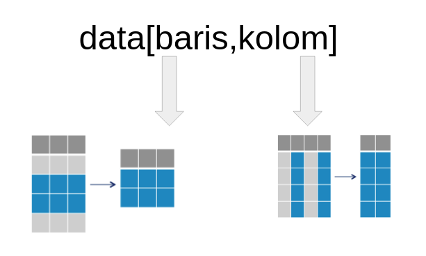

<style>
body {
text-align: justify}
</style>

```{r setup, include=FALSE}
# clear-up the environment
rm(list = ls())

# chunk options
knitr::opts_chunk$set(
  message = FALSE,
  warning = FALSE,
  fig.align = "center",
  comment = "#>"
)
```

# R Studio UI

```{r}
knitr::include_graphics("img/rstudio.png")
```

# Basic R Programming

## Introduction to R Markdown

Ini adalah bagian warna putih dan saya bisa mengisinya dengan narasi

Bagian putih dari R Markdown (.Rmd) berguna untuk menulis narasi. Pada bagian ini dapat ditambahkan heading dengan menambahkan hashtag `#` sebelum kalimat. Narasi yang tidak ditambahkan `#` sebelum kalimat akan menjadi paragraf biasa.

Bagian abu-abu dari Rmarkdown adalah `chunk`. Chunk berguna untuk menulis **code**.

```{r}
# code di sini

```

```{r}

```

Menggunakan sebuah shortcut: ctrl + alt + i/cmd + opt + i

## Object

Untuk pengolahan data di R, data atau sebuah value dapat disimpan/diassign ke dalam objek. Untuk assign objek dapat menggunakan `<-` dan hasilnya akan tersimpan pada environment.

```{r}
# Menyimpan nilai ke dalam objek
nama <- "Algoritma" 
```

```{r}
# Memanggil hasilnya
nama
```

*Disclaimer*, 

- Menjalankan *chunk* dapat menggunakan *shortcut* `ctrl + shift + enter` / `cmd + shift + enter`
- Membuat simbol *assign* dapat menggunakan  *shortcut* `alt + -`/ `opt + -`

## R is Case Sensitive

Case sensitive berarti bahwa huruf besar dan huruf kecil dianggap berbeda. Ini berlaku pada penamaan variabel, fungsi, dan identifier lainnya. Sebagai contoh, variabel `materi`, `Materi`, dan `MATERI` dianggap sebagai tiga variabel yang berbeda.

```{r}
# Menyimpan nilai ke variabel
materi <- "Programming for Data Science"

# Memanggil isi variabel
materi # Output Programming for Data Science
```

```{r}
# Menyimpan nilai ke variabel
Materi <- "Programming"

# Memanggil isi variabel
Materi # Output Programming
```

```{r}
# Menyimpan nilai ke variabel
MATERI <- "R"

# Memanggil isi variabel
MATERI # Output R
```

```{r}
MATERI <- "Python"
MATERI
```


## Comment 

Untuk memasukkan narasi dalam chunk dapat menggunakan **comment** dengan menambahkan `#` sebelum narasi tersebut. Bagian code yang diberi comment tidak akan dieksekusi.

```{r}
# ini adalah comment
1+1 # operasi matematika
```

Tambahan: Comment juga bisa digunakan untuk menonaktifkan code pada chunk

---End of Day 1---

## Overwrite

Overwrite terjadi ketika sebuah variabel yang sudah ada diberi nilai baru, sehingga nilai lama variabel tersebut akan digantikan oleh nilai baru.

Misalnya, jika Anda mendeklarasikan variabel `materi` dengan nilai tertentu, dan kemudian memberikan nilai baru pada variabel `materi`, maka nilai sebelumnya akan hilang, dan variabel `materi` hanya akan menyimpan nilai baru tersebut.

```{r}
# Menyimpan nilai ke variabel 
materi <-  "Programming for Data Science"

# Memanggil isi variabel
materi 
```

```{r}
# Menyimpan nilai ke variabel yang sama
materi <-  "Programming"

# Memanggil isi variabel
materi 
```

Pada contoh di atas, nilai awal variabel `materi` adalah `Programming for Data Science`, tetapi setelah di-overwrite dengan `Programming`, nilai sebelumnya tidak lagi dapat diakses. Ini adalah perilaku default R yang memungkinkan objek untuk berubah nilai seiring waktu.

## 🧠 Dive Deeper

Buatlah 3 buah object sebagai berikut:

- `nama`: nama lengkap Anda
- `pekerjaan`: pekerjaan Anda saat ini
- `kota`: domisili Anda

Gunakan komentar untuk memperjelas code yang diketikkan

```{r}
# code here
nama <- "Victor"
pekerjaan <- "DS Instructor"
kota <- "Jakarta"
```

```{r}
nama
pekerjaan
kota
```

## Data Types

Sebelum membahas tentang tipe data apa saja yang terdapat di R. Ada 2 fungsi yang akan kita bahas terlebih dahulu, dengan tujuan untuk mempermudah kita dalam berkenalan dengan tipe-tipe data di R.

Fungsi `c()` -> combine nilai untuk menyimpan lebih dari satu nilai

```{r}
nama <- c("Vic", "Dwi", "Arkana")
```

```{r}
nama
```


Funcsi `class()` -> melihat tipe data pada sebuat object

```{r}
class(nama)
```

### Character

Tipe data yang berisi huruf/karakter.

```{r}
tempat <- c("Bandung", "Jakarta", "Bogor")
class(tempat)
```

Contoh lain data yang memiliki tipe *character*:

- Benda 
- Alamat
- Gender
- Jabatan
- Negara

### Numeric

Tipe data berisi angka yang dapat berupa angka kontinu (ada koma/pecahan), maupun diskrit (bilangan bulat tanpa koma).

```{r}
tinggi <- c(170.5, 165, 168.5)
class(tinggi)
```

Contoh lain data yang memiliki tipe *numeric*:

- Berat
- Suhu tubuh
- Jarak
- Currency

### Integer

Tipe data berisi angka yang berupa angka diskrit (bilangan bulat tanpa koma). Untuk memaksa numeric menjadi integer, dapat gunakan L dibelakang angka.

```{r}
umur <- c(25L, 34L, 27L, 17L)
class(umur)
```

Contoh lain data yang memiliki tipe *integer*:

- Jumlah pegawai 
- Tahun
- No HP

### Logical

Tipe data yang hanya berisi `TRUE` atau `FALSE`. Penulisan TRUE/FALSE dapat disingkat menjadi T/F.

```{r}
status <- c(TRUE, FALSE, T, F)
class(status)
```

Contoh lain data yang memiliki tipe *logical*:

-
-

### Implicit Coercion

Lalu, apa yang akan terjadi jika dalam satu data memiliki beberapa tipe data yang berbeda seperti chunk dibawah ini?

```{r}
mix <- c("Algoritma", 2022, TRUE)
class(mix)
```

```{r}
angka <- c(100.2, 100L, 75.4)
class(angka)
```

Bila Anda perhatikan setiap nilai pada object `mix` memiliki **petik dua**, artinya nilai tersebut merupakan sebuah objek dengan tipe character. Proses perubahan paksa dari suatu vector bisa disebut sebagai **implicit coercion**. Ilustrasi terjadinya implicit coercion dapat dilihat pada gambar di bawah ini:

```{r}
knitr::include_graphics("img/data_type.png")
```

## ❓ Knowledge Check

1. Di bawah ini mana pernyataan yang **salah** terkait sifat pemrograman di R ?

- [ ] Bahasa pemrograman R bersifat case sensitive
- [ ] Tanda <- berfungsi untuk menyimpan suatu nilai ke dalam sebuah objek
- [x] Tanda // diawal sebuah chunk berfungsi sebagai tanda komentar  
- [ ] tanda == digunakan untuk mengecek kesamaan antar 2 buah nilai

2. Tipe data yang tepat untuk kolom umur student adalah ...

- [ ] Logical 
- [x] Integer
- [ ] Character
- [ ] Numeric

3. Jawablah tipe data dari beberapa object di bawah ini:

```{r}
object1 <- c(TRUE, 1L, 1/2)
object2 <- c(TRUE, "TRUE", 1, 1.0)
object3 <- c(1, 2, 3, 4L)
```

```{r}
class(object1)
class(object2)
class(object3)
```

- Tipe data `object1` adalah numeric
- Tipe data `object2` adalah char
- Tipe data `object3` adalah numeric

## Data Structure

Struktur data merupakan bagaimana data disusun berdasarkan struktur tertentu, pada R terdapat 4 struktur data dasar yaitu vector, matrix, list, dan dataframe.

### Vector

Vector merupakan salah satu struktur data yang sering digunakan. Vector merupakan struktur data yang hanya bisa menampung 1 tipe data saja dan hanya terdiri dari satu dimensi. Fungsi `c()` digunakan untuk membuat sebuah vector.

```{r}
nilai <- c(1, 2, 3, 4)
kelas <- c("Python", "R")
```

### Factor

Factor merupakan bentuk perkembangan dari vector, yang membedakan vector dan factor adalah objek factor memiliki levels. Digunakan untuk tipe data kategorikal.

```{r}
card <- factor(c("Blue", "Gold", "Platinum", "Gold", "Gold"))
class(card)
```

Contoh Factor yang lain:

- Jabatan

Sebagai contoh, dalam sebuah perusahaan yang terdiri dari 1000 pegawai
  + Direktur -> jumlah 5
  + Manager -> jumlah 50
  + SPV -> jumlah 100
  + Staff -> jumlah 800
  + AI (anak intern) -> jumlah45

- Tingkat Pendidikan

Sebagai contoh, dalam kelas Algorita yang terdiri dari 26 participants
  + S2 -> 5 orang
  + S1 -> 21 orang
  
- Jenis Pakaian
- Gender
- Suku
- Nationality

### Matrix

Matrix merupakan struktur data yang memiliki 2 dimensi dan hanya bisa diisi dengan 1 tipe data saja.

```{r}
# tidak perlu fokus pada pembuatan object matrix
mat <- matrix(data = 11:16, nrow = 3, ncol = 2)
mat
```

```{r}
# nama_objek[urutan  informasi barisnya , urutan informasi kolom]

# Mengambil angka 12
mat[2 , 1]
```

```{r}
# Mengambil keseluruhan baris pada kolom 2
mat[ , 2]
mat[1:3, 2]
```

Note: Bisa menggunakan simbol `:` untuk memberikan sebuah rentang baris ataupun kolom matrix yang diambil

### List

List merupakan struktur data yang dapat menyimpan lebih dari 1 tipe data dan hanya memiliki 1 dimensi

```{r}
# tidak perlu fokus pada pembuatan object list
our_list <- list(c(TRUE, FALSE), "TRUE", c(1, 6, 12), 1L)
our_list

class(our_list)
```

### Data Frame

Data frame merupakan tipe data yang paling sering digunakan dalam pengolahan data, karena data frame dapat berisi beberapa tipe data serta memiliki 2 dimensi. Adapun cara untuk membuat sebuah data frame kita bisa menggunakan fungsi `data.frame()` seperti di bawah ini:

```{r}
# cara 1: dari vector
nama <- c("Vic", "Dwi", "Arkana")
umur <- c(29, 27, 25)
logic <- c(T, F, T)

data.frame(nama, umur, logic)
```

```{r}
# cara 2: langsung
data.frame(
  nama = c("Vic", "Dwi", "Arkana"),
  umur = c(29, 27, 28)
)
```

Note: Ketika R menerima inputan dalam Data Frame, semua nilai angka (terutama yang bentuk integer) akan dianggap sebagai dbl (double) ~ numeric

```{r}
data.frame(
  nama <-    c("Vic", "Dwi", "Arkana"),
  umur <-   c(29, 27, 25)
)
```


# Working with Data Frame

## Read and extracting data

Kita akan menganalisis data `retail.csv` yang terdapat pada folder `data_input`. Gunakan fungsi `read.csv()` untuk membaca file CSV ke R, lalu simpanlah ke sebuah object dengan nama `retail`. 

```{r}
retail <- read.csv("data_input/retail.csv")
retail
```

Deskripsi kolom:

- `Row.ID` = Nomer baris
- `Order.ID` = Unique ID pemesanan
- `Order.Date` = Tanggal pemesanan
- `Ship.Date` = Tanggal pengiriman barang
- `Ship.Mode` = Jenis pengiriman yang dipilih customer
- `Customer.ID` = Unique ID customer
- `Segment` = Segmentasi/kategori custoemr
- `Product.ID` = Unique ID barang
- `Category` = Kateogri barang
- `Sub.Category` = Sub Kategori barang
- `Product.Name` = Nama produk barang
- `Sales` = Total sales dari barang yang dibeli oleh customer
- `Quantity` = Total barang yang dibeli oleh customer
- `Discount` = Total diskon yang diberikan kepada customer
- `Profit` = Total keuntungan yang didapatkan oleh perusahaan

### head() and tail()

Daripada melihat keseluruhan data, lebih baik kita "mengintip" sebagian baris yang dapat merepresentasikan bentuk keseluruhan data.

Fungsi `head()` untuk melihat beberapa baris teratas pada data (default 6)

```{r}
head(retail)
```

Fungsi `tail()` untuk melihat beberapa data terakhir.

```{r}
tail(retail)
```

### str()

Fungsi `str()` untuk melihat struktur dari dataframe.

```{r}
str(retail)
```

### dim(), nrow(), ncol()

Fungsi `dim()` untuk mengetahui dimensi dari dataframe.

```{r}
# Hasil dari dim() adalah jumlah baris - kolom
dim(retail)
```

Fungsi `nrow()` untuk mengetahui jumlah baris, sedangkan `ncol()` untuk mengetahui jumlah kolom.

```{r}
nrow(retail)
```

---End of Day 2---

### summary()

Fungsi `summary()` untuk mengetahui ringkasan/rangkuman statistik dari dataframe.

```{r}
summary(retail)
```

Pada kolom numerik, ditampilkan ringkasan lima nilai (five number summary). Apakaha ada insight yang menarik:

-
-

## ❓ Knowledge Check

1. Code yang tepat untuk melihat 10 baris terakhir pada data retail yaitu ...

- [ ] `head(retail, 10)`
- [ ] `str(retail)`
- [ ] `summary(retail, 10)`
- [x] `tail(retail, 10)`

```{r}
# Untuk menampilkan jumlah baris tertentu dengan head()/tail(), bisa dgn menambahkan angka di samping object DF
tail(retail, 2)
```

2. Fungsi yang digunakan untuk menampilkan `dimensi` data serta `tipe data` setiap kolom secara sekaligus yaitu ...

```{r}
str(retail)
```

- [ ] `dim()`
- [ ] `ncol()`
- [ ] `class()`
- [x] `str()`

## Performing simple data cleansing

### Explicit Coercion

Tahapan awal sebelum melakukan analisis data adalah memastikan bahwa data yang digunakan sudah bersih. Salah satu teknik data cleansing yaitu mengubah tipe data ke dalam tipe data yang tepat, atau dikenal sebagai istilah **explicit coercion**.

```{r}
# cek kembali struktur data retail
str(retail)
```

Untuk mengubah tipe data, kita bisa menggunakan fungsi `as.___()` di mana `___` diisi dengan tipe data tujuan. Contoh:

* `as.character()`
* `as.Date()`
* `as.integer()`
* `as.numeric()`
* `as.factor()`
* dan sebagainya

**Diskusi:** Dari data `retail`, kolom manakah saja yang perlu diubah tipe datanya?

- order date, ship date : Date
- ship mode, segment, category : factor

*hint*, untuk mengetahui apakah kolom data tersebut bisa diubah menjadi kategori, dapat memanfaatkan fungsi `unique()`

```{r}
# Bisa menggunakan simbol $ untuk mengakses kolom pada dataframe
unique(retail$Ship.Mode)
```

```{r}
# explicit coercion untuk menjadi factor
retail$Ship.Mode <-  as.factor(retail$Ship.Mode)
```

```{r}
str(retail)
```

Yang dimunculkan pada hasil perubahan tipe data pada kolom factor, adalah urutan level dari setiap unik datanya.

```{r}
unique(retail$Ship.Mode)
```

Cara factor mengurutkan level, levelnya diurutkan berdasarkan alfabet

Tips Mengetahui Factor

- Kita perlu apakah ada perulangan yang cukup sering
- Kita bsia menggunakan fungsi unique()

Parameter `format` pada `as.Date()` digunakan untuk menspesifikan format penulisan tanggal pada data, berikut format yang sering digunakan:

* YEAR
  - %Y = tahun empat digit, contoh: 2022
  - %y = tahun dua digit, contoh: 22

* MONTH
  - %B = nama bulan, contoh: January
  - %b = nama bulan singkatan, contoh: Jan
  - %m = bulan dua digit, contoh: 01
  - %M = bulan satu digit, contoh: 1

* DAY
  - %A = nama hari, contoh: Monday
  - %d = tanggal, contoh: 01 sampai 31

```{r}
head(retail,1)
```

```{r}
# explicit coercion data waktu
retail$Order.Date <- as.Date(retail$Order.Date, format = "%m/%d/%y")
```

```{r}
str(retail)
```

Note:

- Jangan menjalan 2x fungsi perubahan tipe data tanggal
- Parameter format untuk memberikan informasi bentukan data tanggal, bukan untuk mengubah menjadi bentukan yang diinginkan

Ketika tipe data kolom sudah tepat, maka summary lebih informatif:

- Date: dapat melihat range tanggal
- Factor: dapat melihat frekuensi untuk masing-masing levels

```{r}
summary(retail)
```

### Check Missing Value

Fungsi `anyNA()` digunakan untuk mengetahui apakah pada data terdapat missing value.

```{r}
anyNA(retail)
```

Fungsi `is.na()` digunakan untuk mengecek missing value pada setiap nilai. Fungsi `colSums()` digunakan untuk menjumlahkan nilai pada setiap kolom.

```{r}
colSums(is.na(retail))
```

Kesimpulan: 

Proses imputasi missing value lebih dalamnya akan dibahas pada course Machine Learning.

```{r}
# contoh NA
as.numeric(c(12, 23, "-"))
```

https://askalgo-r.netlify.app/#handling-missing-value

Beberapa cara yang dapat dilakukan untuk mengisi NA:

* Menghapus baris atau kolom
* Mengisi NA dengan sebuah nilai (imputasi):
  - Dari sumber data lain, misal dari database, dll
  - Dari hasil perhitungan kolom lain
  - Isi dengan sebuah nilai yang merepresentasikan
  - Pendekatan statistik, contoh: mean, median, modus (ukuran pemusatan)

### Subsetting

Subsetting adalah teknik untuk mengambil sebagian data yang diperlukan untuk proses analisis. Gunakan kurung siku `[]` setelah nama object Untuk melakukan subsetting. Berikut ilustrasinya:

```{r}

```

Hint: `nama_object[index_baris, index_kolom]`

Dari data `retail`, ambil index baris 2 hingga 4.

```{r}
retail[2:4 , ]
```

Dari data `retail`, ambil kolom `Ship.Mode` dan `Segment` saja

```{r}
retail[ , c("Ship.Mode", "Segment")]
```

Bagaimana untuk menggabungkan subset baris dan kolom dari dua kasus di atas?

```{r}
retail[2:4, c("Ship.Mode", "Segment")]
```

#### Conditional Subsetting

Kita dapat menggunakan operator logikal berikut untuk melakukan **filter baris** berdasarkan kondisi tertentu.

**Logical Operator:** 

* `>` lebih dari
* `<` kurang dari
* `>=` lebih dari sama dengan
* `<=` kurang dari sama dengan
* `==` mengecek kesamaan 2 nilai
* `!=` tidak sama dengan
* `&` dan
* `|` atau

Dari data `retail`, ambil baris yang memiliki `Profit` lebih dari 4000 lalu ambil kolom `Product.Name` beserta nilai `Profit`nya

```{r}
retail[retail$Profit > 4000 , c("Product.Name", "Profit")]
```

Berapa banyak transaksi yang pengirimannya (`Ship.Mode`) menggunakan Second Class dan Standard Class?

```{r}
retail[retail$Ship.Mode == c("Second Class", "Standard Class"), ] # Cara tidak tepat
```

== 

kita ingin mengambil a & b 

b == a
a == b
c == a
a == b
b == a

Dengan operator `%in%`:

%in%

kita ingin mengambil a & b 

b %in% a/b
a %in% a/b
c %in% a/b
a %in% a/b
b %in% a/b

```{r}
retail[retail$Ship.Mode %in% c("Second Class", "Standard Class"), ] # cara yang tepat
```

Berapa banyak transaksi yang dilakukan oleh `Segment` Corporate yang nilai `Profit`nya di atas 500?

> Terdapat operator `&` (AND) dan `|` (OR) untuk melakukan subsetting lebih dari 1 kondisi.

Hint:

- Biasanya operator AND digunakan untuk mengambil informasi dari 2 kolom yang berbeda
- Biasanya operator OR digunakna untuk mengambil informasi dari 1 kolom yang sama

```{r}
retail[retail$Segment %in% "Corporate" & retail$Profit > 500 , c("Segment", "Profit")]
```

## 🧠 Dive Deeper

Anda sebagai seorang analis diminta tolong oleh Mba Lita selaku kepala divisi sales, untuk menelusuri performa penjualan perusahaan retail ini. Dibawah ini ada, 2 pertanyaan bisnis yang ditanyakan:

1. Ada berapa banyak transaksi barang dengan `Category` Furniture yang tipe pengirimannya (`Ship.Mode`) adalah Standard Class?

```{r}
# Bu Zahra
retail[retail$Category %in% "Furniture" & retail$Ship.Mode %in% "Standard Class", c("Category","Ship.Mode")]
```

```{r}
# Pak Azis
nrow(retail[retail$Category %in% c("Furniture") & retail$Ship.Mode %in% c("Standard Class"),  ])
```

2. Ada berapa banyak transaksi dari `Category` Furniture yang mengakibatkan kerugian (`Profit` kurang dari nol)?

```{r}
# Pak Tizar
retail[retail$Category %in% "Furniture" & retail$Profit <0 , c("Category","Profit") ]
```

```{r}
# Pak Yoga
summary(retail[retail$Category %in% c("Furniture") & retail$Profit < 0, c("Category","Profit")])
```

## Data Aggregation 

Selain subsetting, hal yang sering dilakukan ketika kita melakukan analisis adalah aggregasi data, yaitu membuat tabel rangkuman. 

### `table()`

Fungsi `table()` untuk menampilkan **frekuensi** tiap **kategori**

Kita sebagai seorang analyst bisa memanfatkan fungsi `table()` untuk mencari tahu `Segment` manakah yang paling banyak melakukan transaksi pada data `retail`?

```{r}
table(retail$Segment)
```

Contoh kasus lain, untuk mencari tahu tipe pengiriman (`Ship.Mode`) apa yang paling banyak digunakan oleh `Segment` consumer?

```{r}
table(retail$Ship.Mode, retail$Segment)
```

### `prop.table()`

Mengubah tabel frekuensi menjadi tabel **proporsi/persentase** untuk tiap kategori.

Sintaks: `prop.table(table(...))`

Fungsi `prop.table()` dalam data retail dapat kita manfaatkan untuk mengetahui proporsi transaksi untuk masing-masing `Segment` pelanggan.

```{r}
prop.table(table(retail$Segment)) * 100
```

### Cross Tabulation

Fungsi `xtabs()` untuk menampilkan **jumlah (sum) suatu variabel numerik** untuk tiap kategori.

Sintaks: `xtabs(formula = ..., data = ...)`

Parameter:

* `formula` dituliskan dengan `numerik ~ kategorik` (simbol ~ disebut tilde)
* `data` dituliskan dengan nama object data yang digunakan

Dikarenakan fungsi `xtabs()` diperuntuhkan untuk menjumlahkan, kita bisa menggunakannya untuk menghitung jumlah Profit yang dihasilkan untuk setiap Category!

```{r}
xtabs(
  formula = Profit ~ Category, 
  data = retail
)
```

Fungsi `xtabs()` tidak hanya bisa digunakan untuk satu value saja. Sebagai contoh, kita ingin menghitung jumlah `Sales` yang diperoleh dari masing-masing `Category` dan setiap `Segment`.

```{r}
xtabs(
  formula = Sales ~ Category + Segment,
  data = retail
)
```

### Aggregate 

Untuk melakukan aggregasi data dengan fungsi yang lebih fleksibel, kita dapat menggunakan fungsi `aggregate()`.

Fungsi `aggregate()` untuk menghitung nilai statistik tertentu (jumlah, rata-rata, dll) berdasarkan kolom kategori dalam data.

Sintaks: `aggregate(formula = ..., data = ..., FUN = ...)`

Parameter:

* `formula/x` dituliskan dengan `numerik ~ kategorik`
* `data` dituliskan dengan nama object data yang digunakan
* `FUN` dituliskan dengan nama fungsi:
  - `sum`: jumlah
  - `min`: nilai minimum
  - `max`: nilai maksimum
  - `mean`: nilai rata-rata
  - `median`: nilai tengah
  - `length`: count (menghitung frekuensi)

Hitung nilai rata-rata `Sales` untuk setiap `Segment`

```{r}
aggregate(x = Sales ~ Segment,
          data = retail,
          FUN = "mean")
```

Hitung nilai rata-rata `Sales` untuk setiap `Segment` dan `Category`. Tampilkan baris dengan nilai rata-rata `Sales` yang tertinggi dan terendah saja.

```{r}
rata_rata <-  aggregate(x = Sales ~ Segment + Category,
          data = retail,
          FUN = "mean")
```

```{r}
head(rata_rata[order(rata_rata$Sales, decreasing = T) , ], 1)
tail(rata_rata[order(rata_rata$Sales, decreasing = T) , ], 1)
```


Gunakan fungsi `order()` untuk mengurutkan nilai, perlu diingat output dari `order()` adalah urutan index sehingga perlu dikombinasikan dengan subsetting `[]` untuk mengurutkan object dataframe.

---End of Day 3---

### 🧠 Dive Deeper

1. Kategori barang dengan jumlah kuantitas yang paling banyak terjual adalah ..., sedangkan yang paling sedikit adalah ...

```{r}

```

2. Pasangan segmen pelanggan dan kategori barang yang mendatangkan jumlah keuntungan terbesar adalah ..., sedangkan yang terkecil adalah ...

```{r}

```

3. Data `retail` adalah data transaksi dari tahun 2014 sampai 2017. Anda diminta untuk menghitung jumlah keuntungan yang diperoleh pada setiap kategori barang, namun hanya untuk order yang terjadi **pada tahun 2017 saja** (Hint: `Order.Date` di antara tanggal "2017-01-01" dan "2017-12-31"). 

```{r}

```


