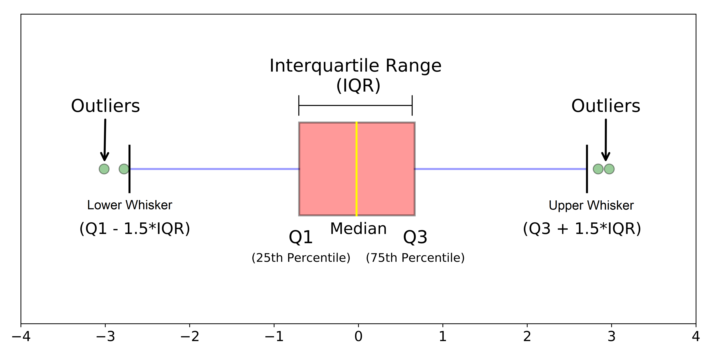
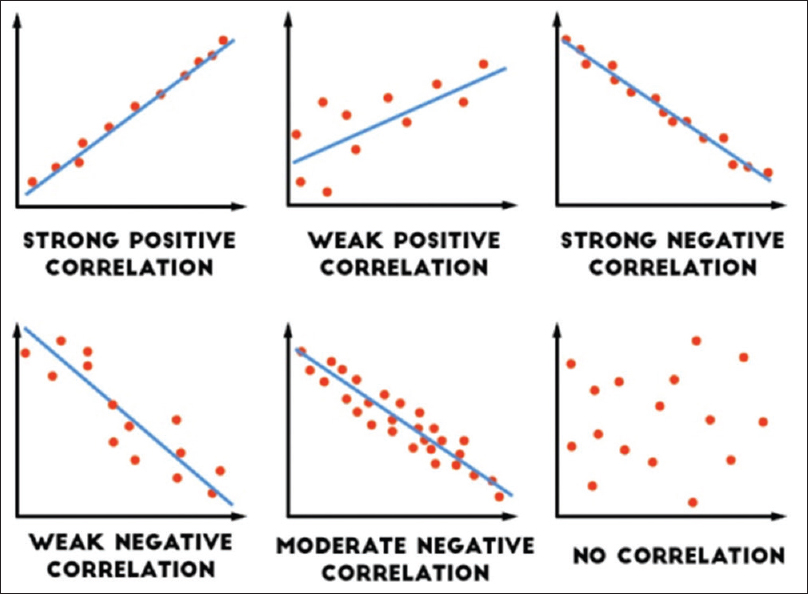

<style>
body {
text-align: justify
}
</style>


```{r setup, include=FALSE}
# clear-up the environment
rm(list = ls())

# chunk options
knitr::opts_chunk$set(
  message = FALSE,
  warning = FALSE,
  fig.align = "center",
  comment = "#>"
)

options(scipen = 10)
```

# Practical Statistics

Practical Statistics berisi kaidah statistika yang banyak diterapkan dalam praktik data science agar dapat **memahami dan mengolah data dengan tepat**. Secara umum, Practical Statistics terbagi 2, berdasarkan kegunaannya:

- **Descriptive Statistics**: menggambarkan keadaan dari sebuah data yang kita miliki.
- **Inferential Statistics**: menyimpulkan sesuatu tentang kondisi data populasi di lapangan, berdasarkan sampel data yang kita punya.

# Study Case: Credit Card Balance Analysis

**1. 🖊 Business Question**

Credit Card Balance Analysis, atau Analisis Saldo Kartu Kredit, dilakukan sebagai bagian dari analisis debitur dalam sebuah perusahaan kartu kredit. Hasil analisis dapat menentukan debitur mana yang memiliki risiko pembayaran kredit yang tinggi, atau bagaimana behavior debitur. Selain itu, menggabungkan data saldo kredit dengan informasi seperti limit kredit dapat membantu menghitung pemanfaatan kredit kartu, informasi yang berpengaruh pada Rating kredit seorang pemegang kartu.

Asumsi data:

- Balance dihitung sebagai jumlah semua transaksi selama periode penagihan/billing cycle. Sebagai contoh, jika seorang pemegang kartu mengeluarkan `$400`, `$500`, dan `$600` dalam 3 bulan, maka saldo rata-rata akan dicatat sebagai `$500`.

Kita sebagai tim data diminta untuk **menganalisa performa Credit Card Balance** nasabah. Data tersimpan dalam folder `data` dengan nama file `credit_card.csv`, gunakan `stringAsFactors = T` supaya kolom bernilai string berubah langsung menjadi tipe factor.

**2. 📖 Read Data**

```{r}
cc <- read.csv("data/credit_card.csv", stringsAsFactors = T)
cc
```

**Deskripsi Kolom**

- `Income`: Besaran gaji nasabah per tahun (dalam $10000)
- `Limit` : Besaran kredit limit
- `Rating` : Skor yang diberikan kepada individu berdasarkan kelayakan kreditnya. Semakin besar maka semakin baik
- `Cards` : Jumlah banyaknya kartu kredit yang dimiliki oleh nasabah
- `Age` : Usia nasabah
- `Education` : Level/lamanya pendidikan yang ditempuh oleh nasabah
- `Gender`: Jenis kelamin nasabah
    - Male
    - Female
- `Student` : Apakah nasabah seorang pelajar atau bukan
    - Yes -> Pelajar
    - No -> Bukan pelajar
- `Married`: Status pernikahan
    - Yes -> Sudah menikah
    - No -> Belum menikah
- `Ethnicity`: Etnis nasabah
    - African American
    - Asian
    - Caucasian
- `Balance`: Rata-rata jumlah saldo kartu kredit

# Descriptive Statistics

Descriptive Statistics membantu kita **menggambarkan karakteristik** dari data, sehingga berguna dalam proses **Exploratory Data Analysis (EDA)**. Terdapat 3 hal pada descriptive statistics:

- Ukuran pemusatan data (Measure of Central Tendency)
- Ukuran penyebaran data (Measure of Spread)
- Hubungan antar data (Variable Relationship)

## Measure of Central Tendency

Ukuran pemusatan data adalah **suatu nilai yang cukup untuk mewakili seluruh nilai pada data**.

### Mean

Cara paling umum untuk membuat perkiraan nilai tunggal dari data yang banyak adalah dengan merata-ratakannya.

- 📌 Fungsi pada R: `mean()`

❓ Berapa rata-rata `Rating` atau skor yang diberikan kepada nasabah berdasarkan kelayakan kreditnya?

```{r}

```

* Sifat nilai mean: **sensitif terhadap outlier**

> Outlier adalah nilai ekstrim yang jauh dari observasi lainnya. Kurang tepat apabila menggunakan nilai mean yang diketahui ada data outliernya.

**Contoh lain: **

🔍 Ada sebuah Kantor Cabang Bank A di daerah Blok M yang merekap jumlah pengunjung per bulan. 

Dengan nilai mean:

```{r}
# data pengunjung
pengunjung <- c(55, 50, 40, 70, 60, 45, 35, 35, 60, 1000, 250, 70)
```

```{r}
# rata-rata pengunjung

```

Apakah nilai mean di atas dapat diandalkan? ___

> Nilai mean tidak dapat diandalkan karena terdapat outlier

📝 Masalah ini dapat diatasi oleh nilai **median**.

### Median

```{r, echo = FALSE, fig.align = "center"}

```

Median atau nilai tengah diperoleh dengan mengurutkan data terlebih dahulu kemudian mencari nilai tengah dari data.

- Baik untuk data yang memiliki **outlier** atau berdistribusi **skewed** (condong kiri/kanan)

- 📌 Fungsi pada R: `median()`

Mari hitung ulang nilai pusat dari `pengunjung` menggunakan median:

```{r}
# median


# bandingkan dengan mean

```

> ___

### Modus (Mode)

```{r, echo = FALSE, fig.align = "center"}

```

Modus berguna untuk mencari nilai yang paling sering muncul (frekuensi tertinggi).

- Modus digunakan untuk data kategorik
- R tidak memiliki fungsi built-in

**Contoh:**

❓ Berasal dari `Ethnicity` mana nasabah di Bank tersebut paling banyak berasal? 

Untuk menghitung modus, bisa didapatkan dengan menghitung frekuensi kemunculan data menggunakan `table()`.

```{r}
table(cc$Ethnicity)
```

Menggunakan library `DescTools` dengan function `Mode()`

```{r}
library(DescTools)

```

> Modus untuk `Ethnicity` adalah ___

### ❓ Knowledge Check

Dari pernyataan berikut, jawablah benar atau salah. Apabila salah tuliskan pernyataan yang benar.

1. Median adalah pusat data yang hanya melibatkan sebagian data dalam perhitungannya.

- [ ] Benar
- [ ] Salah

2. Mean adalah pusat data yang sensitif terhadap outlier.

- [ ] Benar
- [ ] Salah

3. Nilai pusat data yang cocok untuk tipe data kategorik adalah modus.

- [ ] Benar
- [ ] Salah


## Measure of Spread

Ukuran penyebaran data mewakili seberapa menyebar atau beragam data kita.

### Variance

Variance menggambarkan seberapa beragam/bervariasi suatu data numerik tunggal menyebar dari pusat datanya.

```{r, out.width = "65%", echo = FALSE, fig.align = "center"}

```

Pemahaman: Variance terbesar dimiliki oleh Candy A atau B?

- 📐 Formula variance:

$$var = \frac{\sum(X_i - \bar{X})^2}{n-1}$$

Variance tidak dapat diinterpretasikan karena satuannya dalam kuadrat.

- 📌 Fungsi di R: `var()`

```{r, out.width = "100%", echo = FALSE, fig.align = "center"}

```

❓ Bank ABC sedang dalam rencana membuka kantor cabang baru. Bank ABC menyeleksi daerah mana yang cocok untuk cabang baru mereka. Mereka mengumpulkan informasi harga sewa bangunan di daerah A dan B sebagai berikut: 

```{r}
# harga dalam satuan juta
harga_A <- c(400,410,420,400,410,420,400,410,420,400,410,420,400)

harga_B <- c(130,430,650,540,460,320,380,550,650,470,330,140,270)
```

Setelah dibandingkan, rata-rata harga bangunan kedua daerah sama:

```{r}
mean(harga_A)
mean(harga_B)
```

Mari bandingkan dari sisi lain, yaitu tingkat keberagaman data (variance). Daerah mana yang harganya lebih bervariasi?

```{r}
# menghitung variansi dengan var()

```

❓ Daerah manakah yang lebih baik untuk dijadikan area perkantoran?

- ___

🔎 **Karakteristik Variance**

- Skala variance dari 0 sampai tak hingga. Semakin besar nilainya maka artinya semakin menyebar dari pusat datanya (mean).

- Variance memiliki satuan kuadrat, sehingga tidak dapat langsung diinterpretasikan. Biasanya digunakan untuk membandingkan dengan nilai var lain dengan satuan yang sama.

- **Nilai variansi sangat bergantung dengan skala data**. Hati-hati apabila membandingkan antar variabel yang berbeda skala.

### Standard Deviation

Sama dengan variansi, standar deviasi menggambarkan **seberapa jauh simpangan nilai dari titik pusat (mean) nya**. Akan tetapi, standard deviation dapat diinterpretasikan karena satuannya sudah sama seperti satuan data aslinya.

- 📐 Formula standar deviasi: 

$$sd = \sqrt{var}$$

- 📌 Fungsi di R: `sd()`

```{r}
# standar deviasi harga_A & harga_B

```

```{r}
mean(harga_A)
mean(harga_B)
```

**Interpretasi nilai normal/wajar : mean +- sd** (karena satuan mean dan sd sama, yaitu jutaan rupiah)

- Harga sewa pada daerah A umumnya jatuh pada interval 
- Harga sewa pada daerah B umumnya jatuh pada interval 

 **Business question**

Apabila kita ditawarkan suatu bangunan di daerah B dengan harga 800, apakah harga tersebut masih wajar? Apakah sebaiknya kita membeli bangunan tersebut? Hubungkan dengan nilai mean dan standar deviasi yang diperoleh.

menghitung range "harga normal" daerah B:

```{r}
# hitung batas bawah dan atas dari harga wajar daerah B

```

> ___

### Range and IQR using `boxplot()`

Distribusi data numerik pada umumnya divisualisasikan dengan `boxplot()`, yang meliputi komponen:

- Box: menggambarkan Q1, Q2 (median), dan Q3
  + Kuartil 1 (Q1): nilai ke 25%
  + Kuartil 2 (Q2 atau median): nilai ke 50% (nilai tengah)
  + Kuartil 3 (Q3): nilai ke 75%
  + Interquartile Range (IQR): selisih antara Q3 dan Q1
- Whisker: pagar bawah dan atas (PENTING: hati-hati, nilai ini bukan nilai minimum dan maksimum data)
- Data outliers: nilai ekstrim data yang berada di luar pagar bawah dan atas

```{r, out.width = "100%", echo = FALSE, fig.align = "center"}

```

📌 Beberapa hal yang harus diperhatikan dalam boxplot:

- Banyaknya data dari Q1 ke nilai minimum (bukan pagar bawah) adalah 25%
- Banyaknya data dari Q1 ke Q2 adalah 25%
- Banyaknya data dari Q2 ke Q3 adalah 25%
- Banyaknya data dari Q3 ke nilai maksimum (bukan pagar atas) adalah 25%

```{r, echo = FALSE, fig.align = "center"}

```

📈 Insight yang dapat diperoleh dari boxplot:

1. Pusat data dengan median (Q2)
2. Sebaran data dengan IQR (lebar kotak)
3. Outlier, nilai ekstrim pada data
4. Bentuk distribusi data:
  + box yang berada ditengah = **distribusi normal**
  + box yang mendekati batas bawah = **distribusi skewed kanan**
  + box yang mendekati batas atas = **distribusi skewed kiri**
  
Ilustrasi distribusi data:
```{r, echo = FALSE, fig.align = "center"}

```
Keterangan:

- Ekor: Bagian sempit panjang dari distribusi frekuensi; nilai yang relatif ekstrim terjadi pada frekuensi rendah.

**Contoh:**

❓ Visualisasikan sebaran data `Rating` dari data `cc`! Analisis informasi yang didapatkan.

```{r}
boxplot(cc$Rating, horizontal = T)
```

- ❓ Apakah data memiliki outlier?

> ___

- ❓ Central tendency (mean, median, modus) mana yang cocok dipakai untuk data ini?

> ___

- ❓ Bagaimana bentuk distribusi data?

> ___

❓ Dari setiap komponen boxplot, kita pun bisa mengetahui nilai sebaran data dengan beberapa fungsi berikut:

- **Range**: rentang data, menunjukkan nilai maksimum dan minimum

```{r}
# code here

```

- **Interquartile Range (IQR)**:nilai selisih antara Q3 (data ke 75%) dan Q1 (data ke 25%)

```{r}
# code here

```

## Variable Relationship

Karena pada data kita punya banyak kolom atau variabel, kita juga ingin tahu hubungan antar variabel dalam data kita.

Ukuran yang digunakan untuk melihat **hubungan linear** antara dua variabel numerik.

### Covariance

Covariance menunjukkan bagaimana variansi 2 data (variable yang berbeda) bergerak bersamaan.

- 📌 Fungsi di R: `cov()`

```{r, out.width = "100%", echo = FALSE, fig.align = "center"}

```

- Nilai covariance positif mengindikasikan pergerakan nilai yang searah / berbanding lurus.
- Nilai covariance negatif mengindikasikan pergerakan nilai yang berbalik arah.

**Contoh:**

❓ Hitunglah covariance antara `Income` dengan `Rating` pada data `cc` . Bagaimana hubungannya?

```{r}

```

Interpretasi nilai: ___

> Kelemahan: Seperti variance, covariance tidak memiliki batasan nilai untuk mengukur kekuatan hubungan antar dua variabel (-inf s.d inf), sehingga kita hanya bisa mengetahui apakah hubungannya positif atau negatif. Oleh karena itu, hadir **correlation**.

### Correlation

Correlation memampatkan nilai covariance dari -inf s.d inf menjadi **-1 s.d 1** sehingga bisa diukur kekuatan hubungan antar data (variable).

- 📌 Fungsi di R: `cor()`

- Nilai korelasi mengindikasikan kekuatan hubungan antara dua variable numerik sebagai berikut:

```{r, out.width = "100%", echo = FALSE, fig.align = "center"}
knitr::include_graphics("img/correlation-coef.jpg")
```

Bila korelasi dua variable numerik mendekati:
  - -1 artinya korelasi negatif kuat
  - 0 artinya tidak berkorelasi
  - 1 artinya korelasi positif kuat

**Contoh:**

❓ Adakah korelasi antara `Income` dengan `Rating` pada data `cc` . Bagaimana hubungan dan kekuatannya?

```{r}

```

Jawaban: ___

❓ Visualisasi korelasi dengan scatter plot:

```{r}
plot(cc$Income, cc$Rating)
```

❓ Ilustrasi correlation:

```{r, out.width = "100%", echo = FALSE, fig.align = "center"}

```

### ❓ Knowledge Check

Dari pernyataan berikut, jawablah benar atau salah. Apabila salah, tuliskan pernyataan yang benar.

1. Ketika korelasi variabel A dan B bernilai -1 artinya tidak ada korelasi antara nilai A dan B.

- [ ] Benar
- [ ] Salah

2. Scatter plot dapat digunakan untuk menggambarkan hubungan antara dua variabel numerik.

- [ ] Benar
- [ ] Salah

**Quick Summary Descriptive Statistics**

- **Central Tendency** = ____
  + Untuk data numerik: ____
    - Ketika terdapat outlier:
    - Ketika tidak terdapat outlier:
  + Untuk data kategorik : ____
  
- **Measure of Spread** = ____
  + Variance ____ diinterpretasi secara sendirinya
  + Standard deviation memiliki satuan ____, sehingga ____
  + Range dan IQR dapat divisualisasikan dengan ____
  
- **Variable Relationship**: ____
  + ____ hanya bisa dilihat nilai positif dan negatifnya. 
    - Rangenya ____ s.d ____
  + ____ digunakan untuk mengukur kekuatan hubungan
    - Rangenya ____ s.d ____
    - semakin mendekati -1 -> ____
    - semakin mendekati 1 -> ____
    - semakin mendekati 0 -> ____

---

# Inferential Statistics

Inferential Statistics membantu kita **menarik kesimpulan tentang keseluruhan data (populasi) dengan menggunakan sebagian informasinya saja (sampel)**

```{r, out.width = "100%", echo = FALSE, fig.align = "center"}

```

## Sampling

Sampling merupakan salah satu konsep penting dalam inferential statistics yang digunakan untuk mengambil sebagian kecil data dari populasi yang lebih besar. Dalam konteks pembelajaran mesin (ML), sampling berperan penting untuk mendapatkan subset data yang representatif, sehingga model dapat dilatih secara efisien tanpa perlu menggunakan seluruh data populasi.

**Role play**: Misal data `cc` yang telah kita gunakan saat ini adalah data populasi seluruh nasabah di suatu Bank. Jika kita ingin ambil 100 sample dari nasabah Bank tersebut, maka kita bisa melakukan simple random sampling dengan cara: 

Ambil 100 sample dari data `cc$Balance` dan hitung mean dan juga standard deviasinya

```{r}
#lakukan proses sampling
#set.seed(100)
sample_balance <- sample(__,__)
```

```{r}
#hitung mean

```

```{r}
#hitung standard deviasi

```


Setiap data memiliki distribusi. Distribusi data yang spresial dan berperan dalam inferential statistics adalah **distribusi normal**

## Normal Distribution

```{r, out.width = "100%", echo = FALSE, fig.align = "center"}

```

🔎 Karakteristik:

- Kurva membentuk lonceng simetris, artinya puncaknya adalah titik pusat (mean = median)
- Luas area dibawah kurva = 1 (menyatakan probabilitas)
- Persebaran data:
  + 68% data berada di rentang +- 1 standar deviasi dari mean
  + 95% data berada di rentang +- 2 standar deviasi dari mean
  + 99.7% data berada di rentang +- 3 standar deviasi dari mean
- **Standar normal baku** adalah distribusi normal dimana mean = 0 dan standar deviasi = 1. 

Distribusi normal banyak digunakan pada inferensial statistik karena dicetuskannya **Central Limit Theorem**.

> Semakin bertambahnya jumlah sampel yang diambil secara acak, maka **distribusi rata-rata sampel** akan mengikuti distribusi normal

🔎 Karakteristik distribusi normal inilah yang dimanfaatkan untuk penghitungan inferensial statistik:

- **Menghitung Probabilitas:**
  + Probability Mass Function -> diskrit/kategorik
  + Probability Density Function -> kontinu/numerik
- **Membuat Confidence Interval**
- **Uji Hipotesis**

## Probability Mass Function

* Menghitung peluang untuk data diskrit, contoh:
  + peluang hujan/tidak hujan
  + peluang produk yang terjual
  + peluang nasabah good credit/bad credit
  
* Formula: jumlah kejadian terjadi dibagi dengan jumlah kejadian total

**Contoh:**

Terdapat 100 nasabah dari sebuah Bank, 90 diantaranya merupakan nasabah dengan status good (good credit), sedangkan sisanya sebanyak 10 adalah status bad (bad credit). Berapakah peluang nasabah bad credit?

```{r}

```

## Probability Density Function

- Menghitung probability data **kontinu**. Data kontinu merupakan data yang memiliki nilai dalam rentang tertentu, dan bisa memiliki angka desimal atau pecahan, contohnya:
  + tinggi badan
  + Rating nasabah
  + profit/revenue

- Tahapan:
  1. Hitung Z-score (ubah nilai data asli ke standar normal baku = Z-score standardization)
  2. hitung peluang (area di bawah kurva) berdasarkan Z-score dengan menggunakan fungsi `pnorm()`
  
-  📐 Formula Z-score:

$$Z = \frac{x-\mu}{\sigma}$$

Keterangan:

- Z = Z-score
- x = titik data
- $\mu$ = mean
- $\sigma$ = standar deviasi

> Z-score merupakan sebuah nilai yang merepresentasikan **berapa standard deviasi data tersebut menyimpang dari rata-ratanya**

**Contoh**

❓ Tinggi badan pria dewasa di Indonesia berdistribusi normal dengan rata-rata 165 cm dan standar deviasi 10 cm. Berapa peluang pria dewasa di Indonesia memiliki tinggi badan > 180 cm?

Diketahui:
- mean = ...
- stdev = ...
- titik data(x) = ...

Tahapan 1: Hitung Z-score

```{r}
Z <- ___
```

Insight: 

Tahapan 2: Ubah menjadi peluang dengan `pnorm()`

Parameter `pnorm()`:
* lower.tail = F -> mencari peluang yang lebih tinggi dari titik data
* lower.tail = T -> mencari peluang yang lebih rendah dari titik data

```{r}

```

Insight: Peluang pria dewasa di Indonesia memiliki tinggi badan > 180 cm ____

## Confidence Interval

Confidence interval (selang kepercayaan) berguna untuk menduga nilai mean populasi dengan sebuah interval. Menebak dengan sebuah interval akan meminimalisir error dibandingkan hanya dengan menebak satu nilai.

-  📐 Formula: 

$$CI = \bar{x} \pm Z_{\frac{\alpha}{2}}*SE$$

- Keterangan: 
  + $\bar{x}$ = rata-rata sampel
  + $Z_{\frac{\alpha}{2}}$ = Z-score ketika alpha/2
  + $\alpha$ = tingkat error yang ditolerasi
  + tingkat kepercayaan = 1-$\alpha$
  + SE = standard error
  
SE mengukur kebaikan sampel dalam mewakilkan populasi. Semakin kecil, maka sampel semakin representatif (baik).

$$SE = \frac{\sigma}{\sqrt n}$$

- Ket: 
  + $\sigma$ = standar deviasi populasi
  + $n$ = jumlah sampel

- Tahapan:
  1. Hitung nilai mean sampel dan standar deviasi populasi
  2. Hitung standar error (SE)
  3. Tentukan tingkat kepercayaan dan $\alpha$ (biasanya $\alpha$ = 5%)
  4. Tentukan nilai $Z_{\frac{\alpha}{2}}$
  5. Hitung confidence interval

**Contoh**

❓  Dari data `cc` yang berisikan sampel **400 nasabah** suatu Bank diketahui memiliki rata-rata `Balance` kredit sebesar **520**. Semisal diketahui Bank tersebut memiliki standard deviasi populasi untuk Balance sebesar **465**.

Berapakah confidence interval untuk rata-rata Balance seluruh nasabah? Gunakan tingkat kepercayaan 95%!

1. Diketahui:

- mean sampel = ___  
- stdev populasi = ___
- jumlah sampel (n) = ___

2. Hitung nilai SE

```{r}
# sd / akar(n)
SE <- 
```

2. Tentukan tingkat kepercayaan dan alpha

- Tingkat kepercayaan : 95%
- alpha (tingkat error) : 100% - 95% = 5%, artinya kita mentoleransi error sebesar 5%, bahwa mungkin saja rata-rata Balance nasabah aslinya terletak di luar Confidence Interval

```{r}
alpha <- 
```

3. Hitung Z alpha/2 dengan `qnorm()`

alpha dibagi 2 karena ingin membuat batas bawah dan batas atas (dalam dunia statistika dikenal sebagai two-tailed) -> Untuk two tail, gunakan `lower.tail = F`

```{r}
# Mencari nilai Z
Z <- 
```

```{r, out.width = "100%", echo = FALSE, fig.align = "center"}

```

**Notes:**

- `pnorm()` untuk mencari peluang (p) dari sebuah titik di normal baku (q)
- `qnorm()` untuk mencari titik di normal baku (q) dari sebuah peluang (p)

4. Hitung confidence interval

CI = mean -+ (Z * SE)

```{r}
# batas bawah
batas_bawah <- 
```

```{r}
# batas atas
batas_atas <- 
```

Kesimpulan: Dengan tingkat keyakinan 95%, maka rata-rata Balance untuk nasabah suatu Bank ada di rentang ... s/d ...

## Hypothesis Testing

Uji hipotesis bertujuan untuk menguji **dugaan**. Uji hipotesis sering disebut juga sebagai **uji signifikansi** yang digunakan untuk menguji apakah suatu treatment memberikan perubahan/pengaruh signifikan terhadap suatu kondisi.

🔎 Istilah-istilah:

- Hipotesis: dugaan sementara yang harus diuji
  + $H_0$ / null hypothesis: 
    * kondisi awal
    * memiliki unsur kesamaan (=, >=, <=)
  + $H_1$ / alternative hypothesis: 
    * kontradiktif dengan $H_0$
    
- $\alpha$:
  + tingkat signifikansi yaitu tingkat error yang masih bisa ditoleransi
  + umumnya 0.05
- $1-\alpha$: tingkat kepercayaan

- $p-value$:
  + hasil perhitungan statistik yang menunjukkan peluang data sampel terjadi dengan kondisi H0.

Pengambilan kesimpulan:

- Jika $p-value$ < $\alpha$, maka tolak $H_0$ -> terima h1
- Jika $p-value$ > $\alpha$, maka gagal tolak $H_0$ -> terima h0

**Contoh Hipotesis**

1. Hipotesis dua arah (!=)

- $H_0$ : Rata-rata saldo rekening tidak berbeda secara signifikan antara nasabah yang menggunakan layanan internet banking dan yang tidak menggunakan layanan tersebut. (=)
- $H_1$ : Rata-rata saldo rekening **berbeda secara signifikan** antara nasabah yang menggunakan layanan internet banking dan yang tidak menggunakan layanan tersebut. (!=)

2. Hipotesis satu arah (<)

- $H_0$ : Penambahan teller tidak memberikan perbedaan durasi pembayaran (>=)
- $H_1$ : Penambahan teller **menurunkan** durasi pembayaran (<)

3. Hipotesis satu arah (>)

* $H_0$: Penerapan diskon tidak memberikan perbedaan jumlah pembelian produk (<=)
* $H_1$: Penerapan diskon **meningkatkan** jumlah pembelian produk (>)

### Z-Test

Uji hipotesis yang menggunakan Z-test bila:

- standar deviasi populasi diketahui
- jumlah sampel banyak (n > 30)

**Contoh**

ABC merupakan salah satu Bank di Indonesia. Bila diketahui rata-rata likes dari suatu post di platform mereka sebesar **14000** likes dengan standar deviasi **5000** likes.

Demi meningkatkan likes dari tiap post, ABC memutuskan untuk menggunakan influencer sebagai brand ambassador pemasaran produk. Setelah menggunakan influencer, diambil **50** postingan acak yang ternyata memiliki rata-rata likes **17500**.

Sebagai tim marketing, lakukan analisis apakah menggunakan jasa influencer secara signifikan meningkatkan customer engagement (dari sisi rata-rata jumlah likes) atau tidak? Gunakan tingkat kepercayaan **95%**.

Jawaban:

**I. Tentukan hipotesis**

- $H_0$: ___
- $H_1$: ___

**II. Hitung nilai statistik**

Diketahui deskriptif statistiknya:

```{r}
mean_populasi <-  
stdev_populasi <- 
n <- 
mean_sample <- 
```

Ditentukan oleh user:

```{r}
tingkat_kepercayaan <- 
alpha <- 
```

$$Z = \frac{\bar X-\mu}{SE}$$

Z = (rata2 sampel - rata2 populasi) / standar error

$$SE = \frac{\sigma}{\sqrt n}$$

Standar error = standar deviasi populasi / akar dari banyak sampel

```{r}
# menghitung nilai SE
SE <- 

# menghitung nilai z
Z <- 
```

* SE mengukur kebaikan sampel dalam mewakilkan populasi. Semakin kecil, maka sampel semakin representatif (baik).

* Z-score merupakan sebuah nilai yang merepresentasikan **berapa standard deviasi data tersebut menyimpang dari rata-ratanya**

```{r}
# p-value dengan pnorm
p_value <- 
```

Daerah/area yang kita ingin cari dilihat dari tanda ketidaksamaan di hipotesis alternatif yaitu:

* $H_1$: ....

```{r, out.width = "100%", echo = FALSE, fig.align = "center"}
knitr::include_graphics("img/p-value.PNG")
```

**III. Bandingkan P-value dengan alpha**

Pengambilan kesimpulan:

- Jika $p-value$ < $\alpha$, maka tolak $H_0$ , terima H1
- Jika $p-value$ > $\alpha$, maka gagal tolak $H_0$ 

p-value = ___ (>/<) alpha = 0.05

> ___

**IV. Kesimpulan**

> ___

### T-test

Uji hipotesis menggunakan T-test jika:

* standar deviasi populasi tidak diketahui atau
* jumlah sampel sedikit (n <= 30)

Bentuk t-distribution mirip dengan normal distribution, hanya saja lebih landai ketika jumlah sampel sedikit:

```{r, out.width = "100%", echo = FALSE, fig.align = "center"}
knitr::include_graphics("img/t-distribution.jpg")
```

**Contoh Kasus**

❓Quicker merupakan startup yang bertugas untuk membantu para startup lain mendapatkan dana hibah dari pemerintah. Umumnya, lama proses penyerahan berkas hingga dana dicairkan adalah **215 hari**. 

Dikumpulkan data durasi proses pencairan dana dari **10** perusahaan startup yang menggunakan jasa Quicker sebagai berikut: 

```{r}
duration <- c(201, 200, 215, 212, 246, 220, 205, 195, 190, 200)
```

Apakah Quicker bisa secara signifikan mempercepat durasi pencairan dana hibah Gunakan tingkat kepercayaan 95%.

Jawab:

**I. Tentukan hipotesis**

* $H_0$: mean durasi pencairan dana >= 215 hari (Quicker tidak memberikan efek pada durasi pencairan dana)
* $H_1$: mean durasi pencairan dana < 215 hari (Quicker mempercepat durasi pencairan dana)

**II. Hitung P-value dengan `t.test()`**

```{r}
# t.test(data_sampel, mu = mean, alternative = arah_pengujian_di_H1)
t.test(duration, mu = 215, alternative = "less")
```

**III. Bandingkan P-value dengan alpha**

p-value (...) >/< alpha (0.05), maka gagal/tolak H0

**d. Kesimpulan**

Dengan menggunakan tingkat kepercayaan 95% dapat disimpulkan bahwa Quicker ... mempercepat durasi pencairan dana hibah pemerintah secara signifikan.


**Summary penggunaan hipotesis testing:**

```{r, out.width = "100%", echo = FALSE, fig.align = "center"}

```

# Further Readings

- Descriptive Statistics: https://courses.lumenlearning.com/suny-natural-resources-biometrics/chapter/chapter-1-descriptive-statistics-and-the-normal-distribution/

- Dealing with small data set: https://measuringu.com/small-n/

- t-Distribution and some case examples: https://stattrek.com/probability-distributions/t-distribution.aspx