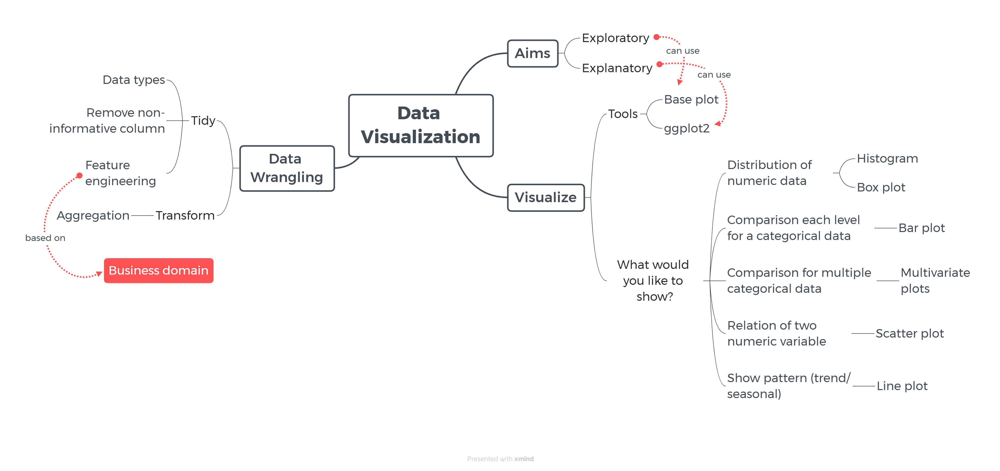
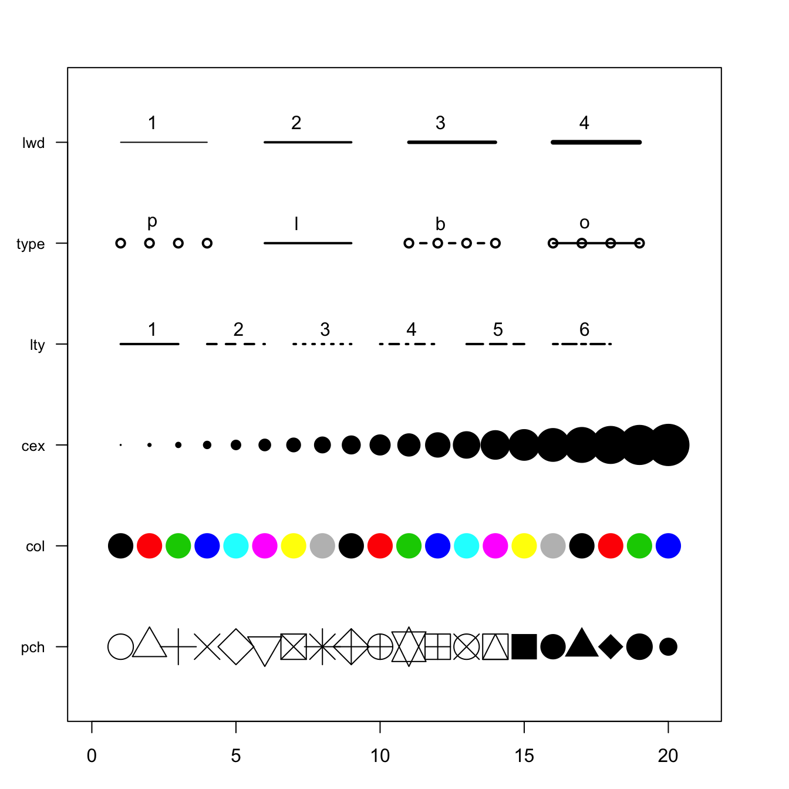
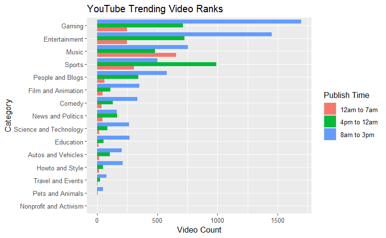

```{r setup, include=FALSE}
# clear-up the environment
rm(list = ls())

# chunk options
knitr::opts_chunk$set(
  message = FALSE,
  warning = FALSE,
  fig.align = "center",
  comment = "#>"
)

# scientific notation
options(scipen = 999)
```
**START OF DAY 1**

# Mindmap

```{r, out.width = "100%", echo = FALSE, fig.align = "center"}

```

# Introduction
**Visualisasi data** adalah proses untuk menampilkan data dalam bentuk visual. Sebagai makhluk visual, visualisasi data akan memudahkan kita untuk memahami informasi dengan cepat.

Berdasarkan tujuannya, visualisasi data dapat dibedakan menjadi 2 jenis:

1. **Exploratory** : visualisasi untuk mengeksplor (*explore*) data agar mendapatkan insight yang baru.
2. **Explanatory** : visualisasi untuk menjelaskan (*explain*) apa yang sudah ditemukan sebelumnya.

Saat ingin membuat visualisasi, baik exploratory maupun explanatory, kita dapat mengikuti workflow berikut:

1.  **Ask the question**: menentukan pertanyaan yang akan dijawab dengan visualisasi.
2.  **Data preparation**: mempersiapkan data agar dapat divisualisasikan.
3.  **Visualization**: membuat visualisasi sesuai dengan pertanyaan yang sudah dibuat.

# Study Case: Youtube's US Trending Video
Untuk memahami lebih dalam worflow visualisasi data, kita akan menganalisis dataset video yang trending di AS selama tahun 2023, mulai dari Januari hingga Desember. Berdasarkan dataset ini, kita akan membuat visualisasi untuk mengidentifikasi **faktor-faktor yang memengaruhi suatu video menjadi trending**.

## Read Data
Mari kita load data `USvideos_2023.csv` yang terdapat pada folder `data_input`.
```{r}
# menyimpan data ke variabel vids
vids <- read.csv('data_input/USvideos_2023.csv')
```

```{r}
# 6 baris pertama pada data
head(vids)
```

Berikut adalah penjelasan dari setiap kolom pada `vids`.

- `trending_date`: tanggal video tersebut trending (dalam format DD-YYYY-MM).
- `title`: judul video.
- `channel_title`: nama channel Youtube.
- `category_id`: kategori video.
- `publish_time`: tanggal upload video (dalam format YYYY-MM-DD HH:MM:SS).
- `views`: jumlah views.
- `likes`: jumlah likes.
- `dislikes`: jumlah dislikes.
- `comment_count` jumlah komentar.
- `comments_disabled`: apakah kolom komentar tidak diaktifkan.
- `ratings_disabled`: apakah rating video tidak diaktifkan.
- `video_error_or_removed`: apakah video dihapus.

## Data Preparation
Data preparation adalah tahapan untuk mempersiapkan data agar siap digunakan untuk analisis. Contoh tahapan data preparation:

- Menghapus kolom yang tidak diperlukan.
- Memeriksa dan menyesuaikan tipe data.
- Melakukan feature engineering: membuat kolom baru dari kolom yang sudah ada.

### Menghapus Kolom yang Tidak Diperlukan
Saat akan menganalisis data, kita dapat meng-exclude kolom-kolom yang tidak memberikan insight, seperti:

-   Kolom yang isinya kosong.
-   Kolom yang isinya sama.

Mari kita inspeksi summary dari dataframe `vids` dengan fungsi `summary()`.
```{r}
# summary vids
summary(vids)
```

❓ Dari summary di atas, kolom apa yang bisa di-exclude? Kolom `dislikes` dan `video_error_or_removed`.

```{r}
# dataframe vids
head(vids)
```
Bagaimana cara kalau kita ingin mengambil kolom `channel_title` dan `category_id` saja?
```{r}
# Hint: dataframe[baris, kolom]
# kode Pak Tedi

vids[ ,c("channel_title","category_id")]
```
```{r}
head(vids)
```

```{r}
# menghapus kolom yang tidak diperlukan
# untuk meng-exclude kolom, kita harus tahu, kolom yang di-exclude adalah kolom ke berapa

vids <- vids[ , -c(8,12)]
head(vids)
```

### Memeriksa Tipe Data
Selanjutnya, mari kita memeriksa apakah setiap kolom sudah memiliki tipe data yang sesuai. Jika belum, maka kita dapat melakukan penyesuaian tipe data.

```{r}
# memeriksa tipe data setiap kolom
# kode Pak Supratno
str(vids)
```

❓ Dari output di atas, kolom apa yang belum sesuai tipe datanya?

- `trending_date` perlu diubah menjadi datetime.
- `publish_time` perlu diubah menjadi datetime.
- `category_id` perlu diubah menjadi factor (category).

### Menyesuaikan Kolom Waktu (Datetime)
Untuk mengubah tipe data waktu, kita bisa menggunakan dua pendekatan: menggunakan fungsi `as.Date()` atau fungsi dari package `lubridate`.

#### Dengan `as.Date()`

> **🗒Sintaks**: `as.Date(x = nama_dataframe$kolom_waktu, format)`.

```{r}
head(vids)
```


**📅Penentuan Format** 

- **YEAR** 
  - %Y = tahun empat digit, contoh: 2023. 
  - %y = tahun dua digit, contoh: 23. 

- **MONTH** 
  - %B = nama bulan, contoh: January. 
  - %b = nama bulan singkatan, contoh: Jan. 
  - %m = bulan dua digit, contoh: 01. 
  - %M = bulan satu digit, contoh: 1. 
  
- **DAY** 
  - %A = nama hari, contoh: Monday.
  - %d = tanggal, contoh: 01 s.d. 31.
 
> [⏱️ Format penanggalan: strftime](https://strftime.org/).

Output fungsi `as.Date()` adalah penulisan tanggal dalam format ISO: YYYY-MM-DD.

Contoh penggunaan fungsi `as.Date()`.
```{r}
a <- "30/04/24" 
b <- "30-April-2024"
```

```{r}
# mengubah tipe data a dan b ke datetime dengan as.Date()
as.Date(a, format = "%d/%m/%y")
```

```{r}
#jawaban Pak Supratno

as.Date(x = b, format = "%d-%B-%Y")
```


Mari kita lihat implementasi fungsi `as.Date()` pada data `vids` kita.
```{r}
# 6 baris terakhir kolom trending_date
tail(vids$trending_date)

```

❓ Apakah format yang cocok untuk kolom `trending_date`? 

```{r}
# implementasi as.Date() pada kolom trending_date
# kode Pak Azis

as.Date(tail(vids$trending_date,6), format = "%y.%d.%m")
```

Perhatikan implementasi fungsi `as.Date()` pada kolom `publish_time` yang terdapat pada dataframe `vids`.
```{r}
# 6 baris terakhir kolom publish_time
tail(vids$publish_time)
```

```{r}
# implementasi as.Date() pada kolom publish_time
as.Date(tail(vids$publish_time), format = "%Y-%m-%dT%H:%M:%SZ")
```

**⚠️ Kekurangan `as.Date`**: untuk kolom waktu dengan informasi jam, hanya bisa mengambil informasi tanggal saja.

Untuk mengatasi kekurangan ini, kita dapat menggunakan fungsi dari package `lubridate`.

#### Fungsi dari `lubridate`
Penggunaan `lubridate` secara lengkap dapat dilihat di [cheatsheet](https://rstudio.github.io/cheatsheets/lubridate.pdf).
```{r}
# install package lubridate (hanya dijalankan sekali)
# comment kembali setelah menjalankan kode di bawah

# install.packages("lubridate")
```

```{r}
# import lubridate
library(lubridate)
```

Fungsi-fungsi pada `lubridate` cukup intuitif: nama fungsi mengikuti urutan tanggal. Contoh:
```{r}
# format: d m y

a <- "30/04/24" 
b <- "30-April-2024"

```

```{r}
# mengubah tipe data a dan b ke datetime dengan fungsi dari lubridate
dmy(a)
dmy(b)

```

**🥽 Dive Deeper**: gunakan fungsi pada library `lubridate` untuk mengubah tipe data tanggal yang terdapat pada variabel `c` dan `d` di bawah ini

```{r}
c <- "Monday, 19-04-2022"
d <- "2022/04/19, 19:00"
```

```{r}
# gunakan fungsi pada lubridate untuk mengubah tipe data c dan d
# Hint: lihat urutan waktu

# ubah c
# Pak Ilham

dmy(c)
```

```{r}
# ubah d
# Pak Aditya
ymd_hm(d)
```

Mari kita lihat implementasinya pada data `vids` kita.

**Kolom `trending_date`**
```{r}
# 6 baris terakhir kolom trending_date
tail(vids$trending_date)
```

```{r}
# urutan trending_date: y d m
ydm(tail(vids$trending_date))
```

```{r}
# melakukan assignment untuk mengubah tipe data kolom trending_date
vids$trending_date <- ydm(vids$trending_date)
head(vids)
```

**Kolom `publish_time`**
```{r}
# 6 baris terakhir kolom publish_time
tail(vids$publish_time)
```

```{r}
# urutan publish_time: y m d h ms

ymd_hms(tail(vids$publish_time))
```

Cara penulisan waktu pada kolom `publish_time` merupakan cara penulisan waktu untuk format UTC (Coordinated Universal Time). Saat menggunakan fungsi `ymd_hms()`, output yang dikeluarkan menambahkan tulisan UTC di akhir data waktu (secara default ditulis sebagai format UTC). Jika ingin menyesuaikan penulisan waktu ke zona waktu yang lain, gunakan parameter `tz` (timezome).

> [⏱️ List time zone](https://en.wikipedia.org/wiki/List_of_tz_database_time_zones).

Karena kita akan menganalisis video YouTube yang sedang tren di AS, akan lebih sesuai jika menggunakan zona waktu seperti New York. Gunakan parameter timezone `tz = "America/New_York"` karena data yang kita ambil menunjukkan video yang trending di US.

```{r}
# mencoba penulisan format waktu dari UTC ke zona waktu Amerika (New York) dalam EST
ymd_hms(tail(vids$publish_time), tz = "America/New_York")
```
Perbedaan waktu UTC dan New York adalah 5 jam. Di mana UTC lebih cepat.


```{r}
# melakukan assignment untuk mengubah tipe data kolom 
vids$publish_time <-ymd_hms(vids$publish_time, tz = "America/New_York")

head(vids)
```

```{r}
str(vids)
```
Perbedaan Date dan POSIXct: POSIXct merupakan variasi tipe datetime yang memiliki informasi jam.

### Menyesuaikan Kolom `category_id`
Jika kita perhatikan `category_id` masih berupa ID, di mana kita belum mengetahui kategori dari setiap ID-nya.
```{r}
# nilai unik kolom category_id pada dataframe vids
unique(vids$category_id)
```
Hal ini akan menyulitkan kita untuk mengambil insight dari setiap kategori video. Oleh karena itu, kita akan mengubah ID kategori menjadi nama kategori yang lebih mudah untuk dipahami.

> [🔢 🔤 Mapping ID kategori](https://mixedanalytics.com/blog/list-of-youtube-video-category-ids/).

Untuk mengubah suatu nilai dengan nilai tertentu dapat digunakan fungsi `switch()`. Akan tetapi,  `switch()` hanya dapat mengubah satu nilai. Perhatikan contoh di bawah ini.
```{r}
# contoh penggunaan switch() untuk 1 nilai
switch(3, # data
       "1" = "Education", 
       "4" = "Travel", 
       "3" = "Music")
```

```{r}
# # will return error
# # cara uncomment: Ctrl + Shift + C

# switch(c("1","2"),
#        "1" = "Education",
#        "2" = "Travel",
#        "3" = "Music")
```

Hal ini diatasi dengan fungsi `sapply()`.

> **🗒️ Sintaks**:` sapply(data, fungsi)`.

Fungsi `sapply()` digunakan untuk mengaplikasikan fungsi tertentu ke setiap baris dalam suatu kolom secara bersamaan. Contoh:

```{r}
data <- c("1", "2", "2", "4")

sapply(X = data, # data/kolom yang ingin diubah 
       FUN = switch, # fungsi
       "1" = "Education", 
       "2" = "Travel", 
       "4" = "Music")
```

Mengubah `category_id` untuk tiap row dengan `switch()` dengan bantuan `sapply()`.
```{r}
# mengubah kategori dalam bentuk angka menjadi nama kategori
vids$category_id <- sapply(as.character(vids$category_id), switch, 
                           "1" = "Film and Animation",
                           "2" = "Autos and Vehicles", 
                           "10" = "Music", 
                           "15" = "Pets and Animals", 
                           "17" = "Sports",
                           "19" = "Travel and Events", 
                           "20" = "Gaming", 
                           "22" = "People and Blogs", 
                           "23" = "Comedy",
                           "24" = "Entertainment", 
                           "25" = "News and Politics",
                           "26" = "Howto and Style", 
                           "27" = "Education",
                           "28" = "Science and Technology", 
                           "29" = "Nonprofit and Activism",
                           "43" = "Shows")

# mengubah tipe data category_id menjadi factor 
vids$category_id <- as.factor(vids$category_id)

# 6 baris pertama dataframe vids
head(vids)
```

```{r}
# recheck
str(vids)
```
Sekarang, setiap kolom pada `vids` sudah memiliki tipe data yang benar. Kita bisa melanjutkan ke tahapan data preparation berikutnya: feature engineering.

**Summary Day 1**

- **Mengapa kita perlu visualisasi data?**
  - Karena manusia makhluk visual, maka akan lebih mudah untuk mengambil informasi dalam bentuk gambar/grafik.
  
- **Jenis-jenis visualisasi**: exploratory dan explanatory.
  - **Exploratory**: untuk eksplorasi data (untuk penggunaan pribadi).
  - **Explanatory**: untuk mempresentasikan insight dari exploratory (untuk disampaikan ke orang lain).
  
- **Workflow Visualisasi**: 
  - Ask the question
  - Data preparation
  - Make the visualization.
  
- **Data Preparation**
  - **Mengidentifikasi kolom yang tidak diperlukan**
    - Sintaks: `dataframe[, -c(indeks_kolom1, indeks_kolom2)]`
  - **Melakukan penyesuaian tipe data tanggal**
    - Dengan `as.Date()`. Kita perlu mendefinisikan format penulisan tanggal. Kelemahan: tidak bekerja untuk waktu yang memiliki detail jam.
    - Fungsi package `lubridate`. Cukup mengetahui urutan waktu dan gunakan nama fungsi yang mirip dengan urutan tersebut. Bisa meng-handle data jam. Kita bisa mendefinisikan zona waktu untuk penulisan data tanggal supaya sesuai dengan area yang kita mau.
    - Tipe data waktu dibedakan menjadi `Date` dan `POSIXct`. `Date` untuk data waktu yang hanya ada informasi tanggal. `POSIXct` untuk data waktu yang memiliki informasi jam.
  - **Melakukan penyesuaian tipe data kategori**
    - Fungsi `sapply()`: untuk mengaplikasikan fungsi tertentu ke baris suatu kolom secara bersamaan. 
    - Untuk mengubah ke kategori: `as.factor()`.
 
**END OF DAY 1**

**START OF DAY 2**

### Feature Engineering
Data yang menunjukkan waktu, seperti tanggal, merupakan data yang kaya. Kita dapat mengekstrak komponen waktu untuk mengambil insight yang lebih mendalam atau detail. Tahapan ini disebut juga dengan **feature engineering**.

```{r}
str(vids)
```


> **⚙️ Feature engineering** adalah membuat kolom/variabel baru berdasarkan data yang ada. 

Untuk mengekstrak komponen waktu tertentu dari kolom waktu, kita dapat menggunakan fungsi dari `lubridate`. Lebih lanjut, kita dapat merujuk pada bagian `GET AND SET COMPONENTS` pada [cheatsheet](https://rstudio.github.io/cheatsheets/lubridate.pdf).

**🗒Sintaks**

- `month(data$kolom_datetime)`: untuk dapatkan komponen bulan.
- `hour(data$kolom_datetime)`: untuk dapatkan komponen jam.
- `minute(data$kolom_datetime)`: untuk dapatkan komponen menit.
- `second(data$kolom_datetime)`: untuk dapatkan komponen detik.
- dan fungsi lainnya yang dapat dilihat pada cheatsheet.


➡️ Mengekstrak jam pada kolom `publish_time` ke dalam kolom baru yang diberi nama `publish_hour`.
```{r}
head(hour(vids$publish_time))
```

```{r}
head(vids$publish_time)
```

```{r}
# mengekstrak jam pada publish_time
vids$publish_hour <- hour(vids$publish_time)
head(vids)
```

➡️ Membuat kolom `publish_when` dengan membagi `publish_hour` menjadi 3 kategori di bawah ini:  

* `12am to 7am`: jam 12 malam sampai sebelum jam 8 pagi.
* `8am to 3pm`: jam 8 pagi sampai sebelum jam 4 sore.
* `4pm to 12am`: jam 4 sore sampai sebelum 12 malam.

Langkah yang dilakukan:

- Membuat fungsi untuk menentukan kategori jam.
- Menerapkan fungsi tersebut ke baris data.
- Memasukkan kategori yang terbentuk ke kolom baru yang diberi nama `publish_when`.

Untuk menentukan kategori dari `publish_hour`, kita menggunakan `if else`.

if(kondisi){
  (statement)
}
else if (kondisi){
 (statement)
}
else if (kondisi)
 (statement)
}
else{
 (statement)
}

```{r}
# fungsi untuk menentukan kategori publish_hour: publish_category

publish_category <- function(x){ 
    if(x < 8){
      x <- "12am to 7am" # video dengan publish_hour jam 12 malam sampai sebelum jam 8 pagi
    }else if(x >= 8 & x < 16){
      x <- "8am to 3pm" # video dengan publish_hour jam 8 pagi sampai sebelum jam 4 sore
    }else{
      x <- "4pm to 12am" # video dengan publish_hour jam 4 sore sampai sebelum 12 malam
    }
}
```

```{r}
# contoh penggunaan fungsi publish_category
print(publish_category(10))
```

Selanjutnya, mari kita implementasikan fungsi di atas pada kolom `publish_hour` dan menyimpan kategori yang dihasilkan pada kolom `publish_when`.
```{r}
head(sapply(vids$publish_hour, FUN=publish_category))
```


```{r}
# menentukan kategori jam pada kolom publish_hour dan menyimpan ke kolom publish_when
vids$publish_when <- sapply(vids$publish_hour, FUN=publish_category)

# mengubah tipe data kolom publish_when menjadi factor
vids$publish_when <- as.factor(vids$publish_when)

# recheck
head(vids)
```

➡️ **Try yourself**: membuat kolom `publish_date` yang isinya **hanya tanggal** (YYYY-MM-DD) dari kolom `publish_time`. 
```{r}
# mengekstrak tanggal dari kolom publish_time dan menyimpannya ke kolom publish_date
# kode Pak Aditya
vids$publish_date <- date(vids$publish_time)

# recheck
head(vids)
```

➡️ **Try yourself**: membuat kolom `publish_wday` yang isinya adalah **nama hari yang tidak disingkat** dari kolom `publish_time`.  🧩 **Hint**: gunakan fungsi dengan parameter `label` dan `abbr`. Atur `label = TRUE` dan `abbr = FALSE`.
```{r}
# mengekstrak nama hari yang tidak disingkat dari kolom publish_time dan menyimpannya ke kolom publish_wday
# abbr = TRUE, kita mau menyingkat penamaan hari

vids$publish_wday <- wday(vids$publish_time, label = TRUE, abbr = FALSE)
  
# recheck
head(vids)
```

### Mengambil Judul Video yang Unik
Perhatikan pada data `vids` terdapat 72389 baris dan 12595 video unik.
```{r}
# banyak baris vids
nrow(vids)

# banyak judul video yang unik
length(unique(vids$title))
```
Hal ini menunjukkan beberapa video trending lebih dari 1 kali.

Untuk menganalisis lebih lanjut dan mengurangi redundansi data, **kita hanya akan menggunakan data saat video tersebut pertama kali trending**. Kita akan mengombinasikan fungsi `unique()` dan `match()`:

* `unique()`: menghasilkan nilai unik. 
* `match()`: menampilkan indeks data yang yang pertama kali match (nilainya sama).

Contoh:
```{r}
# dummy data
df <- data.frame(nama = c("Aya","Rany","Rany", "Dwi", "Dwi"), 
                 umur = c(23,23,24,24,25))
df
```

```{r}
# mengambil nama unique
unique(df$nama)
```

```{r}
# mencari indeks saat nama unique pertama kali muncul
index <- match(unique(df$nama), df$nama)
index
```

```{r}
# filter data yang termasuk indeks (tidak akan memasukkan yang redundan)
# dataframe[baris, kolom]

df[index,]
```

Mari aplikasikan pada data `vids` sehingga indeks yang diambil oleh `match()` adalah indeks video ketika pertama kali trending.

```{r}
# mencari indeks yang menunjukkan kemunculan video pertama kali
index_vids <- match(unique(vids$title), vids$title)

# mengambil data video ketika pertama kali trending
vids_unik <- vids[index_vids,]
```

Setelah proses di atas, harusnya banyak baris `vids_unik` sama dengan banyak video yang unik pada `vids`.
```{r}
# banyak baris vids_unik
nrow(vids_unik)

# banyak judul video yang unik
length(unique(vids$title))
```

```{r}
str(vids_unik)
```

# Tipe Plot dan Fungsinya
Berikut beberapa jenis plot yang dapat kita pilih berdasarkan tujuan representasi data:

* **Distribusi data**: histogram dan box plot.
* **Korelasi data**: scatter plot. Hubungan antarbeberapa variabel.
* **Ranking atau urutan**: bar plot.
* **Trend/evolusi dari waktu ke waktu**: line plot.

> Referensi memilih visualisasi: [data-to-viz](https://www.data-to-viz.com/).

# Exploratory with Base Plot
**📈 Visualisasi exploratory** merupakan jenis visualisasi yang kita gunakan **untuk mendapatkan informasi** dari data. Jenis visualisasi ini lebih digunakan untuk kebutuhan pemahaman data dan biasanya tidak ditujukan untuk kebutuhan presentasi. Visualisasi exploratory dapat dibuat dengan fungsi base dari R.

## Histogram
> **Histogram** digunakan untuk melihat persebaran frekuensi data.

> **🗒Sintaks**: `hist(data_numerik)`.

### Business Question
❓ Pada jam berapa video trending pada banyak di-publish?

### Data Preparation
```{r}
head(vids_unik)
```
❓ Kolom mana yang bisa kita gunakan untuk menjawab business question di atas? Kolom `publish_hour`

#### Visualization
```{r}
# distribusi jam publish video trending
hist(vids_unik$publish_hour)
```
**💡 Insight**:

- Video trending paling banyak di-publish jam 10-12 pagi/siang.

## Bar Plot
> **Bar plot** digunakan untuk melihat frekuensi data kategorik (kategori paling sering muncul).

> **🗒Sintaks**: `plot(kolom_kategorik)`

### Business Question
❓ Pada hari apa video trending paling banyak di-publish?

### Data Preparation
```{r}
head(vids_unik)
```
❓ Kolom mana yang bisa kita gunakan untuk menjawab business question di atas? Kolom `publish_wday`.

### Visualization
```{r}
# bar plot frekuensi hari publish video trending
# kode Pak Supratno

plot(vids_unik$publish_wday)
```
**💡 Insight**:

- Video trending paling banyak di-publish di hari Kamis.

## Box Plot
> **Box plot** digunakan untuk perbandingan distribusi nilai numerik pada beberapa kategori.

> **🗒Sintaks**: `plot(x = kolom_kategorik, y = kolom_numerik)`

### Business Question
Sebagai seorang konsultan media sosial, kita ditugaskan untuk membantu seorang klien yang ingin memulai karir sebagai seorang YouTuber. Klien ingin mengetahui pada jam berapa video harus di-publish agar dapat diminati.

❓ Apakah jam publish video akan memengaruhi besarnya rasio likes terhadap views (likes/views)?

### Data Preparation
```{r}
head(vids_unik)
```

Karena kita belum memiliki kolom yang menunjukkan rasio antara banyaknya likes dan views, kita akan membuat kolom baru: `likes_views`.

```{r}
# likes_views: likes / views
vids_unik$likes_views <- vids_unik$likes/vids_unik$views
head(vids_unik)
```
Semakin besar nilai kolom `likes_views` artinya banyak orang yang me-like video tersebut.

Kolom yang dipakai: `likes_views` & `publish_hour` (jawaban Bu Shafiya).
### Visualization
```{r}
# distribusi likes/views untuk setiap publish_hour
plot(x = as.factor(vids_unik$publish_hour), y = vids_unik$likes_views)
```

**Insight pada Boxplot**

* **Kotak**
  - Bawah: Q1 (25% data)
  - Tengah: Q2/median (50% data)
  - Atas: Q3 (75% data)
  - Semakin besar suatu kotak, maka variasi nilainya juga semakin beragam.

* **Kumis/Whisker (Garis yang Keluar dari Kotak)**
  - Kumis bawah: rentang bawah data yang tidak disebut sbg outlier (nilai yg terlalu kecil)
  - Kumis atas: rentang atas data yang tidak disebut sebagai outlier (nilai yang terlalu besar)

* **Outlier**
  - Titik-titik di luar whisker: menunjukkan outlier (data yang berbeda jauh dari kumpulan data lainnya).


**💡 Insight**:

- Apakah `publish_hour` sangat berpengaruh terhadap nilai `likes_view`? Apakah terdapat perbedaan yang signifikan antara jam-nya? **Dari segi median**, perbedaannya antara semua jam tidak begitu jauh, kecuali untuk jam 12 malam.


## Line Plot

> **Line plot** berguna untuk memvisualisasikan tren. 

> **🗒Sintaks**: `plot(x = kolom_tanggal, y = kolom_numerik, type = 'l')`

### Business Question
❓  Bagaimana perkembangan jumlah video trending pada data `vids_unik` setiap harinya?

### Data Preparation
```{r}
head(vids_unik)
```

Pertama, kita akan menghitung berapa banyak video trending untuk setiap tanggal pada kolom `trending_date`. 🧩 **Hint**:

* Fungsi `table()` untuk menghitung berapa banyak video trending dalam 1 harinya.
* Fungsi `as.data.frame()` untuk mengubah suatu objek menjadi dataframe.

```{r}
as.data.frame(table(vids_unik$trending_date))
```

```{r}
trending <- as.data.frame(table(vids_unik$trending_date))
head(trending)
```
Selanjutnya, kita perlu mengubah tipe data kolom `Var1` ke dalam bentuk datetime.
```{r}
trending$Var1 <- ymd(trending$Var1 )
```

```{r}
head(trending)
```

### Visualisasi
```{r}
# pergerakan banyak video trending selama  2023
plot(x = trending$Var1, y = trending$Freq, type = 'l')
```
**💡 Insight**:

- Kapan waktu yang paling banyak video trending? [Pak Supratno] di January 2023. Bertepatan dengan tahun baru. Kira-kira kenapa bisa seperti itu? (analisis lanjutan).

## Scatter Plot
> **Scatter plot** digunakan untuk melihat hubungan pada data-data numerik.

> **🗒Sintaks**: `plot(x = kolom_numerik1, y = kolom_numerik2)`

### Business Question
Terdapat audiens yang tertarik pada category “Howto and Style”, “Pets and Animals”, dan “Travel and Events”. 

❓ Kita ingin melihat hubungan likes/views dan comments/views video yang berasal dari ketiga kategori tersebut agar dapat diketahui karakteristik tertentu dari masing-masing kategori.

### Data Preparation
```{r}
head(vids_unik)
```

Karena kita telah memiliki kolom `likes_views`, buatlah kolom `comments_views` yang menunjukkan comments/views.
```{r}
# comments_view: comment_count / views
vids_unik$comments_views <- vids_unik$comment_count/vids_unik$views

head(vids_unik)
```

Ambil data pada `vids_unik` dengan kategori video “Howto and Style”, “Pets and Animals”, dan “Travel and Events”. Simpan ke dalam variabel `vids_hpt`.
```{r}
vids_unik$category_id %in% c("Howto and Style", 
                                       "Pets and Animals", 
                                       "Travel and Events")
```


```{r}
# subset dan masukkan ke vids_hpt
# dataframe[baris, kolom]

vids_hpt <- vids_unik[vids_unik$category_id %in% c("Howto and Style", 
                                       "Pets and Animals", 
                                       "Travel and Events"), ]

head(vids_hpt)
```

Saat kita hanya mengambil data dengan kategori tertentu dan menyimpannya ke dalam dataframe yang baru, level kategori pada dataframe yang baru masih mengikuti level kategori pada dataframe yang lama.
```{r}
# cek level
unique(vids_hpt$category_id)
```
Levels `category_id` pada `vids_hpt` masih mengikuti levels pada `vids_unik`.

Untuk menghilangkan level kategori yang tidak ada pada data, kita dapat menggunakan fungsi `droplevels()`.

```{r}
# menghapus level yang tidak ada pada data
vids_hpt$category_id <- droplevels(vids_hpt$category_id )

# recheck level
unique(vids_hpt$category_id)
```

```{r}
head(vids_hpt)
```


### Visualization
```{r}
# scatter plot antara likes_views dengan comments_views
plot(x = vids_hpt$likes_views, y = vids_hpt$comments_views)
```
**💡 Insight**:

- Ada hubungan korelasi positif antara `likes_views` dan `comments_views`.

**Summary Day 2**

- **Data Preparation**
  - **Melakukan feature engineering**
    - Feature engineering: membuat kolom baru berdasarkan kolom yang sudah ada.
    - Feature engineering pada kolom waktu: [cheatsheet pada bagian `GET AND SET COMPONENTS`](https://rstudio.github.io/cheatsheets/lubridate.pdf).
  - **Menghapus baris yang redundan**
    - Untuk mengambil data yang pertama kali muncul dari beberapa baris yang berulang, kita dapat menggunakan kombinasi fungsi `match()` dan `unique()`.
    
- **Visualization: Exploratory**
   - Untuk menemukan insight dari data. Umumnya hanya digunakan untuk eksplorasi pribadi dan tidak perlu disajikan dalam visual yang estetik.
   - Fungsi base R untuk visualisasi exploratory:
     - **Histogram** 
       - Untuk melihat sebaran data numerik
       - Sintaks: `hist(kolom_numerik)`. 
       - Data: 1 kolom numerik.
     - **Bar plot** 
        - Untuk melihat urutan kategori/ranking). 
        - Sintaks: `plot(kolom_kategorik)`.
        - Data: 1 kolom kategorik.
     - **Box plot** 
        - Untuk membandingkan sebaran data numerik pada beberapa kategori).
        - Sintaks: `plot(x = kolom_kategorik, y = kolom_numerik)`. 
        - Data: 1 kolom numerik vs 1 kolom kategorik.
     - **Line plot** 
        - Untuk melihat pergerakan nilai numerik dari waktu ke waktu).
        - Sintaks: `plot(x = kolom_waktu, y = kolom_numerik, type = "l")`. 
        - Data: 1 kolom tanggal vs 1 kolom numerik.
     - **Scatter plot** 
        - Untuk melihat hubungan antara 2 kolom numerik). 
        - Sintaks: `plot(x = kolom_numerik1, y = kolom_numerik2)`. 
        - Data: 1 kolom numerik vs 1 kolom numerik.

**END OF DAY 2**

**START OF DAY 3**

## Kustomisasi Base Plot
Kita juga dapat melakukan kustomisasi pada base plot.

```{r}

```

* Menambahkan warna untuk setiap titik data berdasarkan kategori video dengan parameter `col` pada fungsi `plot()`.
* Mengganti tipe annotation dengan parameter `pch` pada fungsi `plot()`.
* Mengganti ukuran annotation dengan parameter `cex` pada fungsi `plot()`.
* Menambahkan garis regresi  yang menunjukkan hubungan `comments_views` dan `likes_views`.
* Menambahkan legend dan judul axis untuk plot.
```{r}
# kustomisasi scatter plot
# DIJALANKAN BERSAMAAN

plot(x = vids_hpt$likes_views, # variabel numerik 1
     y = vids_hpt$comments_views,# variabel numerik 2
     col = vids_hpt$category_id, # warna
     pch = 19, # tipe point,
     cex = 1.2, # size point
     xlab = "Likes/Views",
     ylab = "Comments/Views"
     
)

# garis regresi
abline(lm(vids_hpt$comments_views ~ vids_hpt$likes_views)) # membuat garis

# judul dan subjudul plot
title(main = "Likes/Views vs. Comments/Views",
      sub = "for Howto and Style, Pets and Animals, and Travel and Events")

# legend
legend("topright", # posisi leged
       legend = levels(vids_hpt$category_id), # isi legend berdasarkan category_id
       fill = 1:3) # warnanya ada 3, mengikuti category id
```


# Explanatory with `ggplot2`
**📈✨ Visualisasi  explanatory** merupakan jenis visualisasi yang kita gunakan **untuk mempresentasikan informasi** dari data. Karena terdapat kebutuhan presentasi, maka visualisasi perlu dibuat dalam tampilan yang semenarik mungkin. Untuk membuat visualisasi yang menarik dan dapat dikustom ini, kita dapat menggunakan fungsi pada library `ggplot2`.

## Introduction to `ggplot2`
```{r}
# install package ggplot2 (hanya dijalankan sekali)
# comment kembali setelah menjalankan kode di bawah

# install.packages("ggplot2")
```

```{r}
# import ggplot
library(ggplot2)
```

`ggplot2` merupakan library untuk membuat visualisasi yang memanfaatkan konsep **grammar of graphics** dan **layer by layer**. Kedua prinsip ini memudahkan kita untuk membuat visualisasi dengan cara yang lebih terstruktur dan lebih mudah untuk dikustomisasi. Dimulai dari pendefinisian kanvas kosong untuk membuat visualisasi, kita dapat menambahkan layer visual secara bertahap.

**🗒 Grammar Formula of `ggplot2`**

`ggplot(data = ..., mapping = aes(x = ..., y = ...)) + geom_... + ...`

* `ggplot()`: mendefinisikan kanvas untuk membuat visualisasi.
  - `data`: dataframe yang akan dibuat visualisasinya.
  - `mapping = aes(x = ..., y = ...)`: mendefinisikan sumbu x dan y.
* `+`: untuk menambahkan layer di atas layer yang sudah ada.
* `geom_...`: menambahkan komponen visualisasi, misalnya:
  - `geom_boxplot()`: membuat box plot.
  - `geom_point()`: membuat scatter plot.
  - dst.


## Step by Step

**❓ Business case**: sebagai data scientist di YouTube, kita ingin menganalisis likeability (**likes per views** pada kolom `likes_views`), engagement (**comments per views** pada kolom `comments_views`), dan waktu publish video (pada kolom `publish when`) untuk setiap kategori video pada `vids_hpt`.
```{r}
head(vids_hpt)
```


### Step 1: Mendefinisikan Kanvas Utama dengan `ggplot()`
Pada tahap pertama, kita perlu mendefinisikan kanvas untuk membuat visualisasi. Pendefinisian kanvas ini menggunakan fungsi `ggplot()`. Parameter pada fungsi `ggplot()`:

* `data`: dataframe yang ingin digunakan.
* `mapping`: diisi dengan komponen aesthetic menggunakan fungsi `aes()`. Fungsi ini biasanya diisi dengan nama kolom pada data dan akan berperan sebagai elemen visual (sumbu x, sumbu y, warna (color/fill), size, dll.).

Mari kita buat kanvas untuk membandingkan `likes_views` untuk masing-masing kategori video pada `vids_hpt`.
```{r}
# kanvas utama (main layer)
# data: vids_hpt
# sumbu x: category_id
# sumbu y: likes_views

ggplot(data = vids_hpt, mapping = aes(x = category_id, y = likes_views))
```

### Step 2: Menambahkan Layer

**Layer 1 - Box Plot (`geom_boxplot`)**

Misalkan kita ingin membandingkan distribusi likes per views untuk setiap kategori video dengan **box plot**. Untuk menambahkan layer pada di atas kanvas utama, kita menggunakan simbol `+`.
```{r}
# menambahkan box plot di atas kanvas utama
# kanvas utama + box plot

ggplot(data = vids_hpt, mapping = aes(x = category_id, y = likes_views)) + 
  geom_boxplot()
```

**Layer 2 - Scatter Plot**

Untuk melihat distribusi data secara lebih detail, kita bisa menambahkan scatter plot pada visualisasi sebelumnya.

`geom_point` - untuk membuat scatter plot. 
```{r}
# menambahkan scatter plot di atas visualisasi sebelumnya
# kanvas utama + box plot + scatter plot

ggplot(data = vids_hpt, mapping = aes(x = category_id, y = likes_views)) + 
  geom_boxplot() +
  geom_point()
```

`geom_jitter` - untuk membuat scatter plot dengan titik yang random bergeser ke kiri/kanan agar tidak tumpang tindih.
```{r}
# menambahkan scatter plot di atas visualisasi sebelumnya
# kanvas utama + box plot + scatter plot (jitter)

ggplot(data = vids_hpt, mapping = aes(x = category_id, y = likes_views)) + 
  geom_boxplot() +
  geom_jitter()
```

### Step 3: Menambahkan Aesthetic (`aes()`) pada Fungsi `geom_*`
Selain pada fungsi `ggplot()`, kita dapat menggunakan fungsi `aes()` pada masing-masing fungsi `geom_*`. Misalnya, kita ingin menggunakan `comments_views` sebagai size pada `geom_jitter`.

```{r}
# mendefinisikan comments_views sebagai ukuran jitter dengan parameter size pada aes()

ggplot(data = vids_hpt, mapping = aes(x = category_id, y = likes_views)) + 
  geom_boxplot() +
  geom_jitter(mapping = aes(size = comments_views))
```


### Step 4: Menambahkan Warna pada Plot
Untuk memberikan warna pada plot, kita bisa memanfaatkan parameter `color` atau `fill`. Mari kita lihat perbedaan kedua parameter ini pada `geom_boxplot()`.

* ➡️ Menggunakan parameter `color`
```{r}
# memberikan warna pada box plot dengan color

ggplot(data = vids_hpt, mapping = aes(x = category_id, y = likes_views)) + 
  geom_boxplot(color = "green") +
  geom_jitter(mapping = aes(size = comments_views))
 
```

* ➡️ Menggunakan parameter `fill` 
```{r}
# memberikan warna pada box plot dengan fill

ggplot(data = vids_hpt, mapping = aes(x = category_id, y = likes_views)) + 
  geom_boxplot(fill = "green") +
  geom_jitter(mapping = aes(size = comments_views))
```

🔑 **Perbedaan `fill` dan `color`**

* `color`: memberikan warna pada garis tepi (sisi).
* `fill`: memberi warna pada bagian dalam plot.


**Tambahan**:

* Untuk `color` juga akan mewarnai outlier. 
* Untuk `fill` hanya mewarnai kotak boxplot.Jika ingin mewarnai outlier, tambahkan parameter `outlier.colour`.

Hal yang perlu diperhatikan bahwa `fill` dan `color` dapat ditempatkan di dalam maupun di luar fungsi `aes()`. Perbedaan penempatan ini akan berpengaruh kepada tampilan plot. Mari kita lihat perbedaan apabila ditempatkan di luar dan di dalam `aes()`.

* ➡️ Ditempatkan di luar `aes()`
```{r}
# menambahkan color di luar aes() pada geom_jitter()

ggplot(data = vids_hpt, mapping = aes(x = category_id, y = likes_views)) + 
  geom_boxplot(fill = "green") +
  geom_jitter(mapping = aes(size = comments_views), color = "blue") # di luar fungsi aes()

```

* ➡️Ditempatkan di dalam `aes()`
```{r}
# menambahkan color dalam luar aes() pada geom_jitter()
# memberikan warna jitter berdasarkan kolom publish_when

ggplot(data = vids_hpt, mapping = aes(x = category_id, y = likes_views)) + 
  geom_boxplot(fill = "green") +
  geom_jitter(mapping = aes(size = comments_views, color = publish_when)) # di dalam fungsi aes()
```
🔑 **Perbedaan Penempatan Parameter di Dalam `aes()` vs. Luar `aes()` pada `geom_()`**

* Di luar `aes()`: memberikan warna yang seragam (tidak berdasarkan data).
* Di dalam `aes()`: memberikan warna yang berbeda (berdasarkan data/kolom).

Selanjutnya, mari kita lihat juga bagaimana jika `aes()` ditempatkan pada fungsi `ggplot()` atau pada salah satu `geom_*`.

* ➡️ Ditempatkan pada fungsi `ggplot()`
```{r}
# meletakkan color sebagai parameter aes() pada fungsi ggplot()

ggplot(data = vids_hpt, mapping = aes(x = category_id, y = likes_views, color = publish_when)) + 
  geom_boxplot(fill = "green") +
  geom_jitter(mapping = aes(size = comments_views)) 

```

* ➡️ Ditempatkan pada fungsi salah satu `geom_`
```{r}
# meletakkan color sebagai parameter aes() pada fungsi geom_jitter()

ggplot(data = vids_hpt, mapping = aes(x = category_id, y = likes_views)) + 
  geom_boxplot(fill = "green") +
  geom_jitter(mapping = aes(size = comments_views, color = publish_when))
```
🔑 **Perbedaan Penempatan `aes()` pada `ggplot()` vs. pada `geom_*()`**

* Pada `ggplot()`: nilai parameter akan berpengaruh pada layer di atasnya.
* Pada `geom_*()`: nilai parameter hanya akan berpengaruh pada `geom_*()`.


### Step 5: Menambahkan Judul-Judul pada Plot dengan Fungsi `labs()`
```{r}
ggplot(data = vids_hpt, mapping = aes(x = category_id, y = likes_views)) + 
  geom_boxplot(fill = "green") +
  geom_jitter(mapping = aes(size = comments_views, color = publish_when)) +
  labs(
    title = "Likeability vs Engagement vs Publish Time for Trending Video in YouTube 2023", 
    subtitle = "in US for 3 Category",
    x = "Video Category",
    y = "Likes/Views",
    color = "Publish Hour Category", # nama parameter tergantung pada pendefinisian aes()
    size = "Comments/Views" # nama parameter tergantung pada pendefinisian aes()
)

```
**💡 Insight**:

- Pada ketiga kategori, video trending banyak di-upload pada jam 8 pagi sampai 3 sore.
- Kategori "Howto and Style" adalah kategori dengan video trending paling banyak.
- Kategori "Howto and Style" memiliki tingkat likeability yang paling tinggi dibandingkan dengan 2 kategori lainnya.
  
## Bar Plot
### Business Question
❓ YouTube ingin memberi penghargaan untuk channel-channel yang sering trending. Sebagai data analyst, kita ingin mengetahui 10 channel yang paling sering trending (punya banyak video trending).

### Data Preparation
1️⃣ **Step 1**: membuat dataframe `trending_channel` yang berisi frekuensi kemunculan channel. 

🧩 **Hint**: 

- `table()` untuk membuat tabel frekuensi.
- `as.data.frame()` mengubah tabel menjadi dataframe.

```{r}
head(vids_unik)
```

```{r}
# membuat dataframe trending_channel
trending_channel <- as.data.frame(table(vids_unik$channel_title))
trending_channel
```
2️⃣ **Step 2**: urutkan berdasarkan frekuensi dan ambil top 10

Fungsi `order()` akan mengambil indeks data mulai dari frekuensi yang tertinggi (parameter `decreasing = TRUE`).
```{r}
# order(kolom)
order(trending_channel$Freq, decreasing = TRUE)

# output-nya adalah indeks/urutan baris 
# trending_channel pada baris 2162 itu adalah channel dengan frekuensi yang tertinggi
```
Lakukan subsetting dan ambil 10 data teratas. Simpan pada dataframe `top10_channel`.
```{r}
# urutkan dengan fungsi order()
trending_channel <- trending_channel[order(trending_channel$Freq, decreasing = TRUE),]

# top 10 channel dengan video trending terbanyak
top10_channel <- head(trending_channel, 10)
top10_channel
```

### Visualization

1️⃣ **Step 1**: visualisasikan bar plot dengan `geom_col()`

```{r}
head(top10_channel)
```


```{r}
# kanvas utama
# sumbu x menunjukkan nama channel
# sumbu y menunjukkan frekuensi

# pembuatan kanvas
ggplot(data = top10_channel, mapping = aes(x =Var1, y = Freq)) + 
  geom_col()

```

2️⃣ **Step 2*: pada step 1, nama channel tidak terbaca. Switch kolom sumbu x dan y pada parameter `aes()`

```{r}
# kanvas utama
# sumbu x menunjukkan frekuensi
# sumbu y menunjukkan nama channel

ggplot(data = top10_channel, mapping = aes(y = Var1, x = Freq)) + 
  geom_col()
```
3️⃣ **Step 3**: mengurutkan bar berdasarkan frekuensi

Mengurutkan bar berdasarkan frekuensi dapat kita lakukan dengan fungsi `reorder()` untuk sumbu y (kategorik). Cara menggunakan:

- `reorder(kolom_diurutkan, berdasarkan_kolom)`: mengurutkan dari besar ke kecil.
- `reorder(kolom_diurutkan, -berdasarkan_kolom)`: mengurutkan dari kecil ke besar.

```{r}
# mengurutkan plot sebelumnya dari frekuensi tertinggi ke terendah

ggplot(data = top10_channel, mapping = aes(y = reorder(Var1, Freq), x = Freq)) + 
  geom_col()
```

4️⃣ **Step 4**: mengubah warna bar plot dengan menambahkan fungsi `scale_fill_gradient()`

`scale_fill_gradient()` adalah sebuah fungsi untuk meberikan gradasi warna pada setiap bar dalam `geom_col()`. Parameter pada fungsi ini: 
  + `low` = parameter untuk warna yang paling bawah. 
  + `high` = parameter untuk warna yang paling atas.
  
```{r}
# memberikan gradasi warna pada setiap bar

ggplot(data = top10_channel, mapping = aes(y = reorder(Var1, Freq), x = Freq)) + 
  geom_col(aes(fill = Freq)) + 
  scale_fill_gradient(high = "black", low = "red")

```

5️⃣ **Step 5** menambahkan keterangan nilai frekuensi pada bar plot dengan `geom_text()`

```{r}

ggplot(data = top10_channel, mapping = aes(y = reorder(Var1, Freq), x = Freq)) + 
  geom_col(aes(fill = Freq)) + 
  scale_fill_gradient(high = "black", low = "red") +
  geom_text(aes(label = Freq), nudge_x = -5, color = "white")+
  labs(title = "Top 10 Channels with Most Trending Videos",
       y = "Channel Name",
       x = "Number of Trending Videos")

# nudge_x = untuk menggeser ke arah sumbu x
# silakan tambahkan judul pada plot dengan labs()
```
**💡 Insight**:

- NBA adalah channel yang paling sering trending dan diikuti oleh NFL.

**Summary Day 3**

**Visualization: Explanatory**
   
- Untuk mempresentasikan insight dari data. Visual yang ditampilkan perlu dibuat sebagus mungkin.
- Menggunakan library `ggplot2`.
- **Konsep**: bekerja dengan **grammar of graphics** dan **layer by layer**.
- **Grammar**: `ggplot(data = ..., mapping = aes(x = ..., y = ...)) + geom_... + ...`.
  * `ggplot()`: mendefinisikan kanvas untuk membuat visualisasi.
    - `data`: dataframe yang akan dibuat visualisasinya.
    - `mapping = aes(x = ..., y = ...)`: mendefinisikan sumbu x dan y.
  * `+`: untuk menambahkan layer di atas layer yang sudah ada.
  * `geom_...`: menambahkan komponen visualisasi, misalnya:
    - `geom_boxplot()`: membuat box plot.
    - `geom_point()`: membuat scatter plot.
    - dst.
    
**Parameter `ggplot2`**

* 🔑 **Perbedaan `fill` dan `color`**
  - `color`: memberikan warna pada garis tepi (sisi).
  - `fill`: memberi warna pada bagian dalam plot.
* 🔑 **Perbedaan Penempatan Parameter di Dalam `aes()` vs. Luar `aes()` pada `geom_()`**
  - Di luar `aes()`: memberikan warna yang seragam (tidak berdasarkan data).
  - Di dalam `aes()`: memberikan warna yang berbeda (berdasarkan data/kolom).
* 🔑 **Perbedaan Penempatan `aes()` pada `ggplot()` vs. pada `geom_*()`**
  - Pada `ggplot()`: nilai parameter akan berpengaruh pada layer di atasnya.
  - Pada `geom_*()`: nilai parameter hanya akan berpengaruh pada `geom_*()`.
  
**Common `geom_*`**

- `geom_boxplot()`: box plot.
- `geom_point()`: scatter plot.
- `geom_jitter()`: scatter plot dengan efek geser random ke kanan kiri agar tidak tumpang tindih.
- `geom_col()`: bar plot.
- `geom_text()`: memberi label.

**END OF DAY 3**

**START OF DAY 4**

## Multivariate Plot

Multivariate plot berguna ketika kita ingin membandingkan suatu nilai dari beberapa variabel secara bersamaan.

### Business Question
❓ Kita ingin mengetahui banyaknya video trending yang di-publish berdasarkan kategorinya (`category_id`) dan waktu publish-nya (`publish_when`). Di bawah ini adalah ilustrasi multivariate plot.

- Numerik: banyaknya video trending.
- Kategori1: kategori video.
- Kategori2: waktu publish.

```{r}

```

### Data Preparation
```{r}
head(vids_unik)
```
Kolom yang dipakai: `channel_title`, `category_id`, `publish_when`.

```{r}
# melakukan aggregasi data
# ~ (tilde) dibaca "dikelompokkan berdasarkan apa"
vids_agg <- aggregate(
  channel_title ~ category_id + publish_when, # formula 
  data = vids_unik,
  FUN = length
)

# memperbaiki nama kolom
names(vids_agg) <- c("category_id", "publish_when", "vid_count")
head(vids_agg)
```


### Visualization
Multivariate plot menggunakan `geom_col()` dapat dibuat dengan mengatur `position`:

- `position = "stack"` = untuk menampilkan nilai asli dan proporsi (default).
- `position = "dodge"` = menampilkan nilai asli.
- `position = "fill"` = menampilkan proporsi.


```{r}
# contoh position = "dodge"
ggplot(data = vids_agg, mapping = aes(x = vid_count, y = reorder(category_id, vid_count), fill = publish_when)) + 
  geom_col(position = "dodge")+
  labs(title = "YouTube Trending Video Ranks",
       x = "Video Count",
       y = "Category",
       fill = "Publish Time")
```

* `position = "dodge"`: menampilkan nilai asli.
* **Insight yang bisa diambil**: 
  - `publish_when` yang paling banyak di setiap kategori video.
  - Kita bisa melihat di kategori mana, `publish_when` tertentu memiliki frekuensi tertinggi.
* **Insight pada plot**: 
  - Jam publish date pada waktu 4pm to 12am paling trend video Sport
  - Jam publish date pada waktu 8am to 3pm paling trend video Gaminng, kemudian Entertainment
  - Jam publish date pada waktu 12am to 7am paling trend video Music.
  
```{r}
# contoh position = "stack"

ggplot(data = vids_agg, mapping = aes(x = vid_count, y = reorder(category_id, vid_count), fill = publish_when)) + 
  geom_col(position = "stack")
```

* `position = "stack"`: untuk menampilkan nilai asli dan proporsi (default).
* **Insight yang bisa diambil**: 
  - Proporsi masing-masing kategori `publish_when` terhadap keseluruhan banyak video di suatu kategori.
* **Insight pada plot**:
  - Di mayoritas kategori video, kotak biru paling mendominasi. Video trending paling banyak di jam 8am - 3pm.

```{r}
# contoh position = "fill"

ggplot(data = vids_agg, mapping = aes(x = vid_count, y = reorder(category_id, vid_count), fill = publish_when)) + 
  geom_col(position = "fill")
```

* `position = "fill"`: menampilkan proporsi (persen)
* **Insight pada plot**:
  - Nonprogit & Acitivist (100% di 4 pm to 12 am).
  - Pets and Animals: ~ 80% biru, ~15% untuk warna hijau, ~5% untuk warna pink.


## Line Plot
### Business Question
❓ Visualisasikan tren **rata-rata views** tiap `publish_hour` untuk 3 kategori dengan jumlah video terbanyak ("Gaming", "Entertainment", "Music")!

### Data Preparation
```{r}
head(vids_unik)
```

Memfilter data dari 3 kategori yang diinginkan. 
```{r}
# filtering
# dataframe[kondisi, ]

vids_gem <- vids_unik[vids_unik$category_id %in% c("Gaming", "Entertainment", "Music") ,]
head(vids_gem)
```

Mencari rata-rata views untuk tiap `category_id` dan tiap `publish_hour`
```{r}
# prepare data
# agregasi data -> aggregate(numerik ~ kategori1 + kategori2, data, FUN)
# numerik = views
# kategori1 = category_id
# kategori2 = publish_hour

vids_trend <- aggregate(
  views ~ category_id+publish_hour , # kode Bu Niken
  data = vids_gem,
  FUN = mean # jawaban Pak Budi
    
)
vids_trend
```

```{r}
head(vids_trend)
```

### Visualization
Membuat line plot dengan mendefinisikan `group = category_id` pada fungsi `aes()` untuk `geom_line()`.
```{r}
ggplot(data = vids_trend, mapping = aes(x = publish_hour, y = views)) + # kanvas
  geom_line(aes(group = category_id)) # garis yang terbuat untuk masing-masing kategori
```

Mengganti parameter `group` menjadi `color` pada fungsi `aes()`.
```{r}
# visualisasi geom_line dengan color
ggplot(data = vids_trend, mapping = aes(x = publish_hour, y = views)) + # kanvas
  geom_line(aes(color = category_id)) # garis yang terbuat untuk masing-masing kategori
```

```{r}
# jika color diletakkan pada aes() ggplot()
# coba untuk pindahkan color dari aes geom_line() ke aes ggplot()
library(scales)
 
# kanvas
ggplot(data = vids_trend, mapping = aes(x = publish_hour, y = views, color = category_id)) +
  # line plot
  geom_line() + 
  # titik pada line plot
  geom_point() + 
  # mengatur sumbu y agar dipisahkan koma dan memecah penomoran sumbu y setiap 1 juta
  scale_y_continuous(labels = label_comma(big.mark = ","), breaks = seq(0,10000000,1000000)) + 
  labs(
    title = "Pergerakan Rata-Rata Views untuk 3 Kategori",
    x = "Jam Publish Video",
    y = "Rata-Rata Views",
    subtitle = "Entertainment, Gaming, Music",
    color = "Kategori Video"
  ) 

# semua yang diawali dengan scale_* digunakan untuk mengatur aspek estetik dari *
# scale_y_continuous digunakan untuk mengatur lebih lanjut tentang sumbu y
```

**💡 Insight**:

- Kategori Music itu cenderung trending pada malam hari.
- Pada kategori Gaming, pergerakan rata-rata views tidak sesignifikan yang lain.

## Faceting

Faceting digunakan untuk memplotkan variabel di panel terpisah sehingga visual dapat terlihat lebih jelas.
```{r}
# geom + faceting 

ggplot(data = vids_trend, mapping = aes(x = publish_hour, y = views, color = category_id)) +
  geom_line() + 
  geom_point() + 
  scale_y_continuous(labels = label_comma(big.mark = ","), breaks = seq(0,10000000,1000000)) + 
  labs(
    title = "Pergerakan Rata-Rata Views untuk 3 Kategori",
    x = "Jam Publish Video",
    y = "Rata-Rata Views",
    subtitle = "Entertainment, Gaming, Music",
    color = "Kategori Video"
  ) +
  facet_wrap(facets = vars(category_id), nrow = 3)
```

Parameter `scales = "free_x"`.
```{r}
# geom + faceting 
ggplot(data = vids_trend, mapping = aes(x = publish_hour, y = views, color = category_id)) +
  geom_line() + 
  geom_point() + 
  scale_y_continuous(labels = label_comma(big.mark = ","), breaks = seq(0,10000000,1000000)) + 
  labs(
    title = "Pergerakan Rata-Rata Views untuk 3 Kategori",
    x = "Jam Publish Video",
    y = "Rata-Rata Views",
    subtitle = "Entertainment, Gaming, Music",
    color = "Kategori Video"
  ) +
  facet_wrap(facets = vars(category_id), nrow = 3, scales = "free_x") # beda sumbu x, sama y
```

Parameter `scales = "free_y"`
```{r}
# geom + faceting 
ggplot(data = vids_trend, mapping = aes(x = publish_hour, y = views, color = category_id)) +
  geom_line() + 
  geom_point() + 
  scale_y_continuous(labels = label_comma(big.mark = ","), breaks = seq(0,10000000,1000000)) + 
  labs(
    title = "Pergerakan Rata-Rata Views untuk 3 Kategori",
    x = "Jam Publish Video",
    y = "Rata-Rata Views",
    subtitle = "Entertainment, Gaming, Music",
    color = "Kategori Video"
  ) +
  facet_wrap(facets = vars(category_id), nrow = 3, scales = "free_y") # beda sumbu y, sama di x
```

Parameter `scales = "free"`.
```{r}
# geom + faceting 

ggplot(data = vids_trend, mapping = aes(x = publish_hour, y = views, color = category_id)) +
  geom_line() + 
  geom_point() + 
  scale_y_continuous(labels = label_comma(big.mark = ","), breaks = seq(0,10000000,1000000)) + 
  labs(
    title = "Pergerakan Rata-Rata Views untuk 3 Kategori",
    x = "Jam Publish Video",
    y = "Rata-Rata Views",
    subtitle = "Entertainment, Gaming, Music",
    color = "Kategori Video"
  ) +
  facet_wrap(facets = vars(category_id), nrow = 3, scales = "free") # beda sumbu x & y
```

  
# Penggunaan `theme()`
`ggplot2` juga dilengkapi dengan pilihan tema untuk menghasilkan plot yang lebih estetik.

> [📌 Pilihan tema pada `ggplot2`](https://ggplot2.tidyverse.org/reference/ggtheme.html).

```{r}
ggplot(data = vids_agg, mapping = aes(x=vid_count, y=reorder(category_id, vid_count))) +
  geom_col(mapping = aes(fill=publish_when), position = "dodge") +
  labs(title = "Rank YouTube Trending",
       subtitle = "Across All Categories",
       x = "Frequency",
       y = "Category",
       fill="Publish Time") +
  theme_minimal()

```

# Interactive Map with `leaflet`
Kita dapat membuat interactive map dengan bantuan package `leaflet`. Leaflet sendiri adalah open-source JavaScript library untuk pembuatan interactive maps. Contoh sederhana:

```{r}
# install package leaflet (hanya dijalankan sekali)
# comment kembali setelah menjalankan kode di bawah

# install.packages("leaflet")
```

```{r}
library(leaflet)

# make dummy data
set.seed(418)
loca <- data.frame(lat=runif(5, min = -6.24, max=-6.23), # latitude
                   lng=runif(5, min=106.835, max=106.85)) # longitude

# get icon
ico <- makeIcon(
    iconUrl = "https://algorit.ma/wp-content/uploads/2023/04/Algoritma-Logo.png",
    iconWidth=41/2,
    iconHeight=41/2
)

# prepare pop-up
pops <- c(
    "<h3>Algoritma Main HQ</h3><p>Visit us here!</p>", # h3 = Heading 3, p = paragraph
    "<strong>Algoritma Business Campus</strong>", # strong = bold
    "<h3>In-Construction</h3><p>New Secondary Campus</p>",
    "<strong>Secondary Campus</strong>",
    "<strong>The Basecamp (business-school)</strong>"
)

# check data
loca
```

```{r}
# create a leaflet map widget
map <- leaflet()
# add tiles (kerangka peta) from open street map
map <- addTiles(map = map)
# add markers
addMarkers(map = map, data = loca, icon = ico, popup = pops)
```


```{r}
map <- leaflet()
map <- addTiles(map = map)
addMarkers(map = map, data = loca, icon = ico, popup = pops)
```

Berikut adalah referensi yang dapat mempermudah pemahaman kita mengenai `leaflet`,

* [Leaflet for R](https://rstudio.github.io/leaflet/)

**END OF DAY 4**

# Further Readings

**Datetime & `lubridate`**

- [`lubridate` Documentation](https://lubridate.tidyverse.org/).
- [Cheatsheet `lubridate`](https://posit.co/wp-content/uploads/2022/10/lubridate-1.pdf).
- [Time Zones](https://en.wikipedia.org/wiki/List_of_tz_database_time_zones).
- [Locale](https://www.localeplanet.com/icu/).


**Visualization**

- [R Base Graphs](http://www.sthda.com/english/wiki/r-base-graphs).
- [The Base Plotting System](https://bookdown.org/rdpeng/exdata/the-base-plotting-system-1.html).
- [`ggplot2` Documentation](https://ggplot2.tidyverse.org/).
- [`ggplot2`: Elegant Graphics for Data Analysis by Hadley Wickham](https://ggplot2-book.org/).
- [Cheatsheet `ggplot2`](https://posit.co/wp-content/uploads/2022/10/data-visualization-1.pdf).
- [Data-to-Viz](https://www.data-to-viz.com/): ragam tipe data dan plot yang cocok untuk data tersebut. Dilengkapi contoh plot dan coding.
- [`ggplot2` Extensions](https://exts.ggplot2.tidyverse.org/): fitur-fitur tambahan yang bisa diintegrasikan dengan `ggplot2`.
- [HTML ColorCodes](https://htmlcolorcodes.com): untuk memilih warna custom dari internet.
- [Image Color Picker](https://imagecolorpicker.com/).

**By Algoritma**

- [AlgoFAQ: Data Visualization](https://askalgo-r.netlify.app/#data-visualization).
- [Contoh LBB DV: Rotten Tomatoes Data Visualization](https://rpubs.com/divakartika/rotten-tomatoes).
- [Geospatial Data Visualization with R Programming](https://algolearn.netlify.app/p/e-commerce_clothing_reviews/).


# Inclass Question
## Q: Apakah cara exclude dengan `-` juga bekerja untuk exclude baris?
Ya, cara ini juga bekerja dengan cara yang sama saat kita ingin exclude baris. Misalkan, pada kode di bawah ini, kita meng-exclude baris 1 dan 3 serta mengambil semua kolom.
```{r}
# meng-exclude baris 1 dan 3, mengambil semua kolom
vids[-c(1,3),]
```


## Q: Informasi zona waktu tidak disimpan ke dalam dataframe setelah di-assign ulang.
Informasi zona waktu ini tidak dituliskan ke dalam dataframe untuk mencegah kolom diidentifikasi sebagai tipe character. Untuk mengetahui dalam zona waktu apa suatu kolom waktu ditulis, kita bisa menggunakan fungsi `tz()`.

```{r}
tz(vids$publish_time)
```

## Q: Mengapa saat menggunakan `mode(vids$category_id)` hasil yang di-return adalah `numeric`?
Fungsi `mode()` pada base digunakan untuk mengetahui tipe mode penyimpanan objek apapun pada bahasa pemrograman R. Dalam hal ini, `vids$category_id` disimpan dengan mode numerik.

Adapun untuk memverifikasi tipe data dari sebuah kolom, kita dapat menggunakan fungsi `class()`.

Untuk melihat detail banyak observasi dari setiap kategori pada kolom, kita dapat menggunakan fungsi `summary()`.

## Q: Pada saat ingin mengambil data yang pertama kali muncul apakah memungkinkan jika kita urutkan saja datanya secara descending dan di-subset dari indeks data yang terakhir?
Pendekatan ini sepertinya tidak terlalu efektif jika kita ingin mengambil data video kapan pertama kali trending. Hal ini dikarenakan pada saat mengurutkan berdasarkan kolom tertentu, pada saat kita akan melakukan subsetting, kita tidak tahu berapa baris terakhir dari data yang harus diambil.

## Q: Apakah bisa memasukkan angka sebagai indikator warna pada parameter seperti `fill`?
Ya, parameter `fill` dapat diisi oleh angka yang merepresentasikan warna tertentu. Misalnya, pada gambar ini.

```{r}

```
Akan tetapi, pemberian nama warna pada parameter sebaiknya menggunakan dari nama warna tersebut atau kode hex yang menunjukkan identitas warna.


## Q: Pada saat ingin mengganti warna gradien barplot pada `ggplot2`, sebagai pengganti `scale_fill_gradient()` yang hanya terdiri dari 2 transisi warna, apakah ada fungsi yang memungkinkan kita untuk menggunakan 3 gradasi warna (ada warna tengah)?
Bisa menggunakan fungsi `scale_fill_gradient2`. Berikut contoh penggunaannya.

```{r}

ggplot(data = top10_channel, mapping = aes(y = reorder(Var1, Freq), x = Freq)) + 
  geom_col(aes(fill = Freq)) + 
  scale_fill_gradient2(high = "black", low = "grey", mid = "red", midpoint=54) +
  geom_text(aes(label = Freq), nudge_x = -5, color = "white")+ # nudge_x = untuk menggeser ke arah sumbu x
  labs(title = "Top 10 Channels with Most Trending Videos",
       y = "Channel Name",
       x = "Number of Trending Videos")

```

## Q: Bagaimana cara agar angka pada sumbu y ditampilkan setiap 1 juta pada pembuatan lineplot?
Kita bisa mengatur menggunakan parameter `breaks` pada fungsi `scale_y_continuous`. Masukkan `seq(angka_awal, angka_akhir, step)`.
```{r}
# kanvas
ggplot(data = vids_trend, mapping = aes(x = publish_hour, y = views, color = category_id)) +
  # line plot
  geom_line() + 
  # titik pada line plot
  geom_point() + 
  # mengatur sumbu y agar dipisahkan koma dan memecah penomoran sumbu y setiap 1 juta
  scale_y_continuous(labels = label_comma(big.mark = ","), breaks = seq(0,10000000,1000000)) + 
  labs(
    title = "Pergerakan Rata-Rata Views untuk 3 Kategori",
    x = "Jam Publish Video",
    y = "Rata-Rata Views",
    subtitle = "Entertainment, Gaming, Music",
    color = "Kategori Video"
  ) 
```


