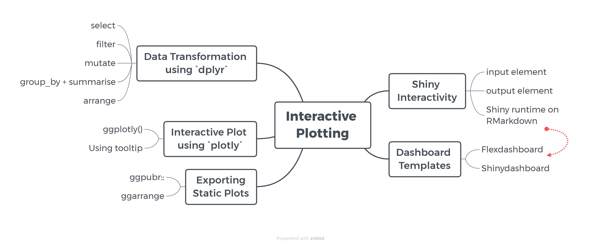
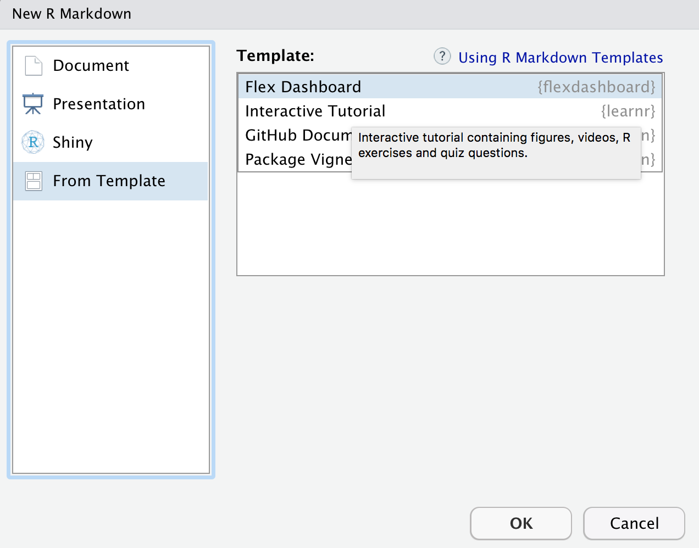

```{r setup, include=FALSE}
# clear-up the environment
rm(list = ls())

# chunk options
knitr::opts_chunk$set(
  message = FALSE,
  warning = FALSE,
  fig.align = "center",
  comment = "#>"
)

options(scipen = 100)
```


# Course Map

```{r echo=FALSE, out.width="100%"}

```


# Introduction

Pada eksplorasi kali ini, akan digunakan satu package bernama dplyr, yang mengusung konsep tidy dalam transformasi data. 

```{r, warning=FALSE}
library(dplyr)
library(ggplot2) # visualisasi
library(ggpubr)
library(scales) # untuk tampilan digit (memberikan koma dll)
library(glue)
library(plotly) 
library(lubridate) # working with datetime
options(scipen = 100) # supaya output tidak menampilkan notasi ilmiah (10-e10)
```

#️ Data Transformation using `dplyr`

**🕵 `dplyr`** adalah package khusus yang mempermudah kita dalam melakukan data wrangling/cleaning/transformation.


## Load Data

Kita akan coba mengeksplorasi kembali data **Youtube Trending 2023, All Unique Videos** menggunakan package dplyr! Mari kita baca terlebih dahulu data kita:

```{r}
vids <- read.csv("data_input/youtubetrends_2023.csv", stringsAsFactors=TRUE)
vids
```

Deskripsi kolom: 

-   `trending_date`   : tanggal trending (format: YY.MM.DD)
-   `title`           : judul video
-   `channel_title`   : nama channel Youtube
-   `category_id`     : kategori video
-   `publish_time`    : tanggal upload video (format: YYYY-MM-DD-HH-MM-SS)
-   `views`           : jumlah views dalam video tersebut
-   `likes`           : jumlah likes dalam video tersebut
-   `dislikes`        : jumlah dislikes dalam video tersebut
-   `comment_count`   : jumlah komentar
-   `comment_disabled`: apakah kolom komentar tidak diaktifkan
-   `rating_disabled` : apakah rating video tidak diaktifkan
-   `video_error_or_removed`: apakah video dihapus
-   `publish_hour`    : jam video tersebut dipublish
-   `publish_when`    : range video tersebut dipublish
-   `publish_wday`    : hari video tersebut dipublish
-   `timetotrend`     : rentang waktu video tersebut dari dipublish sampai menjadi trending (harian)

## 🛠 `select` : seleksi kolom

❓ Misalkan kita ingin mengambil kolom `trending_date` & `title`:

```{r eval=FALSE}
# base
vids_select1 <- vids[ , c("trending_date", "title") ]
```


```{r}
# dplyr
select(.data=vids, trending_date, title)
```


❓ Misalkan kita ingin buang kolom `comments_disabled`, `ratings_disabled`, dan `video_error_or_removed` karena tidak digunakan:


```{r eval=FALSE}
# base: harus menggunakan index
vids_select2 <- vids[,-c(10,11,12)]
```


```{r}
# dplyr
select(.data=vids, -comments_disabled, -ratings_disabled, -video_error_or_removed)
```
```{r}
select(.data=vids, -c(comments_disabled, ratings_disabled, video_error_or_removed))
```
## 🛠 `filter`: filter baris (berdasarkan kondisi)

Misalkan kita ingin mengambil video dari kategori *"Gaming"* dan memiliki views lebih dari 1 juta.


```{r eval=FALSE}
# base
vids_filter <- vids[vids$category_id == "Gaming" & vids$views > 1000000,]
```

```{r}
# dplyr
filter(.data=vids, 
       category_id == "Gaming",
       views > 1000000)
```

## 🛠 `mutate`: memodifikasi kolom: mengubah tipe data, menambah kolom, mengganti nilai pada suatu kolom

```{r eval=FALSE}
# base: mengubah tipe data kolom `title`
vids$title <- as.character(vids$title)
```


```{r}
# dplyr
mutate(.data=vids, 
       title = as.character(title),
       jam = 12)
```


➰➰➰➰➰➰➰➰➰➰➰➰➰➰➰➰➰➰➰➰➰➰➰➰➰➰➰➰➰➰➰➰➰➰➰➰➰➰


## 🏄️ Dive Deeper: DPLYR

Misal untuk kebutuhan analisis lanjutan kita akan mempersiapkan data terlebih dahulu. Kita ingin menganalisis **video** dan **channel youtube** yang trending dan mencari tahu **durasi yang mereka butuhkan hingga trending**. Analisis hanya untuk kategori **Music** saja. 


```{r}
music <- filter(.data=vids,
       category_id == "Music")

select(.data=music, title, channel_title, timetotrend)
```


## ✨✨ Tips: Piping `%>%`

Piping `%>%` digunakan untuk menyambungkan proses yang **sequential** atau berurutan. Untuk lebih memahaminya, mari menuliskan kegiatan pagi kita dari bangun tidur hingga siap bekerja menggunakan piping:

**Shortcut Piping**: ctrl + shift + m / cmd + shift + m


```{r}
vids %>% filter(category_id == "Music") %>% select(title, channel_title, timetotrend)
```


➰➰➰➰➰➰➰➰➰➰➰➰➰➰➰➰➰➰➰➰➰➰➰➰➰➰➰➰➰➰➰➰➰➰➰➰➰➰


## Data Cleansing

- 1️⃣ Sebagai tahapan data wrangling di awal, kita akan buang kolom `comments_disabled`, `ratings_disabled`, dan `video_error_or_removed` karena tidak digunakan.

- 2️⃣ Kemudian **memperbaiki tipe data** pada kolom:

  + `trending_date`, `publish_time` -> date & datetime (POSIXct)
  + `title`, `channel_title` -> character

- 3️⃣ Kemudian coba **buat kolom** baru berupa:

  - buat kolom `likesp` (likes per view)
  - buat kolom `dislikesp` (dislikes per view)
  - buat kolom `commentp` (comment per view)

Kemudian simpan ke nama objek `vids_clean`:


```{r}
# code here
vids_clean <- vids %>% 
  # deselect kolom yang tidak dibutuhkan
  select(-c(comments_disabled, ratings_disabled, video_error_or_removed)) %>% 
  # manipulasi kolom
  mutate(title = as.character(title),
         channel_title = as.character(channel_title),
         trending_date = ymd(trending_date),
         publish_time = ymd_hms(publish_time)) %>% 
  mutate(likesp = likes / views,
         dislikesp = dislikes / views,
         commentp = comment_count / views)
vids_clean
```

### Check missing value:

```{r}
colSums(is.na(vids_clean))
```


```{r}
vids_clean %>% is.na() %>% colSums()
```


➰➰➰➰➰➰➰➰➰➰➰➰➰➰➰➰➰➰➰➰➰➰➰➰➰➰➰➰➰➰➰➰➰➰➰➰➰➰

## 🛠 Agregasi Data

Pada dplyr, kita dapat melakukan aggregasi data menggunakan `group_by()` dan `summarise()`, kemudian disempurnakan dengan fungsi penutup `ungroup()`.

- 🛠 `group_by()`: melakukan pengelompokkan berdasarkan kolom tertentu, sehingga proses apapun setelahnya dilakukan berdasarkan pengelompokkan tersebut.
- 🛠 `summarise()`: menghitung nilai statistik tertentu
- 🛠 `ungroup()`: melepaskan pengelompokkan agar proses apapun setelahnya dilakukan untuk keseluruhan data.

[Ilustrasi](https://docs.google.com/presentation/d/1GIQ4vkAiwAeVVRzVX3HDFw-R61pVQ4cqEE0hgVn117A/edit#slide=id.g10f92d5049a_0_165)

Analisis Engagement Video Trending

❓Coba hitung **rata-rata likes** video trending yang dimiliki oleh **tiap category_id video youtube**:


```{r eval=FALSE}
# base
vids_agg <- aggregate(likes ~ category_id, data = vids_clean, FUN = mean)
```

```{r}
# dplyr
vids_clean %>% 
  group_by(category_id) %>% 
  summarise(avg_like = mean(likes)) %>% 
  ungroup()

```


➰➰➰➰➰➰➰➰➰➰➰➰➰➰➰➰➰➰➰➰➰➰➰➰➰➰➰➰➰➰➰➰➰➰➰➰➰➰

**❓ Knowedge Check**


- 1️⃣ Hitung rata-rata likes dan comment untuk setiap category

```{r}
vids_engagement <- vids_clean %>% 
  group_by(category_id) %>% 
  summarise(avg_like = mean(likes), avg_comment = mean(comment_count)) %>% 
  ungroup()

vids_engagement
```


- 2️⃣ Periode (hari dan jam) kapan seorang youtuber dapat mengupload videonya supaya memiliki views yang banyak (berdasarkan rata-rata)? Hanya untuk category **music**

```{r}
vids_agg <- vids_clean %>% 
  filter(category_id == "Music") %>% 
  group_by(publish_hour, publish_wday) %>% 
  summarise(avg_views = mean(views)) %>% 
  arrange(desc(avg_views)) %>% 
  ungroup()

vids_agg
```


➰➰➰➰➰➰➰➰➰➰➰➰➰➰➰➰➰➰➰➰➰➰➰➰➰➰➰➰➰➰➰➰➰➰➰➰➰➰

## 🛠 `arrange`: mengurutkan data 

Urutkan channel youtube dengan rata-rata viewer tertinggi hingga terendah dari kategori Music:

```{r eval=FALSE}
# base
vids_agg[order(vids_agg$average, decreasing = T),]
```


```{r}
# dplyr
vids_agg %>% arrange(-avg_views)
```

> ...


```{r}
glimpse(vids_clean)
```

## 🏄️ Dive Deeper: Aggregasi

1. Dwi ingin membuat suatu channel youtube namun masih bingung kategori video yang cocok dibuat. Sajikan suatu data lalu buatlah analisis dari setiap **kategori video** ada berapa jumlah video yang trending? Data yang didapat silahkan disimpan pada objek bernama `vids_count`. Berikan rekomendasi kategori video apa yang bisa Dwi buat supaya bisa trending. (hint: menghitung frekuensi: `n()`)


```{r}
# Code here
vids_count <- vids_clean %>% 
  group_by(category_id) %>% 
  summarise(video_count = n()) %>% 
  arrange(-video_count) %>% 
  ungroup()

vids_count
```

> Category: Gaming

2. Berdasarkan kategori video yang sudah direkomendasikan diatas, Dwi ingin menganalisis lebih lanjut channel mana yang memiliki jumlah rata-rata viewers tertinggi? Data yang didapat silahkan disimpan pada objek bernama `vids_10`. Ia ingin melihat 10 channel teratas sebagai referensi channel yang akan dibuat. Channel apa saja yang dapat direkomendasikan?

```{r}
# code here
vids_10 <- vids_clean %>% 
  filter(category_id == "Gaming") %>% 
  group_by(channel_title) %>% 
  summarise(avg_views = mean(views)) %>% 
  arrange(-avg_views) %>%
  ungroup() %>% 
  top_n(10)

vids_10
```


➰➰➰➰➰➰➰➰➰➰➰➰➰➰➰➰➰➰➰➰➰➰➰➰➰➰➰➰➰➰➰➰➰➰➰➰➰➰

# 📝 Summary DPLYR

Cocokan fungsi dplyr dan tahapan data wrangling yang dilakukan pada list di bawah:

* cek data: 
* seleksi kolom: 
* filter baris: 
* mengubah/membuat kolom/mengubah tipe data: 
* agregasi data: 
* mengurutkan data: 


a. select
b. group_by + summarise + ungroup
c. glimpse
d. mutate
e. arrange(desc())
f. filter


Untuk memudahkan pengolahan, kita juga bisa menggunakan piping (%>%)

Referensi tambahan: [Official Documentation & Cheatsheet `dplyr`](https://dplyr.tidyverse.org/) 


➰➰➰➰➰➰➰➰➰➰➰➰➰➰➰➰➰➰➰➰➰➰➰➰➰➰➰➰➰➰➰➰➰➰➰➰➰➰


# Reshaping data

## 📌 Tips: `pivot_longer()`

Fungsi `pivot_longer()` memungkinkan kita untuk membentuk ulang sebuah dataframe yang awalnya memiliki format *wide* (tersebar secara horizontal) menjadi *long* (dikumpulkan secara vertikal). Prinsip format *wide* dan *long* dapat diilustrasikan dengan gambar berikut ini.

```{r echo=FALSE, out.width="100%"}
knitr::include_graphics("assets/long_wide.png")
```

Parameter fungsi `pivot_longer()`

* `data`: objek data
* `cols`: kolom yang ingin diubah menjadi format **long**
* `names_to`: nama kolom baru yang berisi nama-nama kolom sebelumnya yang dimasukkan di parameter `cols`
* `values_to`: nama kolom baru yang berisi nilai-nilai numerik

```{r}
library(tidyr)
```


```{r}
vids_engagement %>% 
  pivot_longer(
    cols = c(avg_like, avg_comment),
    names_to = "engagement_type",
    values_to = "engagement_value"
  )
```


```{r}
vids_longer <- vids_engagement %>% 
  pivot_longer(
    cols = c(avg_like, avg_comment),
    names_to = "engagement_type",
    values_to = "engagement_value"
  )
```

Contoh visualisasi hasil pivot:

```{r}
ggplot(vids_longer, aes(x = category_id, y = engagement_value)) +
  geom_col(aes(fill = engagement_type), position = "dodge")
```


➰➰➰➰➰➰➰➰➰➰➰➰➰➰➰➰➰➰➰➰➰➰➰➰➰➰➰➰➰➰➰➰➰➰➰➰➰➰


🔎 Problem: Dari object `vids_agg`, kita ingin melihat rata-rata jumlah penonton untuk setiap hari dalam rentang waktu publikasi yang berbeda dalam satu tabel yang lebih mudah dianalisis.

```{r}
vids_agg
```

## 📌 Tips: pivot_wider()

Fungsi `pivot_wider()` merupakan kebalikan dari fungsi `pivot_longer()` yang memungkinkan kita untuk membentuk ulang sebuah dataframe berformat *long* (tersebar secara vertikal) menjadi *wide* (dikumpulkan secara horizontal)

Parameter pada fungsi `pivot_wider()` 

- `data`        : object data 
- `names_from`  : parameter ini untuk memberi tahu fungsi kolom apa yang mewakili data yang ingin kita buat menjadi wide 
- `values_from` : parameter ini untuk memberi tahu fungsi kolom apa yang mewakili data numerik

```{r}
# Menggunakan pivot_wider
vids_agg %>% 
  pivot_wider(
    names_from = publish_wday,
    values_from = avg_views
  )
```


➰➰➰➰➰➰➰➰➰➰➰➰➰➰➰➰➰➰➰➰➰➰➰➰➰➰➰➰➰➰➰➰➰➰➰➰➰➰


# Interactive Plot using `plotly`

```{r}
library(ggplot2) # pembuatan plot statis
library(plotly) # untuk plot interaktif
library(glue) # untuk setting tooltip
library(scales)
```

**Plot interaktif membolehkan user untuk berinteraksi dengan plot** dan menghasilkan visualisasi yang lebih **ringkas, namun tetap informatif dan menarik**. Kita dapat menggunakan library `plotly` untuk membuat plot interaktif di R.

Link Official Plotly: https://plotly.com/r/

📊 Tahapan pembuatan interactive plot dengan mudah menggunakan `plotly`:

   1. Business question
   2. Siapkan data
   3. Buat ggplot
   4. Ubah objek ggplot menjadi plotly

❗️ Sebelumnya kita telah menyiapkan 2 data hasil analisis (`vids_count` & `vids_10`). Mari visualisasikan 2 data tersebut menggunakan interactive plotting.

```{r}
vids_count <- vids_count %>% 
  mutate(
    label = glue(
      "Category: {category_id}
       Video Count: {video_count}"
    )
  )
```


## 📉 Plot 1: Trending Category 

**BQ:** Buatlah analisis mengenai kategori paling trending berdasarkan jumlah video yang masuk ke dalam jajaran video trending!

```{r}
# plot: ggplot2
plot1 <- ggplot(data=vids_count, aes(x=video_count, 
                                     y=reorder(category_id, video_count))) + 
  
  
  
  geom_col(aes(fill=video_count)) +
  
  
  # additional
  scale_fill_gradient(low="red", high="black") +
  labs(title = "Trending Categories of YouTube US 2023",
       x = "Video Count",
       y = NULL) +
  scale_x_continuous(labels = comma) +
  theme_minimal() +
  theme(legend.position = "none") 

plot1
```

**Diubah menjadi interaktif**

```{r}
# interactive plot
ggplotly(plot1, tooltip = "label")
```


### Tooltip

Untuk mempercantik plot interaktif, kita dapat menggunakan **tooltip**, yaitu informasi/label yang tertampilkan ketika user meng-hover plot. Kita dapat mempersiapkan informasi yang ingin ditampilkan pada kolom baru di data, kemudian meng-embed nya pada fungsi ggplotly.

```{r}
# menambahkan kolom berisi informasi tooltip
vids_count <- 

vids_count
```

```{r}
# buat ulang ggplot
plot1 <- ggplot(data=vids_count, aes(x=video_count, 
                                     y=reorder(category_id, video_count),
                                     text=label)) + 
  
  
  
  geom_col(aes(fill=video_count)) +
  
  
  # additional
  scale_fill_gradient(low="red", high="black") +
  labs(title = "Trending Categories of YouTube US 2023",
       x = "Video Count",
       y = NULL) +
  scale_x_continuous(labels = comma) +
  theme_minimal() +
  theme(legend.position = "none") 

plot1
```

```{r}
# buat ulang plotly
ggplotly(plot1, tooltip="text")
```


➰➰➰➰➰➰➰➰➰➰➰➰➰➰➰➰➰➰➰➰➰➰➰➰➰➰➰➰➰➰➰➰➰➰➰➰➰➰

## 📉 Plot 2: Trending Channel


```{r}
vids_10
```


**BQ**: Dari kategori video Gaming, buatlah analisis mengenai Top 10 channel youtube dengan rata-rata jumlah viewers tertinggi!

```{r}
# data 
vids_10 <- vids_10 %>% 
  mutate(label = glue(
    "Channel: {channel_title}
    Average Views: {comma(avg_views)}"
  ))
vids_10
```

```{r}
# ggplot: lolipop plot
plot2 <- ggplot(vids_10, aes(
  x = reorder(channel_title, avg_views),
  y = avg_views,
  text = label
)) +
  
  # geom_segment
  geom_segment(aes(xend=reorder(channel_title, avg_views), y=0,yend=avg_views), color="red") +
  
  # geom_point
  geom_point(color="black", size=3) +
  
  # additional
  coord_flip() +
  scale_y_continuous(labels = comma) +
  labs(title = "Top 10 Channel on Gaming",
       x = NULL,
       y = "Average View") +
  theme_minimal()

plot2
```

```{r}
# plotly
ggplotly(plot2, tooltip="label")
```


➰➰➰➰➰➰➰➰➰➰➰➰➰➰➰➰➰➰➰➰➰➰➰➰➰➰➰➰➰➰➰➰➰➰➰➰➰➰

## 📉 Plot 3: Trending Activity

**BQ**: Setelah menganalisis tentang channel top 10 dari kategori video yang direkomendasikan, kita ingin melihat aktivitas viewers pada kategori tersebut di tiap `publish_hour`. Tipe plot apa yang baiknya digunakan? Buatkan interactive plotnya.

```{r}
# data
vids_trend <- vids_clean %>% 
  filter(category_id == "Gaming") %>% 
  group_by(publish_hour) %>% 
  summarise(avg_views = mean(views)) %>% 
  ungroup() %>% 
  mutate(
    label2 = glue(
      "Publish Hour: {publish_hour}
      Average Views: {comma(round(avg_views, 2))}"
    )
  )
  
  
vids_trend
```


```{r}
# plot
plot3 <- ggplot(vids_trend, aes(x=publish_hour, y=avg_views))+
  
  
  # geom_*
  geom_line(col="red") +
  geom_point(aes(text = label2), col="black") +
  
  # additional
  scale_y_continuous(labels = comma) +
  scale_x_continuous(breaks = seq(0,23,1)) +
  labs(
    title = "Viewers Activity of Gaming Videos",
    x = "Publish Hours",
    y = "Average Views"
  ) +
  theme_minimal()
  
plot3  
  
```

```{r}
# buat plot menjadi interaktif dengan menambahkan tooltip
ggplotly(plot3, tooltip="text")
```


➰➰➰➰➰➰➰➰➰➰➰➰➰➰➰➰➰➰➰➰➰➰➰➰➰➰➰➰➰➰➰➰➰➰➰➰➰➰

# Exporting Plots

# Exporting Plots with `ggpubr`

## `ggarrange()`

Untuk menyusun plot statis ke bentuk pdf.

```{r}
library(ggpubr)
publicat <- ggarrange(plot1, plot2, plot3, ncol=1)

# print hal 1
publicat
```

## `ggexport()`

Export visualisasi dalam ragam file extension. Berikut contoh untuk PDF:

```{r}
ggexport(publicat, filename="assets/publication_inclass.pdf")
```

Ke dalam extensi file lain (kebanyakan disimpan per plot nya saja): 

* https://r-coder.com/save-plot-r/
* https://www.datanovia.com/en/blog/how-to-save-a-ggplot/

## `subplot()`

```{r}
subplot(
  plot1,
  plot2,
  plot3,
  nrows=3)
```


# 📝 Summary

1. Tahapan Pembuatan plot Interaktif dari ggplot2:

- siapkan data: ditambahkan kolom untuk tooltip (info yang ingin ditampilkan ketika hover)

```
data <- data %>% 
 mutate(label = glue("isi tooltip {data}"))
```

- buat ggplot, tambahkan aes text ke dalam codingan ggplot, assign ke objek

```
# umumnya di dalam geom
plot <- ggplot(data, aes(x = kolom_a, y = kolom_b, text = kolom_tooltip)) +
  geom_point() + dst...

# aes text bisa juga ditambahkan di geom, umumnya bila multiple geom
plot <- ggplot(data, aes(x = kolom_a, y = kolom_b)) +
  geom_point(aes(text = kolom_tooltip)) + dst ...
```

- buat plotly, atur tooltip agar menggunakan aes text.

```
ggplotly(plot, tooltip = "text")
```

2. Exporting plot:

- `ggarrange()`: menyusun plot statis
- `ggexport()`: mengexport plot yg sudah tersusun ke file PDF/dll.
- `subplot()`: menyusun plot interaktif

3. Untuk exporting plot interaktif (ataupun statis) bisa lebih banyak fiturnya bila menggunakan dashboard


## Exporting Plots with Flexdashboard

* Langkah membuat file Rmd dengan template `flexdashboard`:
  1. Pilih Menu File > New File > R Markdown
  2. Pada bagian "From Template", pilih "Flex Dashboard"
  3. Klik tombol "OK"
  4. Simpan file Rmd dan beri nama file (bisa dengan shortcut CTRL + S)

```{r echo=FALSE, out.width="100%"}

```

* Pada bagian YAML, kita biasanya mengatur:
  - `vertical_layout`: fill atau scroll
  - `orientation`: columns atau rows
  - `theme`: https://bootswatch.com/ 
  - Lalu untuk membuat panel baru dalam column atau row, gunakan ### pada baris baru
  
* Berikut cara mengisi template `flexdashboard`:
  - Code untuk load library, read dan prepare data diletakkan di chunk dengan `include = FALSE` agar tidak tampil.
  - Code untuk proses plotting diletakkan di posisi yang bersesuaian. Catatan: tidak perlu memanggil object yang tidak ingin ditampilkan, cukup object dari plot interaktifnya saja.

* Pertimbangan dalam menggunakan `flexdashboard`:
  - Kelebihan: Dengan adanya template, akan mempermudah pembuatan dashboard
  - Kekurangan: User belum dapat memberikan input (kecuali mengkombinasikannya dengan `shiny`)

* Referensi:
  - Official documentation: https://pkgs.rstudio.com/flexdashboard/index.html
  - Detail penggunaan `flexdashboard`: https://pkgs.rstudio.com/flexdashboard/articles/using.html
  - Layout `flexdashboard`: https://pkgs.rstudio.com/flexdashboard/articles/layouts.html
  - Theme `flexdashboard`: https://pkgs.rstudio.com/flexdashboard/articles/theme.html


# Inclass Questions


# Referensi:

- `shiny Cheatsheet`: <https://raw.githubusercontent.com/rstudio/cheatsheets/main/shiny.pdf>
- `shiny Gallery`: <https://shiny.rstudio.com/gallery/>
- `shiny Input Gallery` : <https://shiny.rstudio.com/gallery/widget-gallery.html>
- `shinyWidgets`: <http://shinyapps.dreamrs.fr/shinyWidgets/>
- `shinydashboard`: <https://rstudio.github.io/shinydashboard/>
