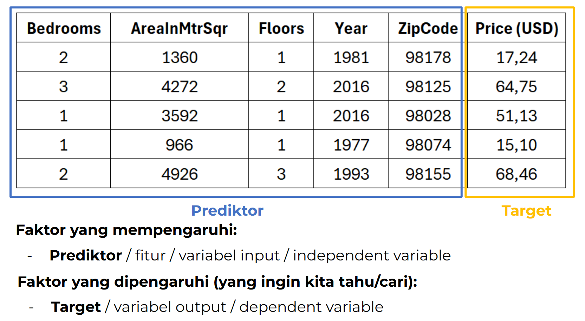
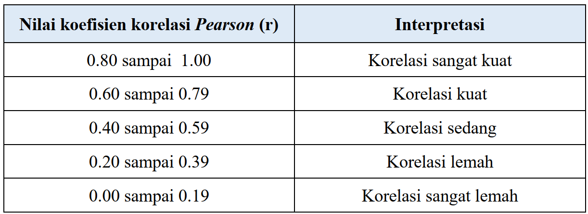
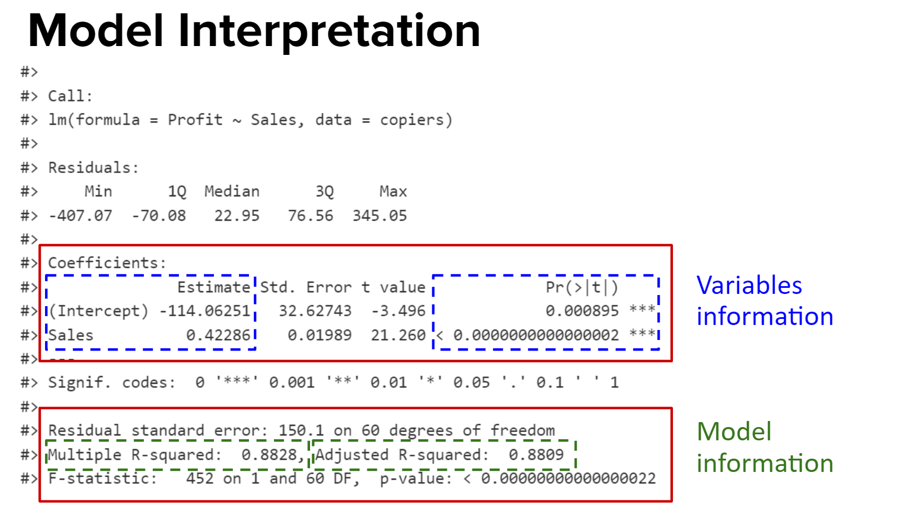
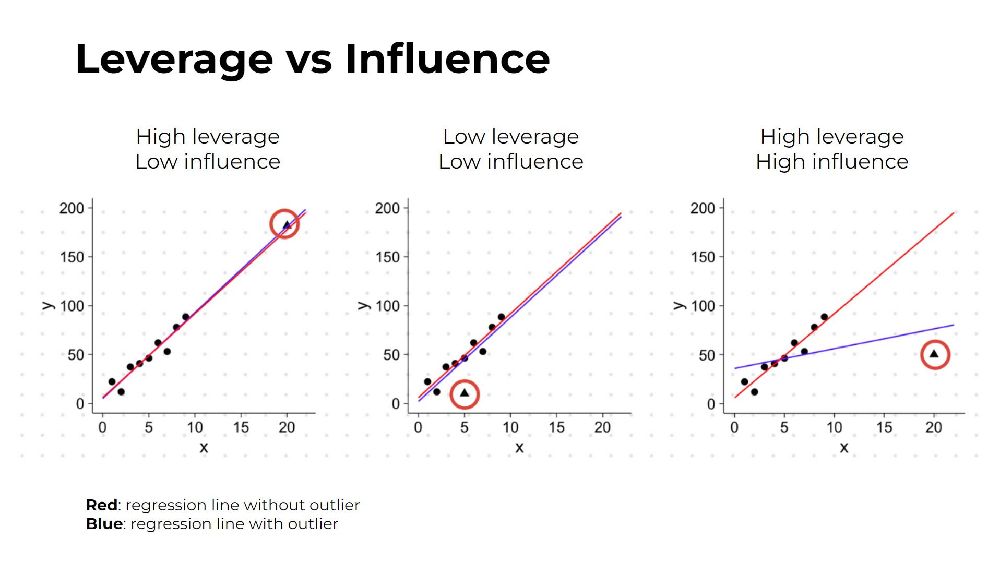
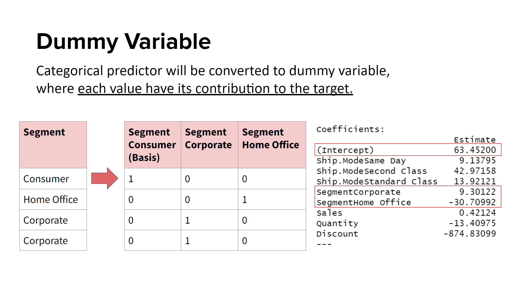
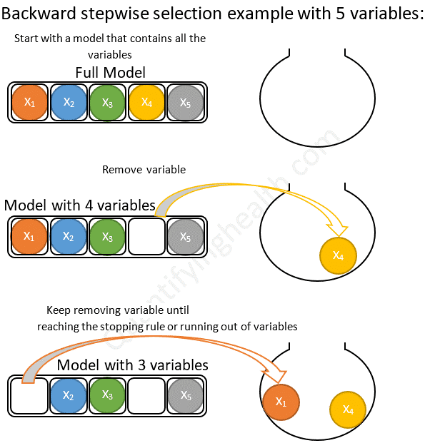
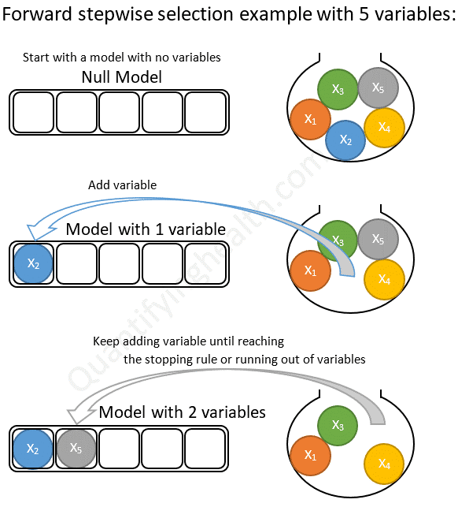
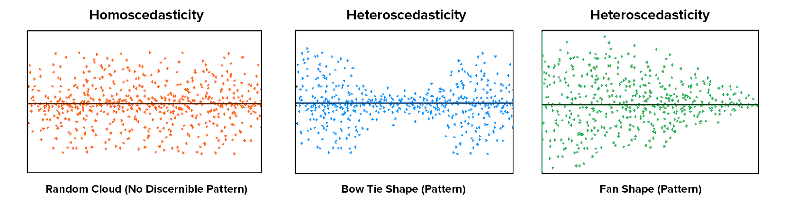

```{r setup, include=FALSE}
# clear-up the environment
rm(list = ls())

# chunk options
knitr::opts_chunk$set(
  message = FALSE,
  warning = FALSE,
  fig.align = "center",
  comment = "#>"
)
options(scipen = 99)
```

# Introduction to Machine Learning

Machine learning adalah sub-bidang dari Ilmu Komputer yang memungkinkan komputer untuk belajar dari data tanpa diprogram secara eksplisit. Tujuan dari machine learning adalah membuat **mesin yang dapat belajar sendiri** dalam memahami pola data sehingga dapat memprediksi apa yang akan terjadi di masa depan berdasarkan pola tersebut.

## Target & Predictor

```{r, out.width = "100%", echo = FALSE, fig.align = "center"}

```

  Suatu dataset akan dibagi menjadi 2 grup yaitu:
  
    - Target: kolom/nilai yang ingin diprediksi.
    - Prediktor: kolom/nilai yang digunakan untuk memprediksi.

## Supervised & Unsupervised Learning

1. **Supervised Learning**: Model dilatih menggunakan data yang **sudah memiliki target**, yaitu nilai yang ingin diprediksi.

    Task yang termasuk ke dalam **supervised learning** yaitu:

    * **Regression** atau regresi: target variabel nya **numerik** (prediksi harga rumah, prediksi profit penjualan)
    * **Classification** atau klasifikasi: target variabel nya **kategorik** (prediksi transaksi fraud/tidak, prediksi terkena diabetes/tidak)

2. **Unsupervised Learning**: Model menemukan pola atau struktur pada dataset **tanpa adanya target**, sering digunakan untuk pengelompokan atau analisis eksploratif.

    Task yang termasuk ke dalam **unsupervised learning** yaitu:
  
    * **Clustering**: mengumpulkan data ke dalam rumpun yang sama (klasterisasi).
    * **Dimensionality Reduction**: mengurangi dimensi/ukuran data.

## How Supervised Machine Learning Works

Dalam case supervised machine learning yang akan kita bahas, Kita tahu bahwa kita membutuhkan **input** (prediktor) dan **output** (target) untuk membuat model machine learning

❓ Misal dalam kasus ingin memprediksi harga rumah, **kolom manakah yang akan menjadi output/target variabel** dalam machine learning model?

```{r}
house_data <- data.frame(
  Bedrooms = c(3, 3, 2, 4),
  AreaInMtrSqr = c(150, 100, 100, 200),
  Floors = c(1, 2, 1, 1),
  ZipCode = c(98178, 98125, 98028, 98074),
  Price = c(125000, 175000, 75000, 225000)
)

house_data
```

Pada data di atas:

- Target: Price
- Prediktor: Bedrooms, AreaInMtrSqr, Floors, ZipCode

## Regression Case Examples

Pemilihan variabel **target (y)** dan **prediktor (x)** biasanya ditentukan berdasarkan masalah bisnis yang ingin diselesaikan. Contoh:

1. Suatu perusahaan asuransi ingin memperkirakan biaya medis yang harus ditanggung untuk setiap nasabahnya sehingga perusahaan asuransi kesehatan dapat membuat keputusan yang lebih baik terkait premi dan manajemen risiko.

* variable target: _____
* variable prediktor: _____


2. Suatu perusahaan T sedang ingin menentukan berapa perkiraan harga dari suatu mobil baru yang akan dijual. Agar tidak salah penentuan harga.

* variable target: _____
* variable prediktor: _____

# Regression Case: Profit Prediction

## 1. Read Data Copiers

Sebagai data scientist kita ditugaskan untuk membangun model machine learning yang bisa memprediksi total keuntungan dari penjualan mesin fotokopi berdasarkan data historis penjualan mesin tersebut.

Kita akan membangun model machine learning dan memahami konsep dasar dari linear regression dengan menggunakan data `copiers.csv`, yaitu data retail hanya untuk `Sub.Category` Copiers.

```{r}
# baca data copiers
copiers <- read.csv("data_input/copiers.csv")

# tampilkan 6 data teratas
head(copiers)
```

**Keterangan kolom**

* Row.ID: ID tiap baris
* Order.ID: ID transaksi
* Order.Date: Tanggal transaksi
* Ship.Date: Tanggal pengiriman barang
* Ship.Mode: Mode pengiriman barang (First Class, Same Day, Second Class, Standard Class)
* Customer.ID: ID konsumen
* Segment: Segmen konsumen (Consumer, Corporate, Home Office)
* Product.ID: ID barang
* Category: Kategori barang (Technology)
* Sub.Category: Sub kategori barang (Copiers)
* Product.Name: Nama barang
* Sales: Harga total sebelum diskon
* Quantity: Jumlah barang yang dibeli
* Discount: Diskon yang diberikan
* Profit: Keuntungan yang diperoleh dari hasil penjualan


## 2. Data Cleansing & Feature Selection

- **Data cleansing**: Membersihkan data sebelum digunakan untuk pemodelan machine learning.
- **Feature selection**: Memilih kolom-kolom yang hanya digunakan untuk pemodelan machine learning.

### 2.1 Seleksi Fitur

* Variable target
* Variable prediktor (berdasarkan business):
  + Bisa bertipe numerik dan kategorik
  + Kategori: Buang kolom dengan jumlah unique yang banyak (terlalu spesifik dan levelnya banyak)
  + Kategori: Buang kolom dengan unique nilai hanya 1 (tidak informatif)
  
  
```{r}
str(copiers)
```
  
  
Case: Melakukan prediksi profit dari data hasil penjualan mesin photo-copy

Target: Profit
Prediktor: Ship.Mode, Segment, Sales, Quantity, Discount

Selanjutnya, mengambil kolom-kolom Target dan Prediktor:

- versi base: `df[ , c("kolom_1", "kolom_2", "kolom_n")]` -> subsetting dengan cara base
- versi dplyr: `select("kolom_1", "kolom_2", "kolom_n")`  -> subsetting dengan library dplyr

```{r}
# import library
library(dplyr)

# melakukan feature selection
copiers <- 

# tampilkan data
head(copiers)
```

Untuk melakukan piping ( %>% ) bisa menggunakan shortcut CTRL + SHIFT + M (Windows) & CMD + SHIFT + M (Mac)


### 2.2 Cek Stuktur & Tipe Data

```{r}
# periksa struktur data menggunakan base R
str(copiers)
```


```{r}
# periksa struktur data menggunakan library glimpse
glimpse(copiers)
```


Tipe data yang belum sesuai:

- _____

Mengubah tipe data:
Syntax: `copiers$nama_kolom <- fungsi(copiers$nama_kolom)`

```{r}
# mengubah tipe data


# menampilkan struktur data

```

## 3. Exploratory Data Analysis (EDA) - Korelasi

```{r, out.width = "100%", echo = FALSE, fig.align = "center"}

```

**cek korelasi** antara prediktor dengan target. Nilai korelasi memiliki rentang -1 sampai 1.

- semakin mendekati 1 artinya semakin kuat secara positif.
- semakin mendekati -1 artinya semakin kuat secara negatif.

```{r}
# import library
library(GGally)

# cek korelasi
ggcorr(data = copiers, label = T)
```

**Insight:**

Berdasarkan korelasi:
* _____
* _____

> Kesimpulan: _____


## 4. Simple Linear Regression

### 4.1 Concept: Simple Linear Regression

Regresi linear sederhana adalah model dengan **satu variabel prediktor**. Dalam hal ini kita akan menggunakan `Sales` karena memiliki korelasi paling kuat terhadap Profit.

Visualisasi Sales terhadap Profit

```{r}
# visualisasi scatter plot

```

💡 Insight: 
* _____

### 4.2 Modelling

Fungsi `lm()` digunakan untuk membuat linear model. Parameter:

* `formula`: dituliskan dengan `y ~ x`
  - y -> target
  - x -> prediktor
* `data`: objek dataframe

* Fungsi `summary(nama_model)`: Untuk melihat informasi model

```{r}
# buat fungsi lm(target ~ prediktor, data = dataframe)
model_ols <- 

# melihat hasil model
model_ols
```

Fungsi `lm()` akan menghasilkan coefficient untuk **intercept** dan masing-masing prediktor, sehingga bisa dibentuk sebuah formula regresi:

$$\hat{y} = \beta_0 + \beta_1 x_1 + ... + \beta_n x_n$$

Keterangan:

* $\hat{y}$ adalah variable target
* $\beta_0$ adalah intercept (nilai titik potong sumbu y)
* $\beta_1, ..., \beta_n$ adalah coefficient dari prediktor (slope atau kemiringan garis)
* $x_1, ..., x_n$ adalah nilai dari prediktor

Sehingga, formula `model_ols` di atas dapat dituliskan dengan:

```{r}
model_ols
```

$$Profit = -114.0625 + 0.4229*{Sales}$$

Berikut visualisasi garis regresinya:

```{r}
# membuat scatter plot
plot(copiers$Sales, copiers$Profit)

# membuat garis lurus
abline(model_ols, col = "red")
```

Formula inilah yang digunakan model linear regression untuk melakukan prediksi.

### 4.3 Prediction

Mari kita melihat kembali formula hasil pemodelan regresi kita:

$$Profit = -114.0625 + 0.4229*{Sales}$$

Berdasarkan formula tersebut, ketika Sales bernilai 1000, maka berapa prediksi nilai Profit?

```{r}
# hitung manual
profit <- 
profit

# berapa profit jika sales 650
profit650 <- 
profit650
```

Misal kita punya data `Sales` yang baru, lalu ingin prediksi nilai `Profit`.

```{r}
# dummy data
new_sales <- data.frame(Sales = c(300, 290, 320, 450))
new_sales
```

Fungsi `predict(object = ..., newdata = ...)` dapat digunakan untuk memprediksi data baru berdasarkan model yang telah dibuat. Dengan catatan, nama prediktor harus sama persis dengan yang dikenal oleh model.

```{r}
# gunakan fungsi predict untuk memprediksi data baru

```


### 4.4 Concept: Ordinary Least Squares / OLS

Ordinary Least Square (OLS) merupakan sebuah konsep untuk mencari suatu representasi berupa persamaan garis linear yang dapat menangkap pola paling baik, dalam hal ini yang menghasilkan **kesalahan terkecil** (perbedaan hasil prediksi dan data aktual terkecil). Objective: Berusaha mencari nilai parameter b0 (intercept) dan b1 (slope) untuk mendapatkan error/residual terkecil.

> Ordinary least squares regression dijelaskan secara visual: https://setosa.io/ev/ordinary-least-squares-regression/


### 4.5 Model Interpretation

Untuk melihat informasi model lebih detail, kita dapat menggunakan fungsi `summary(nama_model)`

```{r}
summary(model_ols)
```

```{r, out.width = "100%", echo = FALSE, fig.align = "center"}

```

Hal yang umum di-interpretasi dari model linear regression:

1. **Intercept**: nilai variable target ketika semua nilai prediktor sama dengan nol.
Profit = -114 + 0.42 * Sales

> Arti: Ketika Sales = 0, maka ____
  
2. **Coefficient/Slope**: besarnya perubahan nilai variable target ketika nilai prediktor bertambah 1 satuan.
  + Koefisien yang positif = meningkatkan nilai variable target
  + Koefisien yang negatif = menurunkan nilai variable target
  
Kasus contoh: memprediksi berat badan
Target: berat badan
Prediktor:
- Bobot makanan : memiliki koef. positif ; semakin banyak makan akan semakin berat
- Waktu jogging : memiliki koef. negatif ; semakin banyak jogging akan semakin ringan

3. **Signifikansi Prediktor**: mengetahui apakah setiap prediktor berpengaruh signifikan terhadap variable targetnya.
  + Sebuah prediktor dikatakan signifikan ketika p-value < 0.05 (alpha)
  + Tips: gunakan Signif. Codes yang tertera. Apabila menggunakan alpha = 0.05, maka ketika prediktor mendapatkan minimal satu bintang `*` sudah dapat dikatakan signifikan.

Uji hipotesis yang digunakan:

  + H0: Prediktor tidak signifikan berpengaruh (Estimate = 0)
  + H1: Prediktor signifikan berpengaruh (Estimate != 0)

**Take Away:** Kita melihat apakah terdapat bintang di prediktor, jika memiliki minimal 1 bintang *, maka prediktor berpengaruh signifikan terhadap target.


4. **R-squared**: ukuran kebaikan model (goodness of fit)
    - Rentang nilai 0 sampai 1
    - Semakin mendekati 1, semakin baik prediktor dalam menjelaskan target
    - Tidak ada aturan baku terkait batasan R-squared yang baik, tergantung kasusnya. Misal di ranah sosial mungkin tidak membutuhkan R-squared yang terlalu tinggi apabila dibandingkan di ranah medis, karena memiliki risiko yang lebih tinggi.
    
    Jenis R-Squared:
    - **Multiple R-squared** = untuk model dengan 1 variabel prediktor
    - **Adjusted R-squared** = untuk model > 1 variabel prediktor

---

```{r}
summary(model_ols)
```


💡 Hasil interpretasi dari `summary(model_ols)`:

* Dari Intercept: _____

* Dari Slope: _____

* Dari P-value: _____

* Dari R-squared: _____


### 📝 Knowledge Check

1. Supervised learning dapat dibagi menjadi regresi dan klasifikasi. Ciri-ciri regresi adalah ...

- [ ] Variable prediktor harus numerik
- [ ] Variable prediktor harus kategorik
- [ ] Variable target harus numerik
- [ ] Variable target harus kategorik

2. Regresi linear bekerja dengan cara membuat garis lurus yang dapat menangkap pola data antara target variable dengan prediktor. Prediktor yang baik adalah yang memiliki korelasi ... dengan targetnya.

- [ ] kuat
- [ ] lemah
- [ ] positif
- [ ] negatif

3. Misal terbentuk garis regresi $$A = 10 - 20*B$$, maka pernyataan mana yang tepat:

- [ ] Nilai intercept dari garis tersebut adalah -20 
- [ ] Ketika nilai B naik satu satuan, maka nilai A akan naik sebesar 20 satuan 
- [ ] Hubungan antara variable A dan B adalah negatif
- [ ] B adalah prediktor yang signifikan untuk memprediksi nilai A.

5. R-squared adalah salah satu nilai untuk menentukan kebaikan model regresi. R-squared yang diharapkan adalah nilai yang mendekati ...

- [ ] nol
- [ ] satu
- [ ] tak terhingga

---

### 4.6 Leverage vs Influence

```{r, out.width = "100%", echo = FALSE, fig.align = "center"}

```

* **Outlier** adalah titik data yang memiliki nilai ekstrim.
* Sebuah titik data dikatakan **high leverage** ketika nilai prediktornya merupakan outlier.
* Sebuah titik data dikatakan **high influence** ketika data tersebut sangat mempengaruhi bentuk garis linear (nilai intercept, slope) maupun nilai r-squared dari model.

Nilai leverage dapat berpengaruh baik dan buruk terhadap model.
* Apabila outlier tidak mengubah R-squared, sebaiknya data outlier dipertahankan saja (gunakan keseluruhan data)
* Apabila ternyata outlier malah menurunkan R-squared, sebaiknya dibuang.

Sejauh ini, kita sudah membuat satu model yaitu `model_ols` yang menggunakan semua observasi. Lakukan exploratory data dengan mengecek apakah terdapat outlier pada variable `sales` menggunakan boxplot.

```{r}
# membuat boxplot prediktor Sales

```

```{r}
# membuat scatter plot antara Sales dan Profit

```

Inspect data outlier. filter data tanpa outlier, atau ketika sales < 4000.

```{r}
# ambil data dengan nilai Sales < 4000 (no outlier)
copiers_new <- 

# buat model
model_no_outlier <- 

# summary model
summary(model_no_outlier)
```

Lakukan visualisasi menggunakan `abline` untuk `model_ols` dan `model_no_outlier`

```{r}
plot(copiers$Sales, copiers$Profit)
abline(model_ols, col="red")
abline(model_no_outlier, col="blue")
```

💡Insight: ___


Perbandingan nilai r-squared tanpa dan dengan outlier menggunakan package `performance`.
- Model dengan outlier = model_ols
- Model tanpa outlier = model_no_outlier

Syntax: `compare_performance(model_1, model_2)`

```{r}
library(performance)

# komparasi model

```

💡Insight:
- R-Squared model_ols = _____
- R-Squared model_no_outlier = _____

**Kesimpulan**:


## 5. Multiple Linear Regression

Linear regression dengan **lebih dari satu prediktor** bisa meningkatkan performa model karena lebih banyak informasi yang dapat menjelaskan target. 

Buat model linear regression dengan menggunakan **semua variable prediktor** untuk memprediksi **Profit**.

Fungsi `lm()` digunakan untuk membuat linear model. Parameter:

- `formula`: dituliskan dengan `y ~ x`
  - y -> target
  - x -> prediktor
- `data`: objek dataframe

Penulisan `formula`:
  + Tanpa prediktor: `formula = Profit ~ 1`
  + Satu prediktor: `formula = Profit ~ Sales`
  + Beberapa prediktor: `formula = Profit ~ Sales + Discount + Quantity`
  + Semua prediktor: `formula = Profit ~ .`
  + Exclude prediktor: `formula = Profit ~ . - Quantity - Discount`

Case: target = Profit, prediktor = semua.

```{r}
# . artinya menggunakan semua kolom selain target
model_ols_multi <- 

# lihat summary model

```

Formula regresi untuk model di atas:

$$
Profit =
63.452 \\
+ 9.13795 * Ship.ModeSame Day \\
+ 42.97158 * Ship.ModeSecond Class \\
+ 13.92121 * Ship.ModeStandard Class \\
+ 9.30122 * SegmentCorporate \\
- 30.70992 * SegmentHome Office \\
+ 0.42124 * Sales \\
- 13.40975 * Quantity \\
- 874.83099 * Discount
$$

Apa arti dari formula di atas? Interpretasi tiap slope dibedakan atas tipe datanya yaitu untuk tipe data numerik dan kategorik.

### 5.1 Slope for Numeric

1. Interpretasi coefficient untuk prediktor numerik:
  + Ketika Sales naik satu satuan, maka Profit _____, dengan catatan nilai prediktor lainnya tetap.
  + Ketika Quantity naik satu satuan, maka Profit _____, dengan catatan nilai prediktor lainnya tetap.
  + Ketika Discount naik satu satuan, maka Profit _____, dengan catatan nilai prediktor lainnya tetap.
  
```{r}
# dataframe example_numeric
example_numeric <- data.frame(
  Ship.Mode = c("Same Day", "Same Day"),
  Segment = c("Corporate", "Corporate"),
  Quantity = c(1, 1),
  Discount = c(0, 0),
  Sales = c(100, 101)
)

# melalukan prediksi pada dataframe di atas
example_numeric$PredictedProfit <- predict(model_ols_multi, example_numeric)

# menampilkan dataframe
example_numeric
```

```{r}
# perbandingan data sales = 100 dan sales = 101
example_numeric$PredictedProfit[2] - example_numeric$PredictedProfit[1]
```

### 5.2 Slope for Categoric (Dummy Variable)

```{r, out.width = "100%", echo = FALSE, fig.align = "center"}

```

2. Interpretasi coefficient untuk prediktor kategorik:
  + Setiap nilai dari kolom kategorik akan dijadikan **dummy variable**
  + Akan ada 1 nilai yang menjadi basis, sehingga tidak ditampilkan koefisiennya.
  + Contoh interpretasi kolom `Segment`:
    - SegmentConsumer tidak masuk sebagai prediktor, artinya dijadikan basis
    - Koefisien SegmentCorporate = 9.3, artinya pembelian dari segmen Corporate meningkatkan Profit sebesar 9.3 dibandingkan Consumer, dengan nilai prediktor lainnya tetap sama.
    - Koefisien SegmentHome Office = -30.7, artinya artinya pembelian dari segment Home Office menurunkan Profit sebesar 30.7 dibandingkan Consumer, dengan nilai prediktor lainnya tetap sama.

```{r}
# dataframe contoh
contoh <- data.frame(
  Ship.Mode = c("Same Day", "Same Day", "Same Day"),
  Segment = c("Consumer", "Corporate", "Home Office"),
  Sales = c(2, 2, 2),
  Quantity = c(1, 1, 1),
  Discount = c(0, 0, 0))

# melalukan prediksi pada dataframe contoh
contoh$PredictedProfit <- predict(model_ols_multi, contoh)

# menampilkan dataframe
contoh
```

### 5.3 Goodness of Fit

Ingat kembali:

- **Multiple R-squared** = untuk model dengan 1 variabel prediktor
- **Adjusted R-squared** = untuk model > 1 variabel prediktor

```{r}
# melihat r-squared

```

Adjusted R-squared: _____

### 5.4 Significant Predictor

Signifikansi prediktor:
  + Variable yang tidak signifikan bisa coba dihapus dari model, karena tidak berpengaruh banyak ke nilai target.
  + Namun hati-hati: ketika menghapus variable yang tidak signifikan, bisa saja variable lain menjadi signifikan. Untuk memastikannya, harus melalui proses trial-and-error

```{r}
# lihat signifikan prediktor

```

Kesimpulan: _____


## 6. Re-Modeling

Mari buat model lagi, dengan hanya menggunakan variable yang signifikan dari `model_ols_multi`

Target = Profit
Prediktor = Sales + Discount

```{r}
# lm(Target ~ Prediktor1 + Prediktor2, data)
model_ols_multi2 <- 
  
# melihat summary model

```

Karena kita menggunakan lebih dari 1 prediktor, maka nilai R-Squared dilihat dari Adjusted R-Squared nya

Membandingkan nilai Adjusted R-squared:
- model_ols_multi: _____
- model_ols_multi2: _____

> Kesimpulan: _____


## 7. Prediction

Di materi ini kita belum ada data baru. Maka dari itu, kita akan melihat performa model di data training saja, yaitu memprediksi data `copiers` dengan model yang sudah dibuat.

Mari bandingkan performa ketiga model berikut:

1. `model_ols`: satu prediktor (Sales)
2. `model_ols_multi`: semua prediktor (ada numerik, ada kategorik)
3. `model_ols_multi2`: dua prediktor signifikan (Sales + Discount)

```{r}
# prediksi model dengan satu prediktor
copiers$pred_ols <- 

# prediksi dari model semua prediktor
copiers$pred_ols_multi <- 

# prediksi dari model 2 prediktor signifikan (sales + discount)
copiers$pred_ols_multi2 <- 

# menampilkan data
head(copiers)
```

### 📝 Knowledge Check

1. Karakteristik *multiple linear regression* yang tepat adalah ...

- [ ] Linear regression tanpa prediktor
- [ ] Linear regression dengan satu prediktor
- [ ] Linear regression dengan prediktor lebih dari satu
- [ ] Linear regression dengan target lebih dari satu

2. Pilih pernyataan yang TIDAK TEPAT terkait feature selection (pemilihan prediktor) pada pembuatan model linear regression:

- [ ] Dapat menggunakan pengetahuan atau pertimbangan dari segi bisnis
- [ ] Dapat dibantu dengan melihat nilai korelasi antara target dengan prediktor
- [ ] Hanya boleh menggunakan prediktor yang berkorelasi sangat kuat saja
- [ ] Variable prediktor kategorik dengan jumlah unique yang banyak sebaiknya tidak digunakan

3. Ketika sebuah prediktor kategorik memiliki 3 level (nilai yang unik), maka pada `lm()` akan terbentuk berapa prediktor?

- [ ] Satu
- [ ] Dua
- [ ] Tiga
- [ ] Empat


## 8. Model Evaluation

Tujuan: mengetahui apakah model machine learning yang sudah dibuat cukup baik dengan melihat apakah hasil prediksi tersebut sudah menghasilkan error yang paling kecil.

### 8.1 Error/Residual

Error/residual adalah selisih antara hasil prediksi dengan nilai aktual.

$$
Error = prediction - actual = \hat y - y
$$

Aktual: 500

A: 550 - 500 = _____
B: 450 - 500 = _____
C: 600 - 500 = _____

Manakah model terbaik? _____


```{r}
# tampilkan data profit, pred_ols pred_ols_multi, dan pred_ols_multi2 pada data copiers

```

Tiap baris observasi akan menghasilkan error, sehingga butuh 1 nilai yang mewakili nilai error tersebut, umumnya adalah rata-rata error. Berikut metrik error yang biasa digunakan untuk regresi:

#### 8.1.1 Mean Absolute Error (MAE)

Mean Absolute Error (MAE) menunjukkan rata-rata dari nilai absolut error. MAE bisa diinterpretasikan sebagai seberapa besar penyimpangan hasil prediksi terhadap nilai aktualnya.

$$
MAE = \frac{\sum |\hat y - y|}{n}
$$

```{r}
# import library MLmetrics
library(MLmetrics)
```

Cara menghitung error menggunakan `MLmetrics`

`nama_metriks(y_pred = nilai_prediksi, y_true = nilai_aktual)`

MAE:
`MAE(y_pred = nilai_prediksi, y_true = nilai_aktual)`

```{r}
# hitung MAE prediksi model ols multi -> pred_ols_multi

```

💡 Insight: ____


Error: mencari yang terkecil.

R-squared:
- indikasi awal apakah model kita baik -> keluar dari hasil summary()

Metriks:
- pertimbangan akhir penentuan model


#### 8.1.2 Mean Squared Error (MSE)

MSE menghitung berapa **rata-rata dari kuadrat selisih antara nilai prediksi dengan nilai aktual**. MSE sensitif terhadap perubahan atau selisih hasil prediksi yang besar sehingga meskipun sulit diinterpretasikan tetapi menjadi lebih baik dalam mendeteksi selisih yang besar.

$$
MSE = \frac{ \sum (\hat y - y)^2 }{n}
$$

MSE:
`MSE(y_pred = nilai_prediksi, y_true = nilai_aktual)`

```{r}
# hitung MSE prediksi model ols multi -> pred_ols_multi

```

Note: MSE tidak dapat diinterpretasikan karena ukuran satuan datanya yang kuadrat.


#### 8.1.3 Root Mean Squared Error (RMSE)

RMSE adalah bentuk akar kuadrat dari MSE. Karena sudah diakarkan, maka interpretasinya kurang lebih sama dengan MAE. RMSE dapat digunakan jika kita lebih concern dengan error yang sangat besar.

$$
RMSE = \sqrt{\frac{ \sum (\hat y - y)^2} {n}} 
$$

RMSE:
`RMSE(y_pred = nilai_prediksi, y_true = nilai_aktual)`

```{r}
# hitung RMSE prediksi model ols multi -> pred_ols_multi

```

> Interpretasi RMSE: _____


#### 8.1.4 Mean Absolute Percentage Error (MAPE)

MAPE menunjukkan seberapa besar penyimpangannya dalam bentuk persentase.

$$
MAPE = \frac{1}{n} \sum\frac{|\hat y - y|}{y} 
$$

Prediksi: 8
Aktual: 10
Error: 2
MAPE: 2 / 10 -> 0.2 -> 20%
Artinya: Hasil prediksi menyimpang 20% terhadap data aktual

MAPE:
`MAPE(y_pred = nilai_prediksi, y_true = nilai_aktual)`

```{r warning=FALSE}
# hitung MAPE prediksi model ols multi -> pred_ols_multi
MAPE(copiers$pred_ols_multi, copiers$Profit)
```

> Interpretasi MAPE: _____
> MAPE memiliki range dalam bentuk persen, semakin kecil nilai MAPE, semakin bagus model yang kita miliki.


💡 Tips: 
- Tidak ada standar pasti MAPE yang baik. Namun, umumnya menggunakan 10% (di bawah 10% dianggap baik)
- Kita tinggal pilih 1  metriks yang kita butuhkan, untuk dibandingkan dengan beberapa model.

Summary Error:

1. **MAE** (Mean Absolute Error)
  + Lebih mudah dijelaskan ke orang tanpa latar belakang statistik
  - Mengabaikan error yang besar dari outlier

2. **MSE** (Mean Squared Error)
  + Sensitif terhadap error yang besar (karena error dikuadratkan)
  - Tidak bisa diinterpretasi, lebih sulit dijelaskan

3. **RMSE** (Root Mean Squared Error)
  + Karena asalnya dari MSE, maka sensitif terhadap error besar juga
  + Nilai bisa diinterpretasi (satuan sudah sama seperti data awal)
  - Formula lebih sulit dijelaskan

4. **MAPE** (Mean Absolute Percentage Error)
  + Mudah diinterpretasi
  - Tidak bisa digunakan ketika *data actual ada yang bernilai 0*

```{r}
# membandingkan model terbaik dengan MAPE
# model ols -> pred_ols


# model ols multi -> pred_ols_multi


# model ols multi2 -> pred_ols_multi2

```

> Model terbaik berdasarkan MAPE adalah _____


# 🏄 Dive Deeper: Predicting Credit Card Balance

Suatu institusi perbankan multinasional ingin mempelajari faktor-faktor yang mempengaruhi **saldo kartu kredit** pemegang kartunya menggunakan machine learning. Prediksi saldo kartu kredit dapat memberikan manfaat yang signifikan bagi perbankan yaitu perbankan dapat meningkatkan kualitas layanan dan keuntungan. Analisis ini juga dapat membantu perusahaan untuk memahami perilaku pemegang kartu.

## 1. Read data `credit card`

Kita akan memahami konsep dasar dari linear regression dengan menggunakan data `credit_card.csv`, yaitu dataset yang terdiri dari informasi 400 pemegang kartu kredit di suatu perbankan.

```{r}
cc <- read.csv("data_input/credit_card.csv", stringsAsFactors = T)
cc
```

**Deskripsi:**

- `Income`: Besaran gaji nasabah per tahun (dalam $100)
- `Limit` : Besaran kredit limit
- `Rating` : Skor yang diberikan kepada individu berdasarkan kelayakan kreditnya. Semakin besar maka semakin baik
- `Cards` : Jumlah banyaknya kartu kredit yang dimiliki oleh nasabah
- `Age` : Usia nasabah
- `Education` : Level/lamanya pendidikan yang ditempuh oleh nasabah
- `Gender`: Jenis kelamin nasabah
    - Male
    - Female
- `Student` : Apakah nasabah seorang pelajar atau bukan
    - Yes -> Pelajar
    - No -> Bukan pelajar
- `Married`: Status pernikahan
    - Yes -> Sudah menikah
    - No -> Belum menikah
- `Ethnicity`: Etnis nasabah
    - African American
    - Asian
    - Caucasian
- `Balance`: Rata-rata pengeluaran dalam 3 bulan menggunakan kartu kredit

**Asumsi data**: Balance dihitung sebagai rata-rata transaksi selama periode penagihan/billing cycle (dalam hal ini 3 bulan). Sebagai contoh, jika seorang pemegang kartu mengeluarkan `$400`, `$500`, dan `$600` dalam 3 bulan, maka Balance akan dicatat sebagai `$500`.

## 2. Data Cleansing (Data Type)

Selanjutnya adalah kita perlu mengecek struktur data dan mengubah tipe data yang bersesuaian jika terdapat tipe data yang belum benar. Gunakan fungsi `str()`.

```{r}
# cek struktur data

```

💡 Insight: ____


## 3. EDA (Variable Correlation)

Dalam machine learning, Exploratory Data Analysis (EDA) merupakan tahap awal yang krusial untuk memahami karakteristik data sebelum membangun model. EDA membantu mengidentifikasi:
- pola, tren, anomali, dan hubungan antar variabel.
- memilih fitur yang relevan, sehingga meningkatkan akurasi dan efektivitas model machine learning.

Selain itu perlu dilakukan proses uji korelasi. Biasanya uji korelasi ini akan sangat berhubungan dengan model regresi yang menunjukkan apakah masing-masing variabel saling berhubungan erat. Meskipun variabel tersebut saling berhubungan erat atau berkorelasi, belum tentu variabel tersebut saling mempengaruhi. 

Dalam analisis korelasi ini, output yang dihasilkan berada pada rentang **-1 sampai 1**

- Bila korelasi dua variabel numerik **mendekati -1** artinya **korelasi negatif kuat**
- Bila korelasi dua variabel numerik **mendekati 1** artinya **korelasi positif kuat**
- Bila korelasi dua variabel numerik **mendekati 0** artinya **tidak berkorelasi**

* **Menggunakan nilai korelasi**

```{r}
library(GGally)
ggcorr(data = cc, label = T) # label untuk menampilkan nilai korelasi
```

Note -> Di dalam regresi:
- X ~ X (prediktor - prediktor ) = korelasi harus rendah
- Y ~ X (target - prediktor) = korelasinya tinggi

Perhatikan nilai korelasi antara variabel prediktor dengan target.

💡 Insight : 

- _____
- _____
- _____

📌 Di dalam kasus Linear Regression, terdapat sebuah asumsi **multikolinearitas** dimana antar variabel prediktor tidak boleh memiliki korelasi yang sangat kuat (> 0.9). Ini akan dibahas lebih detail pada [asumsi](#Asumsi Linear Regression).

Korelasi yang sangat kuat ini biasanya disebabkan karena pembentukan suatu variabel didasarkan oleh variabel lainnya.

Pada data `cc`, limit kartu kredit ditentukan berdasarkan skor rating nasabah. Maka dari itu, kita akan membuang salah satu variabelnya, yaitu `Limit`. 

🔻 Take out variabel ini harus berdasarkan business wise masing-masing institusi. Mana variabel yang lebih tidak penting dapat dikeluarkan dari pemodelan.


## 4. Select Best Model (Trial n Error)

Dengan `Balance` sebagai target, silakan buat model regresi terbaik (nilai MAPE terkecil) dengan melakukan trial and error sebagai berikut:
- Model tanpa prediktor
- Model dengan 1 prediktor yang paling kuat korelasinya
- Model dengan kombinasi beberapa prediktor
- Model dengan semua prediktor

Beberapa cara untuk membuat formula pada `lm` disesuaikan dengan prediktor yang akan digunakan.

* Satu prediktor: `formula = Balance ~ Rating`
* Beberapa prediktor: `formula = Balance ~ Rating + Income + Cards`
* Semua prediktor: `formula = Balance ~ .`
* Exclude prediktor: `formula = Balance ~ . - Age - Ethnicity`

```{r}
# membuat model
best_model_cc <- 

# lihat summary model

```

💡Insight:
- Prediktor yang signifikan:
  Jawaban: _____
  
- Nilai yang dipakai adalah [Multiple R-squared/Adjusted R-Squared]? Berapa nilainya?
  Jawaban: _____
  
- Berapa selisih Balance antara orang yang berumur 30 dan 31 tahun jika semua prediktor selain Age bernilai SAMA. 
  Jawaban: _____


## 5. Model Evaluation

Lakukan prediksi menggunakan model `best_model_cc` lalu hitung skor MAPE:

```{r}
# lakukan prediksi data
pred_balance <-  
```

```{r}
MAPE(y_pred = , y_true = )
```

💡 Insight : ____


## 6. Step-wise Regression for Feature Selection

Step-wise regression membantu kita memilih prediktor yang baik, dengan cara mencari kombinasi prediktor yang menghasilkan model terbaik berdasarkan **nilai AIC**. Akaike Information Criterion (AIC) merepresentasikan banyaknya informasi yang hilang pada model, atau **information loss**. Maka dari itu, model regresi yang baik adalah **AIC yang kecil**.

Take away:
- AIC menyatakan informasi yang hilang (**information lost**): Semakin kecil AIC, semkain sedikit informasi yang hilang (bagus)
- Tujuan dari step-wise mencoba mencari berbagai kombinasi prediktor dan mendapatkan model regresi dengan nilai AIC terkecil.

Jenis pemilihan fitur pada teknik step-wise ada 3 yaitu:
- Backward
- Forward
- Both

## 6.1 Backward Elimination

```{r, out.width = "100%", echo = FALSE, fig.align = "center"}

```

Proses **backward** elimination:

1. Buat model dengan menggunakan seluruh prediktor
2. Masing-masing variable dicoba untuk dihilangkan, lalu dihitung AIC-nya
3. Hilangkan 1 variable yang berdampak kecil pada AIC (misalnya, variabel yang menyebabkan penurunan AIC terkecil)
4. Ulangi langkah 2 dan 3
5. Proses berhenti apabila saat pengurangan variable malah menghasilkan AIC yang lebih tinggi

Untuk melakukan proses backward, siapkan terlebih dahulu model dengan semua prediktor (kecuali Limit).

```{r}
# langkah awal: model seluruh prediktor
model_balance_all <- 

# cek summary model
summary(model_balance_all)
```

Gunakan fungsi `step()` untuk melakukan proses stepwise regression. Parameter:
* `object` = model `lm()` yang sudah dibuat sebelumnya
* `direction` = tipe stepwise yang digunakan. Ada 3 jenis `"backward"`, `"forward"`, `"both"`

```{r}
# stepwise regression: backward elimination
model_backward <- step(object = model_balance_all,
                       direction = "backward")
```

```{r}
# summary model

```

## 6.2 Forward Selection

```{r, out.width = "100%", echo = FALSE, fig.align = "center"}

```

Proses forward elimination:

1. Buat model **tanpa prediktor**
2. Masing-masing variable dicoba untuk **ditambahkan**, lalu dihitung AIC-nya
3. **Tambahkan** 1 variable yang akan menghasilkan AIC terkecil
4. Ulangi langkah 2 dan 3
5. Proses berhenti apabila saat **penambahan** variable malah menghasilkan AIC yang lebih tinggi

```{r}
# langkah awal: model tanpa prediktor
model_balance_none <- 
```

Untuk forward selection, kita perlu mendefinisikan parameter `scope` untuk menandakan **batas atas** maksimal kombinasi prediktor.


```{r}
# stepwise regression: forward selection
model_forward <- step(object = ,
                      direction = ,
                      scope = list(upper= model_balance_all),
                      trace=F)
```

```{r}
# summary model

```

## 6.3 Both

Kombinasi antara backward dan forward. Proses:

1. Buat model dasar (boleh all, boleh none)
2. Masing-masing variable dicoba untuk **ditambahkan atau dihilangkan**, lalu dihitung AIC-nya
3. **Tambahkan atau hilangkan** 1 variable yang akan menghasilkan AIC terkecil
4. Ulangi langkah 2 dan 3
5. Proses berhenti apabila saat **penambahan atau pengurangan** variable malah menghasilkan AIC yang lebih tinggi

```{r}
# stepwise regression: both
# diawali dengan none, uppernya all predictor
# cara pembuatan sama dengn forward, tinggal ganti direction
model_both <- step(object = ,
                      direction = ,
                      scope = list(upper= model_balance_all),
                      trace=F)
```

```{r}
# summary model

```

## 6.4 Comparison

Bandingkan nilai Adjusted R-squared untuk ketiga model:

```{r}
# Nilai adj. r-squared model backward


# Nilai adj. r-squared model forward


# Nilai adj. r-squared model both


```

💡 Insight: ____

Tambahan:
- Hasil ketiga step-wise kurang lebih akan selalu mirip bahkan sama
- Dapat menggunakan salah satu saja metode dari step-wise


## 7. Prediction Interval

Untuk bagian ini, mari kita gunakan salah satu model dari hasil step-wise regression, misalnya `model_backward`

```{r}
# prediksi biasa
pred_model_step <- 
  
# menampilkan hasil prediksi
head(pred_model_step)
```

Misal kita memiliki kebutuhan untuk memprediksi sebuah rentang, dibandingkan hanya memprediksi satu titik. Kita bisa menambahkan parameter `interval = "prediction"` untuk mendapatkan prediction interval ditambah `level = 0.95` untuk mengatur lebar interval.

```{r}
# untuk menambahkan batas atas-bawah
pred_model_step_interval <- 

# menampilkan hasil prediksi
head(pred_model_step_interval)
```

**Insight**: 
- lwr: batas bawah prediksi model
- upr: batas atas prediksi model


# 8. Asumsi Linear Regression

Sebagai salah satu model statistik, linear regression adalah model yang ketat asumsi. Berikut beberapa asumsi yang harus dicek untuk memastikan apakah model yang kita buat dianggap sebagai **Best Linear Unbiased Estimator (BLUE) model**, yaitu model yang dapat memprediksi data baru secara konsisten.

Asumsi model linear regression ada 4 yaitu:

1. Linearity
2. Normality of Residuals
3. Homoscedasticity of Residuals
4. No Multicollinearity

> Note: Hanya perlu cek asumsi kepada model yang akan digunakan, tidak perlu semua kombinasi model dicek asumsinya. Pada bagian ini, kita akan cek asumsi untuk `model_backward`


## 8.1 Linearity

Linearity artinya target variabel dengan prediktornya memiliki hubungan yang linear atau hubungannya bersifat garis lurus. 

Untuk menentukan asumsi linearitas dari sebuah multiple linear regression dapat dilakukan dengan membuat **plot residual vs fitted values**.

Plot ini merupakan *scatter plot* dengan:
- **sumbu x** adalah nilai **fitted values (hasil prediksi variabel respon)**
- **sumbu y** adalah **nilai residual**.

> Kondisi yang diharapkan: Nilai residual di sekitar nilai 0.


```{r}
plot(model_backward, which = 1)
abline(h = 10, col = "green")
abline(h = -10, col = "green")
```

Nilai residual berada di sekitar nilai 0.

**Kesimpulan**: ____

**Status**:
Uji asumsi Linearity [`TERPENUHI`/`TIDAK TERPENUHI`].


**📌 Tambahan**:

Apabila ada prediktor yang tidak memenuhi asumsi linearity:   
1. Tidak perlu dilibatkan di model linear regression
2. Gunakan model lain yang lebih kompleks, sehingga bisa menangkap hubungan non-linear


## 8.2 Normality of Residuals

Model linear regression diharapkan menghasilkan **error yang berdistribusi normal**. Dengan begitu, error lebih banyak berkumpul di sekitar angka nol.

1. Visualisasi histogram residual menggunakan fungsi `hist()`

```{r}
# histogram residual

```

2. Uji statistik dengan `shapiro.test()`

Shapiro-Wilk hypothesis test:

* H0: error berdistribusi normal
* H1: error TIDAK berdistribusi normal

> Kondisi yang diharapkan: H0
- p_value > alpha -> gagal tolak h0 (terima h0)
- p_value < alpha -> tolak h0 (terima h1)

Syntax: `shapiro.test(nama_model$residuals)`

```{r}
# shapiro test dari residual

```
p-value = ____
alpha = 0.05

**Kesimpulan**: 
Karena p-value [</>/=] alpha, maka:
- 
- 

**Status**:
Uji asumsi Normality of Residuals [`TERPENUHI`/`TIDAK TERPENUHI`].


**📌 Tambahan**: Apabila model tidak memenuhi asumsi normality of residual:

1. Handle outlier dengan cara dibuang
2. Lakukan transformasi data pada **variable target** sebelum digunakan di pemodelan, misal dengan fungsi `log()` atau `sqrt()`.
3. Gunakan model lain yang lebih kompleks (model yang bebas asumsi)


[Referensi transformasi](https://askalgo-r.netlify.app/#bagaimana-cara-melakukan-transformasi-data-untuk-meningkatkan-kebaikan-model-regresi-linier-terhadap-asumsi-asumsi)


## 8.3 Homoscedasticity of Residuals

Diharapkan error yang dihasilkan oleh model menyebar secara acak atau dengan variasi konstan. Apabila divisualisasikan maka error tidak berpola. Kondisi ini disebut juga sebagai **homoscedasticity**

```{r, out.width = "100%", echo = FALSE, fig.align = "center"}

```

```{r}
plot(model_backward, which = 1)
```


Cara melakukan pengecekan asumsi homoscedasticity:

Uji statistik dengan `bptest()` dari package `lmtest`

Breusch-Pagan hypothesis test:

* H0: error menyebar konstan atau homoscedasticity
* H1: error menyebar TIDAK konstan atau heteroscedasticity

> Kondisi yang diharapkan: H0
p_value > alpha -> gagal tolak h0 (terima h0)
p_value < alpha -> tolak h0 (terima h1)

Syntax: `bptest(nama_model)`

```{r warning=FALSE}
library(lmtest)

```

Nilai p-value = ____

**Kesimpulan**: 
Karena p-value [</>/=] alpha, maka:
- 
- 

**Status**:
Uji asumsi Homoscedasticity of Residuals [`TERPENUHI`/`TIDAK TERPENUHI`].


**📌 Tambahan**: 

Apabila model tidak memenuhi asumsi homoscedasticity of residual:
1. Lakukan transformasi data pada variable target ataupun predictor sebelum digunakan di pemodelan.
2. Gunakan model lain yang lebih kompleks (model yang bebas asumsi).


## 8.4 No Multicollinearity

Multicollinearity adalah kondisi adanya **korelasi antar prediktor yang kuat**. Hal ini tidak diinginkan karena menandakan prediktor redundan pada model, yang seharusnya dapat dipilih salah satu saja dari variable yang hubungannya amat kuat tersebut. Harapannya **tidak terjadi multicollinearity**.

Uji VIF (Variance Inflation Factor) dengan fungsi `vif()` dari package `car`:
* nilai VIF > 10: terjadi multicollinearity pada model
* nilai VIF < 10: tidak terjadi multicollinearity pada model

> Kondisi yang diharapkan: VIF < 10

Syntax: `vif(nama_model)`

```{r warning=FALSE}
library(car)

```
**Kesimpulan**: 
____

**Status**:
Uji asumsi No Multicollinearity [`TERPENUHI`/`TIDAK TERPENUHI`].


**📌 Tambahan**: 

Apabila model tidak memenuhi asumsi no multicollinearity:
1. Membuat model kembali **menggunakan salah satu prediktor** yang terindikasi multiko 
2. **Tidak menggunakan prediktor-prediktor** tersebut
3. **Melakukan feature engineering** dengan membuat variabel baru yang berisi rata-rata dari kedua variabel yang terindikasi multiko
4. Gunakan model lain yang lebih kompleks (model yang bebas asumsi)


Contoh model yang multikolinearity (menggunakan semua prediktor pada dataset credit card)

```{r}
# modeling dengan semua prediktor (termasuk limit)
model_multiko <- 
  
# summary model
summary(model_multiko)
```

```{r}
# cek multikolinearitas

```

**Kesimpulan**
Dari 4 uji asumsi yang dilakukan, dapat ditarik kesimpulan:
1. Linearity -> [`TERPENUHI`/`TIDAK TERPENUHI`]
2. Normality of Residuals -> [`TERPENUHI`/`TIDAK TERPENUHI`]
3. Homoscedasticity of Residuals -> [`TERPENUHI`/`TIDAK TERPENUHI`]
4. No Multicollinearity -> [`TERPENUHI`/`TIDAK TERPENUHI`]


📌 **Workflow Analisis Regresi**

1. Business problem
2. Data Cleansing
  - Missing value
  - Inkonsistensi data
  - Mengecek duplikat
  - Mengecek tipe data
3. Exploratory Data Analysis (EDA)
  - Mengecek outlier -> boxplot -> cek target variabel kemudian cek prediktor (apabila dibutuhkan)
  - Mengecek korelasi -> `ggcorr()`
4. Model Fitting
  - Goodness of fit (R-squared) apabila prediktor multiple (Adj. R squared)
5. Model Comparison
  - Perbandingan error 
  - MAPE -> Percentage error
  - MSE atau RMSE -> sensitif terhadap outlier
6. Model Interpretation
7. Model Assumption

---

# Additional Reference

1. [Regression Model](https://seeing-theory.brown.edu/regression-analysis/index.html#section1)
2. [Interval in Predict](http://www.sthda.com/english/articles/40-regression-analysis/166-predict-in-r-model-predictions-and-confidence-intervals/)
3. [Metric Evaluation for Regression Model](https://towardsdatascience.com/what-are-the-best-metrics-to-evaluate-your-regression-model-418ca481755b)
4. [Greedy Algorithm](https://brilliant.org/wiki/greedy-algorithm/#:~:text=A%20greedy%20algorithm%20is%20a,to%20solve%20the%20entire%20problem)
5. [Ordinary Least Square (OLS)](https://setosa.io/ev/ordinary-least-squares-regression/)
6. [Regression Random Forest](http://zevross.com/blog/2017/09/19/predictive-modeling-and-machine-learning-in-r-with-the-caret-package/)
7. [Outlier Test](https://universeofdatascience.com/how-to-test-for-identifying-outliers-in-r/)
8. [Dummy variable](https://docs.google.com/spreadsheets/d/14xHUTiM1FvGxoLzrcuxSmREr4g1n0RacRPK8YpOX8yY/edit?usp=sharing)
