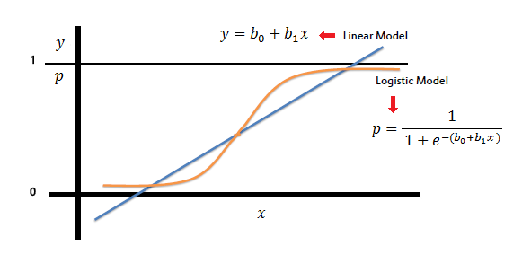

```{r setup, include=FALSE}
# clear-up the environment
rm(list = ls())

# chunk options
knitr::opts_chunk$set(
  message = FALSE,
  warning = FALSE,
  fig.align = "center",
  comment = "#>"
)

options(scipen = 10)
```

# Classification in Machine Learning 1 {.tabset}

## Course Map

```{r, echo=FALSE}
knitr::include_graphics("assets/Classification 1.png")
```

## Classification Concept

Dalam machine learning dan statistik, **classification** / klasifikasi adalah bentuk pendekatan supervised learning untuk memprediksi **label** dari suatu target variabel bertipe **kategorikal**

**Contoh prediksi:**

- Spam/no spam?
- Loan default/no default?
- Customer churn/loyal
- Yes/No?
- ...
- 1/0 (Positive/Negative)

Terdapat 2 jenis tipe algoritma klasifikasi:

- Binary: ketika `y` adalah biner (1 untuk spam, 0 untuk bukan-spam)
- Multiclass: ketika `y` > 2 kategori

## Library Preparation

Berikut beberapa library yang digunakan selama pemodelan klasifikasi

```{r echo=TRUE, warning=FALSE}
library(dplyr) # for wrangling
library(inspectdf) # for EDA
library(gtools) # for ML model & assumption 
library(caret) # for ML model & evaluation 
library(readxl)
```

# Binary Classification using Logistic Regression - Workflow

Tujuan dari logistic regression adalah menggunakan model regresi linier untuk memprediksi probability (yang dapat digunakan untuk klasifikasi).

Linear Regression vs Logistic Regression

```{r, echo=FALSE}

```

Ide dari logistic regression mulanya berangkat dari model linear regression. Bedanya:  
- **Linear regression:** digunakan untuk memprediksi angka kontinu
- **Logistic regression:** digunakan untuk memprediksi probability

- Range regression: ...
- Range probability: ...

Berikut adalah workflow yang biasa digunakan pada pemodelan Klasifikasi

1. Problem Statement
2. Read Data + Data Understanding
3. Data Wrangling
4. EDA
5. Cross Validation
6. Build Model & Interpretation
7. Model Selection & Assumption
8. Predict
9. Model Evaluation

## Problem Statement

Pemanfaatan data analitik untuk pengembangan kasus kredit dan perbankan telah meningkatkan dan merevolusi pengambilan keputusan oleh departemen kredit guna menambah efisiensi dalam pengambilan kebijakan. Pemanfaatan bidang analitik telah digunakan selama bertahun-tahun. Namun, karena sistem yang dimiliki oleh perbankan itu sendiri bersifat dinamis, pengumpulan, pemrosesan dan analisa terhadap data yang digunakan sebagian besar bersifat manual. Pendekatan yang bersifat manual ini memberikan kesulitan tersendiri untuk tim. Untuk mengatasi permasalahan ini, dibutuhkan suatu metode yang bersifat cepat dan dinamis dan mampu memanfaatkan informasi yang dimiliki secara optimal. Metode Machine Learning menjadi salah satu jawaban untuk mengatasi problem tersebut.

**Behaviour Analysis** dalam konteks kartu kredit merujuk pada metode evaluasi perilaku keuangan dan pembayaran seorang individu atau peminjam. Prediksi klasifikasi ini dapat memberikan gambaran tentang kecenderungan seorang peminjam untuk membayar tepat waktu atau mungkin memiliki riwayat pembayaran yang kurang konsisten.

Kita akan membuat pemodelan machine learning untuk memprediksi suatu debitur gagal/berhasil bayar pada suatu dataset dari Bank di Taiwan.

📍 Dengan asumsi perusahaan kredit sudah memiliki market share yang baik, **tujuan** dari analisis prediktif ini adalah untuk **mengurangi debitur yang diprediksi berhasil bayar padahal aktualnya gagal bayar**

## Read Data 

Kita akan mencoba untuk membaca data dengan format excel. Di R, kita bisa gunakan syntax berikut: `read_xlsx("lokasi working directory")` dari `library(readxl)` dari data 

```{r}
# read data
data <- 

```

Dataset memiliki 25 kolom dan 30,952 dengan penjelasan sebagai berikut:

- `id`        = id debitur
- `limit_bal` = Besaran kredit limit yang diberikan dalam dolar NT
- `sex`       = jenis kelamin 
    - man = laki-laki
    - woman = perempuan 
- `education` = Pendidikan terakhir 
    - postgraduate (s2 & s3)
    - undergraduate (s1)
    - highschool (SMA) 
    - others = lain-lain
- `marriage`  = Status pernikahan 
    - married = menikah
    - single = lajang
    - others = lainnya
- `age` = Usia dalam tahun
- `pay_*` = Status pembayaran dalam bulan April (1) - September (6).
    - 0 = pembayaran tepat waktu
    - 1 = keterlambatan pembayaran satu bulan
    - 2 = keterlambatan pembayaran dua bulan
    - ...
    - 8 = keterlambatan pembayaran delapan bulan atau lebih
- `bill_amt*` = Jumlah tagihan pada bulan April (1) - September (6) dalam dolar NT 
- `pay_amt*`  = Jumlah pembayaran/pengeluaran sebelumnya pada bulan April (1) - September(6) dalam dolar NT
- `gb_flag` = Flagging pembayaran default (gagal bayar) pada bulan berikutnya 
    - 1 = default
    - 0 = not default

## Data Wrangling 

1. Melakukan seleksi dan drop kolom yang tidak dipakai

📍 Drop kolom `id` yang mana hanya sebagai identifier debitur dan tidak akan dipakai ke dalam pemodelan

```{r}
# your code here
data_clean <- 
```

2. Melakukan perubahan tipe data

```{r}
# cek struktur data

```


❓ Manakah diantara tipe-tipe data di atas yang perlu dilakukan konversi?

- 
- 
- 

```{r}
data_clean <- 

```

## Exploratory Data Analysis (EDA)

Pada tahapan EDA kita ingin mengetahui bagaimana sebaran data kategorik maupun numerik. 

- `inspect_cat()` untuk melihat summary/ringkasan nilai untuk variabel kategorik. 
- `inspect_num()` untuk melihat summary/ringkasan nilai untuk variabel numerik.
- [optional] `show_plot()` untuk menampilkan plot sederhana dari fungsi `inspect_*`

```{r}
# your code here

```

💡 **Insight:**

- 
- 

## Cross Validation

Cross Validation adalah metode yang digunakan untuk memisahkan data menjadi 2 bagian yaitu data train dan data test.

- Data yang digunakan untuk melatih model kita sebut dengan `data train`, sedangkan
- Data yang digunakan untuk menguji model disebut dengan `data test`.

```{r echo=FALSE}
knitr::include_graphics("img/test-train.png")
```

 **Analogi sederhana**

- Seorang siswa dapat dikatakan pintar ketika dapat menjawab benar soal-soal ujian yang tidak pernah dikerjakannya pada soal-soal latihan untuk persiapan ujian.
- Data `train` diibaratkan soal latihan, dan data `test` diibaratkan soal ujian. Adapun `model` kita diibaratkan sebagai siswa.

💬 Mengapa kita butuh melakukan cross validation dalam melakukan pembuatan model Machine Learning?

> Untuk mengetahui seberapa baik model untuk memprediksi unseen data dan tidak hanya menghafal data yang ada

Fungsi `initial_split()` dari library `rsample` memiliki beberapa parameter:

- `data` = data frame awal
- `prop` = proporsi dari data yang akan digunakan sebagai data train

Selanjutnya, fungsi `training()` and `testing()` dilakukan untuk mengekstrak data train dan test dari hasil split. 

```{r}
library(rsample)
# intuisi set seed: mengunci kerandoman data
RNGkind(sample.kind = "Rounding")
set.seed(123)

# membuat binary split data menjadi set data training dan testing dengan proporsi 80:20
splitter <- 

# splitting
train <- 
test <- 
```

### Cek Imbalance Class

Proporsi kelas yang balance penting untuk **data train** karena kita akan melatih model menggunakan data train.

Proporsi yang seimbang penting agar model klasifikasi mempelajari karakteristik setiap kelas secara seimbang, tidak dominan hanya satu kelas saja. Hal ini mencegah model bias terhadap kelas yang lebih besar proporsinya sehingga *hanya baik untuk memprediksi 1 kelas saja*.

```{r}
# your code here

```

Note: data test tidak masalah bila imbalance, karena berarti tetap mempertahankan proporsi seoriginal mungkin.

## Modelling 

### Theory - Logistic Regression

#### Probability

Pada dasarnya, ketika kita melakukan klasifikasi maka kita akan menghitung **peluang**. 

$$P(yes) = \frac{n(yes)}{n(yes) + n(no)}$$

📍 Pada pemodelan logistic regression, salah satu hasil prediksi adalah berbentuk **peluang**

**📚 Case Study:**

Saat libur panjang Idul Fitri 2024, terdapat 100 penerbangan di Soekarno-Hatta Airport. Dari 100 penerbangan tersebut, terdapat 20 penerbangan delay. Berapakah probability suatu penerbangan delay di Soekarno Hatta?

```{r}
p_delay <- ...
p_delay
```

Peluang penerbangan tidak delay (ontime)

```{r}
p_ontime <- ...
p_ontime
```

> Range nilai dari probability = 0 s.d 1

#### Odds 

Odds adalah **peluang kejadian terjadi dibagi dengan peluang kejadian tidak terjadi**.

$$Odds(yes) = \frac{P(yes)}{1-P(yes)}$$

📍 Pada pemodelan logistic regression, **odds** biasanya digunakan untuk interpretasi model.

Sekarang, berapakah odds dari penerbangan ontime?

```{r}
odds_ontime <- ...
odds_ontime
```

**Interpetasi**: ...

Lalu, bagaimana dengan odds dari penerbangan delay?

```{r}
odds_delay <- ...
odds_delay
```

**Interpetasi**: ...

📌 Notes:

  - Odds = 1 -> sama besar kemungkinannya
  - Odds < 1 -> lebih tidak mungkin
  - Odds > 1 -> lebih besar / mungkin

> Range nilai dari odds = 0 s.d inf

#### Log of Odds

Log of odds adalah nilai odds yang dilogaritmikkan 

$$log(odds_{yes}) = log(\frac{P(yes)}{1-P(yes)})$$

📍 Pada pemodelan logistic regression, **log of odds** adalah hasil keluaran nilai **estimate** dari model

Berapakah log of odds dari penerbangan ontime dan delay? 

```{r}
log(odds_ontime)
log(odds_delay)
```

**Nilai log of odds tidak bisa diinterpretasikan**. Oleh karenanya, Nilai log of odds dapat dikembalikan ke bentuk odds dan peluang sehingga dapat digunakan untuk klasifikasi.

> Range nilai dari log of odds = -inf s.d inf

#### The Relation of Terms

```{r, echo=FALSE}
knitr::include_graphics("img/prob_to_logofodds.png")
```

**❓ Discussion:** Bagaimana cara untuk mengubah nilai log(odds) ke peluang?

Misal: Diketahui log of odds penerbangan ontime diketahui 1.386294

1. Step 1: log(odds) -> odds

```{r}
# gunakan fungsi eksponen `exp()`

```


2. Step 2: odds -> peluang

$$p = \frac{odds}{1+odds}$$

```{r}
# odds ke peluang

```

3. Atau gunakan fungsi dari library `gtools`

- `logit()`       : peluang -> log(odds)
- `inv.logit()`   : log(odds) -> peluang; disebut juga **sigmoid function**

```{r}
# mengubah log of odds menjadi probability

```

### Model Without Predictor

📌 Cara membuat model *Logistic Regression*.

Gunakan fungsi `glm()`, dengan parameter:

- `formula` : tempat mendefinisikan target dan prediktor (y~x)
- `data`    : data yang digunakan untuk membuat model
- `family`  : "binomial" untuk logistic regression

```{r}
model_null <- ...
```

📈 **Informasi Coefficient**

Nilai intercepts: ...

Mengapa bisa didapatkan nilai intercept sebesar itu? Berikut pembuktiannya:

```{r}
# tabel frekuensi target variabel

```

```{r}
# probability debitur default
prob_default <- ...
prob_default
```

```{r}
# probability ke log of odds


# bandingkan dengan coefficient

```

> Nilai intercept -0.1595395 merupakan nilai log of odds dari target variabel (gb_flag). Log of odds tidak dapat diinterpretasikan sehingga perlu diubah ke dalam odds/peluang.

📈 **Interpretasi Coefficient**

```{r}
# log(odds) -> odds

```

Interpretasi Odds:

- ...

```{r}
# log of odds -> prob

```

- ...

### 1 Variabel Numerik

Pada kasus kedua, buat model regresi logistik untuk variable `pay_1` terhadap `gb_flag`.

```{r}
model_pay1 <- ...
summary(model_pay1)
```

📈 **Informasi Coefficient**

$$log(odds_{default}) = Intercept + Coefficient \times pay_1$$ 

- `(intercept)`: log of odds debitur gagal bayar ketika nilai pay_1 sebesar 0
- `limit_bal`: kenaikan log of odds gagal bayar setiap kenaikan 1 poin limit_bal

📈 **Interpretasi Coefficient**

```{r}
# log(odds) -> odds

```

Interpretasi: ...

⚙️ **[Opsional] Perhitungan manual memperoleh nilai slope**

$$log(odds_{default}) = -0.78605 + 1.21814 \times pay_1$$

Debitur A memiliki nilai pay_1 2, sementara Debitur B 3. Hitung masing-masing log of oddsnya, berapa selisihnya?

```{r}
# log of odds
log_odds_A0 <- -0.78605 + 1.21814 * 2  
log_odds_B1 <- -0.78605 + 1.21814 * 3

log_odds_B1 - log_odds_A0
```

```{r}
exp(log_odds_B1 - log_odds_A0)
```

Kemungkinan debitur dengan nilai `pay_1` = 3 gagal bayar 3.38 kali lebih tinggi dibandingkan debitur dengan nilai `pay_1` = 2 (perbedaan 1 poin pay_1 di bawahnya)

### 1 Variabel Kategorik

Pada kasus kedua, buat model regresi logistik untuk variable `sex` terhadap `gb_flag`.

```{r}
model_sex <- ...
summary(model_sex)
```


📈 **Informasi Coefficient**

$$log(odds_{default}) = Intercept + Coefficient \times sexwoman$$

- `(intercept)`: log of odds debitur gagal bayar ketika gender male (not woman) sebesar -0.001956
- `sexwoman`: log of odds ratio dari debitur female gagal bayar dibandingkan debitur male gagal bayar sebesar -0.269531
- Coefficient `sexwoman` menjelaskan log of odds dari **woman gagal bayar** dibandingkan *man gagal bayar*.

📈 **Interpretasi Coefficient**

1. Odds

```{r}
# log(odds) -> odds sexwoman

```

Interpretasi: ...

2. Peluang

$$log(odds_{default}) = -0.001956 + -0.269531 \times sexwoman$$

```{r}
# peluang Aya gagal bayar
log_odds_aya <- ...
inv.logit(log_odds_aya)
```

```{r}
# peluang Adi gagal bayar
log_odds_adi <- ...
inv.logit(log_odds_adi)
```

Interpretasi:

- 

💡 **Tips** cara cepat interpretasi: 

* Kalau coefficientnya positif (+) -> meningkatkan peluang ke target (dalam kasus ini debitur default/gagal bayar)
* Kalau coefficientnya negatif (-) -> menurunkan peluang ke target

### Banyak Prediktor

#### 🤿 Dive Deeper

Buatlah model yang dapat memprediksi seseorang akan gagal bayar atau berhasil bayar berdasarkan gender `sex` dan besaran `pay_1`, kemudian jawablah pertanyaan berikut:

1. Interpretasi dari coefficient yang diperoleh. Variabel mana yang punya pengaruh lebih besar?

2. Adi ternyata memiliki status pembayaran di bulan April 3, berapa peluang Adi gagal bayar?

**Step 1: Membangun model**

```{r}
model_sp <- 
summary(model_sp)
```

**Step 2: Mencari odds prediktor**

```{r}
# odds sex

# odds pay_1

```

> `sexwoman` = ...

Interpretasi: Kejadian debitur female gagal bayar _____ kali lebih mungkin dibandingkan debitur male gagal bayar, **dengan syarat variable lain memiliki nilai yang sama.**

> `pay_1` = ...

Interpretasi: Setiap kenaikan 1 poin status pembayaran bulan April akan meningkatkan kemungkinan debitur gagal bayar sebesar _____ KALI, **dengan syarat variable lain memiliki nilai yang sama.**

Dengan kata lain mana variabel yang memiliki pengaruh lebih besar dalam meningkatkan peluang debitur gagal bayar? ____

**Step 3: Mencari peluang Adi**

Adi ternyata memiliki status pembayaran di bulan April 3, berapa peluang Adi gagal bayar?

```{r}
# your code here

```

Interpretasi: ...

#### Model All Variable

Selanjutnya kita akan coba membuat model honors menggunakan semua variabel prediktor

Mari buat model `model_all` untuk memprediksi `gb_flag` berdasarkan semua prediktor yang ada:

```{r}
model_all <- 
```

#### Model Stepwise

Model stepwise backward digunakan untuk feature selection. Gunakan function `step()`. Dengan parameter:

```{r}
model_step <- 
```


## 📝 Summary & Knowledge Check Modeling:

1. Jenis **target** variabel pada kasus klasifikasi machine learning adalah...
  
  - [ ] Diksrit atau Numerikal
  - [ ] Kontinu atau Numerikal
  - [ ] Diskrit atau Kategorikal
  - [ ] Kontinu atau Kategorikal
  

2. Untuk membuat model logistic regression kita dapat menggunakan fungsi `glm(y ~ x, data, family = "binomial")`. Dari summary model, nilai coefficients merupakan...

  - [ ] Probability
  - [ ] Odds
  - [ ] Log of odds

3. Untuk dapat menginterpretasi coefficient model logistic regression kita membutuhkan nilai...

  - [ ] Probability
  - [ ] Odds (menggunakan fungsi: `exp()`)
  - [ ] Log of odds
    
4. Bila koefisien variable / slope bernilai positif artinya:
  
  - [ ] Variabel tersebut berpengaruh untuk menaikkan probabilitas terhadap variabel target
  - [ ] Variabel tersebut tidak berpengaruh untuk menaikan probabilitas terhadap variabel target
  - [ ] Variabel tersebut berpengaruh untuk menurunkan probabilitas terhadap variabel target

5. Untuk melakukan klasifikasi dari hasil logistic regression, nilai log of odds diubah kebentuk probability dengan cara...

  - [ ] `exp()` 
  - [ ] `inv.logit()`
  - [ ] `log()`


