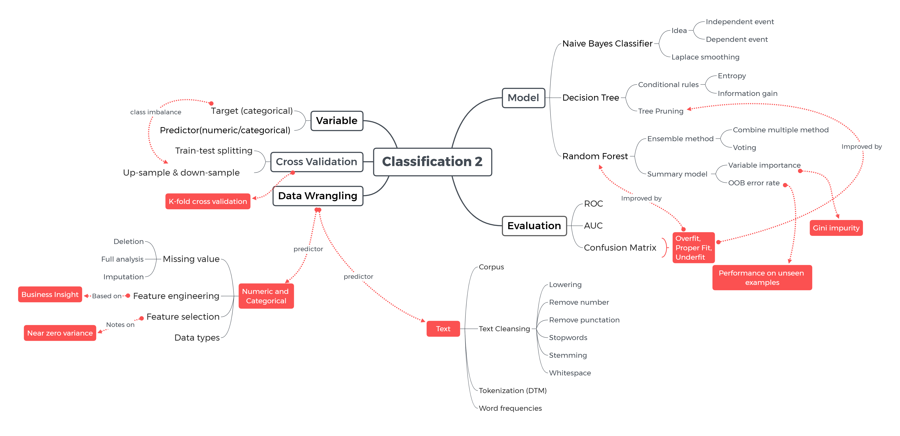
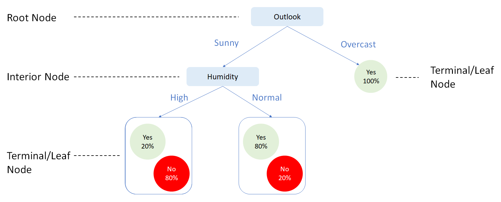
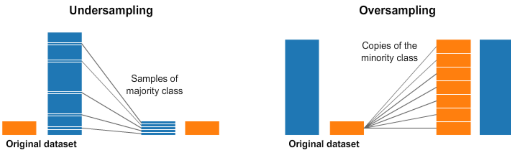
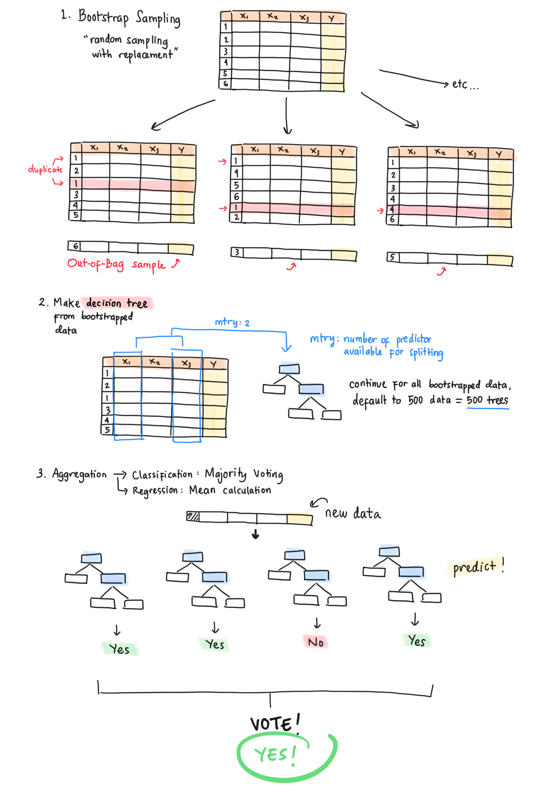
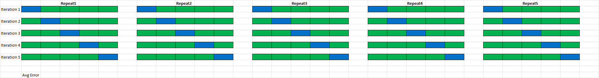

```{r setup, include=FALSE}
# clear-up the environment
rm(list = ls())

# chunk options
knitr::opts_chunk$set(
  message = FALSE,
  warning = FALSE,
  fig.align = "center",
  comment = "#>"
)

options(scipen = 999)
```

```{r}
## apabila belum memiliki package randomForest, silakan uncomment chunk ini
## uncomment: Ctrl + Shift + C
## cukup dijalankan sekali

# install.packages("randomForest")
```

```{r}
library(rsample)

# untuk persiapan data
library(dplyr)

# untuk keperluan machine learning
library(partykit)
library(randomForest)
library(caret)
```

# Mindmap

```{r, out.width = "100%", echo = FALSE, fig.align = "center"}

```

# Decision Tree

**Decision tree** merupakan tree-based model yang cukup sederhana dengan performa yang robust/powerful untuk membuat prediksi. Seperti namanya, decision tree menghasilkan **struktur pohon** yang tersusun dari pertanyaan-pertanyaan yang berkaitan dengan variabel prediktor. Pertanyaan-pertanyaan ini akan menjadi guidance dalam menentukan hasil prediksi.

**🗒️ Note**: Selain klasifikasi, decision tree juga dapat digunakna nuntuk kasus regresi.

## Struktur

Mari kita pahami struktur dari decision tree dan istilah yang sering digunakan. Berikut contoh untuk menentukan apakah weekend ini kita akan beraktifitas keluar atau tidak dengan memperhatikan cuaca (`Outlook`) dan kelembapan (`Humidity`).

```{r echo=FALSE, out.width="100%"}

```

- **Root Node**
  - Root node merupakan node paling atas pada suatu decision tree.
  - Root node merepresentasikan prediktor yang paling dasar untuk memisahkan data.
  - Root node pada gambar di atas: `Outlook`.
  
- **Interior Node**
  - Percabangan selanjutnya yang menggunakan predictor lain apabila root node tidak cukup dalam menentukan target.
  - Interior node pada gambar di atas: `Humidity`.
  
- **Terminal/Leaf Node**
  - Keputusan akhir berupa nilai target yang diprediksi.

*❓ Bagaimana cara membangun sebuah decision tree dari prediktor-prediktor yang terdapat pada data?*

- Secara intuitif, decision tree memilih predictor yang sebisa mungkin menyeragamkan (homogen) target variabel pada leaf node.
- Contoh: observasi 100% `Yes` ketika `Outlook` bernilai `Overcast` (berawan).
- Tingkat homogen ini dapat diukur menggunakan **entropy** dan **information gain**.

## Entropy dan Information Gain

Misalkan kita mencatat perilaku dalam menentukan **apakah saya pergi makan ke restoran** selama 12 hari terakhir. Berikut kita menggunakan decision tree untuk menemukan pola perilaku sehingga dapat memprediksi keputusan ke depannya.

```{r}
dine <- read.csv("data_input/dineout.csv",
                 sep = ";",
                 stringsAsFactors = T)

dine
```

- **Budget**: Budget pengeluaran untuk makan
- **Distance** : Jarak restoran
- **Friend**: Pergi dengan teman
- **Dine.Out**: Makan di restoran

Tujuan decision tree adalah memisahkan data menjadi kelompok-kelompok kecil berdasarkan variabel tertentu sehingga dihasilkan **data yang sejenis** atau homogenitas tinggi. Tingkat homogenitas diukur menggunakan nilai **entropy**.

```{r}
knitr::include_graphics("assets/dineout.png")
```

> **Entropy** adalah ukuran ketidakteraturan (measure of disorder) dari  sebuah kelompok data. Semakin kecil nilai entropy, maka data semakin homogen. Sebaliknya, semakin besar nilai entropy, maka data semakin heterogen.

$$
Entropy(S) = -\ p_1 \ log_2 \ p_1 -p_2 \ log_2 \ p_2
$$

**💡 Keterangan:**

- $p_1$: proporsi kelas pertama, misalkan kelas positif `Dine.Out = Yes`.
- $p_2$: proporsi kelas kedua, misalkan kelas negatif `Dine.Out = No`.

> Semakin kecil nilai Entropy, maka data semakin homogen. Sebaliknya semakin besar nilai entropy, maka data semakin heterogen.

- **Entropy = 1**: tidak ada kelas yang dominan (proporsi seimbang, 50:50).
- **Entropy = 0**: salah satu kelas sangat dominan (proporsi 100:0).

Dalam menentukan prediktor untuk percabangan, dihitunglah **information gain**, yaitu selisih antara entropy sebelum dan sesudah dilakukan percabangan.

$$Information \ Gain(F) = Entropy(S1) - Entropy(S2)$$ 

**💡 Keterangan:**

- $Entropy(S1)$: entropy sebelum dilakukan percabangan.
- $Entropy(S2)$: entropy sesudah dilakukan percabangan.

> Prediktor yang dipilih adalah prediktor dengan **information gain terbesar**.

Berikut adalah contoh visualisasi decision tree dari kasus di atas.

```{r fig.width=8}
dine_tree <- ctree(formula = Dine.Out ~ .,
                     data = dine,
                     control = ctree_control(mincriterion = 0.5,
                                             minsplit = 0,
                                             minbucket = 0))

plot(dine_tree, type = "simple")
```

❓ Insight?
> Budget
  - Low -> No Dine Out
  - High
    - Distance:
      - Near -> Yes Dine out
      - Far
        - Friend Avalaible -> Yes


# 💉 Study Case: Diabetes Prediction

**❓ Business Question:** Sebagai seorang konsultan kesehatan di sebuah rumah sakit, kita diminta untuk memprediksi apakah seorang pasien mengalami diabetes atau tidak, untuk membantu diagnosis dokter.

-   Kelas positif: `pos`.
-   Kelas negatif: `neg`.

## Read Data

```{r}
# read data
diab <- read.csv("data_input/diabetes-c2.csv", 
                 stringsAsFactors = T) %>% select(-X)

# 5 observasi pertama
head(diab)
```

**🗒️Deskripsi Data**

- `pregnant`: frekuensi kehamilan.
- `glucose`: konsentrasi glukosa plasma (tes toleransi glukosa).
- `pressure`: tekanan darah diastolik (mm Hg).
- `triceps`: ketebalan lipatan kulit triceps (mm).
- `insulin`: kadar insulin serum setelah 2 jam (mu U/ml).
- `mass`: indeks massa tubuh (berat dalam kg/(tinggi dalam m)\^2).
- `pedigree`: fungsi silsilah diabetes (diabetes pedigree function).
- `age`: usia (tahun).
- `cholesterol`: kadar kolesterol total dalam darah (mg/dL).
- `ldl`: kadar kolesterol LDL (low-density lipoprotein) dalam darah (mg/dL).
- `hba1c`: kadar hemoglobin terglikasi, menunjukkan rata-rata kadar glukosa darah dalam 2-3 bulan terakhir (%).
- `smoking_status`: status merokok.
- `family_history_diabetes`: riwayat keluarga dengan diabetes.
- `diabetes`: hasil tes untuk diabetes.

## Data Wrangling

Cek tipe data dan missing values.

```{r}
# cek struktur data
glimpse(diab)
```

Apakah ada tipe daya yang belum sesuai?

Apakah terdapat missing value?
`anyNA(df)`

```{r}
# cek missing values
anyNA(diab)
```
> Tidak ada missing value di data kita

## Exploratory Data Analysis

```{r}
# cek summary data
summary(diab)
```

**💡 Insight:**

Pak Azis:
memiliki 1 nilai value aja
- cholesterol: nilainya 0 aja
- ldl: nilainya 0 aja
- hba1c: nilainya 0 aja

- smoking_status,
- family_history_diabetes

Apakah kolom2 ini berguna untuk melakukan pemodelan?
- Tidak berguna bagi pemodelan
- Bisa dihapus saja

Kasus:
- Nasabah berhasil bayar / tidak
- Prediktor:
  - Penghasilan
  - History pembayaran
  - Umur
  - Kewarganegaraan: WNI (semua nasabah WNI) -> tidak berguna bagi pemodelan

## Feature Selection

Saat membuat model machine learning, kita perlu memilih prediktor-prediktor yang sesuai agar model dapat memberikan prediksi yang baik. Proses ini disebut sebagai **feature selection**.
 
**🧪 Pendekatan Feature Selection**

- **Berdasarkan intuisi bisnis**: memasukkan fitur/variabel/atribut yang menurut pandangan bisnis berpengaruh kuat dalam melakukan prediksi. 
- **Berdasarkan perhitungan matematika**: pemilihan fitur/variabel/atribut yang akan digunakan untuk membuat machine learning didasarkan pada perhitungan matematis.

Dari data `diab` sebelumnya, mari kita gunakan fungsi `nearZeroVar()` dari package `caret` untuk mengeliminasi kolom-kolom yang hampir tidak memiliki variasi nilai.

```{r}
# kolom-kolom yang hampir tidak memiliki variasi nilai
n0_var <- nearZeroVar(diab)

n0_var
```
```{r}
summary(diab[,n0_var])
```


```{r}
# drop kolom-kolom hasil nearZeroVar()
diab_clean <- diab[,-n0_var]

head(diab_clean)
```

## Cross Validation

Lakukan cross validation untuk membagi data menjadi data training (`diab_train`) dan data testing (`diab_test`) dengan proporsi 80%:20%.

```{r}
RNGkind(sample.kind = "Rounding")
set.seed(100)

splitter <- initial_split(data = diab_clean, prop = 0.8)

diab_train <- training(splitter)
diab_test <- testing(splitter)
```

Cek proporsi kelas di data training.

```{r}
diab_train$diabetes %>% table() %>% prop.table()
```
70:30

Pertanyaannya: Apakah kelas target sudah seimbang atau belum?
> Pak Yudho & Pak Aditya: Belum seimbang (imbalanced)

50:50

Kasus asuransi/kredit bank
- Nasabah berhasil bayar / gagal bayar -> 50:50


## Handling Imbalanced Data

Apabila diperhatikan, proporsi kelas pada `diab_train` imbalance. Kondisi imbalance ini pada beberapa kasus dapat menyebabkan model menjadi bias: lebih banyak belajar dari kelas yang mayoritas (`neg`). Untuk mengatasi hal ini, kita dapat melakukan sampling pada data. Terdapat 2 pendekatan sampling: upsampling dan undersampling.

```{r, out.width = "100%", echo = FALSE, fig.align = "center"}

```

- **Upsampling/Oversampling**
  - Menambahkan observasi kelas minoritas hingga seimbang dengan kelas mayoritas dengan menduplikasi data pada kelas minoritas secara acak.
  - Digunakan ketika jumlah data minoritas sedikit.
  - Kekurangan: data duplikat tidak menambah informasi baru.
  - Contoh:
    - Before | 70 : 30
    - After  | 70 : 70
  - **🗒️ Note**: Apabila data terlalu sedikit dan tidak ingin melakukan upsampling, kita bisa mengumpulkan lebih banyak data untuk kelas minoritasnya.
- **Downsampling/Undersampling**:
  - Mengurangi observasi kelas mayoritas hingga seimbang dengan kelas minoritas dengan membuang data dari kelas mayoritas secara acak.
  - Digunakan ketika jumlah data minoritas cukup banyak.
  - Kekurangan: mengurangi informasi dari data yang dimiliki
  - Contoh:
    -   Before | 70 : 30
    -   After  | 30 : 30

> **❗️ Note:** teknik sampling hanya boleh dilakukan pada data training. Data testing diperlakukan sebagai data baru untuk model.

**💡 Fungsi untuk Upsampling dan Downsampling**

- `upSample()` : fungsi untuk upsampling.
- `downSample()`: fungsi untuk downsampling.
- Parameter:
  -   `x` : predictor.
  -   `y` : target.
  -   `yname` : nama kolom target.

Karena perbedaan banyak data antara kelas `neg` dan `pos` cukup jauh, kita akan melakukan upsampling.

```{r}
# upsampling
RNGkind(sample.kind = "Rounding")
set.seed(100)

diab_train_up <- upSample(x = diab_train %>% select(-diabetes),
                          y = diab_train$diabetes,
                          yname = "diabetes")

diab_train_up
```

Cek proporsi kelas target setelah melakukan upsampling.

```{r}
diab_train_up$diabetes %>% table() %>% prop.table()
```
> Proporsi kelas target telah seimbang

## Model Fitting

Untuk membuat model decision tree, dapat digunakan fungsi `ctree()` dari library `partykit`.

**🧪 Formula**: `ctree(formula, data)`

- `formula = y ~ x`
  -   `y`: variabel target.
  -   `x`: variabel prediktor.
- `data`: dataframe yang berisikan variabel target dan prediktor.

Lakukan training menggunakan `diab_train_up`

```{r}
# membuat model decision tree dengan semua prediktor
diab_tree <- ctree(formula = diabetes ~ .,
                   data = diab_train_up)

diab_tree
```

Decision tree menghasilkan struktur pohon untuk melakukan prediksi. Hal ini menjadikan decision tree sebagai model robust yang cukup interpretable.

```{r fig.width=15}
# visualisasi decision tree
plot(diab_tree, type = "simple")
```

## Model Prediction and Evaluation

Dari model yang sudah dibuat sebelumnya, mari kita lakukan prediksi pada data testing menggunakan fungsi `predict()`.

**🧪 Formula**: `predict(object, newdata, type)`

- `object`: model decision tree.
- `newdata`: data baru.
- `type`: bentuk prediksi.
  - `type = "prob"` mengeluarkan peluang untuk masing-masing kelas.
  - `type = "response"` mengeluarkan label kelas.

```{r}
# prediksi label kelas data testing
pred_test <- predict(object = diab_tree, 
                     newdata = diab_test,
                     type = "response")
pred_test[0:5]
```

Selanjutnya, kita bisa mengevaluasi hasil prediksi model dengan `confusionMatrix()`.

Fungsi: `confusionMatrix(data, reference)`

- `data`: Data prediksi
- `reference`: Data aktual 
- `positive`: Kelas positif

```{r}
# confusion matrix untuk prediksi label kelas data testing 
confusionMatrix(data = pred_test,
                reference = diab_test$diabetes,
                positive = "pos")
```

**❓ Q: Metrics apakah yang cocok untuk digunakan pada kasus ini?**

Kelas:
- Pos (positive)
- Neg (negative)

- False Negative (recall): Diprediksi tidak diabetes padahal sebenarnya dia diabetes -> bahaya karena pasien tidak ditreatment 

- False Positive (precision): Diprediksi diabetes padahal sebenarnya tidak diabetes -> treatment -> didiagnosis tambahan oleh dokter dan diketahui ternyata tidak diabetes

Minimalisir: Recall

## Considerations on Decision Tree: Pruning and Tree-size

> Kekurangan dari decision tree adalah kecenderungannya untuk **overfitting**. Overfitting adalah kondisi di mana data cenderung menghafal pola data training.

- Training: Data training -> model menghafal pola
- Prediction: Data testing -> performa model tidak terlalu baik

Hal ini terjadi karena decision tree melakukan percabangan data hingga amat detail (bahkan hingga dalam leaf node hanya terdapat 1 observasi). Pada keadaan ini, decision tree justru **menghafal** pola pada data training dan membuat aturan yang terlalu kompleks. Bukan **mempelajari** pola tersebut. Alhasil, model memiliki kemampuan generalisasi pola data yang rendah dan kurang bisa memprediksi data baru.

> **Indikasi overfitting**: performa tinggi pada data training dan rendah pada data testing. Perbedaan performanya cukup signifikan.

Perhatikan model di bawah ini yang terlalu kompleks.

```{r fig.width=15}
diab_tree_complex <- ctree(formula = diabetes ~ ., 
                            data = diab_train_up,
                            control = ctree_control(mincriterion = 0.05, 
                                                    minsplit = 5,
                                                    minbucket = 5))
plot(diab_tree_complex, type='simple')
```


Selanjutnya, kita akan melakukan evaluasi model pada data training dan data testing.

```{r}
# prediksi kelas di data training
pred_complex_train <- predict(diab_tree_complex, 
                           diab_train_up, 
                           type = "response")

# confusion matrix data train
confusionMatrix(pred_complex_train, 
                diab_train_up$diabetes, 
                positive = "pos")
```

```{r}
# prediksi kelas di data testing 
pred_complex_test <- predict(diab_tree_complex, 
                     diab_test, 
                     type = "response")

# confusion matrix data testing
confusionMatrix(pred_complex_test, 
                diab_test$diabetes, 
                positive = "pos")
```

- Recall data training: 92%
- Recall data testing: 47%

Indikasi overfitting -> perbedaan performa di data train & testing cukup jauh.
- Tidak aturan khusus berapa perbedaan train-test hingga dikatakan overfitting
- Jika perbedaannya lebih besar dari 10%, dikatakan overfitting.


Untuk mengatasinya, decision tree perlu tahu kapan ia **berhenti membuat cabang**. Dengan demikian, pohon yang dihasilkan tidak terlalu kompleks. Pemotongan/pencegahan cabang pohon disebut **pruning**. Pruning terbagi menjadi 2 cara:

- **Pre-pruning**: pencegahan pembuatan cabang (memasang parameter sebelum model dihasilkan).
- **Post-pruning**: pemangkasan cabang (memotong cabang setelah model terbentuk).

Mari kita lakukan tuning terhadap model decision tree dengan mengubah beberapa nilai berikut:

- **Parameter `mincriterion`**
  - Parameter ini menunjukkan nilai (1 - p-value) yang harus dilewati agar proses percabangan dapat terjadi.
  - Contoh, saat `mincriterion = 0.95`, nilai p-value harus < 0.05 agar sebuah node dapat membuat cabang (berkaitan dengan signifikansi prediktor).
  - Semakin besar parameter ini, semakin besar tingkat signifikansi sebuah prediktor agar dapat dilakukan percabangan.
  - Default: `mincriterion = 0.95`.
  
- **Parameter `minsplit`**
  - Parameter ini mengatur banyak observasi minimal pada node agar percabangan dapat terjadi.
  - Default: `minsplit = 20`.
  
- **Parameter `minbucket`**
  - Parameter ini mengatur banyak observasi minimal pada node setelah terjadi percabangan.
  - Default: `minbucket = 7`.

**💡️ Tips:** semakin besar ketiga parameter di atas, semakin sederhana decision tree yang dihasilkan (semakin ketat kriteria dalam melakukan percabangan).

```{r fig.width=10}
# tuning model decision tree
tree_diab_tuned <- ctree(formula = diabetes ~ .,
                         data = diab_train_up,
                         control = ctree_control(mincriterion = 0.95,
                                                 minsplit = 30,
                                                 minbucket = 10))

```

```{r fig.width=8}
# visualisasi decision tree hasil tuning
plot(tree_diab_tuned, type = "simple")
```

Mari kita coba evaluasi model hasil tuning sebelumnya pada data training dan data testing.

```{r}
# prediksi kelas di data training
# Pak Supratno
pred_tuned_train <- predict(tree_diab_tuned, 
                           diab_train_up, 
                           type = "response")


# confusion matrix data training
confusionMatrix(pred_tuned_train,
                diab_train_up$diabetes,
                positive = "pos")
```

```{r}
# prediksi kelas di data testing
# Pak Supratno
pred_tuned_test <- predict(tree_diab_tuned, 
                           diab_test, 
                           type = "response")


# confusion matrix data testing
confusionMatrix(pred_tuned_test,
                diab_test$diabetes,
                positive = "pos")
```

**💡 Insight: **

- Recall train: 92%
- Recall test: 80%

Apakah model overfit? Masih, karena perbedaannya 12% (lebih dari 10%)
ToDo: 
- Coba untuk lebih menyederhanakan model kita.
- Telah puas dengan recall 80%, bisa menggunakan modelnya.

Perbedaan performa train dan test itu semakin kecil.

Semisal:
Target: pos, neg
Prediktor 20

- Model DT 1: prediktor 1-5 -> prediksi: pos
- Model DT 2: prediktor 6-10 -> prediksi: pos
- Model DT 3: prediktor 11-15 -> prediksi: neg
- Model DT 4: prediktor 16-20 -> prediksi: pos
Prediksi total: positif

Setiap DT memiliki spesialisasinya masing-masing


# Ensemble Method: Random Forest

## Concept

Ensemble method merupakan pendekatan machine learning untuk melakukan prediksi dengan mengombinasikan prediksi dari beberapa model menjadi sebuah prediksi. Dengan kombinasi dari beberapa prediktor tersebut, ensemble method dapat meningkatkan performa prediksi model. Contoh ensemble method adalah **random forest**.

> 🌳🌳 Random forest terbentuk dari sekumpulan decision tree. Masing-masing decision tree memiliki karakteristik yang berbeda dan tidak saling berhubungan.

Pembentukan random forest memanfaatkan konsep **bagging = bootstrap sampling + aggregation**.

* **Bootstrap Sampling**
  - Akan dibentuk sampel data untuk setiap model decision tree.
  - Satu sampel berkemungkinan untuk digunakan lebih dari satu kali untuk satu buah tree.
  - Data yang tidak termasuk ke dalam sampel untuk membentuk decision tree akan berperan sebagai sampel out-of-bag.
  - Parameter `mtry` digunakan untuk menentukan banyak prediktor untuk pembentukan tree.
  
* **Aggregation**
  - Prediksi dilakukan oleh masing-masing decision tree.
  - Prediksi final klasifikasi dengan majority voting.

```{r echo=FALSE, out.width="100%"}

```

## Fitting RF: Repeated K-Fold Cross Validation

Pada model-model machine learning sebelumnya, kita menggunakan fungsi yang khusus untuk model machine learning yang berbeda:

* `naiveBayes()` untuk membuat model naive Bayes.
* `ctree()` untuk membuat model decision tree.

Package `caret` memungkinkan kita untuk mencoba berbagai model machine learning berikut parameternya dengan satu fungsi saja: `train()`.

**🧪 Parameter Fungsi `train()`**

- `formula`: target ~ prediktor.
- `data`: data untuk proses training.
- `method`: metode machine learning yang akan dicoba. -> "rf"
- `trControl`: kontrol proses training.

Pada parameter `trControl`, kita dapat memodifikasi proses cross validation. Biasanya, kita hanya membagi data menjadi data training dan data testing. Selanjutnya, kita melatih model dengan keseluruhan data training sekali. Terdapat variasi lain dari cross validation biasa, yang disebut dengan **k-fold cross validation**. Alih-alih melatih model dengan keseluruhan data training sekali (pendekatan cross validation biasa):

* Data training akan dibagi menjadi k bagian.
* Proses training akan dilakukan sebanyak k iterasi, Di setiap iterasinya:
  - 1 bagian menjadi bagian untuk testing.
  - k-1 bagian menjadi bagian untuk training.
  - Model belajar pada bagian untuk training dan diuji pada bagian untuk testing.
* Hasil evaluasi akhir training adalah rata-rata dari semua iterasinya.

```{r}

```

Dengan k-fold cross validation, kita mendapatkan estimasi yang lebih fair tentang performa model karena proses training dilakukan dengan kombinasi observasi yang berbeda.

K-fold cross validation dapat dikombinasikan dengan **repeats**. Dalam hal ini, proses k-fold cross validation di atas dilakukan sebanyak jumlah repeats yang kita definisikan. Tingkat randomness setiap repeat akan berbeda sehingga kombinasi data akan berbeda di setiap repeat. 

Mari kita coba untuk membuat model random forest:

* Dengan 3 kali repeats (pengulangan): `repeats = 3`.
* Di setiap pengulangan dilakukan 5-fold cross validation: `number =5 `.

```{r}
# JANGAN DI RUN
# # definisikan training control untuk repeated k-fold cross validation 
# train_ctrl <- trainControl(method = "repeatedcv",
#                            number = 5, # seberapa banyak kita ingin membagi data
#                            repeats = 3) 
# 
# # training model random forest dengan train()
# diab_forest <- train(diabetes ~ .,
#                    data = diab_train_up,
#                    method = "rf", # pilih metode random forest
#                    trControl = train_ctrl)
```

Salah satu kelemahan random forest adalah pembuatan model yang membutuhkan waktu yang cukup lama. Practice yang baik selesai melakukan training adalah menyimpan model tersebut ke dalam bentuk file RDS dengan function `saveRDS()` agar model dapat langsung digunakan tanpa harus training dari awal.

**Info**: RDS adalah format yang bisa digunakan untuk menyimpan model ML.

```{r}
# menyimpan model ke format RDS
# saveRDS(diab_forest, "model/diab_forest.RDS")
```

Load model yang sudah disimpan sebelumnya dengan `readRDS()`

```{r}
diab_forest <- readRDS("model/diab_forest.RDS")
  
diab_forest
```

**💡 Penjelasan Output Model**

* 406 samples: banyak bootstrap data untuk pembuatan model -> banyak DT.
* 8 predictors: banyak prediktor.
* 2 classes: banyak kelas target.
* Summary of sample size: banyaknya data trainining hasil k-fold cross validation.
* mtry dan accuracy: banyaknya `mtry` yang digunakan dan accuracy model untuk masing-masing `mtry.` Digunakan untuk menentukan model terbaik.


## Out-of-Bag Score

Pada tahap bootstrap sampling, terdapat data yang tidak digunakan dalam pembuatan model. Data ini yang disebut sebagai data **out-of-bag (OOB)**. Model random forest akan menggunakan data OOB sebagai data untuk melakukan evaluasi dengan cara menghitung error (serupa dengan data testing). Error inilah yang disebut **OOB Error**. Dalam kasus klasifikasi, OOB error merupakan persentase data OOB yang misklasifikasi.

Syntax: `object_model$finalModel`

```{r}
diab_forest$finalModel
```

> Nilai OOB Error pada model `diab_forest` sebesar 11.33% Dengan kata lain, akurasi model pada data OOB adalah 88.67%

OOB -> data yang tidak digunakan pada proses training Decision Tree
Digunakan sebagai evaluasi model random forest
Akurasi model random forest kita adalah 88.67% terhadap data OOB (bisa menjadi indikasi awal kebaikan model kita)

Akurasi model random forest pada data testing.

## Variable Importance

Meskipun random forest kerap dikatakan sebagai model yang tidak bisa diinterpretasi, kita bisa melihat prediktor apa saja yang paling penting (important) dalam pembentukan random forest.

Syntax: `varImp(model)`

```{r fig.width=10}
varImp(diab_forest) %>% plot()
```

> Prediktor paling berpengaruh adalah glucose.

Action plan:
- Hanya sekadar informasi bagi kita.
- Kita tau prediktor yang penting untuk model, sehingga ketika ingin meningkatkan performa dan melakukan ulang pemodelan, kita mengikutsertakan prediktor-prediktor tersebut. 

Nilai importance berasal dari perhitungan **gini importance** yang konsepnya sama dengan **information gain**, hanya berbeda rumus saja. [Rumus gini index](https://askalgo-r.netlify.app/#mathematics-concept).

# NB vs DT vs RF

* **Naive Bayes**
  * Pros:
    * Baik untuk data yang kategorikal.
    * Proses komputasi cepat.
  * Cons:
    * Setiap prediktor memiliki bobot yang sama.
  * Resource: https://blog.algorit.ma/kelebihan-naive-bayes/
    
* **Decision Tree**
  * Pros:
    * Modelnya interpretable dengan adanya struktur pohon.
    * Setiap prediktor dianggap memiliki pengaruh yang berbeda.
  * Cons:
    * Rentan overfitting (karena model bisa jadi sangat kompleks).
  * Resource: https://blog.algorit.ma/decision-tree/
    
* **Random Forest**
  * Pros:
    * Setiap prediktor dianggap memiliki pengaruh yang berbeda.
    * Men-tackle permasalahan overfitting dari decision tree.
  * Cons:
    * Proses komputasi cukup lama.
  * Resource: https://blog.algorit.ma/random-forest/

**💡 Tips Pemilihan Model ML**: selalu mulai dari model yang paling sederhana.

KC

1. Berikut adalah karakteristik model Decision Tree, KECUALI.....
 - [ ] Membentuk pohon keputusan dari data
 - [x] Menghasilkan nilai log of odds -> logistic regression
 - [ ] Dapat diinterpretasi

2. Metode apa yang digunakan oleh Random Forest untuk mengambil keputusan akhir dalam kasus klasifikasi?
 - [ ] Rata-rata prediksi semua pohon -> regresi (122, 130, 140, 100 = rata-rata)
 - [x] Mayoritas suara (majority vote) dari semua pohon
 - [ ] Menggunakan pohon dengan performa terbaik


# References
## Official Documentation
- [Dokumentasi Package `partykit`](https://cran.r-project.org/web/packages/partykit/partykit.pdf)
- [Dokumentasi Package `caret`](https://cran.r-project.org/web/packages/caret/caret.pdf)
- [The `caret` Package](https://topepo.github.io/caret/index.html)

## By Algoritma
- [Frequently Asked Questions (FAQ) Classification 2](https://askalgo-r.netlify.app/#classification-2)
- [Credit Risk Analysis](https://algolearn.netlify.app/p/credit_risk_analysis/)
- [Customer Churn Prediction](https://algolearn.netlify.app/p/customer_churn_prediction/)
- [Interpreting Classification Model with LIME](https://algolearn.netlify.app/p/interpreting-black-box-regression-model-with-lime/)
