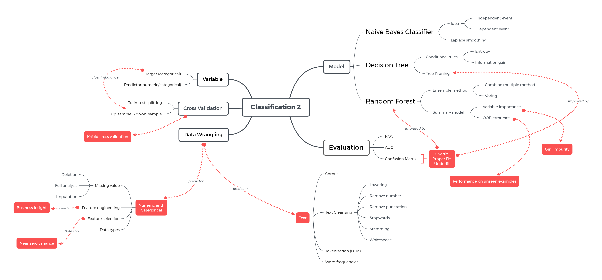
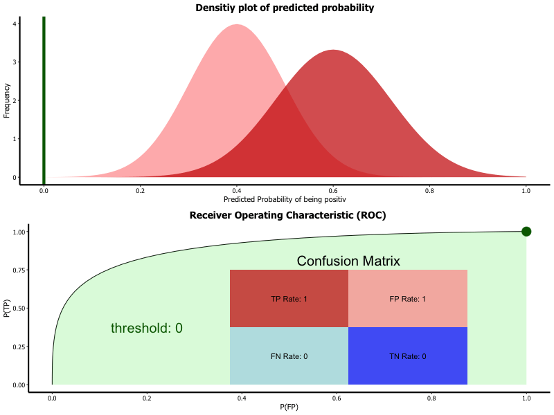
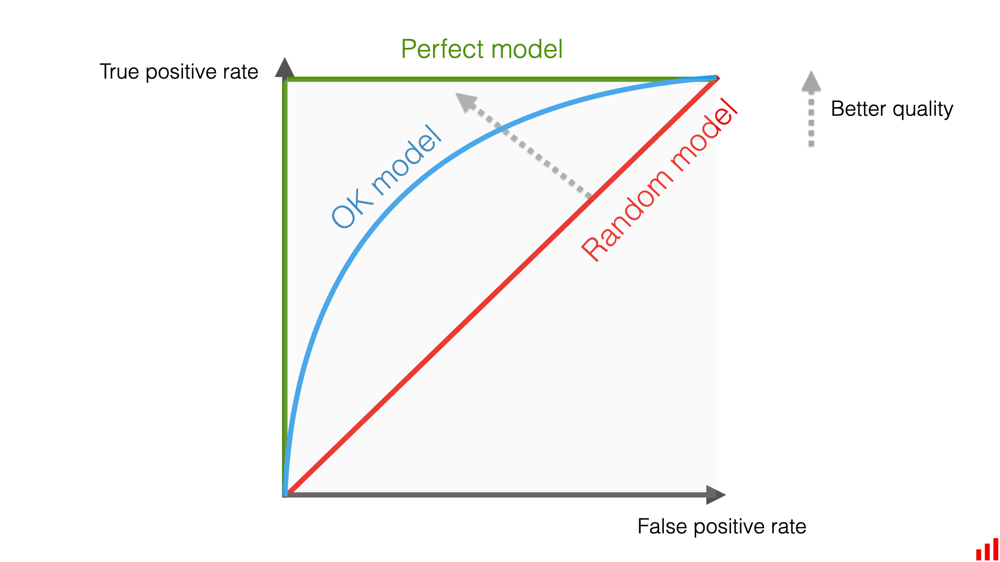

```{r setup, include=FALSE}
# clear-up the environment
rm(list = ls())

# chunk options
knitr::opts_chunk$set(
  message = FALSE,
  warning = FALSE,
  fig.align = "center",
  comment = "#>"
)

options(scipen = 999)
```

```{r message=F, warning=F}
# untuk persiapan data
library(dplyr)
library(rsample)

# untuk text processing
library(tm)
library(SnowballC) 
library(inspectdf)

# untuk keperluan machine learning
library(e1071)
library(caret)
library(ROCR)
```

# Mindmap

```{r, out.width = "100%", echo = FALSE, fig.align = "center"}

```

# Naive Bayes

Naive Bayes merupakan metode klasifikasi yang menggunakan Teorema Bayes. Menurut Teorema Bayes, peluang sebuah kejadian dapat berubah dengan adanya informasi baru.

Irfan ingin menjemur (Selasa)
 - pagi -> mendung
 - menunda untuk menjemur (Rabu)

## Theory of Probability

Saat kita menghitung peluang dua atau lebih kejadian terjadi bersamaan, kita dapat menghitungnya dengan 2 cara:

### Independent Event

Kejadian A **tidak mempengaruhi** kejadian B. Contoh:

- Peluang dadu muncul angka 4 pada lemparan pertama **dan** peluang muncul angka 6 pada lemparan kedua.

- Peluang student Algoritma minum Kopi Mengenang **dan** peluang instruktor Algoritma mengajar materi Classification 2.

Peluang dua kejadian independent terjadi secara bersamaan adalah hasil perkalian peluang masing-masing kejadian.

$$P(A \cap B) = P(A) \times P(B)$$

**Contoh Perhitungan:**

Event A: Peluang dadu muncul angka 4 pada lemparan pertama $P(A) = 1/6$

Event B: Peluang dadu muncul angka 6 pada lemparan kedua $P(B) = 1/6$

$$P(A \cap B) = P(A) \times P(B) = \frac{1}{6} \times \frac{1}{6} = \frac{1}{36}$$

Maka, peluang kedua kejadian terjadi bersamaan adalah 1/36.

### Dependent Event 

Kejadian A **jika diketahui** kejadian B. Contoh:

-   Peluang karyawan membawa payung **jika diketahui** cuaca mendung pada pagi hari.

-   Peluang seseorang membeli produk **jika diketahui** gendernya.
  
Untuk menghitung peluang bersyarat, kita menggunakan **[Bayes Theorem](https://en.wikipedia.org/wiki/Bayes%27_theorem)**:

$$P(A|B) = \frac{P(B|A) P(A)}{P(B)}$$
dengan $P(B) \neq 0$.

**📌Keterangan**

- $P(A|B)$ = Peluang terjadi A jika diketahui B **telah terjadi** (*posterior probability*)
- $P(A)$ = Peluang terjadi A tanpa informasi tambahan apapun (*prior probability*)
- $P(B|A)$: peluang kejadian B diketahui kejadian A 
- $P(B)$: peluang kejadian B

**📌Catatan**

- Kejadian A sering disebut sebagai hypothesis (target variable)
- Kejadian B sering disebut sebagai evidence/observation (predictor variable)


# 💸 Study Case: Customer Behavior

Agar lebih memahami bagaimana Naive Bayes bekerja, kita akan menggunakan kasus customer behavior. Peluang customer untuk membeli produk akan dihitung berdasarkan karakteristik pada nasabah.

## Read Data

```{r}
customer <- read.csv("data_input/customer_behaviour.csv", 
                     stringsAsFactors = T)

head(customer)
```

**🗒️Deskripsi Data**

-   **Gender**: jenis kelamin (Male, Female).
-   **Age**: range usia (\< 30, 30-50, \> 50).
-   **Salary**: kategori gaji customer (Low, Medium, High).
-   **Purchased**: apakah customer membeli produk atau tidak (Yes, No).

Informasi yang tersedia: Gender, Age, dan Salary (yang mempengaruhi peluang seseorang beli produk atau tidak).

```{r}
# cek struktur data
glimpse(customer)
```

```{r}
# cek summary data
summary(customer)
```

## Manual Modelling

**❓ Q1: Tanpa  prediktor (karakteristik nasabah), berapakah peluang customer membeli produk?**

```{r}
# tabel frekuensi kolom Purchased
table(customer$Purchased)
```

```{r}
# peluang membeli produk
143 / (143 + 257)
```

> Tanpa informasi tambahan (tidak ada prediktor), peluang customer membeli produk adalah 35.75%.

Pada contoh di atas, kita menghitung **prior probability**.

**❓ Q2: Jika diketahui customer adalah seorang pria, berapakah peluang customer tersebut membeli produk?**

$$P(Purchased = Yes | Gender = Male) = \frac{P(Gender = Male|Purchased = Yes) P(Purchased = Yes)}{P(Gender =  Male)}$$

```{r}
# 1. Tentukan P(Purchased = Yes)
table(customer$Purchased)
```

```{r}
p_yes <- 143 / (143 + 257)
p_yes
```

```{r}
# 2. Tentukan P(Gender = Male)
table(customer$Gender)
```
```{r}
p_male <- 196 / (196+204)
p_male
```

```{r}
# 3. Tentukan P(gender = Male | Purchased = Yes)
table(customer$Purchased, customer$Gender)
```

**💡Tips:** untuk menghitung peluang, fokus pada informasi yang disediakan.

```{r}
# peluang membeli produk jika customer adalah pria
p_male_yes <- 66 / (66 + 77)
p_male_yes
```

$$P(Purchased = Yes | Gender = Male) = \frac{P(Gender = Male|Purchased = Yes) P(Purchased = Yes)}{P(Gender =  Male)}$$

```{r}
# 4. Hitung P(Purchased = Yes | Gender = Male)
p_yes_male <- (p_male_yes * p_yes) / p_male

p_yes_male
```

> Jika customer adalah pria, peluang membeli produk turun menjadi 33.67%.
> Tanpa prediktor: 35.75%

Pada contoh di atas, kita menghitung **posterior probability** dengan adanya informasi mengenai jenis kelamin customer (sebagai prediktor).

> Dengan penambahan informasi (gender), peluang seseorang membeli barang akan berubah, inilah konsep bayesian.

P(Target | Prediktor) = P(Prediktor | Target) * P(Target) / P(Prediktor)

**Bagaimana jika tidak ingin menghitung manual?**

## Modeling with `naiveBayes()`

Kita dapat membuat model Naive Bayes menggunakan fungsi `naiveBayes()` dari pacakge `e1071`.

Terdapat 2 cara dalam membuat model menggunakan function `naiveBayes()`:

1. Menggunakan argumen `naiveBayes(formula, data)`

* `formula`: `y ~ x`, 
    + `y`: target variabel
    + `x`: prediktor variabel
    
* `data`: data yang digunakan untuk target dan prediktor variabel

2. Menggunakan argumen `naiveBayes(x, y)`

* `x`: prediktor variabel dari data yang digunakan
* `y`: target variabel dari data yang digunakan

### 1 Prediktor: Gender

Melanjutkan contoh yang sebelumnya, mari kita gunakan gender sebagai prediktor.

```{r}
# Membuat model dengan 1 prediktor
nb_gender <- naiveBayes(formula = Purchased ~ Gender,
                        data = customer)

# output model 1 prediktor
nb_gender
```


Jika pada model regresi logistik kita mendapatkan nilai koefisien setiap variabel, maka pada model naive bayes kita akan mendapatkan dua elemen:

* **A-priori Probabilities**
  - Output ini menunjukkan peluang setiap kelas tanpa adanya prediktor. Mirip dengan pada saat kita menggunakan `table()`.
  
* **Conditional Probabilities**

  - $$P(Y|x) = \frac{P(x|Y) P(Y)}{P(x)}$$
  - Output ini menunjukkan peluang prediktor jika diketahui variabel targetnya ($P(x|Y)$).
    - P(Gender = Male | Purchased = Yes) = 0.4615385
    - P(Gender = Male | Purchased = No) = 0.5058366

### Predict 

Question: Berapa peluang seorang membeli barang bila diketahui ia seorang Pria?

P(Purchased = Yes | Gender = Male)

Menggunakan fungsi `predict(object = ..., newdata = ..., type = ...)`

Parameter `type`:

- `type = "raw"` mengembalikan nilai peluang untuk masing-masing kelas
- `type = "class"` mengembalikan label kelasnya (default threshold 0.5)

```{r}
predict(object = nb_gender,
        newdata = data.frame(Gender = "Male"),
        type = "class")
```

```{r}
predict(object = nb_gender,
        newdata = data.frame(Gender = "Male"),
        type = "raw")
```


**Bagaimana bila menggunakan lebih dari satu predictor?**

### Lebih dari 1 Prediktor

Kita bisa menggunakan lebih dari 1 prediktor sebagai informasi tambahan dengan memodifikasi parameter `formula`.

```{r}
# membuat model dengan semua prediktor
nb_all <- naiveBayes(formula = Purchased ~ .,
                     data = customer)

nb_all
```

**💭 Asumsi Naive Bayes**

> Setiap prediktor independen satu sama lain.

Dengan demikian, pada saat kita memiliki customer wanita, usia 27 tahun, tingkat gaji yang medium, peluang ia membeli produk:

$$P(Yes | A  \cap B \cap C) = \frac{P(A|Yes) P(B|Yes) P(C|Yes) P(Yes)}{P(A \cap B \cap C)}$$

dengan:

* A = melambangkan prediktor `Gender = "Female"`.
* B = melambangkan prediktor `Age = "< 30"`.
* C = melambangkan prediktor `Salary = "Medium"`.

### Prediction with >1 Predictors

Seperti sebelumnya, kita dapat langsung memprediksi peluang berdasarkan prediktor dengan fungsi `predict()`.

```{r}
new_cust <- data.frame(Gender = "Female",
                       Age = "< 30",
                       Salary = "Medium")
new_cust
```

`predict(object, newdata, type)`
- object = nb_all

```{r}
# prediksi peluang dengan semua prediktor
predict(nb_all, new_cust, type = "raw")
```

📝 Perbandingan nilai probability customer akan membeli produk kita:

 - tanpa mengetahui info apapun : 35.75%
 - mengetahui info Gender, Age, dan Salary : 1.2%

### Karakter Naive Bayes

- Naive Bayes melakukan klasifikasi berdasarkan peluang dependent antara prediktor dengan target variable (Bayes' Theorem).

- **Asumsi Naive Bayes:**
  + Antar prediktor saling independent
  + Antar prediktor memiliki bobot yang sama
    + dear friend = friend dear
  
- **Kelebihan:**
  + Waktu komputasi relatif lebih cepat dibanding model klasifikasi lain, karena hanya mengkomputasi proporsi tabel frekuensi.
  + Maka dari itu, sering digunakan sebagai *baseline model*, yaitu model sederhana (acuan) yang nantinya dibandingkan dengan model yang lebih kompleks
  
- **Kekurangan:** sangat terpengaruh oleh data yang memiliki skewness pada frekuensi data


## Laplace Smoothing 

Pada kasus tertentu, dapat terjadi **scarcity** (kelangkaan), yaitu kondisi dimana **suatu prediktor tidak hadir sama sekali di salah satu kelas**.

Misalkan pada data `Customer_Behaviour` sebelumnya, terdapat kondisi dimana tidak ada customer **Male** yang melakukan **Purchased**. Sehingga tabel frekuensinya menjadi seperti ini.

```{r}
new_table <- matrix(c(130, 143, 127, 0), nrow = 2, dimnames = list(c("Female", "Male"), c("No", "Yes")))

new_table
```

```{r}
new_table %>% prop.table(margin = 2)
```

Dari tabel di atas, kita peroleh: $P(Male\ |\ Purchase) = 0$. Jika Irfan adalah seorang Pria, berapakah peluang Irfan untuk **Purchased**?

$$P(Purchased|Male) = \frac{P(Male|Purchased) P(Purchased)}{P(Male)}=\frac{0 * P(Purchased)}{P(Male)} = 0$$

📖 Ini adalah salah satu karakteristik dari Naive Bayes: **Skewness Due To Scarcity**. 

Ketika terdapat *suatu prediktor yang frekuensi nilainya 0 untuk salah satu kelas* (pada kasus ini `Male` untuk `Purchase = Yes`), maka *model otomatis memprediksi bahwa peluangnya adalah 0 untuk kondisi tersebut, tanpa mempedulikan nilai dari prediktor lainnya*. Dengan kata lain, semua customer bergender **Male** akan diprediksi tidak purchased. Model menjadi bias atau kurang akurat dalam melakukan prediksi.

Berikut adalah solusinya:

1. **Strategi 1: Menghilangkan prediktor yang bermasalah** (Not Recommended)

Prediktor yang bermasalah tidak digunakan untuk pembuatan model. Namun, cara ini mungkin kurang tepat kalau prediktor tersebut memang punya pengaruh besar terhadap hasil predksi, sehingga ketika dihilangkan maka hasil prediksi justru kurang baik.

2. **Strategi 2: Menggunakan Laplace Smoothing**

Kita ingin memastikan tidak ada observasi yang nol, namun dengan proporsi yang tidak berubah jauh dari data aslinya. Solusi alternatifnya menggunakan *Laplace Smoothing*, yaitu dengan **menambahkan frekuensi dari setiap prediktor sebanyak angka tertentu (biasanya 1)**, sehingga tidak ada lagi prediktor yang memiliki nilai 0.

Contoh jika kita menggunakan laplace = 1 untuk tabel P(Male|Purchased) = 0.

```{r}
# Menambahkan nilai 1 untuk setiap nilai
new_table_lp <- matrix(c(130, 143, 127, 0) + 1, 
                       nrow = 2, 
                       dimnames = list(c("Female", "Male"), c("No", "Yes")))

new_table_lp
new_table_lp %>% prop.table(margin = 2)
```

Setelah ditambahkan laplace smooting = 1, maka P(Male|Purchased) bukan lagi 0 dan peluang/proporsi dari variabel lainnya tidak berubah jauh dari proporsi/peluang sebelumnya.

Bagaimana penerapannya pada code di R? Dengan menggunakan function `naiveBayes()`, kita cukup menambahkan parameter `laplace = 1`:

```{r}
# train
nb_all_lp <- naiveBayes(formula = Purchased ~ . , 
                        data = customer, 
                        laplace = 0.1)

# predict
predict(nb_all_lp, newdata = new_cust, type = "raw")
```


# 🗽 Study Case: Party Classifier

Pada kasus ini, kita akan membuat model Naive Bayes untuk mengklasifikasikan kelompok partai seseorang berdasarkan persetujuannya terhadap kebijakan-kebijakan tertentu.

## Read Data 

```{r}
votes <- read.csv("data_input/votes.txt", stringsAsFactors = T, header = FALSE)

colnames(votes) <- c("party", "hcapped_infants", "watercost_sharing", "adoption_budget_reso",
                  "physfee_freeze", "elsalvador_aid", "religious_grps", "antisatellite_ban",
                  "nicaraguan_contras", "mxmissile", "immigration", "synfuels_cutback",
                  "education_funding", "superfundright_sue", "crime", "dutyfree_exps",
                  "expadmin_southafr")
head(votes)
```

**🗒️Deskripsi Data**

- `party`: nama partai (target variable).
- `hcapped_infants`: undang-undang perlindungan bayi cacat (melarang profesional medis menahan nutrisi atau perawatan medis dari bayi cacat). 
- `watercost_sharing`: pembagian biaya proyek air. Dimaksudkan sebagian untuk menghentikan proyek yang tidak perlu (jika penerima manfaat tahu bahwa mereka harus membayar sebagian dari biaya). 
- `adoption_budget_reso`: mengharuskan resolusi bersamaan tentang anggaran untuk diadopsi sebelum undang-undang memberikan otoritas anggaran baru. 
- `physfee_freeze`: memaksakan pembekuan satu tahun pada pembayaran medicare untuk dokter. Mencegah dokter membebankan lebih banyak kepada penerima manfaat yang sebagian besar lanjut usia atau cacat.
- `elsalvador_aid`: meningkatkan bantuan militer (senjata) untuk El Salvador. 
- `religious_grps`: undang-undang untuk menjamin akses yang sama ke fasilitas sekolah oleh kelompok agama siswa. 
- `antisatellite_ban`: mencegah dana yang dialokasikan untuk menangkap semua tindakan lain dapat digunakan untuk menguji persenjataan anti-satelit selama satu tahun. 
- `nicaraguan_contras`: bantuan AS untuk kontras di negara-negara Nikaragua.    
- `mxmissile`: persetujuan dari LGM-118 Peacekeeper alias program rudal MX.  
- `immigration`: reformasi keimigrasian dan undang-undang kontrol. 
- `synfuels_cutback`: pengurangan dana ke The Synthetic Fuels Corporation (SFC).
- `education_funding`: undang-undang rekonsiliasi anggaran dengan merevisi anggaran pendidikan. 
- `superfundright_sue`: amandemen yang bertujuan menghapus ketentuan yang memberi warga negara hak untuk menuntut EPA dalam kasus tertentu untuk memaksa tindakan dump. 
- `crime`: undang-undang pengendalian kejahatan komprehensif tahun 1984. 
- `dutyfree_exps`: memberikan perlakuan bebas bea untuk barang dan barang tertentu, seperti purun tikus dan rebung. 
- `expadmin_southafr`: amandemen undang-undang administrasi ekspor yang memperkenalkan beberapa bentuk kontrol ekspor (atau pinjaman) ke Afrika Selatan.

**🗒 Possible Values**

- `"y"` : berarti setuju dengan kebijakan tersebut.
- `"n"` : berarti tidak setuju dengan keputusan tersebut. 
- `"?"` : jawaban tidak diketahui.

## Exploratory Data Analysis (EDA)

Cek struktur data.

```{r}
glimpse(votes)
```

Cek summary data.

```{r}
summary(votes)
```

Cek proporsi kelas target.

```{r}
# Hint: menggunakan prop.table()
table(votes$party) %>% prop.table()
```

**❓ Q: Apakah proporsi kelasnya sudah seimabang?**

* 60:40 -> proporsi kelas target masih seimbang -> melanjutkan tahapan modelling.

## Cross Validation

Selanjutnya, kita akan membagi data untuk training dan testing dengan proporsi 80%:20%.

```{r}
RNGkind(sample.kind = "Rounding") 
set.seed(100)

# membuat binary split data menjadi set data training dan testing dengan proporsi 80:20
splitter <- initial_split(data = votes, prop = 0.8)

# train-test splitting: 80%:20%
votes_train <- training(splitter)
votes_test <- testing(splitter)
```


## Modeling with Naive Bayes

Dengan data training dari cross validation, kita akan membuat model Naive Bayes dengan semua prediktor dan 1 sebagai Laplace smooting.

- Target = party
- Prediktor = semua
- data = votes_train
- laplace = 1

```{r}
votes_bayes <- naiveBayes(party ~ .,
                          votes_train,
                          laplace = 1)
  
votes_bayes
```

## Prediction

Setelah model belajar dari data training, kita akan melakukan prediksi pada data testing dengan type "class".

- data = votes_test
```{r}
head(votes_test)
```
```{r}
# membuat prediksi untuk data testing
votes_pred <- predict(votes_bayes, votes_test, type = "class")

votes_pred[0:5]
```

## Model Evaluation

### Confusion Matrix

Setelah membuat prediksi dengan data testing, kita dapat membandingkan hasil prediksi dan label data testing yang sebenarnya dengan membuat confusion matrix.

```{r, out.width = "100%", echo = FALSE, fig.align = "center"}
knitr::include_graphics("assets/confusion_matrix.png")
```

Fungsi: `confusionMatrix(data, reference)`

- `data`: Data prediksi
- `reference`: Data aktual 

```{r}
# evaluasi model dengan confusion matrix
confusionMatrix(data = votes_pred,
                reference = votes_test$party)
```


**❓ Q: Metrics apakah yang cocok untuk digunakan pada kasus ini?**

* akurasi: 86% -> dengan data yang cukup seimbang, bisa dikatakan model kita sudah cukup baik.

Threshold dikatakan baik:
- Tergantung bisnis: permintaan stakeholder: Prediksi nasabah gagal bayar ->
- di atas 70% sudah cukup baik.

### ROC-AUC

Sebelumnya, kita sudah mengetahui bahwa accuracy tidak representatif apabila digunakan untuk kasus kelas target yang imbalance. Sebagai alternatif, kita dapat menggunakan precision atau recall. Akan tetapi, kedua metrics ini sangat berpengaruh pada nilai threshold.

> Saat kita menggeser nilai threshold, nilai TP, TN, FP, dan FN dapat naik atau turun.

Untuk mengetahui apakah model kita baik di semua threshold, kita dapat membuat plot **ROC (Receiver Operating Characteristic)**.

> **ROC** merupakan plot antara TPR (True Positive Rate) dan FPR (False Positive Rate) pada setiap threshold. TPR pada sumbu y dan FPR pada sumbu x.

$$TPR = \frac{TP}{TP+FN} \qquad \qquad FPR = \frac{FP}{FP+TN}$$

Perhatikan plot di bawah ini.
```{r echo=FALSE, out.width="100%"}

```

**💡 Plot ROC Ideal**

* TPR mendekati 1.
* FPR mendekati 0.
* Secara grafis:

```{r echo=FALSE, out.width="100%"}

```

Karena bentuk ROC visual, untuk mengetahui apakah model kita sudah baik di semua threshold, kita memerlukan **AUC (Area Under Curve)** 

> AUC menunjukkan luas area di bawah kurva ROC.

**💡 Kriteria AUC**

* Rentang 0-1.
  * Semakin mendekati 1, semakin baik dalam memisahkan kelas positif dan negatif.
  * Semakin mendekati 0.5, model cenderung membuat prediksi secara random.

Mari kita buat plot ROC dan hitung nilai AUC berdasarkan prediksi pada `votes_test` sebelumnya.

```{r}
# prediksi: ambil nilai peluang
pred_test_prob <- predict(votes_bayes, votes_test, type = "raw")
```

```{r}
# ambil peluang kelas positif: democrat
pred_prob <- pred_test_prob[,1]
```

```{r}
# membuat prediction object agar dapt menghitung nilai TPR, FPR, dan AUC
bayes_roc <- prediction(predictions = pred_prob, 
                        labels = votes_test$party,
                        label.ordering = c("republican",
                                           "democrat")) # urutan: negatif, positif
```


```{r}
# membuat plot ROC
model_roc_vec <- performance(bayes_roc, 
                             "tpr", # True Positive Rate (Recall)
                             "fpr") # False Positive Rate (1 - Specificity)
plot(model_roc_vec)
abline(0,1 , lty = 2) 
```

```{r}
# menghitung AUC
bayes_auc <- performance(bayes_roc, "auc")
bayes_auc@y.values[[1]] # mengakses nilai AUC
```

**❓ Q: Bagaimana kebaikan model berdasarkan nilai AUC?**

* Model sudah cukup baik memisahkan kelas positif & negatif karena AUC mendekati 1 (0.9695)

> AUC umum digunakan untuk membandingkan antara model satu dengan model lainnya karena memperhatikan 2 nilai sekaligus: True Positive Rate (Recall) dan False Positive Rate (1 - Specificity)

**KEY POINTS**

- ROC dan AUC sebagai alat evaluasi tambahan selain confusion matrix.

- ROC menggambarkan kurva True Positive Rate (Recall) vs False Positive Rate. Kurva yang baik adalah kurva yang mendekati pojok kiri atas atau membentuk L terbalik (Recall = 1, FPR = 0).

- ROC menggambarkan seberapa baik model membedakan antara kelas positif dan negatifnya.

- AUC adalah Area under curve atau luas dibawah kurva ROC

- Jika nilai AUC semakin mendekati nilai 1, model semakin baik dalam memisahkan kelas positif dan negatif.
- Jika nilai AUC semakin mendekati nilai 0.5, model semakin buruk dalam memisahkan kelas positif dan negatif.

# Text Mining

```{r message=F, warning=F}
library(dplyr)
library(stringr)
library(tm)
library(SnowballC)
```

Text Mining adalah salah satu metode analisis data yang fokus utamanya adalah mencari informasi dan pola-pola dari data yang **tidak terstruktur (unstructured), yaitu data teks**. Data teks disebut tidak terstruktur karena:

- Satu kalimat terdiri dari beberapa kata yang jumlahnya berbeda-beda tiap kalimat.
- Adanya *typo* (salah ketik), penyingkatan kata (you menjadi u), ataupun simbol-simbol tidak bermakna sehingga perlu dilakukan cleansing.
- Adanya perbedaan bahasa yang digunakan sehingga perlu mencari kosa kata yang cocok.

# 🖹 Study Case: Spam Classifier

**Business Question:** Berdasarkan kata-kata pada SMS, kita ingin melakukan klasifikasi apakah suatu SMS termasuk spam atau bukan (ham) sehingga nantinya SMS spam akan diletakkan pada folder spam.

- Kelas positif: Spam
- Kelas negatif: Ham

## Read Data

```{r}
sms_raw <- read.csv("data_input/spam.csv")

head(sms_raw)
```

## Data Wrangling

- Adakah kolom yang tipe datanya perlu disesuaikan?

```{r}
# Cek Struktur Data
glimpse(sms_raw)
```

Kolom yang perlu diubah tipe datanya:
* label -> factor

```{r}
# mengubah tipe data
sms <- sms_raw %>% 
  mutate(label = as.factor(label))

sms
```

## Exploratory Data Analysis (EDA)

Silahkan ambil 5 sample text yang termasuk spam, kemudian amati kata-kata apa saja yang dapat menjadi indikator (prediktor) bahwa suatu text adalah spam?

```{r}
# your code here
sms %>% 
  filter(label == "spam") %>% 
  pull(text) %>% # Mengambil kolom dan mengubah jadi bentuk vector
  head(5)
```

**❓ Q: Kata-kata apakah yang sering muncul pada 5 pesan spam di atas?**

* FREE, win, apply, reward, prize, gacor

P(spam | win, apply, prize)

## Data Preprocessing

Sebelum pembuatan model, kita perlu membersihkan data text terlebih dahulu. Pada tahap selanjutnya, text diubah menjadi format corpus kemudian dibersihkan.

### Text to Corpus

**Corpus** adalah kumpulan dari dokumen. Pada kasus ini, satu dokumen ekuivalen dengan satu observasi SMS. Di dalam satu SMS bisa terdapat satu atau lebih kalimat.

Salah satu package yang bisa kita gunakan untuk text mining adalah `tm`. Pengubahan dari vector text menjadi corpus bisa dilakukan menggunakan function `VectorSource()` dilanjutkan dengan fungsi `VCorpus()`

```{r}
# ubah format menjadi corpus
sms_corpus <- sms$text %>% VectorSource() %>% VCorpus()
sms_corpus
```

Untuk selanjutnya mari kita inspect `content` SMS ke-9:

```{r}
sms_corpus[[9]]$content
```

### Text Cleansing

> Kenapa kita harus melakukan text cleansing? setiap kata akan menjadi predictor/kolom sehingga dibersihkan terlebih dahulu untuk komputasi yang lebih ringan.

* `tm_map()` : menerapkan function yang ada didalamnya untuk setiap corpus (sms)

1. Remove numbers: Menghapus angka. Untuk karakter angka umumnya tidak bermakna ketika melakukan klasifikasi data. Oleh karena itu kita menghapus semua angka pada data text dengan `removeNumbers()`

```{r}
removeNumbers("saya aslinya 2 orang, hubungi di nomor 0843242123")
```
```{r}
# Remove numbers
sms_clean <- sms_corpus %>% tm_map(removeNumbers)

sms_clean[[9]]$content
```

2. Case-folding: Mengubah semua text menjadi lowercase dengan fungsi `tolower()`

```{r}
tolower("WINNER") == "winner"
```
```{r}
# Case-folding to lowercase
sms_clean <- sms_clean %>% tm_map(content_transformer(tolower))

sms_clean[[9]]$content
```

* Gunakan function `content_transformer()` jika fungsi yang ingin diterapkan bukan dari package `tm`

3. Remove stopwords: menghapus kata yang sering muncul di corpus dan biasanya tidak meaningful dengan `removeWords()`. (contoh stopwords bahasa Inggris: "the", "to", "was", etc.)

```{r}
# Remove stopwords
sms_clean <- sms_clean %>% tm_map(removeWords, stopwords("en"))

sms_clean[[9]]$content
```

4. Menghilangkan tanda baca menggunakan `removePunctuation`. Tanda baca yang dihilangkan: ! ' # S % & ' ( ) * + , - . / : ; < = > ? @ [ / ] ^ _ { | } ~

```{r}
# Remove punctuation
sms_clean <- sms_clean %>% tm_map(removePunctuation)

sms_clean[[9]]$content
```

5. Stemming: pemotongan kata menjadi kata dasarnya menggunakan `stemDocument`. Misalnya *walking*, *walked*, *walks* menjadi *walk*.

`stemDocument()` akan menghapus imbuhan kata "ing", "e", "ed", "er", "s", "es", dll

Mengapa kata imbuhan dihapuskan? Karena yang dibutuhkan dalam text mining ini adalah mendapatkan beberapa kata-kata yang muncul atau tidak muncul dalam suatu sekumpulan text. Kata-kata tersebut akan digunakan sebagai **prediktor** untuk memprediksi apakah sms masuk kedalam "spam" atau "ham".

```{r}
stemDocument("winners")
```
```{r}
# lakukan instalasi package: SnowballC
# stemming
sms_clean <- sms_clean %>% tm_map(stemDocument)

sms_clean[[9]]$content
```

6. Menghapus whitespace berlebih menggunakan `stripWhitespace`.

Hal ini diperlukan karena pada proses tokenizing (selanjutnya), kata akan dipotong berdasarkan karakter spasi.

```{r}
sms_clean <- sms_clean %>% tm_map(stripWhitespace)

sms_clean[[9]]$content
```

📝 **Additional Notes**:

* Step-step di atas merupakan step-step yang umum untuk text processing. Apabila dibutuhkan, kita dapat menambah atau mengurangi beberapa step, tergantung pada kompleksitas data yang dibersihkan.

* Tujuan teks cleansing adalah untuk meringankan beban komputasi komputer dan menghilangkan informasi yang tidak berguna. Maksud dari tidak berguna di sini adalah kata atau karakter tersebut tidak mempunyai andil dalam membantu model kita memprediksi apakah suatu sms merupakan spam atau bukan spam (dalam konteks kasus di atas). 

Summary singkat, secara umum tahapan yang sering dilakukan untuk text cleansing adalah:

- Case-folding
- Remove numbers
- Remove stopwords: kata - kata yang tidak bermakna 
- Remove punctuation
- Stemming
- Remove white space

### Document-Term Matrix (DTM)

Sampai di tahap ini, data kita masih berupa text. Pertanyaannya bagaimana cara model kita belajar apabila prediktornya masih berupa text?

Kita perlu melakukan transformasi data text menjadi **Document-Term Matrix (DTM)** melalu proses tokenization. **Tokenization** adalah proses memecah satu kalimat menjadi beberapa *term* (bisa berupa 1 kata, pasangan kata, dll). Dalam DTM, 1 kata akan menjadi 1 prediktor dengan nilai berupa frekuensi kemunculan kata tersebut dalam sebuah dokumen.

Gunakan fungsi `DocumentTermMatrix()` untuk membuat DTM dan fungsi `inspect()` untuk melihat hasil DTM

```{r}
# ubah menjadi DTM
sms_dtm <- DocumentTermMatrix(sms_clean)

inspect(sms_dtm)
```

Istilah:

- documents: SMS
- terms: kata yang unique di seluruh SMS kita
- non-sparse: nilai yang bukan 0 pada matrix
- sparse: nilai yang 0 pada matrix

Mari kita amati SMS ke 1085 yang sudah di-cleansing, kemudian dapat kita konfirmasi bahwa kata "will" muncul sebanyak 11 kali:

```{r}
sms_corpus[[1085]]$content
```

## Cross-Validation

Splitting data menjadi `sms_train` dan `sms_test` dengan perbandingan 75-25.

```{r}
RNGkind(sample.kind = "Rounding")
set.seed(100)

# train-test splitting
index <- sample(nrow(sms_dtm), nrow(sms_dtm)*0.75)

# sms_dtm = DocumentTermMatrix yang tidak ada labelnya
sms_train_x <- sms_dtm[index,]
sms_test_x <- sms_dtm[-index,]
```

Siapkan juga label untuk targetnya:

```{r}
# label untuk train dan test, tersimpan pada dataframe sms
sms_train_y <- sms[index, "label"]
sms_test_y <- sms[-index, "label"]
```

Cek proporsi kelas target pada `sms_train_y`:

```{r}
prop.table(table(sms_train_y))
```

📝 **Note**: Pada kasus ini, data yang kita gunakan memang imbalance, tapi kita akan coba lihat performa model terlebih dahulu.

## Further Data Preprocessing

- Meringankan proses pemodelan
- Menyesuaikan dengan karakteristik model

### Remove Infrequent Words

Cek dimensi `sms_train` yang akan digunakan untuk pembuatan model:

```{r}
# cek dimensi (dim)
dim(sms_train_x)
```

Predictor kita sangat banyak, mencapai 6474. Mari kita kurangi noise pada data kita dengan mengambil kata-kata yang cukup sering muncul, misalnya minimal 20 kali dalam keseluruhan SMS. Gunakan function `findFreqTerms()`:

```{r}
# sms_train_x dari sms_dtm
sms_freq <- findFreqTerms(sms_train_x, lowfreq = 20)
  
length(sms_freq)
```

**Note:** Penentuan `lowfreq = 20` tidak mutlak dan dapat diubah-ubah untuk *feature selection*. Perlu diketahui: Semakin besar `lowfreq`, semakin sedikit terms yang kita gunakan sebagai feature/predictor.

Mari subset data `sms_train` hanya untuk kata-kata yang muncul di `sms_freq`:

```{r}
sms_train_x <- sms_train_x[, sms_freq] # terms letaknya di kolom
inspect(sms_train_x)
```

### Bernoulli Converter

> Model Naive Bayes itu lebih baik ketika menghadapi data kategorikal

Nilai pada matrix `sms_train` masih berupa frekuensi. Untuk perhitungan peluang, frekuensi akan diubah menjadi hanya kondisi muncul (1) atau tidak (0). Salah satu caranya dengan menggunakan **Bernoulli Converter**.

- Jika frekuensi > 0, maka bernilai 1 (muncul)
- Jika frekuensi == 0, maka bernilai 0 (tidak muncul)

```{r}
bernoulli_conv <- function(x){
  # parameter ifelse: kondisi, Hasil jika Kondisi TRUE, Hasil jika Kondisi FALSE
  x <- as.factor(ifelse(x > 0, 1, 0)) 
  return(x)
}

# testing fungsi
bernoulli_conv(c(3,0,0,1,4,0))
```

Selanjutnya, terapkan `bernoulli_conv` ke `sms_train` dan `sms_test`:

```{r}
sms_train_bn <- apply(X = sms_train_x, MARGIN = 2, FUN = bernoulli_conv)
sms_test_bn <- apply(X = sms_test_x, MARGIN = 2, FUN = bernoulli_conv)
```

- MARGIN = 1 -> mengaplikasikan FUN by baris
- MARGIN = 2 -> mengaplikasikan FUN by kolom, karena kita ingin tetap matrix berupa DocumentTermMatrix

Mari cek hasilnya:

```{r}
# inspect(sms_train_x)
sms_train_bn[0:10, c("call", "can", "come", "free", "get", "just", "know", "ltgt", "now", "will")]
```

## Model Fitting

Membuat model Naive Bayes dengan `sms_train_bn` yang sudah siap:

- x = sms_train_bn
- y = sms_train_y
- laplace = 1

```{r}
# train
naive_spam <- naiveBayes(x = sms_train_bn,
                         y = sms_train_y,
                         laplace = 1)
```

## Model Prediction

Prediksi kelas target pada `sms_test_bn`. Simpan ke objek `sms_pred_class`, akan digunakan untuk mengevaluasi dengan confusion matrix.

```{r}
# predict
sms_pred_class <- predict(naive_spam,
                          sms_test_bn,
                          type = "class")

sms_pred_class[0:5]
```

## Model Evaluation

### Confusion Matrix

Evaluasi model `naive_spam` menggunakan confusion matrix dan metric-metric yang ada:

Fungsi: `confusionMatrix(data, reference)`

- `data`: Data prediksi -> data test -> sms_pred_class
- `reference`: Data aktual -> sms_test_y
- `positive` = "spam"

```{r}
confusionMatrix(data = sms_pred_class, 
                reference = sms_test_y,
                positive = "spam")
```

- positive = spam
- negative = ham

Kasus mana yang ingin kita minimalisir:

- False Negative (Recall): Diprediksi ham (negative) padahal spam -> Pak Yudho: Banyak sms spam yang masuk di inbox (bisa saja kena phising / baca unwanted sms)

- False Positive (Precision): Diprediksi spam (positif) padahal ham -> Pak Yudho: Kehilangan sms penting

Minimalisir: 
- Jika dirasa lebih merugikan banyak email spam di inbox -> recall
- Jika dirasa lebih merugikan tidak membaca email penting -> precision

Cross Validation:
- Train (Model dilatih menggunakan data train)
  - Prediktor
  - Target
- Test
  - Prediktor
  - Target -> aktual (dibandingkan dengan hasil prediksi ketika evaluasi)

# References

- [Frequently Asked Questions (FAQ) Classification 2](https://askalgo-r.netlify.app/#classification-2)
- [Interpreting Classification Model with LIME](https://algolearn.netlify.app/p/interpreting-classification-model-with-lime/)

### Others

- [Dokumentasi Package `e1071`](https://cran.r-project.org/web/packages/e1071/e1071.pdf)
- [Dokumentasi Package `caret`](https://cran.r-project.org/web/packages/caret/caret.pdf)
- [Dokumentasi Package `ROCR`](https://cran.r-project.org/web/packages/ROCR/ROCR.pdf)
- [Dokumentasi Package `tm`](https://cran.r-project.org/web/packages/tm/vignettes/tm.pdf)
- [Stopwords List Bahasa Indonesia](https://github.com/stopwords-iso/stopwords-id)
- [Stemming Bahasa Indonesia](https://github.com/nurandi/katadasaR)
- [Lemmatization: Fungsi Lain untuk Pengubahan Kata ke Kata Dasar](https://rdrr.io/cran/textstem/man/lemmatize_words.html)
- [Buku Penggunaan Package `tidytext`](https://www.tidytextmining.com/)


