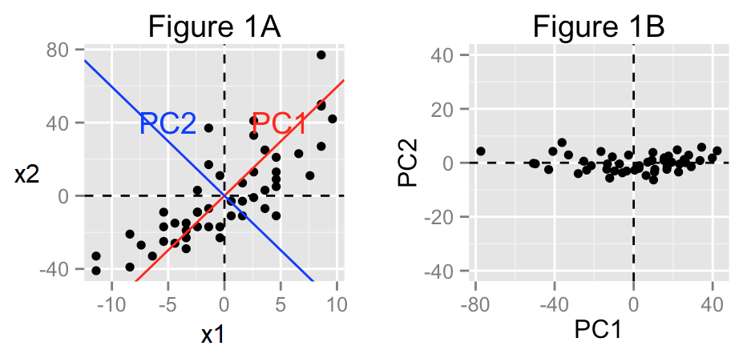
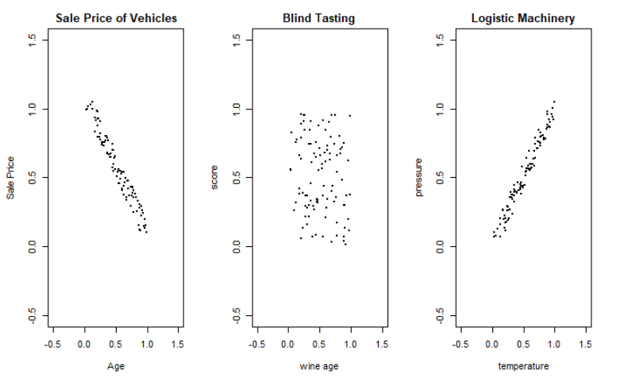
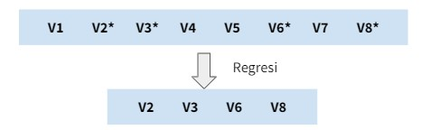
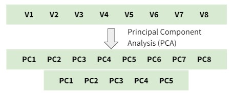
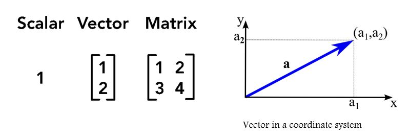
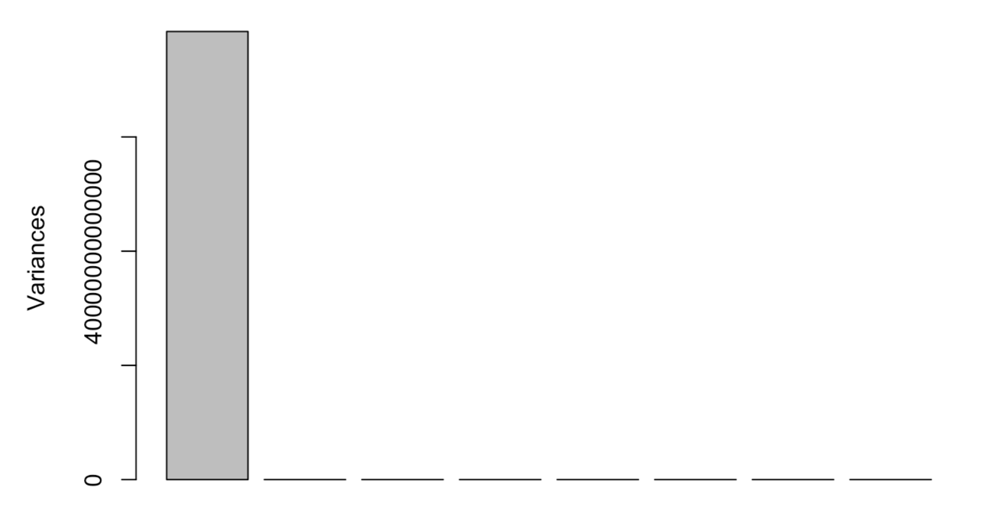
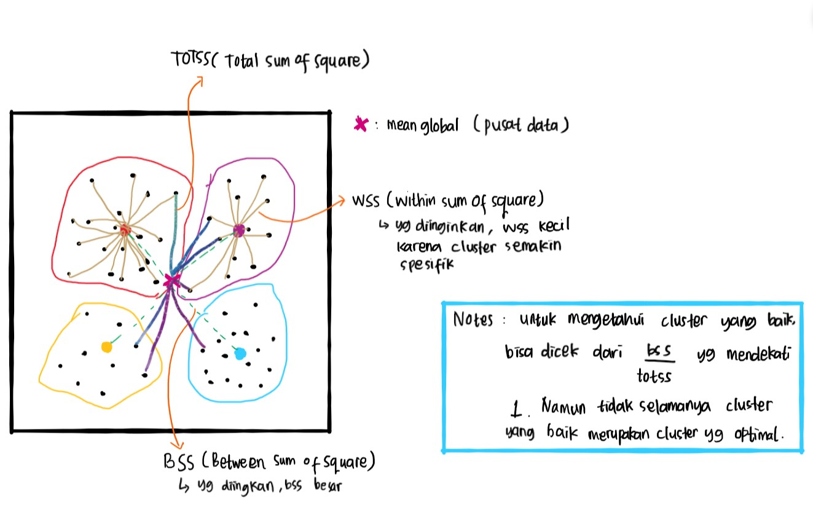
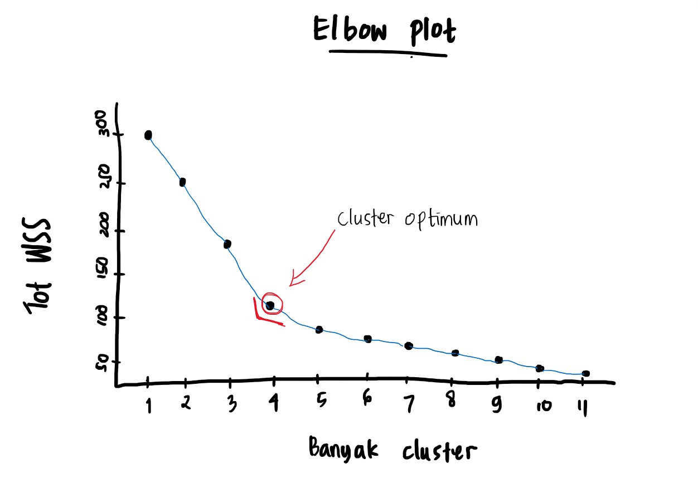

```{r setup, include=FALSE}
# clear-up the environment
rm(list = ls())

# chunk options
knitr::opts_chunk$set(
  message = FALSE,
  warning = FALSE,
  fig.align = "center",
  comment = "#>"
)

options(scipen = 999)
```

<style>

body {
text-align: justify}

</style>

# Introduction


## Supervised vs Unsupervised

**Supervised Learning**

- Memiliki target variabel
- Tujuannya untuk membuat model prediksi dengan training data
- Model di-evaluasi dengan testing data
- Output: Model machine learning, interpretasi model

**Unsupervised Learning**

- Tidak memiliki target variabel
- Tujuannya untuk mencari pola dalam data, yang berguna untuk menghasilkan informasi. Digunakan pada tahap Pre-processing maupun Exploratory Data Analysis (EDA)
- Tidak perlu melakukan evaluasi model, karena tidak ada label aktual
- Output: data baru, insight data

## Mindmap

```{r, out.width = "100%", echo = FALSE, fig.align = "center"}
knitr::include_graphics("additional_assets/UL.png")
```
Secara umum, unsupervised learning yang akan kita pelajari terbagi menjadi tiga:

1. **Visualize High Dimensional Data**: Memvisualisasikan serta pengambilan insight dari data yang berdimensi besar. Algoritma: Principal Component Analysis (PCA)
2. **Dimensionality Reduction**: mereduksi dimensi dengan tetap mempertahankan informasi sebanyak-banyaknya. Algoritma: Principal Component Analysis (PCA)
3. **Clustering**: pengelompokkan data berdasarkan kemiripan karakteristik data. Algoritma: K-means Clustering

-------------

# Principal Component Analysis (PCA)

Konsep utama PCA adalah membuat beberapa kolom baru dari gabungan kolom lama. Kolom baru ini disebut *Principal Components (PC)*. 

PC dipilih sedemikian rupa sehingga PC pertama (PC1) menangkap sebanyak mungkin variasi dalam data. PC kedua (PC2) menangkap variasi terbesar yang masih tersisa, dan begitu seterusnya untuk PC berikutnya.

🔎 Penjelasan tambahan:

- **Principal Components (PC)** adalah seperti sumbu baru di mana data kita bisa dilihat dari sudut yang berbeda. Mereka adalah kombinasi dari kolom-kolom asli.
- **PC1** adalah sumbu yang paling banyak menjelaskan variasi dalam data. Ini seperti mencari arah terbesar di mana data kita tersebar.
- **PC2** adalah sumbu yang menjelaskan variasi terbesar yang belum dijelaskan oleh PC1, dan seterusnya untuk PC selanjutnya.
- PCA memilih PC secara hati-hati sehingga setiap PC menjelaskan **sebanyak mungkin variasi** dalam data, dan setiap PC berbeda arahnya satu sama lain.


## Konsep PCA

Ide dasar dari PCA adalah untuk membuat sumbu (axis) baru yang dapat menangkap variasi data sebanyak mungkin. Sumbu baru ini adalah yang dinamakan sebagai **Principal Component (PC)**.

```{r, out.width = "80%", echo = FALSE, fig.align = "center"}

```

**Figure 1A (kiri)**:

- Sumbu/dimensi: X1 dan X2
- Variansi data dijelaskan oleh X1 dan X2
- Dilakukan PCA: akan membuat sumbu baru untuk menangkap informasi dari X1 dan X2, yang dinamakan PC1 dan PC2

**Figure 1B (kanan)**:

- Sumbu baru: PC1 dan PC2
- PC1 dan PC2 tegak lurus
- PC1 menangkap variasi data lebih banyak daripada PC2

kebutuhan reduksi dimensi:
- hasil PCA > data baru, misal: 

    - PC1 = 90% informasi
    - PC2 = 10% informasi
    
- User/kita menentukan berapa banyak kolom yang ingin direduksi


📝 **Catatan**:

- PC dibuat untuk merangkum sebanyak mungkin informasi data
- Banyaknya PC = jumlah kolom
- PC1 > PC2 > dst
- Karena PC1 dan PC2 tegak lurus, data hasil PCA akan menghasilkan data yang **tidak saling berkorelasi**. Sehingga cocok untuk data numerik yang saling berkorelasi. 

**❓ Knowledge Check**

```{r echo=FALSE, fig.align='center'}

```

1.  Dari Gambar diatas mana data yang cocok dilakukan PCA ?

-   [X] Sale Price of Vehicles
-   [ ] Blind Tasting
-   [X] Logistic Machinery

**Jawaban**: ........

Data Blind Tasting tetap bisa diaplikasikan PCA. Namun hasilnya kurang baik karena PC1 dan PC2 yang dibentuk akan menangkap variansi yang kurang lebih sama besar, sehingga tidak dapat dilakukan dimensionality reduction.

2.  PCA cocok digunakan pada data yang ?

-   [X] Saling berkorelasi
-   [ ] Tidak berkorelasi
-   [ ] Korelasi = 0.3

3.  Bila terdapat 3 PC, PC ke-berapa yang merangkum variansi (informasi) paling besar ?

-   [X] PC1
-   [ ] PC2
-   [ ] PC3

4.  Dalam PCA jumlah PC yang dihasilkan sebanyak ?

-   [X] Jumlah variabel yang digunakan
-   [ ] Setengah dari jumlah variabel yang digunakan
-   [ ] Ditentukan oleh user -> ketika ingin mereduksi PC / dimensi yang sudah di PCA


🥽 TIPS

Kapan PCA cocok digunakan?
Ketika data yang digunakan memiliki tingkat korelasi yang tinggi.

Bagaimana cara cek data berkorelasi tinggi?
Bisa menggunakan heatmap untuk melihat nilai korelasi.
Bisa menggunakan scatter plot dan melihat persebaran datanya.

Mengapa PCA cocok untuk data yang bekorelasi tinggi?
Dengan korelasi tinggi, PCA mampu menangkap variansi data sebanyak mungkin.


## [Additional] Misconception

❗️️ **Miskonsepsi garis PCA dengan garis Linear Regression**

```{r, out.width = "49%", out.height = "20%", echo = FALSE, fig.align = "center", fig.show = "hold"}
knitr::include_graphics(c("additional_assets/lr_vs_pca_1.png", "additional_assets/lr_vs_pca_2.png"))
```

Berikut adalah animasi bagaimana garis PCA secara intuitif dibentuk:

```{r, out.width = "80%", echo = FALSE, fig.align = "center"}
knitr::include_graphics("additional_assets/pca.gif")
```

Source: [Medium](https://medium.com/analytics-vidhya/dimensionality-reduction-principal-component-analysis-d1402b58feb1)

⚠️ **Miskonsepsi Dimentionality Reduction**

- Feature Elimination
  + Mengurangi feature space dengan menghilangkan feature
  + [+] Metode yang cukup sederhana dan mempertahankan interpretasi variabel
  + [-] Kehilangan informasi dari variabel-variabel yang telah di eliminasi
Berikut adalah gambaran bagaimana *feature elimination* secara intuitif bekerja

```{r, out.width = "50%", echo = FALSE, fig.align = "center"}

```
  
- Feature Extraction
  + Membuat n variabel “baru”, dimana variabel “baru” tersebut merupakan kombinasi dari masing-masing n variabel  "lama".
  + [+] Mempertahankan sebanyak mungkin  informasi dengan tetap mereduksi dimensi data
  + [+] Sebagai manfaat tambahan, masing-masing variabel "baru" setelah PCA semuanya independen satu sama lain
Berikut adalah gambaran bagaimana *feature extraction* secara intuitif bekerja

```{r, out.width = "50%", echo = FALSE, fig.align = "center"}

```


## [Optional] Mathematics of PCA - Eigen Value dan Eigen Vector

💡 Video: [3Blue1Brown: Eigenvectors and eigenvalues](https://www.youtube.com/watch?v=PFDu9oVAE-g)

Untuk membentuk PC dan nilai pada PC dibutuhkan **eigen values** & **eigen vector**. Secara manual, eigen values dan eigen vector didapatkan dari operasi matrix.

✨ Terminologi baru: 
- Eigen value = variansi (informasi) yang ditangkap oleh tiap PC
- Eigen vector = formula untuk mengubah data asli menjadi nilai PC (sumbu baru)

Teori matrix:

* skalar: nilai yang memiliki magnitude/besaran
* vektor: nilai yang memiliki besaran dan arah (umum digambarkan dalam suatu koordinat)
* matrix: kumpulan nilai/bentukan data dalam baris dan kolom

```{r, out.width = "60%", echo = FALSE, fig.align = "center"}

```

**Perkalian skalar-vektor**: mengubah besaran vektor (tidak merubah arah kecuali berbalik arah)
$$2\left(\begin{array}{cc}2\\3\end{array}\right) = \left(\begin{array}{cc}4\\6\end{array}\right)$$
$$-2\left(\begin{array}{cc}2\\3\end{array}\right) = \left(\begin{array}{cc}-4\\-6\end{array}\right)$$

**Perkalian matrix-vektor**: mengubah besaran dan arah

$$\left(\begin{array}{cc}1 & 2\\-1 & 2\end{array}\right)\left(\begin{array}{cc}2\\3 \end{array}\right) = \left(\begin{array}{cc}8\\4\end{array}\right)$$ 

**Perkalian Matrix-Vektor Spesial**

* **Matrix Rotasi**: mengubah arah vektor tanpa mengubah besaran

$$
\left(\begin{array}{cc} 
0 & -1\\ 
1 & 0 
\end{array}\right)
\left(\begin{array}{cc} 
2\\ 
3
\end{array}\right)=
\left(\begin{array}{cc} 
-3\\ 
2
\end{array}\right)
$$

```{r}
# perkalian matrix di R
matrix(c(0,1,-1,0), nrow=2) %*% as.vector(c(2,3))
```

* **Matrix Identitas**: tidak mengubah besaran maupun arah vektor

$$
\left(\begin{array}{cc} 
1 & 0\\ 
0 & 1 
\end{array}\right)
\left(\begin{array}{cc} 
2\\ 
3
\end{array}\right)=
\left(\begin{array}{cc} 
2\\ 
3
\end{array}\right)
$$

```{r}
# perkalian matrix di R
matrix(c(1,0,0,1), nrow=2) %*% as.vector(c(2,3))
```

**Eigen dari suatu Matrix**

Untuk setiap matrix, terdapat vektor spesial (eigen vector) yang jika dikalikan dengan matrixnya, hasilnya akan sama dengan vektor tersebut dikalikan suatu skalar (eigen value). Sehingga didapatkan rumus:

$$Ax = \lambda x$$
Dimana $x$ adalah eigen vector dan $\lambda$ adalah eigen value dari matrix $A$.

$$
\left(\begin{array}{cc} 
2 & 3\\ 
2 & 1 
\end{array}\right)
\left(\begin{array}{cc} 
3\\ 
2
\end{array}\right)
=
\left(\begin{array}{cc} 
12\\ 
8
\end{array}\right)
=4
\left(\begin{array}{cc} 
3\\ 
2
\end{array}\right)
$$
Teori eigen dipakai untuk menentukan PC dan nilai-nilai pada PC.

**Penerapan Eigen dalam PCA:**

**Matrix covariance** adalah matrix yang dapat merangkum informasi (variance) dari data. Kita menggunakan matrix covariance untuk mendapatkan mendapatkan eigen vector dan eigen value dari matrix tersebut, dimana:

* **eigen vector**: arah sumbu tiap PC, yang menjadi formula untuk mentransformasi data awal ke PC baru. 
* **eigen value**: variansi yang ditangkap oleh setiap PC.
* tiap PC memiliki 1 eigen value & 1 eigen vector.
* alur: matrix covariance -> eigen value -> eigen vector -> nilai di tiap PC

Eigen vector akan menjadi formula untuk kalkulasi nilai di setiap PC. Contohnya, untuk data yang terdiri dari 2 variabel, bila diketahui eigen vector dari PC1 adalah:

$$x_{PC1}= \left(\begin{array}{cc}b_1\\b_2\end{array}\right)$$

Maka formula untuk menghitung nilai pada PC1 (untuk tiap barisnya) adalah:

$$PC1= b_1X1 + b_2X2$$

Keterangan:

* $x_{PC1}$ : eigen vector PC1 dari matrix covariance
* $b_1$, $b_2$ : konstanta dari eigen vector
* $PC1$ : nilai di PC1
* $X1$, $X2$ : nilai variabel X1 dan X2 di data awal

**Mencari Eigen dengan R**

```{r fig.height=5, fig.width=5}
# membuat data dummy
RNGkind(sample.kind = "Rounding")
set.seed(100)

x <- runif(200) # buat data random dengan distribusi normal
data <- data.frame(x=x, y=-x+runif(100, 1.05, 1.25)) # buat data frame
data <- scale(data) # agar skala antar variable sama
plot(data)
```

```{r}
# matrix covariance
A <- cov(data)
A
```

**Ket:**

-   variansi variabel 1: 1
-   variansi variabel 2: 1
-   covariance: -0.982719

```{r}
# menghitung eigen
eigen(A)
```

```{r fig.height=5, fig.width=5}
# plotting eigen vector as new coordinate
slope1 <- eigen(A)$vectors[1,1]/eigen(A)$vectors[2,1]
slope2 <- eigen(A)$vectors[1,2]/eigen(A)$vectors[2,2]

plot(data, pch=19, cex=0.25, xlim=c(-1.5,1.5), ylim=c(-1.5,1.5))
lines(data[,1], data[,1] * slope1, col="blue") # PC1
lines(data[,1], data[,1] * slope2, col="green") # PC2
```

**Keterangan**:

* `eigen(A)$values`: Eigen value untuk tiap PC, besar variansi yang dapat ditangkap oleh tiap PC. Eigen value tertinggi adalah milik PC1, kedua tertinggi milik PC2, dan seterusnya. 

* `eigen(A)$vectors`: Eigen vector untuk tiap PC. Eigen vector untuk PC1 adalah kolom pertama `[,1]`; untuk PC2 adalah kolom kedua `[,2]`.


<center>**<----------- Study Case PCA: Loan Data ----------->**</center>


## 🔬 Workflow PCA

### 1️⃣ Business Question

💬 Kita sebagai data scientist diminta untuk:

- Analisis mendalam untuk memahami pola data pelanggan
- Mereduksi dimensi data untuk menyederhanakan analisis

### 2️⃣ Read data

Mari kita lakukan analisis PCA untuk Dataset Loan dari sebuah platform di quarter ke-4 tahun 2017. 

```{r message=FALSE}
library(dplyr)

loan <- read.csv("data_input/loan2017Q4.csv", stringsAsFactors = T)
str(loan)
  
```


Data ini berisi 1556 pelanggan dengan 16 variabel, termasuk kolom `not_paid` yang menunjukkan apakah pelanggan tersebut gagal membayar pinjaman atau tidak. Berikut adalah deskripsi lengkap dari variabel-variabel tersebut:

- `initial_list_status`: Either w (whole) or f (fractional). Variabel ini menunjukkan apakah pinjaman adalah pinjaman utuh atau pinjaman fraksional. Beberapa investor institusional memiliki preferensi untuk membeli pinjaman secara utuh untuk mendapatkan perlakuan hukum dan akuntansi yang khusus sesuai dengan situasi mereka, dengan tambahan manfaat "pendanaan instan" bagi peminjam.
- `purpose`: Disederhanakan dari data asli; Salah satu dari: credit_card, debt_consolidation, home_improvement, major_purchase, dan small_business.
- `int_rate`: Tingkat bunga dalam persen.
- `installment`: Pembayaran bulanan yang harus dibayar oleh peminjam.
- `annual_inc`: Pendapatan tahunan yang dilaporkan sendiri oleh peminjam / co-peminjam selama aplikasi.
- `dti`: Rasio total pembayaran hutang bulanan peminjam terhadap total kewajiban mereka terhadap pendapatan bulanan yang dilaporkan sendiri (rasio utang terhadap pendapatan).
- `verification_status`: Apakah pendapatan yang dilaporkan diverifikasi, tidak diverifikasi, atau jika sumber pendapatan diverifikasi.
- `grade`: Peringkat pinjaman yang ditetapkan oleh perangkat lunak.
- `revol_bal`: Total saldo kredit yang berputar (dalam kasus kartu kredit, ini mengacu pada bagian dari pengeluaran kartu kredit yang tidak dibayar pada akhir siklus penagihan).
- `inq_last_12m`: Jumlah pertanyaan kredit dalam 12 bulan terakhir.
- `delinq_2yrs`: Jumlah kejadian tunggakan lebih dari 30 hari dalam file kredit peminjam selama 2 tahun terakhir.
- `home_ownership`: Salah satu dari MORTGAGE, OWN, dan RENT.
- `not_paid`: 1 untuk charged-off, lewat jatuh tempo / masa tenggang, atau defaulted, 0 untuk pinjaman lunas sepenuhnya.
- `log_inc`: Logaritma dari annual_inc.
- `verified`: 0 untuk "Not verified" di bawah verification_status, 1 sebaliknya.
- `grdCtoA`: 0 untuk peringkat A, B, atau C, 1 sebaliknya.

### 3️⃣ Data Cleansing

❓ Adakah tipe data yang belum tepat?

- ubah kolom `not_paid, verified, grdCtoA` 

```{r}
loan_clean <- loan %>% 
  mutate_at(vars(not_paid, verified, grdCtoA), as.factor)
```

❓ Apakah terdapat missing value?

```{r}
loan_clean %>% is.na() %>% colSums()
```


### 4️⃣ Exploratory Data Analysis

❓ Apakah antar variable memiliki skala yang sama? Mari kita cek *range* untuk tiap kolom:

```{r}
loan_clean %>%
  select_if(is.numeric) %>% 
  summary
```

> Range dan satuan data kita berbeda, sehingga ketika kita melakukan PCA perlu dilakukan scaling.


❗️❗️❗️ Data dengan perbedaan skala antar variabel yang tinggi **tidak baik untuk langsung dianalisis PCA karena dapat menimbulkan bias**. PC1 akan dianggap menangkap variansi tertinggi dan PC selanjutnya dianggap tidak memberikan informasi.

💬 Diskusi: Bagaimana jika tidak dilakukan perubahan skala?

Perhatikan plot di bawah ini bahwa semua informasi hanya dirangkum oleh PC1. Hal ini terjadi karena salah satu kolom memiliki skala hingga milyaran (variansinya tinggi) dibandingkan variabel lainnya. 

```{r, out.width = "70%", echo = FALSE, fig.align = "center"}

```
Sumber: materi utama

> Scaling akan dilakukan saat PCA

### 5️⃣ PCA

Untuk melakukan PCA, kita bisa menggunakan bantuan dari fungsi di base R, atau dapat menggunakan cara yang lebih mudah dengan bantuan package `FactoMineR`. `FactoMineR`  adalah R package yang dibuat untuk *exploratory multivariate data analysis*.

```{r}
# install.packages("FactorMineR")
library(FactoMineR)
```


💡 Kelebihan `FactoMineR` dari fungsi base adalah:

- memudahkan pembacaan visualisasi data
- dapat melibatkan variable kategorik untuk mewarnai plot sehingga plot lebih informatif

📌 `FactoMineR` menyediakan dua fungsi utama dalam PCA:

1. `PCA()` untuk analisis PC
2. `plot.PCA()` untuk visualisasi

- **Data Preprocessing**: Memisahkan antara data numerik dan non-numerik

Cara 1️⃣:
Cara manual

```{r}
names(loan_clean)
```


```{r}
# indeks kolom numerik (quantitative)
quantivar <- c(3:6,9:11,14)

# indeks kolom kategorik (qualitative)
qualivar <- c(1,2,7,8,12,13,15,16)
```

Cara 2️⃣ (Recommended):
Sebagai alternatif, apabila tidak ingin manual.

Code dibawah ini untuk memilih indeks kolom numerik dan kategorik secara dinamis (agar lebih scalable untuk kolom yang jumlahnya sudah banyak)

```{r}
# bagian ini opsional
# nama kolom numerik (quantitative)
quanti <- loan_clean %>% 
  select_if(is.numeric) %>% 
  colnames()

# indeks kolom numerik
quantivar <- which(colnames(loan_clean) %in% quanti)

# nama kolom kategorik (qualitative)
quali <- loan_clean %>% 
  select_if(is.factor) %>% 
  colnames()

# indeks kolom kategorik
qualivar <- which(colnames(loan_clean) %in% quali)
```

**Melakukan PCA dengan library `FactoMineR`**

📌 Parameter fungsi `PCA()`:

- `X`: dataframe awal
- `scale.unit = T`: untuk melakukan scaling
- `quali.sup`: index kolom variable kategorikal (qualitative)
- `graph = F`: untuk tidak menampilkan plot secara langsung
- `ncp`: banyaknya PC yang digunakan, default = 5

```{r}
# melakukan PCA dengan FactoMineR
loan_pca <- PCA(
  X = loan_clean, # data awal
  scale.unit = T, # scaling
  quali.sup = qualivar, # index kolom qualitative
  graph = F, # tidak menampilkan gambar
  ncp = 8 # jumlah kolom numerik
)
```


**Penjelasan Object hasil PCA yang sering digunakan:**

1️⃣  **`$eig` (eigenvalues):** Nilai yang menunjukkan seberapa banyak informasi yang dijelaskan oleh setiap Principal Component.

```{r}
loan_pca$eig
```


> Reduksi dimensi: digunakan untuk menentukan dimensi mana yang ingin dihapus

2️⃣  **`$var$coord` (coordinates for the variables):** Posisi variabel dalam ruang Principal Components

```{r}
loan_pca$var$coord
```


> Interpretasi PC, Identifikasi Variabel Penting -> lebih mudah apabila divisualisasikan

3️⃣  **`$ind$coord` (coordinates for the individuals):** Posisi individu dalam ruang Principal Components. Atau data setelah PCA

```{r}
loan_pca$ind$coord
```

> Identifikasi kelompok, Deteksi Outlier -> lebih mudah apabila divisualisasikan


✨✨ Terminologi baru:

- **Eigenvalues**: Nilai-nilai yang menggambarkan seberapa banyak variasi dalam data yang dijelaskan oleh setiap principal component.
- **Coordination (coord.)**: Koordinat atau posisi dari variabel atau individu dalam ruang principal component.
- **Correlations (cor)**: Hubungan antara variabel asli dengan dimensi atau arah dalam ruang principal component.
- **Contributions**: Kontribusi dari variabel atau individu terhadap pembentukan principal components, menunjukkan seberapa penting mereka dalam analisis.


..................................🍀🍀🍀..................................

> Setelah kita melakukan PCA, tahapan selanjutnya adalah kita dapat melakukan 2 hal sesuai goal kita, diantaranya:
> 
> - Visualisasi PCA: untuk memahami pola dari data berdimensi besar
> - Reduksi Dimensi: manipulasi data untuk mengurangi dimensi, namun tetap memiliki informasi yang banyak

..................................🍀🍀🍀..................................

### 📈 Visualisasi PCA

Hasil PCA dapat kita visualisasikan untuk memahami pola hubungan antara variabel dan individu menggunakan biplot. Biplot (dua plot) adalah grafik yang menggambarkan posisi variabel dan individu dalam **satu plot**. 

> 🍀 Dengan menggunakan biplot kita dapat mendapatkan wawasan tentang bagaimana variabel mempengaruhi letak individu dalam ruang PCA.

Biplot dapat divisualisasikan menggunakan `plot.PCA()`


```{r}
plot.PCA(
  x = loan_pca,
  
)
```

Namun, untuk mempermudah pengambilan insight, kita pisah menjadi 2 plot


#### Individual Factor Map

Plot yang menunjukkan posisi setiap individu atau observasi data dalam analisis PCA, yang membantu kita mengidentifikasi pencilan (*outlier*) dan **melihat pola** hubungan antara individu dalam dataset.

📌 Parameter:

- `x`: object PCA (`FactoMineR`)
- `choix = "ind"`: plot individual factor map
- `invisible = "quali"`: menghilangkan label kolom kategorik, karena mengganggu visual
- `select = "contrib n"`: menampilkan indeks dari $n$ outlier terluar
- `habillage`: mewarnai titik berdasarkan *index kolom*/ *nama kolom* (bisa kategorikal maupun numerik)

```{r}
plot.PCA(
  x = loan_pca, # obj PCA
  choix = "ind", # pilihan, untuk menampilkan per-observasi
  invisible = "quali", # untuk menghilangkan garis panah
  select = "contrib 10", # untuk identifikasi 10 outlier
  habillage = "not_paid" # untuk mewarnai titik observasi (masukkan nama kolom)
)
```

**📉 Insight**:

- 10 customer yang memiliki karakteristik berbeda dibandingkan dengan yang lain (outlier): 1228, 1310, 1438, ...


#### Variables Factor Map

- 1️⃣ Mengetahui **kontribusi variabel ke tiap PC**, serta seberapa banyak informasi yang dijelaskan oleh setiap variabel ke setiap PC.
- 2️⃣ Mengetahui **correlation** antar variable awal

Parameter fungsi `plot.PCA()`:

- `x`: object PCA (`FactoMineR`)
- `choix = "var"`: plot VARiable factor map

```{r}
plot.PCA(
  x = loan_pca,
  choix = "var"
)
```


**📉 Insight**:

<center>**<----------- 📉 Insight1: Kontribusi variabel ----------->**</center>


> ✨ Tips: Skor loading dilihat dari seberapa jauh panah itu dari titik tengahnya. Panah yang lebih jauh menunjukkan lebih banyak informasi yang dijelaskan. Jika panah menuju ke arah negatif, nilai variabel asli yang tinggi akan memiliki nilai yang rendah di PC, dan sebaliknya.

- ❓ PC1 paling banyak merangkum dua variable: `annual_inc` dan `log_inc`
- ❓ PC2 paling banyak merangkum dua variable: `dti` dan `int_rate`

Dari panah merah tersebut, kita tahu variable mana yang paling banyak berkontribusi untuk tiap PC. Namun kita kesulitan untuk mengurutkan kontribusinya, mari kita gunakan fungsi `fviz_contrib()` untuk melihat urutan **kontribusi variabel ke tiap PC**
    
```{r}
# bar plot variable contribution
library(factoextra)
fviz_contrib(X = loan_pca, axes = 2, choice = "var")
```

**Catatan**: 

- Garis horizontal putus-putus merah adalah batas nilai kontribusi yang diharapkan apabila PC menangkap informasi dari tiap variable dengan sama rata.
- Cara menghitungnya adalah 100%/jumlah variable awal. 
- Pada kasus ini 100/8 = 12.5%.
- Bila melebihi batas tersebut, maka dapat dikatakan variable tersebut berkontribusi terhadap PC tersebut.

<center>**<----------- 📉 Insight 2: Korelasi antar variabel ----------->**</center>

> ✨ Tips: **Korelasi antar variabel** dapat dilihat dari sudut antar panah 
>
> - Panah saling berdekatan (sudut antar panah < 90), maka korelasi positif
> - Panah saling tegak lurus (sudut antar panah = 90), maka tidak berkorelasi
> - Panah saling bertolak belakang (sudut antar panah mendekati 180), maka korelasi negatif

```{r}
plot.PCA(x = loan_pca,
         choix = "var")
```

- ❓ Pasangan variabel yang saling berkorelasi tinggi positif:

  - `installment` & `revol_bal`
  - `dti` dan `int_rate`
  - `annual_inc` dan `log_inc`
  
```{r}
# opsional: cek nilai korelasi hanya untuk memastikan
library(GGally)
ggcorr(loan_clean, label = TRUE, hjust = 1)
```


# 📝 SUMMARY DAY 1

**Supervised vs Unsupervised**

- Supervised: memiliki target variable, untuk prediksi
- Unsupervised: tidak memiliki target variable, untuk memahami pola data

**PCA**

* Istilah:

- Dimensi = fitur / kolom
- Informasi = varians
- Eigen value = .....
- Eigen vector = .....

**Workflow PCA**

1. Import data
2. Cleansing Data
3. Check Missing value
4. EDA: check range data (summary)
5. Preprocessing: memisahkan indeks kolom numerik dan non-numerik
6. PCA menggunakan fungsi `PCA()` dari `factomineR`

**Visualisasi PCA**

1. Individual Factor Map
    
  - Menunjukkan posisi setiap individu / observasi
  - Untuk mendeteksi outlier
    
2. Variables Factor Map

  -  Mengetahui kontribusi variabel ke tiap PC
  -  Mengetahui korelasi antar 2 variabel


<center>**<----------- END OF DAY 1 ----------->**</center>


<center>**<----------- START OF DAY 2 ----------->**</center>

#### PCA Menggunakan Base R

📣Dataset `USArrests` merupakan data tentang jumlah tiga tindak kejahatan (`Murder`, `Assault`, dan `Rape`) per 100 ribu penduduk yang berhasil dicatat di 50 negara bagian US pada tahun 1973.

Deskripsi data:

- `Murder`: murder arrests per 100,000
- `Assault`: assault arrests per 100,000
- `UrbanPop`: percent of population in urban areas
- `Rape`: rape arrests per 100,000

```{r}
# get function & data
source("R/biplot.R")

data("USArrests")
head(USArrests)
```

Melakukan PCA, menggunakan fungsi `prcomp`

```{r}
pca_usa <- prcomp(USArrests, scale = T)
```

Visualisasikan PCA dengan `biplot`

```{r}
biplot(pca_usa)
```

Visualisasikan menggunakan `fancy_biplot()`!

```{r}
# PCA & Visualization
fancy_biplot(pca_usa)
```

#### 🏄 Dive Deeper II: Biplot `USArrests`

🔻Insight dari biplot:

1. Perhatikan cluster di mana Arizona, Colorado, Illinois, dan Texas berada. Negara bagian mana lagi yang ada dalam cluster tersebut? **New York, dan bisa disimpulkan kelima negara bagian ini tingkat Rapenya cukup tinggi**

2. Di antara Ohio, Louisiana, North Dakota, dan Colorado, manakah yang memiliki:

- Tingkat `Murder` tertinggi: **Louisiana**
- Tingkat `Assault` tertinggi: **Louisiana**
- Tingkat `Rape` tertinggi: **Colorado**
- Tingkat kriminalitas terendah, meliputi ketiga tipe kejahatan: **North Dakota**

## ❓ Knowledge Check Biplot 

1. Besarnya informasi yang dirangkum oleh PCA dapat direpresentasi dengan nilai berikut, **KECUALI**

- [X] eigen vector -> formula untuk mengubah data asli menjadi nilai PC
- [ ] eigen value -> variansi atau informasi yang ditangkap oleh tiap PC
- [ ] variance -> informasi
- [ ] standard deviation -> informasi yang ditangkap oleh tiap PC

2. Insight apa yang dapat kita peroleh dari Individual Factor Map (plot persebaran data) dalam biplot?

- [X] Observasi yang merupakan outlier
- [ ] Kontribusi variabel -> garis / panah
- [ ] Korelasi antar variabel -> sudut yang terbentuk antara 2 garis var


<center>**<----------- End Of Dive Deeper ----------->**</center>


### 📝 Deskripsi PCA

Kita akan bahas lebih detail deskripsi dari object PCA kita, untuk mempermudah, kita coba check summary

```{r}
loan_dim <- dimdesc(loan_pca)
```

```{r}
loan_dim$Dim.1$quanti %>% as.data.frame()
```

```{r}
summary(loan_pca)
```


Eigenvalues: memberikan informasi tentang berapa banyak variasi yang dijelaskan oleh masing-masing Dimensi (PC).


- **Variance**: Menunjukkan seberapa banyak variasi yang dijelaskan oleh setiap Dimensi (PC) dalam persen.
- **% of var.**: Persentase variasi yang dijelaskan oleh setiap Dimensi.
- **Cumulative % of var.**: Persentase kumulatif variasi yang dijelaskan hingga dimensi tertentu.

Individuals (the 10 first): menunjukkan bagaimana individu diposisikan dalam ruang PC, serta kontribusi mereka terhadap variasi.

- **Dist**: Jarak dari titik pusat dalam ruang PC.
- **Dim.1, Dim.2, Dim.3**: Koordinat individu dalam setiap Dimensi (PC), menunjukkan di mana individu tersebut berada dalam ruang PC.
- **ctr**: Kontribusi relatif individu terhadap variasi dalam masing-masing Dimensi.
- **cos2**: Proporsi variasi asli yang dijelaskan oleh setiap Dimensi untuk individu tertentu.

Variables: menunjukkan bagaimana variabel diposisikan dalam ruang PC, serta kontribusi mereka terhadap variasi.

- **Dim.1, Dim.2, Dim.3**: Koordinat variabel dalam setiap Dimensi (PC), menunjukkan kontribusi variabel terhadap setiap Dimensi.
- **ctr**: Kontribusi relatif variabel terhadap variasi dalam masing-masing Dimensi.
- **cos2**: Proporsi variasi asli yang dijelaskan oleh setiap Dimensi untuk variabel tertentu.

Supplementary categories (the 10 first): menambahkan informasi tentang kategori tambahan yang mungkin relevan dalam analisis PCA.

- **Dist**: Jarak dari titik pusat dalam ruang PC untuk kategori tambahan.
- **Dim.1, Dim.2, Dim.3**: Koordinat kategori tambahan dalam setiap Dimensi (PC), menunjukkan di mana kategori tersebut berada dalam ruang PC.
- **cos2**: Proporsi variasi asli yang dijelaskan oleh setiap Dimensi untuk kategori tambahan.
- **v.test**: Nilai uji statistik untuk signifikansi kategori tambahan dalam setiap Dimensi.


#### Dimension Description

Untuk lebih jelas dan objektif, kontribusi/korelasi tiap variable ke tiap PC dapat dilihat menggunakan `dimdesc()`. Semakin tinggi nilai korelasi, semakin banyak informasi yang dirangkum pada PC tersebut.

```{r}
# dimdisc: dimension description
loan_dim <- dimdesc(loan_pca)

# variable yang berkontribusi untuk PC1
loan_dim$Dim.1$quanti %>% as.data.frame()
```

💡 Mirip dengan `fviz_contrib()` yang kita pelajari sebelumnya

```{r}
fviz_contrib(
  X = loan_pca,
  choice = "var",
  axes = 1
)
```

❗️️ Besar kontribusi tidak dilihat dari tanda negatif/positif pada korelasi, melainkan hanya magnitudenya (nilai absolutenya)

### 📉 Reduksi Dimensi

Untuk mereduksi jumlah kolom dalam data, kita akan menggunakan hasil PCA, yaitu `loan_pca$ind$coord`. Kita akan memanipulasi data ini dengan menghapus beberapa kolomnya.

```{r}
loan_pca$ind$coord %>% as.data.frame()
```


📌 Langkah-langkah Reduksi Dimensi:

1️⃣  **Lihat Eigenvalues**: Periksa nilai eigenvalues dari **`$eig`** untuk semua PC.

```{r}
loan_pca$eig # menampilkan cummulative proportion variance/eigen value
```
2️⃣  **Tentukan Jumlah PC**: Pilih jumlah PC yang menjelaskan proporsi kumulatif variasi yang cukup besar, atau berdasarkan keputusan bisnis

Kita perlu mereduksi kolom dari belakang. Untuk mengetahui berapa banyak kolom yang perlu direduksi, kita bisa melihat seberapa banyak kumulatif variasi yang dijelaskan secara total oleh setiap variabel.

> ❓ Berdasarkan keputusan bisnis: Misalkan kita ingin mempertahankan informasi sebesar 80%, maka berapa PC yang kita gunakan? 1-5

3️⃣  **Reduksi Dimensi**: Subset PC terpilih untuk mereduksi dimensi

```{r}
# mengambil data hasil PCA sebanyak PC yang dibutuhkan
loan_keep <- loan_pca$ind$coord[ , 1:5 ] %>% as.data.frame()
```

`loan_clean` -> 8 kolom numerik diganti dengan `loan_keep` -> penggabungan data -> supervised learning -> klasifikasi

reduksi dimensi = tahapan preprocessing

penerapan:

- Pada data sensor
- Data yang memiliki fitur yang banyak: seperti gambar


## [Additional] Reconstruction

Fungsi `reconst()` dari library `FactoMineR` memungkinkan kita untuk melakukan rekonstruksi data hasil PCA ke data semula. Umumnya rekonstruksi ini digunakan pada data gambar untuk kasus image compression. 

Misalnya gambar asli adalah 40x40 pixel (1600 kolom), lalu direduksi dengan menggunakan 50 PC saja. Untuk menampilkan data berupa gambar, tetap diperlukan struktur data yang memuat 1600 kolom yang mewakili tiap pixel. Kita bisa melakukan rekonstruksi gambar dari 50 PC ke 1600 kolom kembali. Namun, nilai hasil rekonstruksi tersebut menjadi sedikit berbeda dari nilai awal.

**Catatan**: rekonstruksi data jarang dilakukan pada data tabular, karena nilai hasil rekonstruksi tidak merepresentasikan nilai asli, sehingga kurang ada manfaatnya.

Berikut contoh rekonstruksi data dengan menggunakan data `loan`: 

```{r}
library(FactoMineR)
# var numerik --> 8
# reconstruct data menggunakan PC1 - PC5
loan_reconst <- reconst(loan_pca, 
                        ncp = 5) # jumlah PC yang ingin digunakan untuk reconstruct

head(data.frame(loan_reconst), 3)
```

Bandingkan dengan nilai asli sebelum dilakukan PCA:

```{r}
# data awal (coba bandingkan dengan hasil reconstruct di atas)
loan_clean %>% 
  select_if(is.numeric) %>% 
  head(3)
```

Kita juga dapat rekonstruksi data hingga 100% sama persis bila menggunakan seluruh PC, dengan menggunakan parameter `ncp = 8` di fungsi `reconst()`.

## [Optional] Eigenfaces

**Bagian berikut menyajikan contoh rekonstruksi PCA pada data gambar.**

Pada kasus face recognition, data gambar yang memiliki banyak sekali dimensi dapat mengalami apa yang disebut sebagai **the curse of dimensionality**. Setelah melewati batas tertentu, kemampuan suatu model dalam memprediksi hasil akan semakin menurun seiring dengan bertambahnya dimensi.

Dengan melakukan dimensionality reduction (PCA) pada data gambar dan merekonstruksi data gambar dari data hasil PCA, kita dapat meningkatkan performa model face recognition kita.

```{r}
# read `faceData` 32 pixel
load("data_input/face.rda")

# PCA
face_pca <- PCA(faceData, graph = F, ncp = 32, scale.unit = T)
# face_pca$eig
```

```{r}
# create reconstructed data
face_recon1 <- reconst(face_pca, ncp = 2)
face_recon2 <- reconst(face_pca, ncp = 4)
face_recon3 <- reconst(face_pca, ncp = 6)
face_recon4 <- reconst(face_pca, ncp = 32) # mengambil semua PC
```

```{r fig.height= 8, fig.width=8}
# make function to visualize image data
showMatrix <- function(x, title){
  image(t(x[nrow(x):1,]), 
        xaxt = 'n', yaxt = 'n', 
        col = gray((0:32)/32),
        main = title, 
        font.main=4, 
        cex.main=0.5
        )
}

# visualize image data
par(mfrow=c(2,2), mar=c(0.5,0.5,1.5,0.5))
showMatrix(faceData, title = 'Original Image')
showMatrix(face_recon1, title = 'Reconstructed: 2 dimensions')
showMatrix(face_recon3, title = 'Reconstructed: 6 dimensions')
showMatrix(face_recon4, title = 'Reconstructed: All PCs')
```

## 📝 SUMMARY FUNGSI-FUNGSI

- `biplot(prcomp())`: membuat biplot dengan base R
- `fviz_contrib()`: melihat urutan kontribusi tiap variable ke tiap PC, dari package `factoextra`
- `PCA()`: membuat objek PCA dari package `FactoMineR`
- `plot.PCA()`: membuat biplot dari object `PCA()`:
  + `choix = "ind"`: visualisasi sebaran data (individual factor map), terdapat parameter `habillage` untuk mewarnai observasi berdasarkan index kolom
  + `choix = "var"`: visualisasi variable factor map (panah)
- `dimdesc()`: dimension description, untuk melihat kontribusi variable ke tiap PC
- `reconst()`: melakukan rekonstruksi dari nilai PC ke data asli, umumnya untuk data gambar

***

# Clustering

Clustering adalah pengelompokan data berdasarkan karakteristiknya. Clustering bertujuan untuk menghasilkan cluster dimana:

-   tiap observasi di 1 cluster yang sama yang memiliki karakteristik yang mirip
-   tiap observasi dari cluster yang berbeda memiliki karakteristik yang berbeda.

Kita bisa menggunakan **K-means Clustering** untuk pendekatan ini.

## K-means Clustering

- **Konsep**

K-means adalah salah satu algoritma clustering yang *centroid-based*, artinya tiap cluster memiliki satu centroid yang mewakili cluster tersebut. 

💡 Banyaknya cluster $k$ ditentukan oleh user.

```{r, out.width = "70%", echo = FALSE, fig.align = "center"}
knitr::include_graphics("additional_assets/kmeans.jpg")
```
1. **Random initialization**: meletakkan $k$ centroid secara random
2. **Cluster assignment**: assign masing-masing observasi ke cluster terdekat, berdasarkan perhitungan jarak
3. **Centroid update**: menggeser centroid ke rata-rata (means) dari cluster yang terbentuk
4. Ulangi langkah 2 dan 3 sampai tidak ada observasi yang clusternya berubah lagi

💡 Kunjungi link berikut untuk visualisasi yang interaktif: https://www.naftaliharris.com/blog/visualizing-k-means-clustering/

## 🔬 Workflow K-means Clustering 

### 1️⃣ Business Question: Whisky Recommendation

💬 Kita sebagai seorang data scientist sebuah toko whisky diminta untuk membuat product recommendation untuk whisky berdasarkan preferensi rasa masing-masing customer!

📌 Tujuan: membentuk kelompok whisky yang memiliki karakteristik rasa khas pada tiap clusternya

### 2️⃣ Read Data

Data yang digunakan berupa data penyulingan Malt Whisky dari 86 pabrik penyulingan, diperoleh dari penelitian Dr. Wisehart (Universitas St. Andrews). Setiap whisky diberi skor 0-4 dari 12 kategori cita rasa berdasarkan uji organoleptik:

* Body: tingkat kekuatan rasa (light/heavy)
* Sweetness: tingkat rasa manis
* Smoky: tingkat rasa asap
* Medicinal: tingkat rasa pahit (obat)
* Tobacco: tingkat rasa tembakau
* Honey: tingkat rasa madu
* Spicy: tingkat rasa pedas
* Winey: tingkat rasa anggur
* Nutty: tingkat rasa kacang
* Malty: tingkat rasa gandum
* Fruity: tingkat rasa buah
* Floral: tingkat rasa bunga


```{r}
whisky <- read.csv("data_input/whiskies.txt")
head(whisky)
```

### 3️⃣ Data Cleansing

- Apakah ada kolom yang tidak diperlukan?

```{r}
# assign nilai dari kolom Distillery menjadi rownames
rownames(whisky) <- whisky$Distillery
```

```{r}
# membuang kolom yang tidak digunakan
whisky <- whisky %>% 
  select(-c(Postcode, Latitude, Longitude, RowID, Distillery))

head(whisky)
```


### 4️⃣ EDA

Cek missing values:

```{r}
whisky %>% is.na() %>% colSums()
```

> tidak ada missing value

Cek skala antar variabel

```{r}
summary(whisky)
```

❓ Diskusi: Pada data `whisky`, apakah skala nilai antar variable berbeda? Apakah perlu dilakukan scaling?

- ketika kita memiliki data dengan range yang berbeda skala sama, tidak masalah apabila tidak perlu kita lakukan scaling
- Untuk latihan, dan supaya memahami workflow dari clustering menggunakan k-means, kita akan tetap melakukan scaling


Scaling dilakukan agar antar variabel memiliki skala yang tidak jauh berbeda. Nilai scaling yang digunakan adalah Z-score (mean = 0, standar deviasi = 1)

$$Z = \frac{x-mean}{sd}$$

```{r}
whisky_z <- scale(whisky)
summary(whisky_z)
```


### 5️⃣ K-means

📌 Parameter:

- `x`: dataset
- `centers`: banyaknya centroid $k$

Note: perlu dilakukan `set.seed()` karena terdapat random initialization pada tahap awal k-means

```{r}
# k-means dengan 3 cluster
RNGkind(sample.kind = "Rounding")
set.seed(100)

whisky_km <- kmeans(x = whisky_z, # data yang sudah discaling
                    centers = 3) # jumlah k (cluster yang diinginkan)
```

Hasil dari k-means:

1. Banyaknya pengulangan (iterasi) algoritma k-means sampai dihasilkan cluster yang stabil

```{r}
whisky_km$iter
```

2. Banyaknya observasi pada tiap cluster

```{r}
whisky_km$size
```

3. Letak pusat cluster/centroid, biasa digunakan untuk profiling cluster

```{r}
whisky_km$centers
```

4. Label cluster untuk tiap observasi

```{r}
head(whisky_km$cluster) # menghasilkan cluster untuk tiap rownames (nama-nama whiskynya)
```

### 6️⃣ Goodness of Fit

Kebaikan hasil clustering dapat dilihat dari 3 nilai:

- Within Sum of Squares (`$withinss`): jumlah jarak kuadrat dari tiap observasi ke centroid tiap cluster.
- Between Sum of Squares (`$betweenss`): jumlah jarak kuadrat terbobot dari tiap centroid ke rata-rata global. Dibobotkan berdasarkan banyaknya observasi pada cluster.
- Total Sum of Squares (`$totss`): jumlah jarak kuadrat dari tiap observasi ke rata-rata global.

```{r echo=FALSE, fig.align='center'}

```

* Ilustrasi lihat pada slide

```{r}
# cek nilai WSS dan 
whisky_km$tot.withinss
```

```{r}
# rasio BSS/TSS
whisky_km$betweenss / whisky_km$totss
```


-----

* 💬 Clustering yang "baik":

- WSS semakin rendah: jarak observasi di satu kelompok yang sama semakin rendah, artinya tiap cluster memiliki karakteristik yang semakin mirip
- Rasio BSS/TSS mendekati 1, karena kelompok hasil clustering semakin mewakili persebaran data yang sesungguhnya

**Diskusi**: Coba buatlah k-means dengan nilai k sebesar mungkin, mendekati banyaknya data. Misalnya k = 85. Lalu cek kembali nilai WSS dan rasio BSS/TSSnya. Menurut Anda, apakah clustering yang terbentuk dapat dikatakan ideal?

```{r}
RNGkind(sample.kind = "Rounding")
set.seed(100)

# k-means clustering
whisky_km_85 <- kmeans(x = whisky,
                       centers = 85)

# cek nilai WSS dan rasio BSS/TSS
whisky_km_85$tot.withinss

whisky_km_85$betweenss/whisky_km_85$totss
```
```{r}
whisky_km_85$size
```


**Jawaban**: ....................

### 7️⃣ Tunning: Pemilihan `k` optimum

Semakin tinggi $k$, maka: 

- WSS semakin mendekati 0
- BSS semakin mendekati TSS (atau BSS/TSS mendekati 1)

Kalau begitu apakah kita selalu memilih $k$ = banyak observasi? Bagaimana menentukan $k$ optimum?

1. Kebutuhan dari segi bisnis, dibutuhkan menjadi berapa kelompok
2. Secara objektif: Elbow method, visualisasi dengan `fviz_nbclust()`

```{r echo=FALSE, fig.align='center'}

```

```{r}
library(factoextra)
fviz_nbclust(whisky_z, FUNcluster = kmeans, method="wss")
```

Pilih nilai $k$ dimana ketika $k$ ditambah, penurunan Total WSS tidak terlalu drastis (atau dapat dikatakan melandai).

Buat ulang k-means dengan $k$ optimum:

```{r}
RNGkind(sample.kind = "Rounding")
set.seed(100)

# berdasarkan elbow method, k = 4 (subjektif)
whisky_km_opt <- kmeans(whisky_z, centers = 4)
```

### 📈 Interpretasi/Cluster Profiling

```{r message=FALSE, warning=FALSE}
# memasukkan label cluster ke data awal dengan nama kelompok
whisky$kelompok <- whisky_km_opt$cluster

# melakukan profiling dengan summarise data
whisky_centroid <- whisky %>% 
  group_by(kelompok) %>% 
  summarise_all(mean)

whisky_centroid
```

🔻Cluster Profiling:

* Cluster 1:
  - Paling tinggi di cita rasa: Fruity, Malty, Nutty, Winey, Honey
  - Paling rendah .....
  - Label : flavor, manis nano-nano

* Cluster 2:
  - Paling tinggi di cita rasa: Body, Smoky, Medicinal, Spicy
  - Paling rendah .....
  - Label : bold, whisky pahit pedas
  
* Cluster 3:
  - Paling tinggi di cita rasa: Sweetness, Floral
  - Paling rendah .....
  - Label : manis bunga
  
* Cluster 4:
  - Paling tinggi di cita rasa: tidak ada rasa yang mendominasi
  - Paling rendah .....
  - Label : original


```{r}
# optional: mempermudah profiling
library(ggiraphExtra)
ggRadar(data=whisky, aes(colour=kelompok), interactive=TRUE)
```

```{r}
# optional: mempermudah profiling
whisky_centroid %>% 
  tidyr::pivot_longer(-kelompok) %>% 
  group_by(name) %>% 
  summarize(cluster_min_val = which.min(value),
            cluster_max_val = which.max(value))
```

### 📝 SUMMARY DAY 3

**Clustering**

Mengelompokkan data berdasarkan kemiripan karakteristik, harapannya:

- observasi pada satu cluster yang sama semakin mirip
- observasi dari cluster yang berbeda semakin berbeda/jauh

**K-means Clustering**

- Mengelompokkan data menjadi $k$ cluster yang ditentukan oleh user
- Pengelompokan berdasarkan jarak Euclidean antara centroid (titik pusat) cluster dengan tiap observasi.
- Kriteria clustering yang "baik":
  + Within sum of squares mendekati nilai 0 (sekecil mungkin)
  + Rasio Between sum of squares dengan Total sum of squares mendekati nilai 1
- Memilih $k$ optimum:
  + Kebutuhan bisnis
  + Elbow method
  
**Workflow K-means**

1. Business question
2. Read data
3. Data cleansing
4. EDA: cek skala dan tipe data harus numerik
5. Data Preprocessing: scaling apabila skala berbeda
6. Menentukan $k$ optimum
    - Bisa berdasarkan kebutuhan
    - Elbow plot
7. Membuat cluster dengan fungsi `kmeans(data, center = k)`
8. Kolom label hasil clustering digabungkan dengan data awal
9. Profiling cluster untuk memahami karakteristik tiap cluster, dapat digunakan untuk rekomendasi produk, dll
10. Tambahan: clustering dapat divisualisasikan dengan biplot untuk mempermudah profiling

<center>**<----------- END OF DAY 3 ----------->**</center>

### 🧺 Product Recommender

Misal ada 1 pelanggan yang menyukai whisky **Laphroig** datang ke toko kita, namun stok whisky tersebut sedang kosong. Kira-kira whisky apa yang akan kita rekomendasikan?

```{r}
# cek Laphroig ada di kelompok mana?
whisky[ "Laphroig" , ]

# cek whisky apa saja
whisky %>% 
  filter(kelompok == 2)
```

Jawaban: Laphroig berada di cluster 2, whisky yang dominan memiliki rasa pahit. Whisky lain yang memiliki cita rasa yang sama adalah: Ardbeg, Caol Ila, Clynelish, Lagavulin, Talisker.


1. segmentasi / clustering
2. profiling
3. rekomendasi


### Visualize clustering (PCA Biplot + Kmeans)

Misalkan ada kebutuhan untuk memvisualisasikan hasil clustering tersebut. Namun pada dataset `whisky` terdapat 12 variabel numerik, bagaimana cara kita memvisualisasikannya pada plot 2 dimensi?

```{r}
whisky
```


```{r}
# gunakan fungsi fviz_cluster() dari package factoextra
fviz_cluster(object = whisky_km_opt,
             data = whisky %>% select(-kelompok))
```

Misal kita ingin buat sebuah visualisasi yang mempermudah cluster profiling, dimana tampil gabungan individual + variable factor map menjadi satu. Visualisasi dapat dibuat menggunakan fungsi `fviz_pca_biplot()` dari package `factoextra`

```{r}
# PCA menggunakan FactoMineR
whisky_pca <- PCA(
  X = whisky,
  scale.unit = F, # tidak dilakukan scaling
  quali.sup = "kelompok", # kolom hasil kelompok / cluster
  graph = FALSE
)
```

```{r}
# visualisasi PCA + hasil kmeans clustering
fviz_pca_biplot(X = whisky_pca,
                habillage = "kelompok", # kolom hasil kelompok / cluster
                geom.ind = "point", # hanya menampilkan titik, tanpa nama whisky
                addEllipses = TRUE)
```


### [Additional] Visualize Clustering (Bar plot)

Untuk mempermudah cluster profiling, kita dapat melakukan visualisasi bar plot seperti berikut:

```{r}
library(ggplot2)
library(reshape2)

# nilai centroid
whisky_profile <- whisky %>% 
  mutate(kelompok = as.factor(kelompok)) %>% 
  group_by(kelompok) %>% 
  summarise_all(mean)

# reshaping data
whisky_melt <- melt(whisky_profile, id.vars = "kelompok")

# visualisasi data
ggplot(whisky_melt, 
       aes(x = kelompok, y = value, fill = kelompok)) + 
  geom_col() + 
  facet_wrap(~variable)
```

> Credits to Pak Bayu Andrianto

# Further Reading

- [Askalgo: Unsupervised Learning](https://askalgo-r.netlify.app/#unsupervised-learning-1)
- [Medium: Image Compression using K-means and PCA](https://medium.com/analytics-vidhya/image-compression-using-k-means-clustering-and-principal-component-analysis-in-python-893fd37e8e15)

## Clustering

- [Algotech: Clustering Saham (K-means dan K-medoid)](https://algolearn.netlify.app/p/stock-cluster/)
- [Algotech: Fuzzy C-means Clustering](https://algolearn.netlify.app/p/fuzzy-clustering/)

<hr>