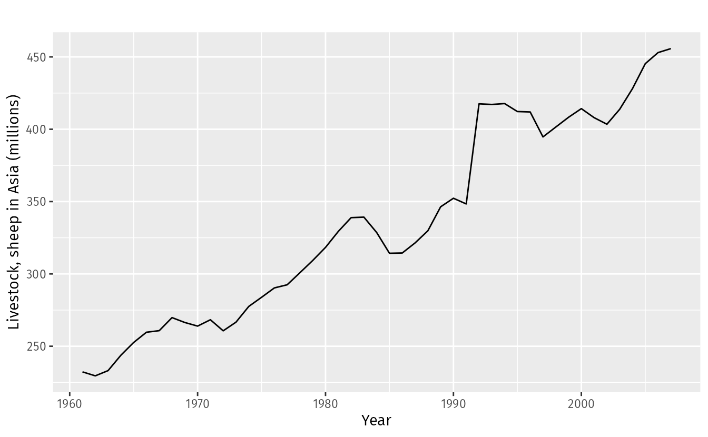

```{r setup, include=FALSE}
# chunk options
knitr::opts_chunk$set(
  message = FALSE,
  warning = FALSE,
  fig.align = "center",
  comment = "#>",
  fig.width=9,
  fig.height=5
)
options(scipen = 99)
```

```{r message=FALSE}
# load library

library(dplyr) # data wrangling
library(lubridate) # date manipulation
library(padr) # complete data frame
library(zoo) # Missing value imputation
library(forecast) # time series library
library(TTR) # for Simple moving average function
library(MLmetrics) # calculate error
library(tseries) # adf.test
library(fpp) # data for forecasting: principles and practice
library(TSstudio) # visualisasi timeseries
library(ggplot2)
library(tidyr)
```

# Time Series and Forecasting

```{r echo=FALSE}

```

## Introduction

- **Time Series** merupakan **data** yang berhubungan dengan waktu yang memiliki interval waktu yang sama. Contoh data time series yaitu: 

  - Data curah hujan 
  - Harga saham 
  - Permintaan barang setiap bulan 
  - Data pendapatan bulanan

- **Forecasting** merupakan suatu metode untuk **memprediksi/meramalkan** data di masa depan.

- **Time series forecasting** merupakan komponen penting dalam analisis data, dan menjadi semakin penting dalam beberapa tahun terakhir karena bisnis mengandalkan data untuk mengambil keputusan yang tepat. Kemampuan untuk memprediksi tren masa depan sangat penting bagi berbagai industri, termasuk keuangan, layanan kesehatan, dan e-commerce.

## Forecasting vs Regression

Regresi dan time series sama-sama merupakan model machine learning yang target variabelnya berupa variabel dengan nilai numerik. Perbedaan dari kedua model ini adalah variabel yang digunakan untuk melakukan prediksi (atau pada kasus machine learning biasanya disebut sebagai prediktor). 

Pada regresi, untuk memprediksi suatu nilai Y dipengaruhi oleh beberapa faktor yaitu x1,x2,..,xn. Sedangkan pada **time series**, untuk memprediksi suatu nilai Y dipengaruhi oleh nilai Y itu sendiri pada masa lampau ($Y_{t-1}$). 

*Regression*

$$y = \beta_0+\beta_1*x_1+\beta_2*x_2+...+\beta_n*x_n$$
*Time Series Forecasting*

$$y_t = \beta_0+\beta_1*y_{t-1}+\beta_2*y_{t-2}+...+\beta_n*y_{t-n}$$


# Karakteristik Data Time Series

Agar dapat dilakukan analisis dan pemodelan dari data time series, terdapat tiga syarat utama yang harus dipenuhi, antara lain:

  1. Data harus **terurut** berdasarkan periode waktunya (dari data terlampau sampai ke data terbaru).
  2. **Interval** waktunya harus tetap dan tidak boleh ada waktu yang terlewat untuk setiap interval.
  3. Tidak boleh ada data **missing**

**1️⃣ Data harus terurut berdasarkan periode waktunya**

Misalkan kita memiliki data time series dengan waktu dan value sebagai berikut.

```{r}
df <- data.frame(date = as.Date(c("2023-08-16","2023-08-19","2023-08-18")),
                 value = c(23,20,34))
df
```

```{r}
# Mengurutkan data berdasarkan kolom date
df <- ...
```

**2️⃣ Interval waktunya harus tetap/sama & Tidak boleh ada waktu atau periode yang terlewat/bolong**

Untuk memastikan data waktu kita sudah lengkap atau belum, kita dapat membandingkannya dengan membuat sebuah deret waktu lengkap menggunakan `seq.Date()`

```{r}
# Mendefinisikan deret waktu lengkap
tanggal_lengkap <- seq.Date(from = as.Date("2023-08-16"), # Waktu awal
                            to = as.Date("2023-08-19"), # Waktu akhir
                            by = "day") # Interval
tanggal_lengkap
```

🌐 [seq.Date() documentation](https://www.rdocumentation.org/packages/base/versions/3.6.2/topics/seq.Date)

Kemudian, kita dapat menggunakan fungsi `all()` untuk memeriksa kelengkapan periode waktu

```{r}
# memeriksa kelengkapan periode waktu

```

Fungsi untuk mengisi periode yang hilang:

- `pad()` dari package `padr`
  - Parameter `interval`: mengisi interval waktu (`"hour", "day", "month"`)
  - Secara default, `pad()` akan mengisi periode waktu (tanggal) berdasarkan kolom data yang bertipe date. 

```{r message=FALSE}
library(padr)

df <- ...
```


**3️⃣ Data tidak boleh ada yang missing**

Setelah kita menambahkan tanggal agar tidak terdapat periode yang terlewat dengan menggunakan fungsi `pad()`, ada baris tanggal yang belum terisi dengan value. Oleh karena itu, data tersebut masih belum memenuhi syarat terakhir.

Agar syarat terakhir dapat terpenuh kita akan mencoba untuk mengisi *missing value* tersebut dengan menggunakan beberapa fungsi dari library `zoo`, yaitu:

+ `na.aggregate()`: nilai aggregasi (mean, median)
+ `na.locf()`: nilai terakhir sebelum missing
+ `na.fill()`: mengisi `NA` dengan sebuah nilai (misal nilai nol)

Note: Metode untuk mengisi missing value disesuaikan dengan perspektif bisnis.

- fungsi `na.aggregate()`: nilai aggregasi (mean/median)
  ~ parameter `object =`: nama kolom yang mau diisi
  ~ parameter `FUN =`: metode imputasi/pengisian apa yang digunakan (mean/median)
  
```{r}
# Please type your code for code na.aggregate()
library(zoo)

```

- fungsi `na.locf()`: nilai terakhir sebelum missing
  ~ parameter `object =`: nama kolom yang mau diisi
  ~ parameter `fromLast =`: metode pengisiannya akan dari data sebelumnya atau sesudahnya. Secara default, value FALSE akan mengambil nilai dari baris/observasi sebelumnya.
  
```{r}
# Please type your code for code na.locf()

```

# Time Series Analysis

## Time Series Object

Untuk mengolah dan memodelkan data time series, maka kita perlu mengubah data tersebut ke dalam object time series menggunakan fungsi `ts()`.

`ts(data, start, frequency)`

  - `data` = data (kolom) yang akan kita prediksi (nilai numerik)
  - `start` = waktu awal mula data
  - `frequency` =  pola berulang yang ingin dianalisis

### Frequency

Frequency merupakan **banyaknya data dalam satu seasonality/musiman**, untuk mengetahui frequency kita perlu mengetahui: 

- Bagaimana data tersusun 
- Pola apa yang ingin diamati

Perhatikan data jumlah penumpang **bulanan** pesawat terbang pada sebuah maskapai di AS berikut:

```{r echo=FALSE}

```

Perhatikan bahwa terdapat pola yang berulang untuk setiap ... . Pola tersebut disebut dengan **seasonality**. Maka, berdasarkan visualisasi diatas, jumlah penumpang pesawat **bulanan** memiliki seasonality dengan frequency = ... .


```{r, echo = FALSE}
data.frame(
  Data = c("Yearly","Monthly","Weekly","Daily","Hourly","Minutes","Seconds"),
  Minute = c("-", "-", "-","-", "-", "-", "60"),
  Hour = c("-", "-", "-","-", "-", "60", "60*60"),
  Day = c("-", "-", "-","-", "24", "60*24", "60*60*24"),
  Week = c("-", "-", "-","7", "24*7", "60*24*7", "60*60*24*7"),
  Month = c("-", "-", "4","30", "24*30", "60*24*30", "60*60*24*30"),
  Year = c("1", "12", "52","365", "24*365", "60*24*365", "60*60*24*365")
)
```

**✅ Knowledge Check**

1.  data: jam  
    pola: harian  
    freq: ...

2.  data: harian  
    pola: mingguan  
    freq: ...

3.  data: harian  
    pola: weekday  
    freq: ...

4.  data: harian  
    pola: tahunan  
    freq: ...

5.  data: bulanan  
    pola: tahunan  
    freq: ...

6.  data: tahunan  
    pola: tahunan  
    freq: ...


## 🛵 Study Case: Motor Vehicle Retail Sales (DAUTONSA) 

Pada section ini, kita akan menggunakan data `DAUTONSA.csv` yaitu data penjualan kendaraan bermotor **bulanan** dari Januari 2011 hingga Juni 2019. Menggunakan data tersebut, kita akan melakukan analisis time series untuk mendapatkan insight mengenai penjualan serta melakukan forecasting untuk mempersiapkan produk di masa depan.

1. **Read Data**

```{r}
dautonsa <- read.csv("data_input/DAUTONSA.csv")
dautonsa
```

Deskripsi data:

- `date`: tanggal saat dilakukan pencatatan penjualan bulanan
- `sales`: Jumlah penjualan dalam sebulan (satuan ribuan).

Dari data `dautonsa` ini, kita akan menggunakan 2 kolom yang kita butuhkan yaitu kolom `date` untuk menunjukkan waktu dan kolom `sales` sebagai nilai yang kita amati untuk membuat object `ts`. 


### Cek Karakteristik Data Time Series

```{r}
# Ubah tipe data menjadi date
dautonsa <- 
```

```{r}
# Mendefinisikan deret waktu yang lengkap
complete_month <- seq.Date(from = ... ,
                           to = ... ,
                           by = ... )
complete_month
```

```{r}
# Cek periode yang terlewat

```

```{r}
# cek missing value

```

### Membuat Object TS dengan `ts()`

`ts(data, start, frequency)`

- `data` = data (kolom) yang akan diprediksi (nilai numerik)
- `start` = waktu awal mula data dalam bentuk vektor `c(year, month)`
- `frequency` =  pola berulang yang ingin dianalisis

Buatlah objek time series dari data penjualan kendaraan bermotor dengan pola tahunan!

```{r}
# simpan dalam object sales_ts
sales_ts <- ...
```

### Visualisasi Object TS

Memvisualisasikan data time series untuk melihat pola datanya

```{r fig.height= 4}
# autoplot

```

**📈 Insight :**

- Bagaimanakah trend penjualan kendaraan bermotor?
    > Jawab :
    
- Apakah terdapat pola berulang yang terjadi? 
    > Jawab :

## Decomposition

**Decomposition** adalah tahapan dalam time series analisis yang digunakan untuk menguraikan beberapa komponen dalam time series data. Komponen/unsur dalam time series:

- **Trend** $(T_t)$ : pola general data, biasa digunakan untuk melihat kenaikan atau penurunan data.
- **Seasonality** $(S_t)$ : pola musiman yang membentuk pola berulang pada periode waktu yang tetap.
- **Error/Random** $(E_t)$ : pola yang tidak dapat ditangkap dalam trend dan seasonality.

Untuk dapat menguraikan object time series kita menjadi 3 komponen tersebut, kita dapat menggunakan fungsi `decompose()`.

```{r}
# Decompose object time series

```

Memvisualisasikan hasil decompose menggunakan `autoplot()`.

```{r}
# Visualisasi hasil decompose

```

> ⚠️ Jika pada hasil decompose, trend masih membentuk sebuah pola maka dapat dicurigai masih ada seasonality yang belum ditangkap. Seharusnya trend cenderung naik atau cenderung turun secara smooth. Penyebabnya:

- frequency yang kita tetapkan belum tepat, atau
- terdapat multiseasonality pada data (lebih dari satu jenis pola musiman)


### ✅ Knowledge Check

1. Misalkan kita memiliki object retail dataframe penjualan harian dari tahun 2010 sampai 2015. Kita ingin menganalisis pergerakan nilai pada kolom sales dari dataframe retail. Cara membuat object ts dengan pola seasonality tahunan adalah ...

- [ ] ts(retail, frequency = 1)
- [ ] ts(retail$sales, frequency = 1)
- [ ] ts(retail$sales, frequency = 12)
- [ ] ts(retail$sales, frequency = 365)

2. Decompose adalah bagian dari eksplorasi data pada analisis time series. Berikut adalah manfaat dari melakukan decompose, kecuali ...

- [ ] Mengetahui pola naik atau turun-nya data dari trend.
- [ ] Dapat digunakan untuk analisis pola musiman dari pola seasonality.
- [ ] Mengetahui nilai di masa depan.
- [ ] Mengetahui apakah frequency yang diatur dalam object time series sudah sesuai atau belum.

```{r echo=FALSE}
knitr::include_graphics("assets/decompose.png")
```

Gambar tersebut menunjukkan hasil decomposition untuk data time series terkait tingkat kejahatan harian di Chicago dari tahun 2014 sampai dengan 2019.

3. Berdasarkan grafik tersebut, bagaimana pola trend yang terdapat pada data?
- [ ] tidak terdapat pola tertentu
- [ ] pola meningkat
- [ ] pola menurun
- [ ] pola naik turun secara berulang

### Trend Analysis

Komponen trend time series menunjukkan pergerakan jangka panjang, ini digunakan untuk melihat pergerakan data secara jangka panjang apakah meningkat, menurun, atau tetap. 

Untuk mendapatkan pola trend, `decompose()` menggunakan **Moving Average (MA)**, metode yang menggunakan rata-rata pada suatu periode waktu tertentu secara beruntun untuk merepresentasikan pola general. 

📝 Note: **Moving Average (MA)** akan dibahas pada materi **ARIMA**

```{r}
trend <- dautonsa %>% 
  mutate(date = ymd(date),
         trend = (sales_ts %>% decompose())$trend) # ekstraksi trend

ggplot(dautonsa, aes(date, sales)) +
  geom_line() +
  geom_line(color='red',data = trend, aes(x=date, y=trend))
```

💡 **Insight**: 


### Seasonality Analysis

Analisis seasonality bertujuan untuk mengetahui pola berulang yang terjadi pada data, menunjukkan pada waktu kapan saja datanya tinggi/rendah.

Untuk mendapatkan pola seasonality, `decompose()` menggunakan **Rata-Rata** seluruh musim untuk masing-masing interval waktu (Seasonality untuk januari adalah rata-rata penjualan januari 2011, januari 2012, dst.) 

```{r, fig.width=8}
seasonality <- dautonsa %>% 
  mutate(date = ymd(date),
         month = month(date, label = T)) %>% # ekstraksi bulan
  group_by(month) %>% 
  summarise(mean_sales = mean(sales)) # rata-rata sales untuk setiap bulan

ggplot(seasonality, aes(month, mean_sales, group = 1)) +
  geom_line()
```

💡 **Insight**: 


## Additive vs Multiplicative Time Series

Secara default, `decompose()` merepresentasikan data time series secara **additive**, dimana nilai Target (Y) adalah penjumlahan Trend (T), Seasonality (S), dan Error (E). Sehingga perubahan data time series akibat nilai seasonality akan konstan seiring berjalannya waktu.

$$
Y_t = T_t + S_t + E_t
$$
Mari kita lihat kembali data `sales_ts`, data ini termasuk time series jenis additive

```{r}
# additive time series
sales_ts %>% autoplot()
```

Namun, terdapat juga jenis time series yang akan semakin besar/kecil efek seasonality nya seiring dengan berjalannya waktu. Jenis time series tersebut disebut dengan **multiplicative** time series, dimana nilai Target (Y) adalah perkalian Trend (T), Seasonality (S), dan Error (E).

$$
Y_t = T_t * S_t * E_t
$$

Berikut merupakan contoh data dengan jenis **multiplicative**:

```{r}
# multiplicative time series
AirPassengers %>% autoplot()
```

📝 **Note**: Data AirPassengers merupakan data jumlah penumpang bulanan pesawat terbang pada sebuah maskapai di AS dari Januari 1949 hingga Desember 1960

Untuk melakukan analisa dekomposisi dari data multiplicative, terdapat tambahan parameter yang perlu kita berikan pada fungsi decompose yaitu `type = "multiplicative"`.

```{r}
# decompose multiplicative time series
AirPassengers %>% decompose(...) %>% autoplot()
```

# Train-Test Splitting

Tahapan cross validation akan selalu dilakukan sebelum pembuatan model. Data akan dibagi menjadi data train dan data test. Khusus untuk data deret waktu/time series pembagian data tidak boleh diambil secara acak melainkan dibagi dengan cara dipisah secara berurutan.

- **Train data** menggunakan data awal
- **Test data** menggunakan data akhir

Data test akan diibaratkan sebagai data masa depan yang ingin kita lakukan forecasting, sehingga dapat dibandingkan untuk melakukan evaluasi.

📝 **Note** : data train sebaiknya lebih banyak dibandingkan data test. 


Mari kita coba ambil data `sales_ts` 18 bulan terakhir (Januari 2018-Juni 2019) untuk dijadikan sebagai data test, sedangkan data diawalnya akan dijadikan sebagai data train.

```{r}
# Subsetting Data Test
sales_test <- ...
```

```{r}
# Subsetting Data Train
sales_train <- ...
```

Untuk memvisualisasikan data train dan data test, kita dapat menambahkan visualisasi `autoplot` dengan `autolayer`:

```{r}
# autoplot + autolayer

```

# Time Series Modelling and Forecasting

Setelah menganalisis data time series secara deskriptif (descriptive analysis), kita juga dapat memprediksi nilai di masa depan yang akan datang, atau disebut juga *forecasting*.

Kita akan coba melakukan forecasting pada data `dautonsa` yang sebelumnya sudah kita proses untuk memprediksi besar penjualan kendaraan bermotor yang akan terjadi pada 18 bulan kedepan (sesuai `sales_test`). 

## Exponential Smoothing

Metode Exponential Smoothing melakukan forecast dengan cara meratakan fluktuasi dalam data time series. Exponential Smoothing terbagi menjadi 3:

1. **Simple Exponential Smoothing**
    - Memanfaatkan nilai masa lalu dan masa depan
    - cocok untuk data yang **❌trend** & **❌seasonality**
    
2. **Double Exponential Smoothing (Holt Exponential)**
    - Memanfaatkan nilai dan trend dari masa lalu dan masa depan
    - cocok untuk data yang **✅trend** & **❌seasonality**
    
3. **Triple Exponential Smoothing (Holt-Winters Exponential)**
    - Memanfaatkan nilai, trend, dan seasonality dari masa lalu dan masa depan
    - cocok untuk data yang **✅trend** & **✅seasonality**

Smoothing dilakukan dengan memberikan suatu pembobotan pada data yang lampau dan juga data yang baru. Masing-masing nilai data, trend, dan seasonality akan memiliki bobotnya masing-masing. Bobot untuk smoothing dilambangkan dengan:

  - Error: **alpha**
  - Trend: **beta**
  - Seasonal: **gamma**

Nilai alpha, beta, dan gamma memiliki range nilai dari **0 - 1**:

- Semakin tinggi: data baru akan memiliki pengaruh yang besar, model akan bersifat lebih sensitif terhadap perubahan data/outlier
- Semakin rendah: data baru akan memiliki pengaruh yang kecil, model akan bersifat lebih smooth

`HoltWinters()` dari library `stats`, parameter yang digunakan, yaitu:

  - `x` : objek time series yang digunakan.
  - `alpha`: smoothing error
  - `beta`: smoothing trend, jika tidak digunakan diisi `FALSE`
  - `gamma`: smoothing seasonal, jika tidak digunakan diisi `FALSE`

📝 Note: 

- Apabila nilai parameter `alpha`, `beta`, & `gamma` tidak diisi, maka fungsi `HolWinters()` akan mencari nilai paling optimum. 
- Jika tidak ingin memperhitungkan trend dan/atau seasonal, parameter `beta` dan `gamma` harus diubah menjadi **FALSE**.

Contoh Penggunaan:

- **Simple Exponential Smoothing**: `HoltWinters(data, beta = F, gamma = F)`
- **Double Exponential Smoothing**: `HoltWinters(data, gamma = F)`
- **Triple Exponential Smoothing**: `HoltWinters(data)`

### Simple Exponential Smoothing

Di bawah ini adalah contoh hasil forecasting menggunakan SES pada data `rain_ts`, yaitu data curah hujan tahunan sejak 1813-1912. 

```{r}
rain_ts <- ts(data = scan("data_input/precip1.dat", skip = 1),
              start = 1813,
              frequency = 1)

rain_ts %>% autoplot()
```

💡 Insight: data `rain_ts` [memiliki/tidak memiliki] trend dan [memiliki/tidak memiliki] seasonal

```{r}
rain_ses <- HoltWinters(rain_ts, beta = F, gamma = F)
rain_ts %>%
  autoplot() +
  autolayer(rain_ses$fitted[,1], series = "Model") +
  autolayer(forecast(object = rain_ses, h = 10)$mean, series = "Forecast")
```

💡**Note**:

- Garis biru merupakan hasil smoothing dari model
- Garis merah merupakan nilai forecast pada masa depan

#### Model Fitting

Sekarang, kita akan coba aplikasikan pada data kita, yaitu `sales_ts`. Untuk membuat model Simple Exponential Smoothing menggunakan `HoltWinters()` kita bisa atur `beta = F` dan `gamma = F` karena dalam model SES tidak memperhitungkan efek trend dan seasonal. 

> **SES**: `HoltWinters(object_ts, beta = F, gamma = F)`

```{r}
# Simple Exponential Smoothing
model_simple <- ...
```

Kita dapat mendapatkan hasil smoothing dari model dengan menggunakan `model$fitted`:

```{r}
# Hasil smoothing

```

Visualisasi data historis dengan hasil fitting model:

```{r}
# gunakan autolayer() untuk menambahkan autoplot()
sales_train %>% 
  autoplot() +
  autolayer(sales_test, series = "Data Test") +
  ...
```

#### Forecasting

Untuk melakukan prediksi masa depan pada `sales_ses` menggunakan fungsi `forecast()` dari library `forecast`.

Parameter `forecast(object, h)`:

- `object` = model time series
- `h` = berapa banyak data ke depan yang akan di forecast

```{r}
# Forecast SES
forecast_simple <- ...
```

Keterangan:

* `Point Forecast`: nilai forecast untuk periode yang ingin kita forecast (`$mean`)
* `Lo 80` & `Hi 80` : rentang tebakan dari hasil forecast untuk confidence level 80%
* `Lo 95` & `Hi 95` : rentang tebakan dari hasil forecast untuk confidence level 95%

```{r}
# Tambahkan nilai forecast pada visualisasi sebelumnya
sales_train %>% 
  autoplot() +
  autolayer(sales_test, series = "Data Test") + # Visualisasi data test
  autolayer(sales_ses$fitted[,1], series = "Model") + # Visualisasi hasil smoothing model
  ...
```
  
### Double Exponential Smoothing (Holt Exponential Smoothing)

**Double Exponential Smoothing / Holt Exponential Smoothing** digunakan untuk data time series yang memiliki trend namun tidak memiliki seasonality.

Di bawah ini adalah contoh hasil forecasting menggunakan Holt Exponential Smoothing pada data `co2`, yaitu data emisi karbon tahunan Indonesia sejak 1970-2012 dengan satuan ton/kapita. 

Apakah data `co2_ts` memiliki trend dan/atau seasonality? 

```{r}
# Plot co2_ts
co2 <- read.csv("data_input/carbon.csv")
co2_ts <- ts(data = co2$co2_emission,
             start = 1970, # awal periode dari data
             frequency = 1) # datanya tahunan, ingin lihat pola tahunan
co2_ts %>% autoplot()
```

💡 Insight: data `co2_ts` [memiliki/tidak memiliki] trend [meningkat/menurun], dan [memiliki/tidak memilliki] seasonality

```{r}
co2_holt <- HoltWinters(co2_ts, gamma = F)
co2_ts %>%
  autoplot() +
  autolayer(co2_holt$fitted[,1], series = "Model") +
  autolayer(forecast(object = co2_holt, h = 10)$mean, series = "Forecast")
```

💡**Note**:

- Garis biru merupakan hasil smoothing dari model
- Garis merah merupakan nilai forecast pada masa depan

#### Model Fitting

Sekarang, kita akan coba aplikasikan pada data kita, yaitu `sales_ts`. Untuk membuat model Double Exponential Smoothing menggunakan `HoltWinters()` kita bisa atur `gamma = F` karena dalam model SES tidak memperhitungkan seasonality. 

> **Holt Exponential Smoothing**: HoltWinters(data, gamma = F)

Melakukan forecasting data `sales_train` dengan metode Double Exponential Smoothing (Holt Exponential) menggunakan fungsi `HoltWinters()`

```{r}
# Modeling dengan nilai alpha dan beta yang dicari secara otomatis
model_double <- ...
```

Mari kita bandingkan secara visualisasi. Gunakan `autolayer()`

```{r}
sales_train %>% 
  autoplot() +
  autolayer(sales_test, series = "Data Test") +
  ...
```

#### Forecasting

Untuk melakukan prediksi masa depan pada `model_double` menggunakan fungsi `forecast()` dari library `forecast`.

Parameter `forecast(object, h)`:

- `object` = model time series
- `h` = berapa banyak data ke depan yang akan di forecast

```{r}
# Please type your code
forecast_double <- ...
```


```{r}
# Tambahkan nilai forecast pada visualisasi sebelumnya
sales_train %>% 
  autoplot() +
  autolayer(sales_test, series = "Data Test") + # Visualisasi data test
  autolayer(model_double$fitted[,1], series = "Model") + # Visualisasi hasil smoothing model
  ...
```


### Triple Exponential Smoothing

**Triple Exponential Smoothing (Holt-Winters Exponential)** merupakan metode forecasting yang tepat digunakan untuk data yang memiliki efek trend dan seasonal. 

#### Model Fitting

Cara pembuatan model Holt-Winters sama seperti 2 model sebelumnya hanya saja nilai `alpha`, `beta`, dan `gamma` tidak diisi nilai `FALSE`, kemudian dapat ditambahkan dengan parameter `seasonal` untuk menentukan jenis dari time seriesnya.

> **Holt-Winters**: `HoltWinters(object_ts, seasonal=["additive"/"multiplicative"])`

Ingat kembali bahwa data `sales_train` merupakan data time series yang berjenis *additive*

```{r}
# seasonal = "additive"
model_triple <- ...
```

Mari kita bandingkan secara visualisasi. Gunakan `autolayer()`

```{r}
sales_train %>% 
  autoplot() +
  autolayer(sales_test, series = "Data Test") +
  ...
```

#### Forecasting

Untuk melakukan prediksi masa depan pada `model_triple` menggunakan fungsi `forecast()` dari library `forecast`.

Parameter `forecast(object, h)`:

- `object` = model time series
- `h` = berapa banyak data ke depan yang akan di forecast

```{r}
forecast_triple <- ...
```


```{r}
# Tambahkan nilai forecast pada visualisasi sebelumnya
sales_train %>% 
  autoplot() +
  autolayer(sales_test, series = "Data Test") + # Visualisasi data test
  autolayer(model_triple$fitted[,1], series = "Model") + # Visualisasi hasil smoothing model
  ...
```

### Model Evaluation

Untuk membandingkan performa model mana yang lebih baik, kita dapat menghitung besar error dari hasil forecast dibandingkan dengan nilai sebenarnya. Mirip seperti regresi, kita dapat menggunakan metrics error seperti **MAE** (Mean Absolute Error), **RMSE** (Root Mean Squared Error), dan **MAPE** (Mean Absolute Percentage Error). 

Package `forecast` menyediakan fungsi `accuracy()` untuk menampilkan metric-metric error tersebut sekaligus:

```{r}
library(forecast)
```

> `accuracy(object, x)`

  - `object` = Object `forecast` yang menyimpan hasil forecast model
  - `x` = Data yang ingin dievaluasi

```{r}
# Evaluasi model SES

```

```{r}
# Evaluasi model Holt

```

```{r}
# Evaluasi model Holt-Winters

```

Berdasarkan model dengan nilai default dari Holt-Winters, yang memiliki performa terbaik adalah ...

### Hyperparameter Tuning

Seperti yang kita lihat dari visualisasi dan evaluasi model sebelumnya, model Holt-Winters dengan nilai parameter default yang telah kita buat menghasilkan hasil forecast yang kurang baik. Maka, hal yang dapat kita lakukan untuk meningkatkan performa model adalah dengan melakukan **Hyperparameter Tuning**.

```{r}
model_triple
```

Jika parameter `alpha`, `beta`, dan `gamma` tidak didefinisikan, maka `HoltWinters` akan mencoba untuk secara otomatis menentukan nilai terbaik untuk ketiga parameter tersebut. Namun, nilai tersebut belum tentu merupakan yang paling sesuai untuk data kita. Maka kita dapat mencoba untuk menentukan nilai parameter secara manual:

```{r}
# Ubah nilai gamma = 0.6
sales_tuning <- ...
```

```{r}
# Forecasting dan Visualisasi
forecast_tuning <- forecast(sales_tuning, h = 18)

sales_train %>% 
  autoplot() +
  autolayer(sales_test, series = "Data Test") + # Visualisasi data test
  autolayer(sales_tuning$fitted[,1], series = "Model") + # Visualisasi hasil smoothing model
  autolayer(forecast_tuning$mean, series = "Forecast")
```

Berdasarkan visualisasi, model Holt-Winters dengan gamma = 0.6 lebih [baik/buruk] dibanding model Holt-Winters default

```{r}
# Perbandingan evaluasi model Holt-Winters default vs tuning
accuracy(forecast_triple$mean, sales_test)
accuracy(forecast_tuning$mean, sales_test)
```

Berdasarkan metrics error, model Holt-Winters dengan gamma = 0.6 lebih [baik/buruk] dibanding model Holt-Winters default

## ✅ Knowledge Check

1. Model forecasting manakah yang cocok digunakan untuk data yang tidak memiliki komponen trend dan seasonal?

- [ ] Simple Exponential Smoothing
- [ ] Holt Exponential Smoothing (Double Exponential Smoothing)
- [ ] Holt-Winters Exponential Smoothing (Triple Exponential Smoothing)

2. Grafik di bawah menunjukkan data tahunan jumlah domba ternak di benua Asia pada tahun 1961–2007. Berdasarkan pola data ini, model forecasting manakah yang cocok?

```{r echo=FALSE, eval=FALSE}

```

- [ ] Simple Exponential Smoothing
- [ ] Holt Exponential Smoothing (Double Exponential Smoothing)
- [ ] Holt-Winters Exponential Smoothing (Triple Exponential Smoothing)

3. Perhatikan grafik decompose dibawah ini. Berdasarkan grafik tersebut, tipe time series dan model forecasting apakah yang sesuai?

```{r echo=FALSE}
knitr::include_graphics("assets/decompose.png")
```

- [ ] Simple Exponential Smoothing
- [ ] Holt Exponential Smoothing (Double Exponential Smoothing)
- [ ] Holt-Winters Exponential Smoothing (Triple Exponential Smoothing)


## ARIMA (Auto Regressive Integrated Moving Average)

ARIMA merupakan model yang popular untuk melakukan forecast time series. ARIMA bekerja dengan memanfaatkan korelasi historis dari data time series yang ingin dianalisis. ARIMA terdiri atas kombinasi 3 metode statistika, yaitu: 

1. **Auto Regressive** (AR)
2. **Integrated** (I)
3. **Moving Average** (MA)

### Konsep ARIMA

#### Auto Regressive (AR)

Bagian Auto Regressive (AR) dari ARIMA mengumpamakan analisis untuk sebuah data Time Series serupa dengan Regresi, namun memiliki perbedaan prediktor yang digunakan. Berbeda dengan regresi yang menggunakan nilai lain yang dependen sebagai prediktornya, Auto Regressive menggunakan nilai targetnya sendiri, namun dimasa lampau. Konsep tersebut disebut dengan nama **lag**.

```{r echo=FALSE}

```

Berikut adalah contoh tampilan data `co2` jika diberikan lag:

```{r}
co2 %>% mutate(
  lag_1 = lag(x = co2$co2_emission, n = 1),
  lag_2 = lag(x = co2$co2_emission, n = 2),
  lag_3 = lag(x = co2$co2_emission, n = 3)
)
```

📝 **Notes**:

- `sales` merupakan variabel target 
- `lag_1`, `lag_2`, `lag_3` merupakan calon prediktor

> Pada ARIMA, kita dapat mengatur lag ke-berapa yang akan digunakan sebagai prediktor pada parameter `p`. Jika `p = 2`, maka `lag_2` yang akan digunakan sebagai prediktor.

#### MA (Moving Average)

MA (Moving Average) adalah metode yang menggunakan rata-rata pada suatu periode tertentu untuk melakukan forecasting.

> Metode ini sering digunakan untuk data yang tidak mengandung trend dan seasonal (datanya bergerak disekitar rata-rata).

Berikut adalah contoh fungsi yang dapat digunakan untuk melakukan forecasting dengan Moving Average, yaitu menggunakan `SMA` (Simple Moving Average) dari library `TTR`. Parameter yang digunakan, yaitu: 

```{r}
library(TTR)
```

> `SMA(x, n)` 

- `x`: object time series
- `n`: periode data untuk dirata-ratakan

Mari kita buat model SMA dengan observasi masa lalu sebanyak 3

```{r}
co2_sma3 <- ...
co2_sma3
```

Nilai ketiga merupakan nilai rata-rata dari nilai pertama, kedua, dan ketiga (periode 3 tahun), sesuai dengan jumlah periode yang kita tetapkan, berlaku juga untuk seterusnya.

📝 **Note**: Nilai `NA` pada data pertama dan kedua disebabkan karena nilainya digunakan untuk dirata-ratakan pada periode waktu selanjutnya


Dengan memanfaatkan nilai moving average, kita dapat melakukan forecasting di masa depan. Berikut visualisasi data historis dengan hasil forecast:

```{r warning=F}
co2_ts %>% 
  autoplot() +
  autolayer(co2_sma3, series="SMA 3") +
  autolayer(forecast(co2_sma3, h=12)$mean, series="Forecast")
```

Ubah periode yang dirata-ratakan menjadi 10 bulan dan perhatikan perbedaannya:

```{r}
# sma = 10
co2_sma10 <- ...
co2_sma10
```

Visualisasi data historis dengan hasil forecast:

```{r warning=F}
co2_ts %>% 
  autoplot() +
  autolayer(co2_sma10, series="SMA 10")+
  autolayer(forecast(co2_sma10, h=12)$mean, series="Forecast")
```


📝 Insight:

- 

> Pada ARIMA, kita dapat mengatur seberapa besar periode yang digunakan moving average pada parameter `q`. Jika `q = 2`, maka ARIMA akan merata-ratakan data setiap periode 2 data.

#### Integrated (I)

Bagian Integrated (I) adalah proses untuk memenuhi syarat agar data dapat diolah menggunakan ARIMA, yaitu data harus bersifat **stasioner**. 

Stasioner berarti data yang digunakan datar dan hanya berfluktuasi di sekitar mean nya.

```{r echo=FALSE}

```

Mari kita lihat kembali data `co2_ts`. Secara visual, apakah data co2 stasioner? ...

```{r}
co2_ts %>% autoplot()
```

Untuk mengetahui secara pasti apakah data kita sudah stasioner atau belum, kita dapat melakukan uji asumsi dengan `adf.test()`

```{r}
# adf.test

```

Menguji stasioneritas data:

- `H0`: data tidak stasioner
- `H1`: data stasioner
- alpha = 0.05

Maka, jika:
- p-value > 0.05: data belum stasioner
- p-value < 0.05: data sudah stasioner. 

Dari hasil perhitungan di atas, apakah data kita sudah dianggap stasioner? ...

##### Differencing

Untuk membuat data menjadi stasioner, solusinya adalah dengan melakukan **differencing**. Differencing adalah proses menghitung selisih antar data.

```{r}
y <- c(10, 12, 14, 12, 15, 12, 10, 9)
y
```

Di R, function untuk melakukan differencing yaitu `diff()`. 

```{r}
# differencing dengan fungsi diff()

```

Mari kita coba implementasikan fungsi `diff()` pada data `co2_ts` kita, kemudian kita visualisasikan

```{r}
# diff & autoplot

```

Kemudian, mari kita uji kembali apakah `co2_ts` yang telah dilakukan differencing telah lulus uji `adf.test`

```{r}
# diff & adf.test

```

Setelah 1x differencing, `co2_ts` [sudah/belum] stasioner

📝 Note: Jumlah differencing bisa lebih dari 1 kali, jika data belum stasioner setelah 1x differencing

```{r}
# diff & adf.test

```

Setelah 2x differencing, `co2_ts` [sudah/belum] stasioner

> Pada ARIMA, kita dapat berapa kali differencing dilakukan untuk mencapai stasioner menggunakan parameter `d`. Jika `d = 2`, maka ARIMA akan melakukan differencing sebanyak 2 kali.


### Non-Seasonal ARIMA

Untuk membuat model ARIMA kita dapat menggunakan dua fungsi, yaitu `Arima()` dan `auto.arima()`.

- `Arima(y, order)` digunakan untuk membuat model secara manual, parameter:
  + `y` = object time series
  + `order` = nilai `(p,d,q)`
  
- `auto.arima(y, d)` digunakan untuk membuat model dengan parameter `(p, q)` yang ditentukan secara otomatis, parameter:
  + `y` = object time series
  + `d` = Jumlah differencing untuk mencapai stationary

#### Menggunakan `auto.arima()` 

Kita akan mencoba untuk membuat model `auto.arima()` untuk melakukan forecasting pada data `co2_ts` yang memiliki **trend** ✅ , namun tidak memiliki **seasonality** ❌

##### Model Fitting

> `auto.arima(y, d)` 
  + `y` = object time series
  + `d` = Jumlah differencing untuk mencapai stationary

```{r}
co2_auto <- ...
```

Berdasarkan perhitungan `auto.arima()`, diperoleh parameter yang ditentukan secara otomatis yaitu `ARIMA(0,2,1)`, maka parameternya adalah:

- `p` (lag Auto Regressive)    = 0 (tidak menggunakan AR)
- `d` (Differencing)           = 2
- `q` (periode Moving Average) = 1

##### Forecasting

```{r}
forecast_auto <- ...
```

📝 **Note**: Data hasil differencing akan dikembalikan menjadi data time series aslinya ketika melakukan  forecasting 

Kemudian, kita bisa memvisualisasikan hasil fitted model dan juga forecast hasil prediksi model:

```{r}
co2_ts %>% 
  autoplot() +
  autolayer(forecast_auto$fitted, series = "Model") + 
  autolayer(forecast_auto$mean, series = "Forecast")
```

#### Menggunakan `Arima()`

Ketika menggunakan `auto.arima()`, model akan secara otomatis menentukan parameter `p` (Auto Regression), `d` (Integrated/Differencing), dan `q` (Moving Average) yang paling cocok untuk data yang kita gunakan.

Jika kita ingin menentukan secara manual nilai parameter-parameter tersebut untuk mencari model terbaik, salah satu metode yang dapat kita manfaatkan adalah menggunakan Plot **ACF** (Autocorrelation Function) dan **PACF** (Partial Autocorrelation Function).

##### ACF & PACF

ACF (Autocorrelation Function) dan PACF (Partial Autocorrelation Function) merupakan visualisasi yang menunjukkan korelasi data dengan data lampau (lag). Seperti regresi, semakin besar korelasi nilai lag dengan targetnya maka akan semakin baik nilai lag tersebut sebagai prediktor.

```{r echo=FALSE}

```

Pada gambar diatas, Lag 1 dan Lag 3 memiliki nilai ACF terbaik, serta memiliki nilai PACF terbaik berdasarkan nilai dalam visualisasinya.

Perbedaan ACF dan PACF adalah:

  - **ACF** menggunakan seluruh nilai lag hingga order yang ditentukan (Jika menggunakan lag 3, maka korelasi nilai lag 1, 2, dan 3 akan dihitung)
  
  - **PACF** hanya menggunakan nilai lag sesuai order yang ditentukan (Jika menggunakan lag 3, maka hanya nilai korelasi lag 3 yang dihitung)


Kemudian, untuk menampilkan plot PACF dan ACF, kita dapat menggunakan fungsi `tsdisplay()` dari library `forecast` dan memberikan object time series sebagai input. 

```{r}
# Visualisasi ACF dan PACF

```

Berdasarkan plot ACF dan PACF tersebut, kita dapat menentukan parameter yang terbaik untuk:

- `p` (Auto Regression) : Order lag yang signifikan pada plot **PACF** 
- `q` (Moving Average)  : Order lag yang signifikan pada plot **ACF** 

Order lag yang signifikan adalah yang korelasi lag-nya yang **melewati garis putus-putus biru**. Kita akan menggunakan lag terakhir sebelum ACF/PACF mulai tidak signifikan (biasanya kurang dari 5).

- Q: Dari plot PACF, lag berapa saja yang dapat kita gunakan untuk `p`?
- A: ...

- Q: Dari plot ACF, lag berapa saja yang dapat kita gunakan untuk `q`?
- A: ...

📝 **Note** : Untuk percobaan lebih lanjut, silahkan gunakan nilai lag yang signifikan lainnya untuk melakukan hyperparameter tuning

##### Model Fitting

Buat model `Arima()` untuk data `co2_ts` menggunakan kombinasi nilai parameter yang sudah kita gunakan diatas:

> `Arima(y, order)` digunakan untuk membuat model secara manual, parameter:
  + `y` = object time series
  + `order` = nilai `c(p,d,q)`

```{r}
co2_arima <- ...
```

##### Forecasting

```{r}
forecast_arima <- ...
```

Kemudian, kita bisa memvisualisasikan hasil fitted model dan juga forecast hasil prediksi model:

```{r}
co2_ts %>% 
  autoplot() +
  autolayer(forecast_arima$fitted, series = "Model") +
  autolayer(forecast_arima$mean, series = "Forecast")
```


### SARIMA (Seasonal ARIMA)

Seasonal ARIMA adalah metode arima yang dapat digunakan untuk object time series yang memiliki pola seasonal. Tahapan dalam melakukan pemodelan menggunakan SARIMA mirip dengan tahap pemodelan ARIMA non-seasonal, namun memiliki tambahan parameter yaitu `P`, `D`, dan `Q` untuk seasonality :

- order untuk Non-Seasonal ARIMA: `order = c(p, d, q)`
- order untuk Seasonal ARIMA: `order = c(p, d, q)` dan `seasonal = c(P, D, Q)`

Jika kita menggunakan model SARIMA, diperlukan langkah tambahan ketika melakukan differencing untuk data yang memiliki seasonality, yaitu **differencing sesuai pola seasonality/frequency** data time series untuk membuat seasonality-nya menjadi stationer.


#### Differencing Seasonality

Lakukan pengujian stasioner menggunakan visualisasi `autoplot()` dan `adf.test()` pada data `sales_train` dengan hipotesis:

- H0: data tidak stasioner
- H1: data stasioner

Kondisi:

- p-value > alpha: data belum stasioner
- p-value < alpha: data sudah stasioner

```{r}
# Autoplot

```

```{r}
# adf.test

```

💡 Berdasarkan visualisasi dan adf.test, data `sales_train` [sudah/belum] stationer


📝 **Notes**: Untuk differencing seasonal, kita akan gunakan parameter `lag` yang nilainya mengikuti frekuensi data yang kita miliki

```{r}
# Autoplot

```

```{r}
# adf.test

```

💡 Setelah dilakukan differencing seasonality, data `sales_train` [sudah/belum] stationer


📝 **Notes**: Jika setelah differencing seasonality data masih belum stasioner karena masih ada **trend**, lakukan differencing biasa untuk menghilangkan trend-nya

```{r}
# Autoplot

```

```{r}
# adf.test

```

💡 Setelah dilakukan 1x differencing trend dan 1x differencing seasonality, data `sales_train` [sudah/belum] stationer

Nilai parameter Integrated untuk ARIMA:

- d (non-seasonal) = ...
- D (seasonal) = ...


#### Menggunakan `auto.arima()`

Kita akan membuat model `auto.arima()` untuk melakukan forecasting pada data `sales_train` dengan Seasonal ARIMA:

##### Model Fitting

> `auto.arima(y, d)` 
  + `y` = object time series
  + `d` = Jumlah differencing untuk mencapai stationary Trend
  + `D` = Jumlah differencing untuk mencapai stationary Seasonality
  
```{r}
sales_auto <- ...
```

Berdasarkan perhitungan `auto.arima()`, diperoleh parameter yang ditentukan secara otomatis yaitu `ARIMA(0,1,1)(0,1,0)[12]`, maka parameternya adalah:

- `p` = 0 (tidak menggunakan AR)
- `d` = 1
- `q` = 1

- `P` = 0 (tidak menggunakan AR Seasonality)
- `D` = 1
- `Q` = 0 (tidak menggunakan MA Seasonality)

- `[12]` = Jumlah Frekuensi Seasonality

##### Forecasting

Setelah membuat model, kita akan melakukan forecasting sesuai dengan jumlah data pada `sales_test` (18 bulan) untuk dibandingkan:

```{r}
forecast_auto <- ...
```

Kemudian, kita bisa memvisualisasikan hasil fitted model dan juga forecast hasil prediksi model:

```{r}
sales_train %>% 
  autoplot() +
  autolayer(sales_test, series = "Data Test") +
  autolayer(forecast_auto$fitted, series = "Model") + 
  autolayer(forecast_auto$mean, series = "Forecast")
```

#### Menggunakan `Arima()`

Sama seperti non-seasonal ARIMA, jika kita ingin menentukan secara manual nilai parameter-parameter tersebut untuk mencari model terbaik, kita dapat menggunakan Plot **ACF** dan **PACF**.

##### ACF & PACF

Tentukan `p` dan `q` (trend) serta `P` dan `Q` (seasonality) dari plot PACF & ACF menggunakan `tsdisplay()`.

- `p` dan `q`: lag terakhir sebelum ACF/PACF mulai tidak signifikan (biasanya kurang dari 5)
- `P` dan `Q`: lag yang keluar dari garis biru sesuai dengan **kelipatan frekuensi** (kelipatan 12)

```{r}
# untuk menampilkan banyak lag yang muncul di plot acf dan pacf bisa tambahkan `lag.max`
sales_train %>% 
  diff(lag = 12) %>% # diff untuk seasonal
  diff() %>% 
  tsdisplay(lag.max = 36)
```

Untuk menentukan p (PACF) dan q (ACF), kita melihat lag-lag diawal:

- p: 
- d: 
- q: 

Untuk menentukan P (PACF) dan Q (ACF), kita melihat lag-lag dengan **kelipatan frequency** (kelipatan 12):

- P : 
- D : 
- Q : 

##### Model Fitting

Buat model `Arima()` untuk data `sales_train` menggunakan kombinasi nilai parameter yang sudah kita gunakan diatas:

> `Arima(y, order)` digunakan untuk membuat model secara manual, parameter:
  + `y` = object time series
  + `order` = nilai `c(p,d,q)`
  + `seasonal` = nilai `c(P, D, Q)`

```{r}
sales_arima <- ...
```

##### Forecasting

Setelah membuat model, kita akan melakukan forecasting sesuai dengan jumlah data pada `sales_test` (18 bulan) untuk dibandingkan:

```{r}
forecast_arima <- ...
```

Kemudian, kita bisa memvisualisasikan hasil fitted model dan juga forecast hasil prediksi model:

```{r}
sales_train %>% 
  autoplot() +
  autolayer(sales_test, series = "Data Test") +
  autolayer(forecast_arima$fitted, series = "Model") +
  autolayer(forecast_arima$mean, series = "Forecast")
```


#### Model Evaluation

Setelah membuat 2 model dan melakukan forecasting, kita dapat melakukan model evaluation untuk membandingkan kedua model tersebut, sehingga kita dapat menentukan model terbaik:

> `accuracy(object, x)`

- `object` = Object `forecast` yang menyimpan hasil forecast model
- `x` = Data yang ingin dievaluasi

```{r}
# Evaluasi model Auto ARIMA

```

```{r}
# Evaluasi model ARIMA berdasarkan ACF PACF

```

💡 Model yang memiliki performa lebih baik pada `sales_test` adalah model [Auto ARIMA / ARIMA]!


### Assumption

Asumsi pada time series diujikan untuk mengukur apakah model sudah cukup baik untuk menggambarkan informasi pada data berdasarkan residual model yang terbentuk.

#### No-autocorrelation residual

Untuk mengecek ada/tidaknya autokorelasi pada hasil forecasting time series bisa menggunakan uji Ljung-box dengan menggunakan fungsi `Box.test(residual model, type = "Ljung-Box")`

- $H_0$: residual tidak berkorelasi
- $H_1$: residual berkorelasi

Yang diinginkan: p-value > 0.05 (alpha), no-autocorrelation

```{r}
Box.test(sales_arima$residuals, type = "Ljung-Box")
```

Kesimpulan: ...


#### Normality of Residual

Untuk mengecek normality residual pada hasil forecasting time series kita bisa melakukan uji normality (shapiro test) dengan menggunakan fungsi `shapiro.test(residual model)`

$H_0$: residual menyebar normal
$H_1$: residual tidak menyebar normal

Yang diinginkan: p-value > 0.05 (alpha), residual menyebar normal

```{r}
shapiro.test(sales_arima$residuals)
```

Kesimpulan: ...

Mengapa asumsi bisa tidak terpenuhi di model ARIMA?

- Terdapat suatu pola seasonality yang tidak tertangkap
- Pemilihan order AR (p) dan MA (q) yang kurang tepat.
- Model kurang stasioner, dapat dilakukan differencing lebih lanjut
- Terdapat outlier pada data


# References

- [Simple Exponential Smoothing](https://otexts.com/fpp2/ses.html)
- [Trend Methods](https://otexts.com/fpp2/holt.html)
- [Holt Exponential Smoothing](https://otexts.com/fpp2/holt-winters.html)
- [Stationarity and Differencing](https://otexts.com/fpp3/stationarity.html)  
- [Explanation `diff()` in R](http://www.datasciencemadesimple.com/difference-function-in-r/)
- [Auto Regression Model](https://otexts.com/fpp2/AR.html)
- [Moving Average Model](https://otexts.com/fpp2/MA.html)
- [Non Seasonal Model](https://otexts.com/fpp2/non-seasonal-arima.html) 
- [ARIMA in R](https://otexts.com/fpp2/arima-r.html)
- [Seasonal ARIMA](https://otexts.com/fpp2/seasonal-arima.html)
- [Residuals Diagnostic](https://otexts.com/fpp2/residuals.html)

Resources to learn more :

* [ARIMA vs ETS](https://otexts.com/fpp2/arima-ets.html)
* [Regression ARIMA](https://otexts.com/fpp2/regarima.html)
* [Multiple Seasonal Time Series](https://algolearn.netlify.app/p/multiple-seasonal/)
* [Multiple Seasonal using Purrr](https://algolearn.netlify.app/p/purrr-operly-fitting-multiple-time-series-model/)