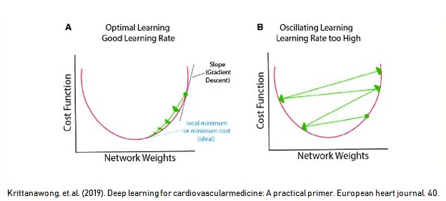

<style>

body {
text-align: justify}

</style>

```{r setup, include=FALSE}
# clear-up the environment
rm(list = ls())

# chunk options
knitr::opts_chunk$set(
  message = FALSE,
  warning = FALSE,
  fig.align = "center",
  comment = "#>"
)

options(scipen = 999)
```

<style>

body {
text-align: justify}

</style>

# Training Objective

```{r, echo=FALSE}

```

# Introduction

## Artificial Neural Network

**Neural network** atau artificial neural network (ANN) adalah metode machine learning yang *terinspirasi dari cara kerja otak manusia*. Otak bekerja dengan suatu sistem saraf (biological neural network). Terdapat 2 hal utama  dari sistem saraf manusia yang diadopsi oleh neural network: **arsitektur** & **proses belajar** yang dilakukan.

Beberapa aplikasi Deep Learning:

- Facial Recognition
- Speech Recognition
- Instagram Filter
- Forecasting
- Text Summarization
- Detect Product Defect from Image
- in-game AI

**Image Filter**

<a href = "https://gadacts.com/technology-behind-snapchat-and-instagram-filters/"> The Machine Behind Instagram Filter </a>

```{r echo=FALSE}

```

**Detect Defect in Product Using Image Recognition**

1. < a href = "https://rpubs.com/Argaadya/semiconductor" > Detect Defect Using Sensor Information </a>

2. <a href= "https://medium.com/@infopulseglobal_9037/intelligent-defect-inspection-powered-by-computer-vision-and-deep-learning-4c75fdf8673"> Computer Vision </a>

```{r echo=FALSE}

```

**Deep Learning for Self Driving Cars**

<a href = "https://arxiv.org/abs/1910.07738"> Deep Learning in Self-Driving Cars </a>

```{r echo=FALSE, out.width="80%"}

```

**The New Star of AI : GPT-3**

GPT-3 adalah model Neural Network yang dilatih dengan menggunakan data banyak teks bahasa inggris yang diambil dari internet. GPT-3 dikembangkan oleh OpenAI, salah satu perusahaan yang didirkan oleh Elon Musk.

Demo: 

1. <a href = "https://openai.com/blog/openai-api/"> GPT-3 API Demo </a>

2. <a href = "https://www.youtube.com/watch?v=fZSFNUT6iY8"> GPT-3 Generate Python Code </a>

3. <a href = "https://www.youtube.com/watch?v=kpiY_LemaTc"> Komparasi GPT-3 dengan otak manusia </a>

```{r echo=FALSE, out.width="60%"}

```


## Library and Setup

Berikut beberapa library yang akan kita gunakan:

```{r message=FALSE}
# Data Wrangling
library(dplyr)

# Neural Network
library(neuralnet)

# Model Evaluation
library(caret)

# Set Graphic Theme
theme_set(theme_minimal())

options(scipen = 999)
```

# 🚀 Flashback Machine Learning

Kita refresh kembali materi awal tentang model regresi, baik regresi linear dan regresi logistik agar nantinya lebih familiar perbedaannya dengan arsitektur neural network. 🤔✨

## 📊 Linear Regression

Misalkan kita punya data untuk memprediksi harga rumah dengan variabel seperti berikut:

```{r}
df_linear <- read.csv("data_input/house_price.csv")

str(df_linear)
```

🔍 **Data Description:**

* **`age`** : usia rumah
* **`distance_to_mrt`** : jarak ke stasiun MRT terdekat
* **`num_conv_store`** : jumlah toko kelontong di lingkungan sekitar
* **`price`** : kisaran harga rumah

Sekarang, kita buat model regresi linear untuk memprediksi harga rumah.

```{r}
# Membuat model regresi linear
model_linear <- lm(price ~ ., data = df_linear)
model_linear
```

### 💡 Hasil Model

Persamaan regresi linear yang dihasilkan:

$$price = 45.75 - 0.34\ age - 0.01\ distance\ to\ MRT + 1.24\ convenience\ store$$

### 👉 Penjelasan

Pada regresi linear, nilai target (Y) dihitung sebagai penjumlahan bobot (koefisien) dikalikan nilai variabel. Formula matematisnya:

$$\hat y = W_0 + \Sigma_{i=1}^m{x_i\ W_i}$$
### 📉 Ilustrasi

Grafik berikut menunjukkan bagaimana prediktor memengaruhi price. 🔢

```{r out.width="80%", echo=FALSE}

```

## 🧩 Logistic Regression

Sekarang kita coba masalah klasifikasi. Kali ini, kita ubah variabel target (`price`) menjadi kategori: `low` dan `high.`

```{r}
df_kategori <- read.csv("data_input/house_price_2.csv")

str(df_kategori)
```

🔍 **Data Description:**

* **`age`** : usia rumah
* **`distance_to_mrt`** : jarak ke stasiun MRT terdekat
* **`num_conv_store`** : jumlah toko kelontong di lingkungan sekitar
* **`price`** : kategori harga rumah  
  - 1 = high
  - 0 = low

Sekarang, mari kita buat model regresi logistik:

```{r}
# Membuat model regresi logistik
model_logit <- glm(price ~ ., data = df_kategori, family = "binomial")
model_logit
```

### 💡 Hasil Model  

Pada regresi logistik, nilai **log of odds** dihitung dengan formula berikut: 

$$g(x) = 5.10 - 0.09\ age - 0.004\ distance\ to\ MRT + 0.004\ num\ convenience\ store$$


👉 Selanjutnya, hasil ini diubah menjadi **probabilitas** (range 0-1) menggunakan fungsi sigmoid:  

$$P(price) = \frac{1}{1 + e^{-g(x)}}$$  

### 📉 Ilustrasi  

Grafik berikut menunjukkan perbedaan utama antara regresi linear dan logistik:  

- **Linear**: Prediksi langsung berupa nilai.  
- **Logistik**: Hasil dikonversi menjadi peluang menggunakan *sigmoid.*  

```{r out.width="80%", echo=FALSE}

```  


___________________________________


## ❓ Knowledge Check

Apa kesamaan model regresi logistik dan regresi linear dari segi pemrosesan datanya? 🤔

> Dalam mempelajari pola data, regresi akan menghasilkan persamaan regresi berdasarkan coefficient
___________________________________

```{r out.width="80%", echo=FALSE}

```

 🌼Quick Summary : 🌼

✨Recall Linear Regression & Logistic Regression ✨

Linear Regresi :

- Objective: Melakukan prediksi terhadap nilai numerik
- Interpretasi: Melakukan interpretasi berdasarkan nilai coefficient hasil model

Logistic Regression :

- Objective: Melakukan prediksi terhadap nilai kategorical
    - Mengubah rentang -Inf s/d Inf menjadi 0-1
- Interpretasi: Di interpretasi dengan menggunakan nilai coefficient log of odds


# 🤖 Neural Network  

## 🧠 Arsitektur Neural Network  

Jaringan saraf buatan terinspirasi oleh sistem saraf manusia! Sistem saraf ini terdiri dari banyak **neuron**, yang bekerja bersama membentuk **jaringan**. Tiap stimulus (seperti suara, sentuhan, atau cahaya) diterima oleh **panca indra**, diproses di **otak**, lalu menghasilkan **respon**.  

> Sama seperti tubuh manusia yang memproses stimulus menjadi respon, neural network juga memproses **input** menjadi **output**. 🚀  

```{r, echo=FALSE}
knitr::include_graphics("asset/bnn.png")
```  

Arsitektur ini menginspirasi pengembangan model **neural network**. Berikut adalah visualisasi bagaimana informasi dialirkan melalui jaringan ini:  

```{r, echo = FALSE}
knitr::include_graphics("asset/animation.gif")
```  


### ⚙️ Komponen Utama Neural Network  

Model neural network terdiri dari **lapisan-lapisan** yang bekerja seperti sistem saraf:  

1. **Input Layer** 🌟  

   - Layer pertama, tempat data awal (variabel X) masuk.  
   - Jumlah neuron = jumlah fitur pada data.

2. **Hidden Layer** 🔍 

   - Lapisan di antara input dan output.  
   - Jumlah lapisan dan neuron ditentukan oleh user.
   - Di sinilah "keajaiban" pemrosesan terjadi.  

3. **Output Layer** 🎯 

   - Layer terakhir, menghasilkan output (prediksi atau klasifikasi).  
   - Jumlah neuron = jumlah target variabel.

Setiap layer terdiri dari *node/neuron* yang saling terhubung melalui *weight/bobot*, dan beberapa layer memiliki *bias* untuk membantu pergeseran fungsi aktivasi.

### 📝 Karakteristik Neural Network  

- **Fully Connected**: Semua node di satu layer terhubung ke node di layer berikutnya.
- **Node/Neuron**: Menyimpan nilai, diilustrasikan sebagai bulatan.
- **Weight/Bobot**: Menghubungkan node satu sama lain, diilustrasikan sebagai garis. 

### 📊 Contoh Arsitektur Neural Network  

Berikut adalah contoh arsitektur neural network untuk kasus **klasifikasi harga rumah**:  

```{r out.width="80%", echo=FALSE}

```  


## 🏠 Kasus Regresi  

Mari kita buat model Neural Network untuk memprediksi harga rumah berdasarkan data **price**. Kita akan menggunakan package `neuralnet`.  


### 📦 Parameter Penting di `neuralnet`  

- **`formula`**: Menentukan target variabel (contoh: `price`) dan prediktor.  
- **`data`**: Dataset yang digunakan untuk membangun model.  
- **`hidden`**: Jumlah node yang digunakan di hidden layer.  
- **`rep`**: Jumlah pengulangan model yang ingin dibuat.  


### 🛠️ Membuat Model Neural Network  

#### Dengan Hidden Layer 

Kita mulai dengan model yang memiliki hidden layer:  

```{r}
# Membuat model NN dengan hidden layer
regression_nn <- neuralnet(formula = price ~ .,
                           data = df_linear,
                           hidden = 6,
                           rep = 3)
plot(regression_nn, rep="best")
  
```


#### Tanpa Hidden Layer

Selanjutnya, kita coba membangun model tanpa hidden layer. Ini untuk membandingkan hasilnya dengan regresi linear.  

```{r}
# Membuat model NN tanpa hidden layer
regression_nn <- neuralnet(formula = price ~ .,
                           data = df_linear,
                           hidden = 0, # tanpa hidden layer
                           rep = 3)
plot(regression_nn, rep="best")
```

### 📊 Membandingkan dengan Model Regresi Linear  

Sekarang, kita bandingkan hasil dari neural network tanpa hidden layer dengan model regresi linear yang sudah kita buat:  

```{r}
# Model regresi linear sebelumnya
model_linear
```


## 🏷️ Kasus Klasifikasi  

Sekarang, mari kita buat model Neural Network untuk kasus klasifikasi dengan target variabel **price** (`high`/`low`).  


### 📦 Parameter Tambahan untuk Kasus Klasifikasi  

- **`err.fct`**: Fungsi perhitungan error.  
  - **`ce`** (Cross-Entropy): Digunakan untuk klasifikasi biner (2 kelas).  
- **`act.fct`**: Fungsi aktivasi pada output layer.  
  - **`logistic`**: Mengubah hasil menjadi probabilitas antara 0 dan 1.  
- **`linear.output`**: 
  - **`FALSE`**: Untuk kasus klasifikasi (bukan output berupa angka).  


### 🛠️ Membuat Model Neural Network  

#### Dengan Hidden Layer

Kita mulai dengan membuat model klasifikasi Neural Network yang memiliki hidden layer:  

```{r}
# Model NN dengan hidden layer
# model_klasifikasi <- neuralnet(formula = price ~ .,
#                            data = df_kategori,
#                            hidden = 5,
#                            linear.output = F, # supaya tidak menghasilkan output yang linear
#                            act.fct = "logistic", # fungsi aktivasi untuk mengubah menjadi bentuk probabiliti
#                            err.fct = "ce", # fungsi error, klassifikasi = cross-entropy
#                            rep = 3)
# 
# plot(model_klasifikasi, rep = "best")
  
```


#### Tanpa Hidden Layer 

Untuk membandingkan, mari kita buat model Neural Network tanpa hidden layer:  

```{r}
# Model NN tanpa hidden layer
model_klasifikasi <- neuralnet(formula = price ~ .,
                           data = df_kategori,
                           hidden = 0, # tanpa hidden layer
                           linear.output = F, # supaya tidak menghasilkan output yang linear
                           act.fct = "logistic", # fungsi aktivasi untuk mengubah menjadi bentuk probabiliti
                           err.fct = "ce", # fungsi error, klassifikasi = cross-entropy
                           rep = 3)

plot(model_klasifikasi, rep = "best")
```

### 📊 Membandingkan dengan Model Regresi Logistik  

Kita cek kembali model regresi logistik yang sudah dibuat sebelumnya:  

```{r}
# Model regresi logistik sebelumnya
model_logit
```


>> Kita telah mengetahui tentang neural network. Namun apa hubungannya dengan Deep Learning? 


## 🔍 Deep Learning  

Deep Learning adalah perkembangan dari Neural Network dengan karakteristik utama berupa penambahan **hidden layer** yang lebih dari satu.  

### 📌 Poin Penting Tentang Deep Learning  

- **Deep Learning** adalah Neural Network dengan arsitektur yang lebih kompleks (lebih dari satu hidden layer).  
- **Jumlah neuron** (node) dan **jumlah hidden layer** berpengaruh besar pada performa model.  
- **Efek penambahan hidden layer**: 
  - Dapat menurunkan error jika model dapat menangkap pola yang lebih kompleks.  
  - Dapat meningkatkan error jika model menjadi overfitting atau terlalu kompleks untuk masalah yang dihadapi.  


### 🛠️ Contoh Deep Learning  

#### 1. Deep Learning untuk Klasifikasi  


```{r}
# Deep Learning untuk klasifikasi
model_klasifikasi_deep <- neuralnet(formula = price ~ .,
                           data = df_kategori,
                           hidden = c(5, 3),
                           linear.output = F, # supaya tidak menghasilkan output yang linear
                           act.fct = "logistic", # fungsi aktivasi untuk mengubah menjadi bentuk probabiliti
                           err.fct = "ce", # fungsi error, klassifikasi = cross-entropy
                           rep = 3)

# plot(model_klasifikasi_deep, rep = "best")
```

#### 2. Deep Learning untuk Regresi


```{r}
# Deep Learning untuk regresi
nn_reg_deep <- neuralnet(formula = price ~ .,
                           data = df_linear,
                           hidden = c(5,3), # tanpa hidden layer
                           rep = 3)
plot(nn_reg_deep, rep="best")
```


## 🔮 Prediksi Output  

Untuk melakukan prediksi menggunakan model Neural Network, kita menggunakan fungsi `compute()` alih-alih `predict()`.  

### ⚙️ Langkah Prediksi  

1. Gunakan model Neural Network yang sudah dibuat.  
2. Tentukan variabel prediktor (`covariate`) untuk data yang ingin diprediksi.  
3. Simpan hasil prediksi ke dalam objek `net.result`.  

### Contoh Kasus Klasifikasi

```{r}
# Prediksi menggunakan Deep Learning
pred <- compute(x = model_klasifikasi_deep, covariate = df_kategori)

# Hasil prediksi
pred$net.result
```


## 📊 Evaluasi Model  

### Mengubah Probabilitas Menjadi Kelas

Untuk klasifikasi biner, hasil probabilitas perlu dikonversi menjadi kelas (`0` atau `1`) menggunakan ambang batas (misalnya, 0.5):  

```{r}
# Konversi probabilitas menjadi kelas
pred_kelas <- ifelse(pred$net.result > 0.5 , yes = 1, no = 0)
head(pred_kelas)
```


## ✨ Komponen Output Neural Network  

Neural Network menghasilkan beberapa informasi penting yang dapat digunakan untuk evaluasi model:  

- **`$call`**: Menampilkan kode pembuatan model.  
- **`$response`**: Data target variabel.  
- **`$covariate`**: Data prediktor.  
- **`$net.result`**: Hasil prediksi target.  
- **`$result.matrix`**: Detail informasi akhir model (bias, weight, error, dll.).  


## 📚 Proses Pembelajaran Neural Network

```{r out.width="80%", echo=FALSE}

```

Neural Network bekerja dengan mengurangi kesalahan (error) dari prediksi dan memperbarui bobot (weight) untuk meningkatkan akurasi. Proses ini disebut **epoch** dan terdiri dari dua fase:

### 1. **Feed Forward**

Proses di mana model mencoba memprediksi nilai target **y** berdasarkan bobot yang ada.

### 2. **Back Propagation**

Setelah memprediksi, model menghitung kesalahan dan memperbarui bobot agar prediksi lebih akurat.


### **Langkah-langkah Proses Pembelajaran**

1. **Inisialisasi Bobot**  
   Bobot dan bias dimulai dengan nilai acak.

2. **Feed Forward**  
   Data input diproses untuk menghasilkan prediksi (y').

3. **Menghitung Error**  
   Kesalahan dihitung dengan membandingkan prediksi dan nilai sebenarnya.

4. **Back Propagation**  
   Error yang dihitung digunakan untuk memperbarui bobot.

5. **Update Bobot**  
   Bobot diperbarui dan proses ini diulang sampai error sekecil mungkin.


### 💡 Istilah Penting dalam Pembelajaran Neural Network

- **Activation Function**: Fungsi yang digunakan untuk memproses output dari setiap node, misalnya sigmoid atau ReLU.
  
- **Forward Propagation**: Proses di mana data berjalan melewati jaringan untuk menghasilkan prediksi.

- **Backpropagation**: Proses memperbaiki bobot berdasarkan error dari prediksi.

- **Cost Function**: Mengukur seberapa besar kesalahan antara prediksi dan data sebenarnya, misalnya Cross-Entropy untuk klasifikasi.

- **Epoch**: Satu putaran penuh dari proses **Feed Forward** dan **Back Propagation**.

Dengan proses ini, Neural Network "belajar" untuk membuat prediksi yang lebih tepat dari waktu ke waktu.

## 🏄 Dive Deeper 1

```{r echo=FALSE}
y <- c(0,1,1,0)
dat <- data.frame(expand.grid(c(0,1), c(0,1), c(1,2)), y)

set.seed(100)
dat <- dat %>%
  mutate(y = runif(nrow(dat), 3, 4) + sum(dat[1:2, ]) + dat$Var3^2)

head(dat)
```

```{r message=FALSE, warning=FALSE, echo=FALSE}
library(neuralnet)
# modelling nn
set.seed(100)

model1 <- neuralnet(formula = y ~ .,
                    data = dat,
                    hidden = 4,
                    linear.output = T, # kasus regresi 
                    rep = 5)

plot(model1, rep = "best") # best = model dengan error terkecil
```

1. Tinjau model neural network di atas:
  a. model terdiri dari tipe layer apa saja, dan berapa jumlah layer untuk masing-masing tipe?
  
    - Layer input  : 3 nodes
    - Layer hidden : 4 nodes
    - Layer output : 1 node

2. Mengapa digunakan `set.seed` saat membuat model neural network? 

> supaya memiliki nilai random yang sama dengan partner kerja yang menjalan kode-nya juga, sehingga nanti menghasilkan nilai output yg sama juga 

3. Apabila ditambahkan variabel prediktor numeric baru sejumlah 2, perbedaan apa yang dimiliki model baru dibandingkan model di atas? 

>  Yang berubah adalah jumlah nodes pada input layer, menjadi 5 nodes. 

4. Kapan neural network tidak cocok untuk digunakan? 

> - Jika dataset nya terlalu kecil
> - Datanya tidak kompleks
> - Bagus untuk data yang memiliki pola kompleks
> - Bagus untuk data unstructured


bobot bisa dikatakan adalah faktor untuk menentukan penting tidaknya suatu data


_______________________


## Feed Forward

**Feed Forward** adalah proses di mana model memprediksi nilai target berdasarkan bobot dan bias yang ada. Dalam proses ini, model menerima input dari setiap prediktor atau fitur, kemudian data ini diolah sesuai dengan bobot yang ada di setiap neuron/node, ditambah dengan nilai bias. Perubahan skala data, yang ditandai dengan `S` pada hidden layer dan output layer, terjadi karena penggunaan **Activation Function** seperti fungsi **Sigmoid**.

```{r echo=FALSE, out.width="80%"}

```

## Activation Function

**Activation Function** berfungsi untuk mentransformasi input sebelum diteruskan ke layer berikutnya sesuai dengan kebutuhan model. Fungsi ini membantu:

- Menjaga agar output sesuai format yang diperlukan, misalnya untuk klasifikasi biner (output 0-1).
- Membatasi nilai yang diteruskan ke node-node berikutnya agar tidak terlalu besar, yang bisa memperberat komputasi.

💡 Beberapa jenis **Activation Function**:

- **Linear**  

  - Cocok untuk output layer ataupun hidden layer (default) pada kasus regresi (range: -∞ ~ ∞).  
  - Pengaturan: `linear.output = T` (default).

```{r out.width="60%", echo=FALSE}

```

- **Sigmoid / Logistic** 

  - Cocok untuk output layer pada klasifikasi biner (range: 0 ~ 1).  
  - Pengaturan: `linear.output = F` & `act.fct = "logistic"`.

```{r out.width="60%", echo=FALSE}

```

- **Softmax**  

  - Cocok untuk output layer pada klasifikasi multiclass (range: 0 ~ 1).  
  - Fungsi Softmax memberikan nilai peluang untuk setiap kelas, dan totalnya akan berjumlah 1. Data akan diklasifikasikan ke kelas dengan peluang tertinggi.

```{r out.width="60%", echo=FALSE}

```

- **ReLU (Rectified Linear Unit)**  

  - Cocok di hidden layer untuk kasus data citra/gambar (range: 0 ~ ∞).

```{r out.width="60%", echo=FALSE}
knitr::include_graphics("asset/activation_relu.png")
```

- **Tanh (Hyperbolic Tangent)**

  - Cocok di hidden layer saat banyak prediktor yang memiliki nilai negatif (range: -1 ~ 1).

```{r out.width="60%", echo=FALSE}

```

_______________________


#### 🔎 Knowledge Check Activation Function

- ❓Apa activation function yang cocok untuk kasus regresi dengan target variabel numerik?

> act fct pada output layer -> linear

- ❓Apa activation function yang cocok untuk kasus klasifikasi dengan target variabel adalah kategori dengan 5 kelas?

> act fct pada output layer -> softmax

_______________________

## Lost Function / Cost Function (Error)

Cost function adalah nilai acuan kebaikan model; nilai untuk mengevaluasi kebaikan model; dapat juga dianalogikan sebagai error. Model dapat "belajar" dengan mengetahui cost function yang harus ia gunakan untuk mengevaluasi dirinya sendiri. Cost function yang digunakan berbeda untuk tiap kasus:

* regresi:

  + sum of squared error(sse)
  + setting parameter: `neuralnet(..., err.fct="sse")`

$$SSE = \frac{1}{2} {\Sigma (y - \hat y)^2}$$

* klasifikasi:

  + cross-entropy error (ce)
  + setting parameter: `neuralnet(..., err.fct="ce")`

$$Binary\ Cross-Entropy = -p(x)\ log\ q(x) + (1-p(x))\ log\ (1-q(x))$$

### 🔎 Knowledge Check Activation Function and Loss Function

❓ Apabila kita ingin memprediksi tingkat kepuasan suatu pelanggan yang mana ada 3 parameter yaitu: tidak puas, biasa saja, puas; jenis activation function dan loss function apa yang cocok digunakan?

> - Activation function --> softmax
> - Loss function --> ce


## Back Propagation

Back Propagation adalah proses **mengupdate bobot** berdasarkan informasi yang didapatkan dari error hasil prediksi. Informasi yang dicari adalah informasi tentang nilai update yang optimal dengan menggunakan nilai gradient, sehingga metodenya disebut dengan *Gradient Descent*. Untuk mengatur seberapa cepat dan detail model belajar, nilai *Learning Rate* dapat diatur. Semakin kecil learning rate, semakin detail model belajar. Nilai yang biasa digunakan untuk Learning Rate adalah 0.01.

$$W_k = W_{k-1} - \alpha \frac{\partial\ E}{\partial\ W_{k-1}} = W_{k-1} - \alpha \nabla g(W_{k-1}) $$

Keterangan:

$W_k$ : Bobot pada iterasi k

$W_{k-1}$ : Bobot pada iterasi k-1

$\alpha$ : Learning rate

$\frac{\partial\ E}{\partial\ W_{k-1}}$ : Partial derivative/turunan parsial

$\nabla g(W_{k-1})$ : gradient dari iterasi k-1

```{r echo=FALSE, out.width="80%"}
knitr::include_graphics("asset/backprop.gif")
```

Gradient Descent akan membuat model belajar mencari nilai dari masing-masing bobot yang tepat sehingga mendapatkan error yang semakin kecil. 

### Learning Rate 

Learning rate yang besar akan membuat model belajar lebih cepat dengan jumlah step yang lebih sedikit, namun kemungkinan besar akan melewatkan titik terendahnya sehingga tidak bisa mencapai nilai error yang optimal. Learning rate yang kecil akan membuat model mengupdate bobot sedikit demi sedikit sehingga kemungkinan untuk melewatkan titik terendah/titik optimalnya lebih kecil. Namun, jika model sudah menyentuh **local optima** atau titik terendah di antara dua area yang lebih tinggi errornya, model akan sulit untuk lepas dari area tersebut sehingga terdapat kemungkinan juga model tidak bisa mendapatkan **global optima** atau error yang paling rendah. Pemilihan learning rate adalah salah satu hal yang penting dalam membuat Neural Network.

```{r echo=FALSE, out.width="80%"}

```

Apabila Bapak/Ibu tertarik dengan matematika di balik *Gradient Descent*, dapat mengunjungi <a href = "https://jermwatt.github.io/machine_learning_refined/notes/3_First_order_methods/3_6_Descent.html"> website berikut </a>.

Contoh perhitungan update bobot ada di FAQ Algotech

https://askalgo.netlify.app/#mathematics-concept

Misalkan kita punya fungsi berikut dari sebuah model:

$$
f(x) = x^2
$$

Gradient Descent menggunakan konsep turunan/derivatif untuk mencari nilai error yang optimal. Maka, kita bisa menurunkan fungsi di atas menjadi sebagai berikut:

$$
f'(x) = 2x
$$

Untuk mengupdate bobot barunya, kita mengatur seberapa besar perubahan bobotnya menggunakan **learning rate** ($\alpha$):

$$ x\ baru = x\ - \alpha\ 2 x$$

Misal bobot yang sekarang adalah 4 dan learning rate = 0.1

$$bobot\ baru = 4 - 0.1\times 2\times 4 = 3.2$$

Jika learning rate semakin kecil, perubahan bobotnya juga akan semakin kecil juga, contohnya dengan learning rate = 0.01

$$bobot\ baru = 4 - 0.01\times 2\times 4 = 3.92$$


Dalam melakukan training data menggunakan neural network, tugas kita adalah:

1. Membuat arsitektur
    - Input layer
    - Hidden layer: berapa layer, dan berapa nodes di tiap layernya
    - Output layer
2. Menentukan activation function
    - Output layer: tergantung kasusnya
    - Hidden layer: optional
3. Error function: Tergantung kasusnya
    - Regresi: sse
    - Klasifikasi: ce
4. Tambahan nilai yang bisa kita tentukan
    - Learning rate
    - Optimizer 

_____


- Kita telah belajar banyak terminologi selama mempelajari arsitektur dan cara kerja deep learning. Coba cocokan terminologi-terminologi di bawah ini!

1. `neuron/node`: b. tempat penyimpanan informasi atau nilai
2. `input layer`: a. layer berisi node yang menerima informasi dari variabel prediktor
3. `hidden layer`: g. layer berisi node tempat informasi di proses
4. `output layer`: c. layer berisi node yang mengeluarkan hasil prediksi
5. `weight`: f. bobot tiap node; koefisien yang dikalikan dengan nilai dari variable prediktor
6. `bias`: e. nilai intercept

7. `feed forward`: d. aliran informasi melalui input-hidden-output layer; aliran informasi
8. `back propagation`: h. aliran informasi untuk memperbaiki/mengupdate bobot; aliran informasi dari output ke hidden layer

9. `cost function`: k. nilai kebaikan model yang dijadikan bahan evaluasi model; selisih antara nilai aktual dengan prediksi.
10. `step / epoch`:  j. 1 kali tahapan feed forward dan back propagation
11. `activation function`: i. fungsi untuk melakukan scaling atau **transformasi** nilai pada node, sebelum nilai dilanjutkan ke node berikutnya


### Paremeter di `neuralnet`

1. `Formula`.

2. `Data`.

3. `hidden`: defaultnya adalah 1.

4. `threshold`: batas minimum error yang harus dicapai. Defaultnya adalah 0,01.

5. `rep`: jumlah tipe model yang ingin dibuat. Defaultnya adalah 1.

6. `err.fct`: menentukan jenis cost function yang digunakan. Pada packages `neuralnet` disediakan 2 jenis saja. Yaitu `SSE` (Sum square error), dan `ce` (Cross Entropy). `SSE` digunakan ketika kasus kita regresi. Sedangkan `ce` digunakan ketika kasusnya klasifikasi. Defaultnya adalah `SSE`. 

7. `act.fct`: menentukan jenis activation function yang digunakan. Ada berbagai macam jenisnya: Sigmoid, softmax, ReLU, tanh. Perbedaan masing-masing jenisnya terdapat pada interval nilai yang dihasilkan. Defaultnya adalah Sigmoid/logistic.

8. `linear.output`: sebuah logical, ketika TRUE maka outputnya akan diteruskan secara linear (regresi). Kalau pilihannya FALSE maka outputnya akan ditransformasikan menggunakn activation function (klasifikasi). Defaultnya linearoutput = TRUE.


- Panduan Model Building dan Tuning
    
  + Nodes pada **input layer**: sejumlah prediktor yang kita miliki
  + Nodes pada **output layer**:
      - regresi = 1
      - klasifikasi = sejumlah kelas variabel target
  + **Hidden layer**
      - Jumlah hidden layer (how deep):
         + Model lebih kompleks
         + Waktu training lama
         + Percobaan pertama bisa 2 layer terlebih dahulu
      - Jumlah node pada hidden layer (how wide)
         + Terlalu banyak bisa menghasilkan overfitting
         + Bisa pakai angka kelipatan 2^n (2,4,8,16,32,64, dst...), atau sekitar 2/3 jumlah prediktor
         + Jumlah mengerucut semakin ke output layer 
      - Error functionnya : diganti sesuai dengan kasus pada target variable
         + regresi sse
         + klasifikasi cross enthropy (ce)
            - 2 kelas binary
            - lebih dari 2 kelas, multi-class 
   + **Activation function**
        - Ouput Layer
            + Linear
                - Range -inf ~ + inf
                - Untuk regresi
            + Sigmoid
                - range 0~1
                - cocok untuk kasus binari klasifikasi
            + Softmax
                - range 0~1
                - cocok untuk multiclas
        - Hidden Layer
            + ReLu
                - range 0 ~ inf
                - cocok untuk data gambar / image
                - sering digunakan pada hidden layer
                - menghilangkan efek negatif pada data
            + tanh
                - range -1 ~ 1
                - cocok untuk prediktor yang banyak negatifnya
    + alpha atau learning rate : untuk mengatur kecepatan belajar dari neural network


--- End of Day 2--- 

# Additional Link & References

[Deep Learning Tips and Tricks cheatsheet, By Afshine Amidi and Shervine Amidi, Stanford Edu](https://stanford.edu/~shervine/teaching/cs-230/cheatsheet-deep-learning-tips-and-tricks)

[11 Essential Neural Network Architectures, Visualized & Explained](https://medium.com/analytics-vidhya/11-essential-neural-network-architectures-visualized-explained-7fc7da3486d8)

[Various cases on Deep Learning at algotech.netlify.app](https://algotech.netlify.app/tags/deep-learning/)

[Image Classification using CNN](https://algotech.netlify.app/blog/image-classification-cnn/)
