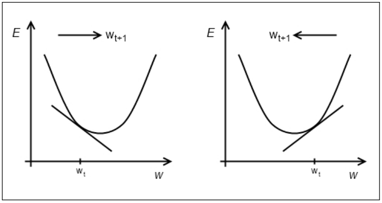

# Background {.tabset}
## Algoritma
The following coursebook is produced by the team at [Algoritma](https://algorit.ma) for its Data Science Academy workshops. The coursebook is intended for a restricted audience only, i.e. the individuals and organizations having received this coursebook directly from the training organization. It may not be reproduced, distributed, translated or adapted in any form outside these individuals and organizations without permission. 

Algoritma is a data science education center with bootcamp programs offered in:

- Bahasa Indonesia (Jakarta campus)  
- English (Singapore campus)

### Lifelong Learning Benefits
If you're an active student or an alumni member, you also qualify for all our future workshops, 100% free of charge as part of your **lifelong learning benefits**. It is a new initiative to help you gain mastery and advance your knowledge in the field of data visualization, machine learning, computer vision, natural language processing (NLP) and other sub-fields of data science. All workshops conducted by us (from 1-day to 5-day series) are available to you free-of-charge, and the benefits **never expire**. 

### Second Edition
This coursebook is initially written in 2017.

This is the second edition, written in late August 2020. Some of the code has been refactored to work with the latest major version of R, version 4.0. I would like to thank the incredible instructor team at Algoritma for their thorough input and assistance in the authoring and reviewing process.


## Libraries and Setup
We'll set-up caching for this notebook given how computationally expensive some of the code we will write can get.

```{r setup}
knitr::opts_chunk$set(cache=TRUE,tidy=TRUE)
options(scipen = 9999,width=50,linewidth=50)
```

You will need to use `install.packages()` to install any packages that are not already downloaded onto your machine. You then load the package into your workspace using the `library()` function:
```{r}
library(dplyr)
library(ggplot2)
library(neuralnet)
library(NeuralNetTools)
```

You may need to install `DiagrammeR` manually for `mxnet` to work for the optional part of this workshop exercise:
```{r eval=F}
#install_version("DiagrammeR", version = "0.9.0", repos = "http://cran.us.r-project.org")
```

## Training Objectives
Artificial neural networks applied in the field of image recognition and handwriting classification have garnered a fair amount of press and public attention these days; in the final course of this Machine Learning Specialization, we are going to dive into this intriguingly named piece of technology, and learn how to develop sophisticated models for regression classification tasks. For this last course of the Machine Learning Specialization, after a lot of iteration I chose to approach this topic from a top-down approach in the aim of making this notoriously wearisome subject a little more approachable (so much so that most people prefer to think of neural networks, random forest and the rest as a "black box model" because their inherent complexity doesn't lend itself well to knowledge of its internal workings).

Throughout this workshop, we will learn to arrive at the neural network computations manually (by-hand), and within the constraints of what is possible with a black box model, we'll peel away the abstractions of a deep learning model layer-by-layer and conclude this specialization with some practical advice on your capstone project.

While the workshop has an Advanced-level difficulty, I urge you not to feel discouraged at the parts where the mathematics get a little more technical than we'd like it to be. In fact, the goal of this workshop is to shed light on the working principles behind the algorithms that are more-or-less treated as a black-box, and by so doing help you apply this algorithm with more thoughtfulness and considerations.

- **Understanding Neural Network**  
- Neural Network Intuition  
- A Primer on Deep Learning  
- Layers and Neurons  
- Weights and Bias  
- `neuralnet` in R  

**Activation Function**  
- Sigmoid Function recap  
- Softmax Function
- ReLu

**Building a Neural Network**
- Architecture Design  
- Parameterization  
- Cost Function  
- Feedforward Algorithm  
- Backpropagation  

**State-of-the-Art Deep Learning**  
- Hand digit classification  
- `mxnet` (Apache)
- The momentum algorithm
- Practical advice on deep learning

**Where to go from here**
- Beyond Machine Learning and Deep Learning

# Deep Learning
## Artificial Neural Networks
Deep learning is an exciting invention that has risen in popularity in recent years, but it's beginnings traced back to the 1950s when the earliest prototypes of **artificial neural network** algorithms were created. The algorithm is named so because it is inspired from our understanding at that time of how our biological brain responds to stimuli from sensory inputs. That is not to say that neural networks are valid representations of how our biological brain works - quite far from that! In fact, the over-sensationalization of neural network is in my opinion doing more harm to actual science than good. 

To date, there are some school of thoughts that hypothesized about how our brain works. There's the grandmother cell theory[^1], which hypothesized that "neurons represent a complex but specific concept or object". It was proposed by neuroscientists Jerry Lettvin, who suggested the notion of hyper-specific neurons that is activated by very specific prompts, such as upon hearing the mention of your grandmother, or seeing pictures of them. Advocates of this theory points to studies where participants were shown three to seven different "target" pictures of 132 photo subjects while having being observed - the researchers measured the electrical activity (activation) of the neurons connected to the electrodes and observe how neurons "almost ignored all other photos but fired steadily each time Aniston appeared on screen"[^2]. 

Other theories assert that neurons are far simpler and that the representation of complex objects are distributed across many neurons. So while the human brain is extremely complex, with around 100 billion neurons and 1,000 trillion synaptic interconnections, each neuron rely on layers of electrochemical signaling and other biological machinery to process information. 

Artificial neural networks are loosely derived from this second set of theories. A neural network architecture comprised of an arrangement of "layers" and "nodes" (representing neurons) such that "information" flows from one later and relayed to another. 

Neuroscientists learn that[^3]:  
- Information from one neuron to another across a small gap called a synapse
- One sending neuron can connect to several receiving neurons  
- One receiving neuron can connect to several sending neurons      
{width=40%}


As one receiving neuron "receives" the signal sent by the sending neuron, the biochemical process help that neuron weight the signal according to its relative importance and as it turns out, this biological mechanism serves as a great template for an artificial neuron. The neurons are represented as nodes, and the strength between nodes are weighted to model the synapses in the biological brain. 

As a motivational example, look at the following architecture:

```{r echo=F}
set.seed(100)
suppressPackageStartupMessages(library(neuralnet))
y <- c(0,1,1,0)
dat <- data.frame(expand.grid(c(0,1), c(0,1), c(1,2)), y)
nneu <- neuralnet( y~Var1+Var2+Var3, dat, hidden=4, rep=5)
# rep="best" to plot the repetition with the smallest error
plot(nneu, rep="best")
```

By default, the `neuralnet()` function uses a backpropagation algorithm named `rprop+`. We are going to dive into the technical details of the backpropagation algorithm in later sections, but I want to take the opportunity to explain how this relates to "intelligence" as we understand it. A modern definition could be:  

> The ability to perceive information, and retain it as knowledge to be applied towards adaptive behaviors within an environment or context  

So for a machine to fit that definition of intelligence, it has to not just "learn" the weights between these nodes, it has to learn how to adapt these weights - and that is achieved with what is termed as a _cost function_. The cost function determine how well the "learned weights" are by calculating the error given the paramaters. By means of analogy, you can imagine that a driver behind wheels having to approximate the optimal distance between his car and the car in front of him. Too much distance, and he may be driving too slow and causing unnecessary discomfort to other drivers around him. Too little distance and he may be accused of "tailgating" and put his own safety as well as others at risk. He / she has to _learn_ the optimal distance through experience and "backpropagate" her visual feedback to correct the distance - when the car in front of her slows down, that visual feedback is passed and the "weights" are adjusted to accommodate that information. The intuition, or the sense of danger acts as a cost function, and she is trying to minimize the sense of danger or equivalently, the cost function. 

Artificial intelligence imitates that objective when it is given a cost function because it now **has a sense of badness and know how poorly the weights are in relation to the prediction error**. A very simple cost function would be one iterative function (for-loop) where we iteratively make estimation, each time using a different combination of coefficients, and plot the error in each iteration by comparing our prediction to the ground truth. 

Using the cost function, our artificial neural network can arrive at the optimal values for each coefficient that is being estimated and as a result of backpropagation, it updates all of the neuron paths (weights) in each iteration of feedback. 

## Neural Networks Architecture
Let's plot our neural network again, and this time we'll take the time to learn the topology of our network: 
```{r}
plot(nneu, rep="best")
```

This is an architecturally simple neural network model, and while neural network architecture can vary in forms and design, each of them can be characterized by:  
- Number of layers in the network  
- Number of nodes in each layer  
- Direction of signals in the network  

When you wrap a neural network object, `nn` in `plot()`, the plot renders the network topology as well as the number of training steps that the neural network takes. 

It also report the sum of squared errors, a measurement of error that all of you should be familiar by now. You can prevent the display of these error and steps by assigning an additional parameter `parameter=FALSE` in the `plot()` call. 

Since the cost function we spoke of earlier is of such crucial importance to a neural network, let's dive deeper into the mathematical details to strengthen and validate our understanding of this mechanism.

### Cost Function and Error Measures I
Throughout the Machine Learning Specialization we've learned and applied the sum of squares error as a measurement of our model's "fitness". As it turns out, the sum of squared errors (SSE) is also a perfectly acceptable cost function for a neural network. 

Recall that we created the neural network using the following function call:
```{r eval=F}
neuralnet(y~Var1+Var2+Var3, dat, hidden=4, rep=5)
```

The `hidden` parameter allow us to specify the number of hidden neurons in each layer, and because we specified a single number, 4, that is going to return a neural network with one hidden layer (which is the layer between the input layer and output layer) and 4 neurons in that layer. 

Supposed you had specify `c(5,7,5)` in the hidden layer, you'd get a neural network with 3 hidden layers with the corresponding number of hidden neurons in each layer. For now, don't worry about the practical considerations between such a network topology and the earlier, simpler one - we'd get into that in a later chapter. 

Edit the following code to construct and plot a neural network with 3 hidden layers, with the first hidden layer containing 5 neurons, the second and third containing 7 and 5 respectively. The number of repetitions, the seed, and the plotting parameters should be left untouched:
```{r eval=F}
set.seed(1)
plot(neuralnet( y~Var1+Var2+Var3, dat, hidden=_______, rep=1), rep="best")
```

Notice that in the code you just wrote, we're using `rep=1` rather than `rep=5`: this parameter indicates the number of repetitions for the neural network's training. In the original neural network, we have `rep=5`, so we could have passed 1 to 5 in the plot parameter, which in turn ask the `plot()` function to  plot the neural network at a particular repetition. 

To plot only the neural network on its fourth repetition, add `rep=4` to the following function call:
```{r eval=F}
plot(nneu, rep=4)
```

**Discussion**:
If you run `plot(nneu)` in the console or in an R Script, all petitions will be plotted each in a separate window. Try and do that now.

Remember how I said earlier that the sum of squared errors (SSE) is a perfectly acceptable cost function for a neural network. Let's write a function `sse` that for a list of numbers, computes the sum of squared difference between the list and the ground truth in our data (`dat$y`). 

```{r}
sse <- function(x){
  return(sum( (x - dat$y)^2 ) )
}
```


**Discussion:**
You've learned that we have 5 repetitions of the neural network, and since each repetition will return the overall prediction, we expect to have 5 sets of prediction. They are stored in `nneu$net.result` as a list of length 5. Go ahead and complete the following code chunk: write some code to take a peek at the predictions returned by any one of the 5 repetitions:
```{r}
length(nneu$net.result)

### Write the code to inspect the prediction returned by any ONE of the 5 repetitions 


```


Now apply the sum of squared error function we wrote above (we named it `sse`) on the list of predictions, which repetition of the neural network has the lowest training error? 
```{r}
# Write the code to compute your SSE for each of the 5 repetitions


```

Your Answer:


Sure enough, if you take the SSE of the repetition that minimizes the training error, and multiply it by 1/2, you'll get the same error that was shown in the `plot()` function. Try that now:
```{r}


```

Notice that it rounds up to 0.000266, which is the same as what we've got in the original neural network:
```{r}
set.seed(100)
nneu <- neuralnet( y~Var1+Var2+Var3, dat, hidden=4, rep=5)
plot(nneu, rep="best")
```

Using SSE as a cost function returns the same error as the one that our original plot has given us, and to estimate the cost for future values or on our cross-validation set, we can use `compute`. `compute` requires at least two value:  
- `nn` object: a `neuralnet` object  
- data: some data from which we wish to obtain a prediction from

Optionally, we can specify `rep` such that a specific repetition of the neural network is used. Because this section aims to equip you with a solid knowledge of the cost function and error, I will perform `compute` on the same training data just to show you that the result you get from this computation (`nneu_compt$net.result`) would be the same as the one from the neural network's in-sample error estimation (`nneu$net.result[[3]]`). 

Notice that I'm computing for a prediction on the same training data with the third repetition of our neural network `rep=3` and then compare it to the one from `nneu`:
```{r}
nneu_compt <- compute(nneu, dat[,1:3], rep=3)

data.frame("result_compute" = nneu_compt$net.result, "error_nn_3"=nneu$net.result[[3]])
```

And so naturally taking the one-half sum of squared error using `nneu_compt$net.result` would return the same value as the Error returned by the neural network when we plot is, which is 0.000266:
```{r}
1/2 * sum((dat$y - nneu_compt$net.result)^2)
```

You may now ask, why do we take the one-half sum of squared error instead of the sum of squared error itself? The reason for that is pretty much conventional: sometimes you'll also see one-half mean squared error being used or the mean of squared error itself.  The reason why it's a convention is that if we define the cost function as such:  
$J_\theta = \frac{1}{2} \sum\limits^{m}_{i=1}(h_\theta(x^i)-y^i)^2$  

When we take the derivative of that equation, then the mathematic becomes nicer because the square cancels out the 1/2 and that turns out to be computationally convenient:

$J_\theta = \sum\limits^{m}_{i=1}(h_\theta(x^i)-y^i)$  

If you're not familiar with calculus, generally for such a function:

$f(x) = \frac{1}{2}x^2$, when taking the derivative of it:
$f\prime(x) = x$

Taking the derivate f-prime at a point a measures the sensitivity of _f_ to small changes in _x_ around _a_ (you'll also hear other explanations that describe it as the "rate of change"):  
$f\prime(x_0) = \lim\limits_{h \to 0}\frac{f(x_0 + h) - f(x_0)}{h}$  

For a mostly-layman explanation of the derivative function, I recommend the lecture notes from this UBC Calculus documents [^6]. From a practicality perspective, derivatives allow us to find the maximum or minimum of functions and are thus highly useful for optimization tasks. More directly, derivatives allow us to measure how variables change in relation to change in other variables (think: acceleration is the derivative of speed)

One can observe that between minimizing the one-half mean of squared errors, one-half sum of squared errors, mean of squared errors and sum of squared errors: the choice doesn't change the result. Minimizing the sum of squared function is essentially minimizing the one-half sum of squared errors. When we call our `neuralnet` function, the default cost function is the sum of squared error (`neuralnet(..., err.fct="sse")`), we could have also used `ce` for the cross-entropy error or pass in our own differentiable function.

When we plot our neural network built with `sse` being the cost function, the "best" repetition is the one that has the lowest sum of squared error. Each repetition computes the predicted value of y using the regression weights and the cost function serves as the "signal" that is used to iteratively adjust these weights.

```{r}
data.frame("computed"=nneu$net.result[[3]], "actual"=dat$y)
```


Remember when I mentioned earlier how a neural network architecture can be characterized by:  
- Number of layers in the network  
- Number of nodes in each layer  
- Direction of signals in the network  

This architectural design allow us to accommodate varying degree of complexity; a more complex network (typically means more number of layers in the network) are capable of modelling more subtle patterns within our data, and while size typically matters, the design of the architecture also plays a part in the effectiveness of a neural network. Let's break the three concepts down:

**Number of Layers** and **Number of Nodes**  
```{r}
plot(nneu, "best")
```

In the architecture above, `Var1`, `Var2` and `Var3` represent the features from our data, notice that there is one input node for each of the 3 features. When there is one hidden layer, the network is sometimes also called a "single-layer network" - they are suitable for classification tasks where the decision boundaries are fairly linear. When we have more than one hidden layer, the network qualify for the definition of a "deep neural network" (I know, I hope I was joking as well).   


When people refer to deep learning or point to a deep neural network, all you know for certain is that it's a neural network with more than one hidden layer[^7], most likely a feedforward network with many hidden layers. Because of it's multi-layer nature, another name for it is the **multi-layer perceptrons**, which is used more often in the past before the rise in popularity with the deep prefix. In fact in many of the journals referencing the `neuralnet` package you're using you are perhaps more likely to come across the name "multi-layer perceptron" or MLP[^8]. 

Some find the standard for depthness analogous to the Sorites paradox[^9]: at what point does heap becomes non-heap? There's also the obvious problem of the rate of change in technology. Revisit this coursebook 5 years from now and you may find the perceived notion of "deep learning" system a lot different from what it is today.   
{width=40%}

Beyond the philosophical question, a more helpful way to think about the term deep learning is to consider the greater trend where we've seen a sharp increase in the number of "deep" prefix to refer to any sufficiently sophisticated AI technology[^10]. Take any algorithm you've learned and add the word "deep" in front of it and you'll find a list of amusing results. So instead of finding a quantitative measurement for "deep learning", think of it qualitatively instead: "deep" suggests that the model is a convention treated like a black box and the results are hard to intuit - and that is taking nothing away from its performance.     

**Direction of signals**
Neural networks can be recurrent or feedforward. A feedforward neural network is one where the input signal is fed continuously in one direction from layer to layer until reaching the final output layer. Despite its apparent restriction, these networks can be very well-suited and form the "foundation" of a full neural network model.  

In contrast, a recurrent neural network (feedback network) is one where signals travel in both directions using loops and unlike a feedforward network can use an internal state to process sequences of input, which gives it the ability to "exhibit dynamic temporal behavior for a time sequence", and see its use throughout vocabulary speech recognition or in time series forecasting[^11].   


For its promises and potential, RNN is rather limited in its application compared to the de facto of neural networks, MLP (Multilayer Perceptron is just a fancy name for a multi-layer feedforward network). When somebody mention neural network to you, he or she is most likely referring to a MLP rather than the RNN. 

With all being said, how do you choose the right combination of architectural factors? Unfortunately to date there isn't any standard yet on determining the right number of neurons or hidden layers in a neural network. It is perhaps most helpful to recall Occam's Razor (or Principle of parsimony) which you've learned in the Regression Models class: when presented with competing hypothesis pick the simpler one. Favor the network with the fewest nodes when the cross-validation performance is just as adequate. In fact, you'd be surprised that often times an architecturally simple neural network often offer a level of learning performance that is well above the required threshold.


# Neural Network From First Principles
> A first principle is a basic, foundational, self-evident proposition or assumption that cannot be deduced from any other proposition or assumption.

Sometimes called "reasoning from first principles", we'll now go into the algorithms that made up a fully formed neural network and peel away at the heavily abstracted mathematical details that lay at its foundation. 

Let's start by adjusting our earlier data so we can study this a neural network from the point of view of OLS regression, a subject all of you are familiar with having completed the Regression Models course. 

The input predictors are the same, but the output target now resembles more of a regression problem. 
```{r}
set.seed(100)
dat$y <- runif(nrow(dat), 3, 4)+sum(dat[1:2,])+dat$Var3^2
head(dat)
```

Consider the case of a single-layer neural network with no hidden layers. Since we have 3 predictors, we would expect to design an architecture with three input neurons, and we would have the estimation function use `sse` as the default cost function since that's also the objective of an ordinary least squares regression. We would have just one output neuron, and we can represent the architecture in the following form:   


To put it in code, we will use the `neuralnet()` function, set `hidden=0` to specify no hidden layers and set 20 to be the number of repetitions for this neural network. The `rep` parameter is nothing but a fancy for-loop that wraps around the neural network function. For each time (up to a maximum of 20 if we had set rep=20), the neural network will pick some random weights as its initial (starting) parameter and perform a procedure known as gradient descent to find the optimal parameter. Essentially, setting 20 offsets some of that randomness picking a repetition that give us the lowest error from a pool of 20 is better than picking one from a pool of 5, which we've used earlier.

Notice that because of the randomly initialized starting weights, setting seed ensures the result is reproducible. 

**Discussion:**
1. Say I'd like to have 30 repetitions of the neural network, how would I change the following code?  

2. Supposed I'd like to avoid having to use the randomly initialized starting weights and instead prefer to use some specified starting weights. I would need 4 values for the first repetition (say we choose to initialize `c(0,0,0,0)` for the first repetition), one for the bias or the intercept coefficient, and one each for the 3 input neurons. For a neural network with 10 repetitions, I would use (`startweights = rep(0,(4*10))`) to initialize the starting weights to 0 for a total of 40 times. Go ahead and change the code to use a `rep` of 3 and specify some initialized weights using `startweights`. Observe that you can now remove the `set.seed(100)` and your neural network will converge at the same set of values every time you execute the code. 

Change the code below for (1) and (2):
```{r}
set.seed(100)
nn_dat <- neuralnet(y~Var1+Var2+Var3, dat, hidden = 0, rep=10, startweights = rep(0,(4*10)))
plot(nn_dat, rep="best")
```

**Discussion:**
3. Bonus question: If we have passed in `startweights = rep(0,(4*10))` we can run our neural network with 10 iterations and without setting a seed, the results will always be the same. The random component has been removed from our algorithm. However, setting the start weights this way is also meaningless and you're better off using randomized weights. Why?  

Let's go ahead and run the neural network again, and this time we'll plot the network to see the weights that were estimated from the best network repetition:
```{r}
set.seed(100)
nn_dat <- neuralnet(y~Var1+Var2+Var3, dat, hidden = 0, rep=20)
plot(nn_dat, rep="best")
```

To estimate the value of y, the neural network above would take the weighted sum of the three input neurons and then add the intercept term (blue arrow) to it. If this sounds terribly similar to a linear regression equation it is because it is. Compare the above weights to the coefficients you obtain from a linear regression:
```{r}
lm_dat <- lm(y ~., dat)
summary(lm_dat)
```

In R, we can take a look at the summary statistics from each repetition of the neural network, including the weights and intercept. In the following code I'm printing out the summary for the first 3 repetitions:
```{r}
nn_dat$result.matrix[,1:3]
```

## Backpropagation

So how does a neural network estimate the weights for each of the nodes? Well - remember that we already learned about a cost function which learns the error in each repetition. The key is to backpropagate these errors using an algorithm simply known as backpropagation. 

Instead of approaching the estimation of weights using a more closed-form algebraic technique (as in OLS regression), the neural network model randomly initialize the weights and it learn the best "weights" by minimizing the cost function. For a regression problem, that is typically the `sse` that you've seen repeatedly up to this point of the workshop. For a classification problem, we can specify the cross-entropy error to be used (`neuralnet(..., err.fct="ce")`). 

And recall for the error function that uses the `sse`:
$E = \frac{1}{2} \sum\limits^L_{l=1}\sum\limits^H_{h=1}(o_{lh}-y_{lh})^2$

For an error function that uses the cross-entropy `ce`, it would be:  
$E = - \sum\limits^L_{l=1}\sum\limits^H_{h=1}(y_{lh}log(o_{lh}) + (1-y_{lh})log(1-o_{lh}))$  

Where:  
- output _o(x)_ is calculated for given inputs _x_ and current weights  
- $l=1,...,L$ indexes the observations, i.e given input-output pairs  
- $h=1,...H$ are the output nodes  

We've learned about the two functions in earlier workshops of the Machine Learning Specialization, but where the backpropagation starts to differ is that it modifies the weights of a neural network in order to find a local minimum of the error function with respect to the weights.

> The learning of the error is the **cost function** of the neural network, and the feeding back of these error for the modification of weights is called **backpropagation**.

The de facto standard is through a general purpose optimization algorithm known as "gradient descent".   


### Gradient Descent
In an earlier chapter, I gave you our definition of the cost function:  
$J_\theta = \frac{1}{2} \sum\limits^{m}_{i=1}(h_\theta(x^i)-y^i)^2$  

When we take the derivative of that equation, then the mathematic becomes nicer because the square cancels out the 1/2 and that turns out to be computationally convenient:

$\sum\limits^{m}_{i=1}(h_\theta(x^i)-y^i)$  

Gradient descent works the following way. For each particular value of weight:  
- 1. Calculates the partial derivative of the weight  
- 2. The update rule
  - If the derivative is positive, it decreases the weight value  
  - If the derivative is negative, it increases the weight value  
- 3. The objective is to find the lowest point in a convex curve where the derivative is minimum  
- 4. How much does it move in its weight update (step 2) depends on a user-specified learning rate. You don't want a learning rate that is too high as it is going to "over-step" the minimum but a learning rate that is too small on the other hand is going to take far longer to find the local minima.

The process in mathematical notation:  
$w_k \gets w_k - \alpha \sum\limits^n_{i=1}(h_\theta(x^i)-y^i)x_{ik}$   


When we call the `neuralnet()` function with a backpropagation algorithm, we could have specified our own learning rate using the `learningrate` parameter like such `neuralnet(..., algorithm="backprop", learningrate = 0.001)`

**Discussion:**
Execute the following code chunk in an R console (not from RStudio):
```{r eval=F}
library(animation)
## default example
ani.options(interval = 0.3, nmax = 50)
gd <- grad.desc()
# gd$par for the parameters 
# gd$persp for perspective plot
# gd$persp(col = "lightblue", phi = 30)
```

Or to see gradient descent working on an even more complicated function (again, run it in R console):
```{r eval=F}
ani.options(interval = 0, nmax = 200)
f2 <- function(x, y)
  sin(1/2 * x^2 - 1/4 * y^2 + 3) * cos(2 * 
  x + 1 - exp(y))

gd2 <- grad.desc(f2, c(-2, -2, 2, 2), c(-1, 0.5), gamma = 0.1, 
  tol = 1e-04)
```

If you managed to run that function above, now look at the function definition in `f2`. Gradient descent takes that function `f2` and find the value of `x` and `y` that would lead to a local minimum of that function. 

1. To retrieve the values (parameters), run `gd2$par`  
2. To print the perspective plot, run `gd2$persp(col = "lightblue", phi = 30)`. If you like to save this plot, combine it with `png()` for example and you'll get something similar to the below:   


Essentially, as a general-purpose optimization algorithm, gradient descent is able to find a local minimum of a function by taking steps proportional to the negative of the gradient (or slope) of the function at the current point. Respecting the constraints of time and objective, I cannot delve into the topic of this optimization algorithm further but I can recommend Andrew Ng's lecture notes (CS 229) on this topic as further reading materials[^12]. 

### [Optional] Gradient Descent by hand

To implement a gradient descent by hand and see how by the 4000th iteration, our algorithm has adjusted the initial weights from `c(0.01, 0.01, 0.01, 0.01)` for the 4 parameters (3 input plus one bias / intercept term) to `c(5.1407142312, -0.2432233805, 0.0684175269, 3.2402247445)` which is exactly the same coefficient with the one a closed-form OLS regression returns up to those precision.

```{r}
set.seed(100)
x <- as.matrix(dat[,1:3])
x <- cbind(rep(1, nrow(x)), x)
y <- as.matrix(dat[,4])
# initialize weights to 0.1
beta_gd <- matrix(0.01, nrow=ncol(x))
# learning rate
lrate <- 0.1

# repeat below for 4,000 iterations
for (i in 1:4000) {
  # cost function using vectorized operation
  cost <- (x %*% beta_gd) - y
  # calculate the gradient at that point
  delta <- (t(x) %*% cost) * (1/nrow(x))
  
  # move the guessed weights in opposite direction
  beta_gd <- beta_gd - (lrate * delta)
}
# linear regression w/ gradient descent
beta_gd
# OLS closed-form solution
solve(t(x) %*% x) %*% t(x) %*% y
```

Verifying it with the coefficient output from `lm()`: 
```{r}
summary(lm(y ~ ., dat))$coef[,1]
```

**Discussion:**
We learned earlier that our gradient descent algorithm above will, at each iteration, update the weights in the direction that result in the greatest reduction in error by an amount. We learned that this quantity is known as the **learning rate**. 

If we have wanted the algorithm to converge faster (descend down the gradients faster) for the training time is greated reduced, should we:  

- [ ] Increase the learning rate
- [ ] Decrease the learning rate
- [ ] Initialize the weights closer to 0

## Neural Network for Classification
When we apply neural network as a classification algorithm, the network uses the logistic sigmoid function to squash the output of a linear regression to a value within the bounds of 0 to 1. This, you may recall, is what you've learned in the Classification 1 workshop. Allow me to help jog your memory:  

- A logistic regression is a linear regression technique modified to solve binary classification problems  
- The "activation" function of a classification-purposed neural network is the logistic function (transform the output of a linear regression to a value within the bounds of 0 and 1)  

I will spare you the detailed explanation of the logistic regression but the following code is identical to the one you'll find in your Classification 1 coursebook. Exponenting something would always make it a positive value, and then to make the final value lesser than 1, we divide it by a number greater than itself (+1 arbitrarily):  
```{r}
sigmoid <- function(x){
    exp(x)/(1+exp(x))
}
# equivalent:
#   sigmoid <- function(x){
#     1/(1+exp(-x))
#   }

sigmoid(-5)
```

Let's confirm that the function we wrote above does resemble a sigmoid curve:
```{r}
curve(sigmoid, xlim = c(-10, 10))
```

Let's also create our cross-entropy loss function:
```{r}
ce_manual <- function(x, y){
  - sum((y * log(x) + (1 - y) * log(1 - x)), na.rm = T)
}
```

This of course, is just the code implementation of the `ce` cross-entropy error that we learned in earlier chapters:
$E = - \sum\limits^L_{l=1}\sum\limits^H_{h=1}(y_{lh}log(o_{lh}) + (1-y_{lh})log(1-o_{lh}))$  

We'll generate some data, this time with `y` being a binary class:
```{r}
set.seed(100)
y <- c(0,1,1,0)
dat <- data.frame(expand.grid(c(0,1), c(0,1), c(1,2)), y)
head(dat)
```

And we can write our neural network algorithm by combining the `sigmoid()` function we wrote earlier with the backpropagation technique. We will also compute the cross-entropy error to see if our manually-written algorithm can rival the `neuralnet()` algorithm in performance:
```{r}
neuralnet_logit <- function(x, y, epochs, lrate=0.005) {
  x <- cbind(1, x)
  beta_hat <- matrix(0.1, nrow=ncol(x))
  for (i in 1:epochs){
      error <- sigmoid(x %*% beta_hat) - y
      # update weights with gradient descent
      delta <- t(x) %*% as.matrix(error, ncol = nrow(x)) * (1/nrow(x))
      beta_hat <- beta_hat - (lrate * delta)
  }
  print(ce_manual(sigmoid(x %*% beta_hat), y))
}
```

And with that we're ready to apply the algorithm we just wrote to the data, with 500 iterations of the update rule. Here I'm introducing a new terminology called `epochs`, which is a common term in neural network terminology. One epoch consist of one round of forward pass and one round of backward propagation of the error. Another way to put it:

> An epoch is a measure of the number of times all of the training vectors are used once to update the weights. For batch training all of the training samples pass through the learning algorithm simultaneously in one epoch before weights are updated.

```{r}
neuralnet_logit(as.matrix(dat[,1:3]), dat$y, epochs=500)
```

`epoch` is not to be confused with the `rep` parameter, with the latter actually referring to the number of repetitions for the neural network's training. The log-likelihood (or cross-entropy) error is 5.547. As a reminder, a perfect binary classifier would have an error of 0:
```{r}
ce_manual(dat$y, dat$y)
```

Let's now use the `neuralnet` package: the parameters are largely similar, except we override the `err.fct` with `ce` and set `linear.output` to `FALSE` since we are configuring the neural network to use a logistic function instead of the linear one earlier:
```{r}
set.seed(100)
nn_logit <- neuralnet(y~Var1+Var2+Var3, dat, hidden=0, err.fct="ce", linear.output = F, rep=500)
ce_manual(nn_logit$net.result[[1]], dat$y)
```

**Discussion:**
The local minima that the function arrive at doesn't seem to be a lot better than ours. How would you improve the neural network model?
- [ ] Set higher amount of `rep` for the neural network 
- [ ] Change the seed to have a different set of initial weights  
- [ ] Change `err.fct` from `ce` to `sse`  
- [ ] Add a hidden layer to the neural network in the hope that the increased complexity would increase its ability to model the pattern within the data

If you pick the fourth option and plot the best repetition, you'll arrive at the following neural network plot:
```{r}
set.seed(100)
nn_logit <- neuralnet(y~Var1+Var2+Var3, dat, hidden=3, err.fct="ce", linear.output = F, rep=500)
plot(nn_logit, rep="best")
```

We can manually confirmed that the error is in fact the `ce` error that we define by hand earlier. The function we wrote is `ce_manual()` so let's verify that:
```{r}
nn_logit_rs <- compute(nn_logit, dat[,1:3], rep = which.min(nn_logit$result.matrix[1,]))$net.result
ce_manual(nn_logit_rs, dat$y)
```

While a multilayer perceptron may seem a little complicated (and that's because it is complicated), the interpretation and mathematics are not any more difficult. Whether for regression or for classification, the difference is in the activation function (one is linear, while the other is sigmoid) and the cost function (one is `sse` and the other is `ce`). Consider the following diagram[^13]:   


To compute the value of our output unit $a_5$ using the multi-layer perceptron:

$a_5 = g(w_{3,5} \cdot a_3 + w_{4,5} \cdot a_4)$  
$a_5 = g(w_{3,5} \cdot g(w_{1,3} \cdot a_1 + w_{2,3} \cdot a_2) + w_{4,5} \cdot g(w_{1,4} \cdot a_1 + w_{2,4} \cdot a_2) )$

### Extra Intuition and Remarks 
#### Remark 1: The Universal Approximation Theorem
So a neural network that is deep has more layers and weights can be thought of as a series of logistic regressions "ensembled" on top of each other. It is even factual to say that a logistic regression is effectively a neural-network with sigmoid activations with no hidden layers - as we've worked out above. 

The hidden layer in a neural network generate non-linearities (between input and output the relationship doesn't need to be linear anymore) and leads to the Universal Approximation Theorem, making the claim that a network with **just one hidden layer** is sufficient as an approximation of any linear or non-linear functions. 

> In the mathematical theory of artificial neural networks, the universal approximation theorem states that a feed-forward network with a single hidden layer containing a finite number of neurons (i.e., a multilayer perceptron), can approximate continuous functions within a compact set under mild assumptions on the activation function. The theorem thus states that simple neural networks can represent a wide variety of interesting functions when given appropriate parameters; however, it does not touch upon the algorithmic learnability of those parameters[^14].

The argument is more nuanced that I can offer in this coursebook and I'll link to some extra reading materials at the end of this workshop, but the UAT is one of the very few, or probably the only rigorous theorem that exists about the ability of neural network to approximate different kinds of functions. From a practitioner's perspective, if a network with one hidden layer can approximate any function, why can't it do with so with impressive accuracy that approaches those of networks with very deep layers? The short answer is: we don't know for certain yet. Potential explanatory factors are:  
- The number of hidden neuron units such that the desired function is learned and approximated well  
- One layer of hidden neuron generally doesn't have as many number of hidden neuron units as a deep learning model, thus requiring a much, much higher amount of training example  
- Could there be a more effective activation function, and does the does the UAT generalize to other activation functions just as well?  

For an academic read, one of the most popular paper is the one from Kurt Hornick[^15], and it in the author asserted that his paper "rigorously establishes that standard multilayer feedforward networks with as fe as one hidden layer using arbitrary squashing functions are capable of approximating any Borel measurable function from one finite dimensional space to another to any desired degree of accuracy, provided sufficiently many hidden units are available". The paper has almost one-third of the citations of the original backpropagation paper! 

A less technical but more intuitive explanation is that a sufficiently wide neural network (width is usually measured by the number of neurons in the widest layer) can reasonably approximate any function given enough training samples. These networks are better at memorization (since less abstraction happens) compared to their deep networks counterpart, but at the cost of its ability to generalize, or learn. Imagine training a neural network with **almost every possible input value** with very little unseen data, a wide and shallow network would eventually be able to predict just on the merit of memorizing the corresponding output value (ground truth) for each input data. 

Deep neural networks offer the opposite advantage, which in real life, turns out to be more helpful. They can learn the parameters from "engineered features", which in turn learn from an even lower level of engineered features etc.   


And that is one reason why deep neural networks are used a lot more in fields like image classification and speech recognition where "ability to generalize and learn from abstraction" has an advantage in accuracy. By taking the "deep" form, a neural network can implement a multi-step abstraction process where features or combination of features are processed progressively through specific neuron units at each level.

Why not a deep **and** wide network? Because on top of the risk of overfitting, neural network is also notoriously expensive to train. So in short, we want a neural network that has good width, but not more than necessary.

So putting aside what science have yet known, the empirical evidence is that more hidden layers do help the neural network learn hierarchical representations of the input data better and can better generalize to unseen data.   


#### Remark 2: Activation Functions
Activation function describes the mechanism that govern how our neuron units pass (forward or backward) the signal throughout the network. It's functional purpose is synonymous to the biological neuron: determining an activation threshold that if met, passes the signal along to other neurons. We've learned the logistic sigmoid function (logistic function) and the linear function - the sigmoid activation function is by far the most common activation function in neural networks but there exist other types of activation functions. The difference is in the output signal range and some other common activation functions you may come across includes:

- Hyperbolic Tangent function, or `tanh()`  
- ReLU / Rectified Linear Unit, or `max(0, x)`  
- Softmax: Outputs a value of 0 to 1, useful as probabilities range as the sum of all the probabilities will be equal to one. When used on multi-classification problems it returns the probabilities of each class with the target class having the highest probability. In R: `exp(x) / sum(exp(x))`

The intuition is that activation functions like the logistic sigmoid function and hyperbolic tangent functions are essentially compressing the input values from the receiving signals into a smaller range of outputs, they are also called squashing functions. Additional advantages of these function are:  
- Performing scaling on the data, preventing large-valued features such as loan amount in IDR (rupiah) from dominating variables such as number of credit cards  
- Output a range that is highly convenient to work with, such as `softmax` for multi-class neural network  
- The neural network is much faster to train when the functions are differentiable (with optimization algorithms like gradient descent)  
- Many of the function also builds non-linearity into the network, which allow us to model a response variables that varies non-linearly with its explanatory variables  

Here I'll plot the few functions I've discusssed above:
```{r}
par(mfrow=c(2,2))
curve(plogis, from=-5, to=5, main="Logistic Regression")
curve(tanh(x), xlim=c(-5, 5), main="Hyperbolic Tangent")
curve(exp(x) / sum(exp(x)), xlim=c(-5,5), main="Softmax Function")
curve(ifelse(x >= 0, x, 0), xlim=c(-5, 5), main="Rectified Linear Unit")
```

#### Remark 3: Logarithmic Loss (Cross-Entropy Error) Function
Before we close this chapter, I want to use yet another technique to give you even more intuition as to why we the cross-entropy function, as we've just learned above, is a suitable loss function for the neural network that is performing a binary classification task. 

Notice how I specify `col` (color) to be the log-loss function / `ce` error type below in the function call: 
`geom_point(aes(col = Var1*log(Var2) + (1-Var1)*log(1-Var2) ) )`

Here's the visualization:

```{r echo=FALSE}
library(ggplot2)
y=seq(0.001, 0.99, 0.005)
yhat=seq(0.001, 0.99, 0.005)
dat2 <- as.data.frame(expand.grid(y, yhat))
ggplot(dat2, aes(x=Var1, y=Var2))+
  geom_point(aes(col = Var1*log(Var2) + (1-Var1)*log(1-Var2) ) )+
  scale_color_gradient("Loss", low = "orange", high = "blue") +
  labs(title="Logarithmic Loss")+
  theme_minimal()
```

As you'll observe , the loss is 0 for the most part - when our predicted output probabilities and the ground truth probabilities agrees with each other. Our cost function incurs a high loss when the predicted output probabilities and ground truth probabilities are at the extreme opposite: when the loan has defaulted while our multi-layer perceptron puts the probability of a default for that loan application composition to be at 0, and vice versa. 

In fact, the closer the two probabilities (predicted and output) agree with each other, the closer to 0 our loss is. 

# Predicting success of a bank telemarketing campaign  
To get you prepared for the learn-by-building module, let's consider one real-life example that many of us can relate to: bank telemarketing campaigns[^17]. The data contains records of telemarketing campaigns (phone calls) of a Portugese bank and the objective is to predict whether the client will subscribe to a term deposit (`$y="yes"`). 

We'll read the dataset in and perform a quick scaling on our numeric features:
```{r}
library(dplyr)
bank <- read.csv("data_input/bank-full.csv", sep = ";") %>% 
  mutate_if(is.integer, scale)
str(bank)
```

Most of the variables are pretty self-explanatory. The ones that need a little more clarification are:  
- `housing`: Has housing loan?  
- `loan`: Has personal loan?  
- `default`: Has credit in default?  
- `campaign`: Number of contacts performed during this campaign and for this client  
- `pdays`: Number of days passed after the client was last contacted from previous campaign  
- `previous`: Number of contacts performed before this campaign and for this client  
- `poutcome`: Outcome of the previous marketing campaign  

I'll introduce you to the `model.matrix()` function in R, which creates a design matrix by expanding factors to a set of dummy variables and then expanding interactions similarly. It sounds more complicated than it really is, so let's take a look at this function in action:
```{r}
levels(bank$contact)
tail(model.matrix(~contact, data=bank), 4)
```

We shall apply the `model.matrix` function to our original data, excluding some of the variables from the final matrix. The resulting matrix has 32 variables:
```{r}
bank_m <- model.matrix(~age+job+marital+education+default+balance+housing+loan+campaign+previous+poutcome+y, data=bank)
dim(bank_m)
```

If you inspect the names of our columns, you'll observe the dashes ("-") in some of these factor levels. That's the name of our original factor levels, and in the next step we'll use `gsub()` to remove these dashes:
```{r}
colnames(bank_m) 
```

And here's the code to remove the dashes in the column names:
```{r}
colnames(bank_m) <- gsub(pattern = "-", replacement = "", colnames(bank_m))
colnames(bank_m[,-1])
```

One quirk of the `neuralnet` package is that it doesn't recognize the dot-notation in its formula specification, so instead of the far easier `formula = yyes ~.`, we have to pass in a complete formula using the additive method:
```{r}
fml <- paste(colnames(bank_m[, -c(1, 28)]), collapse="+")
fml <- paste(c("yyes", fml), collapse="~")
fml <- as.formula(fml)
fml
```

With our `fomula` and `data` ready, we can now implement our neural network. I set the cost function (`err.fct`) to be the cross-entropy function, and because it's a classification algorithm we set `linear.output` to `FALSE`. The `threshold` is set to 0.1; Our multi-layer perceptron will then require the model's partial derivative of our cost function to be at least 0.1 or stop "descending" otherwise:
```{r eval=F}
set.seed(100)
bankmar_nn <- neuralnet(formula = fml, data = bank_m, 
                        hidden = c(5,3), rep = 3, threshold = 0.1, err.fct = "ce", linear.output = FALSE)
```

Because of how time-consuming the algorithm's training phase is, we will store the model locally. 
```{r eval=F}
saveRDS(bankmar_nn, file = "model/bank_marketing_nn.rds")
```

You can read the model I've trained into your environment, which is essentially the same one you'd obtain if you had done the training on your own. The model is now named `bankmar_nn2`, so let's plot it:
```{r fig.height=3}
bankmar_nn2 <- readRDS("model/bank_marketing_nn.rds")
plot(bankmar_nn2,"best")
```

# Graded Quiz: Classification with Neural Network

This section of the workshop needs to be completed in the classroom in order to obtain a score that count towards your final grade.

# Learn-by-building

Apply what you learned, present a simple R Markdown document to demonstrate neural network modelling. You can use either `mxnet` discussed in the later section of this course book or other neural network tools of your choice.

Find the data stored in your course material in `fashionmnist` directory under `data_input`. This folder contains train and test set of 10 different categories for 28 x 28 pixel sized fashion images, use the following glossary for your target labels:

```{r}
categories <- c("T-shirt", "Trouser", "Pullover", "Dress", "Coat", "Sandal", "Shirt", "Sneaker", "Bag", "Boot")
```

Students should be awarded full points if:

1. Document demonstrates student's ability in data preparation.

2. Document shows student's ability to design neural network layer design for input, hidden, output layer, and activation functions.

3. Document shows cross validation method and model evaluation.


Congratulations to completing the final graded quiz of this specialization! I hope this workshop has helped you obtain a deeper level of knowledge into the mechanics of neural networks and the mathematical compositions that are at its foundation. The field is constantly evolving - and it is well beyond the scope of this coursebook to detail the stream of innovations in the neural network domain. I urge you to continue learning, and build on the foundation you've just acquired. 

In the next sub-chapter, I want to show you some ways to visualize your neural network. The default `neuralnet` library has a plotting function that we've been using so far, but some has remarked that these plot "leaves much to be desired"[^18] and in the Data Visualization Specialization you've learned that as a rule we want our plots to be free from overplotting. 

## [Optional] Neural Interpretation Diagram (NID)

Olden & Jackson addresses these issues concerning neural network visualization and put forth the Neural Interpretation Diagram[^19], which is then implemented in the `NeuralNetTools` library through the `plotnet()` function. 

In the following, we plotted the same network we have created in earlier exercises (`nneu`) but as a neural interpretation diagram as in Ozesmi and Ozesmi (1999)[^20]. By default, this diagram color positive weights between neurons as black lines and negative weights as gray lines:
```{r eval=F}
suppressPackageStartupMessages(library(NeuralNetTools))
plotnet(nneu)
```

We can additionally specify our preferred colors for the circle (`circle_col`), border (`bord_col`), line colors for positive and negative weights (`pos_col` and `neg_col` respectively), and even adjust the color transparency:
```{r eval=F}
plotnet(nneu, circle_col="dodgerblue1", bord_col = "black",
        pos_col="darkblue", neg_col="black", alpha_val=0.6)
```

Applying the above set of parameters in our `plotnet()` function call but on the bank direct marketing neural network model:
```{r eval=F}
plotnet(bankmar_nn2, circle_col="dodgerblue1", bord_col = "dodgerblue1",
        pos_col="darkblue", neg_col="black", alpha_val=0.6)
```


# [Deprecated] Apache MXNet

> **As of the second edition, MXNet is no longer compatible with R version 3.6 and above. This section is marked for understanding-only and left in the coursebook as read-only reference, feel free to skip this part or use other deep learning library of your choice. See section 7.3 for a Keras implementation**

Apache MXNet markets itself as "a flexible and efficient library for deep learning", and it has language bindings to R, Python, Scala and C++. In this optional chapter I want to show you how you can run some of the most cutting-edge implementations of what you've just learned -- courtesy of this open-source deep learning framework made available by Apache MXNet. 

The principles of the working knowledge is far more important than being caught up in the syntax-level details: the syntax and programming patterns of mxnet is quite different from what is conventional in R and so in practice, you are more likely to refer to its documentation while writing mxnet code. While working through this final part of the coursebook, aim to understanding the working principles and ideas - not the idiosyncrasies of the mxnet API! 

## Thinking about Parallelism
MXNet supports training with multiple CPUs and GPUs, which may be located on different physical machines. It is thus well-suited for learning tasks that involve a large amount of data and when the procedure can be parallelized. As it turns out, a deep learning network is one such model that allows the computation of parameters to be handled by different devices. A machine learning algorithm that is Bayesian in nature is not as suited from parallelism. In contrast to model parallelism is the notion of data parallelism, where each device is assigned an equal proportion of the data and the output from each device is aggregated to produce the final model.

> By default, MXNet partitions a data batch evenly among the available GPUs: assume a batch size _b_ and assume there are _k_ GPUs, then in one iteration each GPU will perform the forward and backward on _b/k_ examples. The gradients are then summed over all GPUs before updating the model.

And on model parallelism, its documentation says:

> Model parallelism in deep learning was first proposed for the extraordinarily large convolutional layer in GoogleNet. From this implementation, we take the idea of placing each layer on a separate GPU. Using model parallelism in such a layer-wise fashion provides the benefit that no GPU has to maintain all of the model parameters in memory.

The [official documentation](http://mxnet.incubator.apache.org/install/index.html) provides specific installation instructions. Alternatively, you can refer to the README on [MXNet's GitHub page](https://github.com/apache/incubator-mxnet/tree/master/R-package). 

```{r eval=FALSE}
# cran <- getOption("repos")
# cran["dmlc"] <- "https://apache-mxnet.s3-accelerate.dualstack.amazonaws.com/R/CRAN/"
# options(repos = cran)
# install.packages("mxnet")
#if on R 3.5 and the above doesnt work, then try:
# install.packages("https://s3.ca-central-1.amazonaws.com/jeremiedb/share/mxnet/CPU/mxnet.zip", repos = NULL)
library(mxnet)
```


Now that you have MXNet on your operating system, we're ready for digit classification task. A classic introduction to deep learning or computer vision is the MNIST dataset, which stands for "Modified National Institute of Standards and Technology". The goal is to idenfity digits from a dataset of tens of thousands of handwritten images, and the dataset is attributed to Yann LeCun[^21].

We'll read the data into our environment:
```{r}
mnist_train <- read.csv("data_input/mnist/train.csv")
mnist_test <- read.csv("data_input/mnist/test.csv")
```

Tip: If the loading is too slow on your machine, consider using `library(readr)` and then replace `read.csv` with `read_csv`.

**Discussion:**  
1. What do you think the original image dimension is? (Tip: all images are squares)  

a. 72px x 72px  
b. 36px x 36px  
c. 28px x 28px  

2. The target variable is `label`, are the distribution of our class labels equally distributed? With image processing you want a fairly equal distribution so each class is sufficiently exposed to the neural network. 

Our first column is `label`, and the rest are values between 0 and 255 representing grayscale numbers of handwritten digits in the corresponding pixel. 
```{r}
colnames(mnist_train)[c(1:5,780:784)]
```

Sure enough, the distribution of our class labels do seem to be spread out quite evenly. While you may be tempted to use `pie()` to represent the distribution, you will want to resist that temptation - pie charts are generally frowned upon in the scientific community because the human eyes are not good at discerning the distribution from a pie chart. 
```{r}
tr_lab <- table(mnist_train$label)
barplot(tr_lab, main="Distribution of Digits in Training Sample", col=gray.colors(10))
```

As it was the case earlier, our neural network implementation rely on matrix algebra and we'll want to represent our data as matrix objects. Be careful that you do not include the first column in your matrix creation (use: `2:ncol()` or `-1` to exclude the first column). The matrix would be a 28 x 28 and should be numeric (we'll use `as.numeric` as an additional assurance). 

Finally, because the matrix to be passed when creating our image later will be "flipped" vertically, we shall flip it back and fortunately R has a built-in way of handling that: the `rev()` function returned a reversed version of its argument, such that:
```{r}
mat <- matrix(c(2:10), ncol=3)
mat
apply(mat, 2, rev)
```

Putting it together, we now convert the 784 predictor (columns) of our **first row** into a matrix of 28 x 28 shape, ensure that the elements are numeric (doesn't make sense to perform matrix computation on non-numeric values) and finally reverse the order of the rows in our matrix:
```{r}
m1 <- matrix(mnist_train[1,2:ncol(mnist_train)], nrow=28, ncol=28)
m1 <- apply(m1, 2, as.numeric)
m1 <- apply(m1, 2, rev)
```

We should expect `m1` to resemble a numeric "1" when we plot it using `image()` later. 
```{r}
head(mnist_train[1,1])
```

We've learned about the technique to display a grid of colored "pixels" with the colors corresponding to the values in a matrix in the **Unsupervised Machine Learning** course under the "eigenfaces" chapter. Here we're using the same technique to render our `m1` matrix as an image grid. By default, `image()` uses `col.heat.colors(12)` but that's not something we're going to worry about right now. 

We added a text onto that image in the second line of code, specifying `mnist_train[1,1]` so the "ground truth" for row 1 of the original data would be displayed too as a reference:
```{r}
image(1:28, 1:28, m1)
text(2, 2, col="white", cex=1.2, mnist_train[1, 1])
```

With that sanity test, we can now wrap a for-loop function over the same code so that each row of our data (`for i in 1:nrow(data)`) is visualized using the same `image()` function. This time, within the `image()` function call, we'll specify `grey.colors(255)` instead of the default `heat.colors(12)`. The decision to use 255 shades of gray isn't exactly arbitrary - it is because in the original data our values actually assume a range of 0 to 255 as well:
```{r}
range(mnist_train[1,2:ncol(mnist_train)])
```

Another detail is the use of `sqrt(ncol(x))` to set the dimensions of our resulting image. We know our image is square (same number of row and columns) so this trick works. Instead of hard-coding a text value at the corner of each image, we will use `i` as the placeholder as well (`mnist_train[i,1]`). This two techniques combined help make sure our code will run is as general an environment as possible (no hard-coding is always better), where any data frame can be accepted and the resulting images can be plotted:
```{r}
vizTrain <- function(input){
  
  dimmax <- sqrt(ncol(mnist_train[,-1]))
  
  dimn <- ceiling(sqrt(nrow(input)))
  par(mfrow=c(dimn, dimn), mar=c(.1, .1, .1, .1))
  
  for (i in 1:nrow(input)){
      m1 <- matrix(input[i,2:ncol(input)], nrow=dimmax, byrow=T)
      m1 <- apply(m1, 2, as.numeric)
      m1 <- t(apply(m1, 2, rev))
      
      image(1:dimmax, 1:dimmax, m1, col=grey.colors(255), xaxt = 'n', yaxt = 'n')
      text(2, 20, col="white", cex=1.2, mnist_train[i, 1])
  }
  
}
```

Let's do another sanity test to make sure the function we created, `vizTrain` works as expected. Can you modify the code below to plot the first 36 digits?
```{r}
vizTrain(mnist_train[1:25,])
```

`mxnet` has its own "grammar" in defining a neural network's architecture. Specifically, it made use of what it termed as the _symbolic API_, starting with a placeholder `data` symbol.

In the following code, we're assembling a network with the following architecture:
`data --> 128 units ReLU --> 64 units ReLU --> 10 units output softMax`

```{r eval=FALSE}
# notice how our layers are fully-connected and cascading
m1.data  <- mx.symbol.Variable("data") 

m1.fc1 <- mx.symbol.FullyConnected(m1.data, name="fc1", num_hidden=128)
m1.act1 <- mx.symbol.Activation(m1.fc1, name="activation1", act_type="relu")

m1.fc2 <- mx.symbol.FullyConnected(m1.act1, name="fc2", num_hidden=64)
m1.act2 <- mx.symbol.Activation(m1.fc2, name="activation2", act_type="relu")

m1.fc3 <- mx.symbol.FullyConnected(m1.act2, name="fc3", num_hidden=10)
m1.softmax <- mx.symbol.SoftmaxOutput(m1.fc3, name="softMax")
```

Many of the parameters are up to tuning, but what you absolutely want to do is to make sure that your last layers have 10 units, corresponding to the 10 output class. 

As a summary:  
- `mx.symbol.Variable` is where we define variables  
- `mx.symbol.FullyConnected` is where set configure the input layer  
- `mx.symbol.Activation` is where we set our activation function (sigmoid, relu, tanh or softmax typically)  
- `mx.symbol.Output` is where we configure the final output layer  

The reason why I used a softMax in the final layer is something I discussed in **Remarks 2** in the earlier chapter: it is convenient for a multi-class MLP network (which is what a digit recognition is) because the sum of probabilities of all possible class will be 1. If this is hard to intuit about, just recall the formula to plot the softMax curve:
```{r}
curve(exp(x) / sum(exp(x)), xlim=c(-5,5), main="Softmax Function")
```

The denominator is simply the sum, so the sum of `exp(x)` will result in 1. 
```{r}
c(4,8,1)/sum(c(4,8,1))
```
So we have a neural network created using the `mxnet` specification model, 
`data --> 128 units ReLU --> 64 units ReLU --> 10 units output softMax`

But that's not very friendly on the eyes; MXNet uses the `graph.viz` to graph the architecture of our network and allow us to visualize an otherwise complex (and messy) network:

```{r eval=FALSE}
graph.viz(m1.softmax)
```

Now that we have our data and our network ready, the rest is something I believe all of you should be familiar with. We'll go ahead and prepare the train-test split just as we've always done. First we'll convert the data frames back into matrix:
```{r}
train <- data.matrix(mnist_train)
test <- data.matrix(mnist_test)
```

The training data would 
```{r eval=FALSE}
# remove 'label'
# train_x: result in 42000 x 784 matrix range 0 to 255
train_x <- train[,-1]
train_y <- train[,1] 
# train_x: result in 784 x 42000 matrix range 0 to 1 (divide by 255)
# each of the 784 is treated as input (predictors), hence the transpose
train_x <- t(train_x/255)
test_x <- t(test/255)
```

To create a MXNet feedforward neural network, we'll pass in the symbolic network specification we created above, our X (input) and y (output). Most of the other variables are optional and have sensible default values. `num.round`, for example by default uses 10: that's how we specify the number of iterations over training data to train the model. I've increased this value to 40; 

`array.layout` is set to `auto` by default. For a matrix we use `rowmajor` when our dimensions are `c(example, features)` and `colmajor` when they are `c(features, examples)`. When it's `auto`, then it will try to auto-detect the layout by matching the feature size. We also specified "accuracy" as our performance metric, and finally we specified a callback to log the time our neural network uses: 
```{r eval=FALSE}
log <- mx.metric.logger$new()
startime <- proc.time() 
mx.set.seed(0)

m1 <- mx.model.FeedForward.create(m1.softmax,  #the network configuration made above
                                     X = train_x, #input (predictors),
                                     y = train_y, #the labels
                                     ctx = mx.cpu(),
                                     num.round = 40,  # 10 get us ~0.93 accuracy
                                     array.batch.size = 80,
                                     momentum = 0.95,
                                     array.layout="colmajor",
                                     learning.rate = 0.001,
                                     eval.metric = mx.metric.accuracy,
                                     epoch.end.callback = mx.callback.log.train.metric(1,log)
)
print(paste("Training took:", round((proc.time() - startime)[3],2),"seconds"))
```
In less than 100 seconds we've trained a neural network that classify handwritten digits with 97.4% accuracy! In the network configuration, we specified `momentum`, a concept strongly related to the gradient descent algorithm we spoke about earlier. 

Recall from earlier lessons that gradient descent is a greedy algorithm that at each step selects the steepest descent at the current point as the direction of advancement. This means that the algorithm may in many cases, instead of descending towards the center directly would zig-zag around because of the noise in our sample size when calculating the gradient:   


In the case above, the curvature in the direction of the x2 axis is far larger than that of the x1, causing the gradient descent to advance more aggressively towards x2. The momentum algorithm addresses that problem by introducing a parameter $\gamma$ ranging from 0 to 1 to the descent, and is so doing increases the size of steps taken towards the minimum (jumping out from a local minima). 

Say our first update to the weights is $\theta_1$ and the second update without momentum is $\theta_2$. However, with momentum, the second update would instead have been $\theta_2 + \gamma \cdot \theta_1$. For yet another update, it would have been $\theta_3 + \gamma \cdot  \theta_2 + \gamma^2 \cdot \theta_1$ and so on. The objective is to avoid the algorithm getting stuck in a local minimum when the error function isn't a smooth but consist of several local minima:   


By introducing momentum into the gradient descent, it also pushes the algorithm to converge faster to the global minimum:   

Illustration: Momentum from Sratch[^22]

By default, `mx.model.FeedForward.create` assumes `verbose=TRUE` and prints out the information of each iteration during training. We can suppress that to false, and then plot the accuracy at each iteration using `plot(log$train)` instead. This is useful in production environment when we're typically running 500 iterations or more and do not require information being printed to the console. For this technique to work, you want to initialize the mxnet logger by calling `mx.metric.logger$new()` before training your deep learning network.

```{r eval=FALSE}
plot(log$train, type="l", xlab="Iteration", ylab="Accuracy")
```

## Making Predictions
Up to this point we haven't tested our model on the `test` dataset. The process here is similar to what you've learned in the past: using `predict()` and specify that the data is in the `colmajor` format (`c(features, examples)`). If you want to confirm these, `dim(test_x)` is a quick and easy test. 

The `predict()` function will return a prediction in the same `colmajor` format, so we'll expect 10 rows and 28000 columns, each value corresponding to the probability of an example being in a particular class. If you rather see each example as a row, and probability of it being a digit as a column ,then you can use `t()` to transpose the result:

```{r eval=FALSE}
m1_preds <- predict(m1, test_x, array.layout = "colmajor")
t(round(m1_preds[,1:5], 2))
```

Notice that our neural network was very sure in its prediction for the first three examples (2, 0, 9 respectively), but less-certain on the forth one even though it predicted a 9. 

Let's transpose that back to it's output format and print the first 10 predictions by taking the column which has the largest probability using `max.col()`. We also added `-1` because the index should correspond to a digit smaller than itself (so 4th column correspond to digit 3, and 10th column correspond to digit 9):
```{r eval=FALSE}
m1_preds_result <- max.col(t(m1_preds)) - 1
m1_preds_result[1:10]
```

We can also modify the plotting function we've written above, to plot the prediction from `m1_preds_result` right on each training example. This is roughly the same code, with the difference being the `text(..., preds[i])` which should print out the prediction:
```{r}
plotResults <- function(images, preds){

  x <- ceiling(sqrt(length(images)))
  par(mfrow=c(x,x), mar=c(.1,.1,.1,.1))
  
  for (i in images){
    m <- matrix(test[i,], nrow=28, byrow=TRUE)
    m <- apply(m, 2, rev)
    image(t(m), col=grey.colors(255), axes=FALSE)
    text(0.05,0.1,col="red", cex=1.2, preds[i])
  }

}
```

Here let's put our visualization function to work. Pay special attention to the digit that our neural network wasn't sure about (the fourth digit it says was a 9 but was only 64% sure whereas 95%-100% certain on pretty much every other prediction): 
```{r eval=FALSE}
plotResults(1:49, m1_preds_result)
```

## [Optional] Keras

An alternative to MXNet is the popular **Keras** deep learning library. It provides a high level API for working with other popular back-ends such as TensorFlow, Theano, CNTK. I will emphasize once again on the importance of understanding the working principles and ideas rather than the idiosyncrasies of libray of your choice, because most of the time you are more likely to refer to its documentation for its everchanging and evolving nature of deep learning libraries.

```{r}
mnist_train <- read.csv("data_input/mnist/train.csv")
mnist_test <- read.csv("data_input/mnist/test.csv")

train <- data.matrix(mnist_train)
test <- data.matrix(mnist_test)

dim(train)
dim(test)
```

We'll load the keras library below. If you're a seasoned Python developer, you may have multiple virtual environments installed on your machine and would like to have keras interface with a specific environment. The following code shows an example of using `use_condaenv(your_environment_name)` to that effect, but you may un-comment that line of code if deemed unnecessary:

```{r}
reticulate::use_condaenv("r-tensorflow")
library(keras)
```


Before feeding our data into the model, we are going to have a pre-processing step to ensure we comply to the API requirements of data class and shape:

```{r}
# reshape
train_x <- train[, -1]
train_y <- train[, 1]
train_x_keras <- array_reshape(train_x, c(nrow(train_x), 784))
test_x_keras <- array_reshape(test, c(nrow(test), 784))


# rescale
train_x_keras <- train_x_keras / 255
test_x_keras <- test_x_keras / 255

train_y_keras <- to_categorical(train_y, 10)
```

Observe how we implemented chaining method on creating the model layers:

```{r}
model <- keras_model_sequential() 
model %>% 
  layer_dense(units = 128, activation = 'relu', input_shape = c(784)) %>% 
  layer_dense(units = 64, activation = 'relu') %>%
  layer_dense(units = 10, activation = 'softmax')

model %>% compile(
  loss = 'categorical_crossentropy',
  optimizer = optimizer_rmsprop(),
  metrics = 'accuracy'
)
```

```{r}
summary(model)
```

Keras came with a handy plot feature that can easily give you the summary of training process. It gives you a better idea of the model convergence state throughout your training epoch from the evaluation metrics of your choice:

```{r}
history <- model %>% fit(
  train_x_keras, train_y_keras, 
  epochs = 30, batch_size = 128
)
plot(history)
```

Let's now use our model to perform some prediction on unseen data and evaluate it using our previously created `plotResults` function:

```{r}
prediction_test <- predict(model, test_x_keras)  %>% k_argmax() %>% as.array() %>% as.factor()
prediction_test[1:10]
```

```{r}
plotResults(1:49, prediction_test)
```

```{r}
history$metrics$acc[30]
```

Lastly, we have produced a model with more than 99.9% in-sample accuracy using the same layer design as our previous model from MxNet. As complicated as it seems, as long as you have a solid understanding on how the layer design impacted the output, you can trace the steps back to simple gradient descent and back-propagation operations have covered in this coursebook.

**Discussion:**  

Using the same layer design, what do you think the cause of different results between Keras and MxNet model? How can you improve it?


# Final Words
I know what you're wondering at this point: are there any best practices at all amidst all the decision a user may have to pick? The truth is we haven't really figured out a lot yet beyond what we already know for certain. Most employ a trial-and-error method or some grid-search method (which is really still trial-and-error but automated) to choosing for example, the number of hidden layers in a neural network. 

Hyperparameters-tuning isn't just a neural network problem. When we have to make decisions about how complex our training process goes, these are decisions that a user have to "express" and can rarely directly be inferred from data. Parameters are existing information about our data and hyper-parameters are "meta-information" about the training that we decide: how complex, how fast, how computationally expensive, how do we treat outliers etc. These information cannot be extracted directly from the data and some examples are:  

- Polynomial terms in a regression task  
- Standardization vs Normalization of features  
- Depths of a tree in a decision tree
- Number of `k` in nearest neighbor algorithms  
- Number of trees in a random forest  
- Number of `mtry` in a random forest  
- Smoothing factor in naive bayes  
- Learning rate in a gradient descent algorithm  
- Number of hidden layers and neurons in MLP  

We have it put it broadly earlier, finding the parameters that yield an optimal model which minimizes a predefined loss function is a work of trial and error, and tools you've learned in the past such as the k-fold cross validation can go a long way to making this process more manageable and systemic.

Some rule of thumbs that have been observed:  

- Number of hidden neurons usually between number of input neurons and the number of output neurons  
- Very rarely would you need more than two hidden layers so unless you have strong evidence to suggest an improved model, one or two will suffice for most tasks  
- For very high-dimensional data, PCA is often applied to compress the dimension down to a manageable level (for a more elaborated answer, refer to the Eigenfaces chapter of your Unsupervised Learning course to see how 2 or 3 principal components for the most part still retail a lot of the variability in the original data)  

Within the constraints of what is possible in 140 hours of hands-on coding and training, I do hope that you have gained precious knowledge throughout this Specialization. At the very least, I hope it has been both educational and fun learning how to use mathematical tools in solving day-to-day prediction problems. Use your lifetime learning benefits to follow our short-form courses ranging from 3 to 5 days, covering topics ranging from Computer Vision series to Natural Language Processing! These workshops are often paid courses, but they are all available to you for free.

As you continue to progress and develop your competencies in the area of AI, machine learning and the more encompassing data science domain, may I offer some practical tips:

- Prioritize picking up another language that have the biggest immediate impact on the way you currently work. This may mean **Python** if that's what your workplace is using, or it may mean **SQL** if that's a core part of your day to day work. It may also be **Scala** if you're working with big data technologies such as Apache Spark or Hadoop.  

- Competency and skill adeptness is a continuous variable and not discrete. Roll your eyes the next time you scroll past a LinkedIn post that uses terms like "junior data scientists" or "senior ___". Don't be put off or discouraged; As long as you're making improvements in your programming literacy and domain knowledge, then that adds up. It's continuous not discrete! Speaking of LinkedIn: connect with me on LinkedIn so I can stay tuned to your professional progress!  

- Find a way to promote the work you're doing. I know this sounds "sell-sy", which is generally frowned upon, but trust me, we need a reward mechanism: when you know your work is helpful to others, that serves as a motivation to keep honing your skills. So start a blog, set up your GitHub account, promote your content on LinkedIn, publish your apps on Shiny - find ways to make your work useful to others. 

And finally, I hope the new knowledge you've acquired will have a big impact in the way you work, and shape the way you develop solutions. If you hit a stumbling block or run into an error, don't give up! Get in touch with your mentor or myself, and I promise that you'll get the help you need. Allow me to paraphrase from Niels Bohr, a Danish physicist[^23]:

> If mathematics hasn't profoundly shocked you, you haven't understand it yet. 

And on mastery, he said:  

> An expert is a person who has made all the mistakes that can be made in a very narrow field. 

Keep in touch with me on [LinkedIn](https://id.linkedin.com/in/chansamuel) and see you around! Good luck and happy holiday!


[^1]: [Wikipedia, Grandmother Cell](https://en.wikipedia.org/wiki/Grandmother_cell)
[^2]: Quiroga R.Q, Reddy L., Kreiman, G., Koch C., Fried I., Invariant visual representation by single neurons in the human brain, Nature. 2005
[^3]: [Learn.Genetics, Genetic Science Learning Center, UTAH](http://learn.genetics.utah.edu/content/neuroscience/neurons/)
[^4]: Riedmiller M., Rprop - Description and Implementation Details, Technical Report, University of Karsruhe
[^5]: Riedmiller M., Braun H., A direct adaptive method for faster backpropagation learning: The RPROP algorithm, Proceedings of the IEEE International Conference on Neural Networks (ICNN)
[^6]: [Lecture Notes on Derivative, University of British Columbia Calculus Class](http://www.ugrad.math.ubc.ca/coursedoc/math100/notes/derivs/deriv5.html)
[^7]: [Neural Network Deep Learning](http://neuralnetworksanddeeplearning.com/chap5.html)
[^8]: [Gunther, F., Fritsch, S., `neuralnet`: Training of Neural Networks](https://journal.r-project.org/archive/2010/RJ-2010-006/RJ-2010-006.pdf)
[^9]: [Wikipedia, Sorites Paradox](https://en.wikipedia.org/wiki/Sorites_paradox)
[^10]: [A list of papers on arxiv.org with the over-hyped Deep* prefix in the title](https://gist.github.com/ledell/9d17bf62de55d48e29e61ff14b0ad90b)
[^11]: [Wikipedia, Recurrent neural network](https://en.wikipedia.org/wiki/Recurrent_neural_network)
[^12]: [Ng, A., Stanford University, Lecture Notes on CS229](http://cs229.stanford.edu/notes/cs229-notes1.pdf)
[^13]: Professor Chiarandini, M., Department of Mathematics & Computer Science at University of Southern Denmark, Notes from DM534 Machine Learning: Linear Regression and Neural Networks
[^14]: [Wikipedia, Universal approximation theorem](https://en.wikipedia.org/wiki/Universal_approximation_theorem)
[^15]: [Hornik, K., Multilayer Feedforward Network are Universal Approximators](https://pdfs.semanticscholar.org/f22f/6972e66bdd2e769fa64b0df0a13063c0c101.pdf)
[^16]: [Pandey, G., Dukkipati, A., To go deep or wide in learning?](http://proceedings.mlr.press/v33/pandey14.pdf)
[^17]: [Moro et al., 2014, A Data-Driven Approach to Predict the Success of Bank Telemarketing](https://archive.ics.uci.edu/ml/datasets/bank+marketing)
[^18]: [Beck, Visualizing Neural Networks](https://beckmw.wordpress.com/2013/11/14/visualizing-neural-networks-in-r-update/)
[^19]: [Olden., Jackson., Predictive Modeling for DSS](ftp://gis.msl.mt.gov/Maxell/Models/Predictive_Modeling_for_DSS_Lincoln_NE_121510/Modeling_Literature/Olden_ANN's.pdf)
[^20]: Ozesmi, S.L., Ozesmi, U., 1999, An artificial neural network approach to spatial habitat modeling with interspecific interaction
[^21]: [LeCun, Y., The MNIST Database](http://yann.lecun.com/exdb/mnist/)
[^22]: [MXNet.io, Momentum from Sratch](https://gluon.mxnet.io/chapter06_optimization/momentum-scratch.html)
[^23]: He actually said that about Quantum mechanics, and not mathematics! 